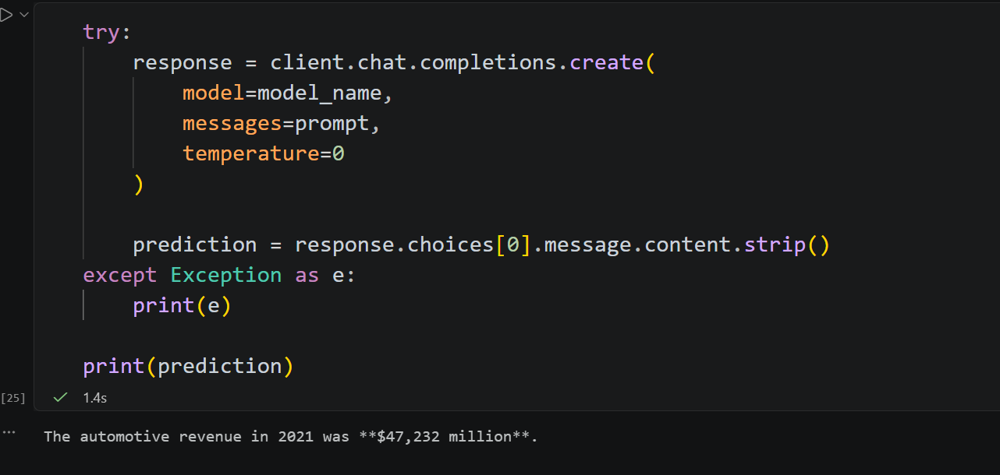

# Assignment 02 - Advanced RAG Retrieval System (Query Expansion)

## Participant Name
Vaibhav Kesarwani

## Project Title
Advanced RAG Retrieval with Query Expansion

## Description
This project demonstrates a **advance Retrieval-Augmented Generation (RAG) system** that uses **query expansion techniques** to improve retrieval quality.  
The system expands user queries using semantic embeddings before retrieving documents, ensuring more relevant context is passed to the language model.  
It integrates the **Groq API** for generation, the **all-mpnet-base-v2** embedding model for query expansion, and **ChromaDB** as the vector database to store and retrieve documents efficiently.

## How to Run

### Step 1: Initalise the UV

```bash
uv init
```

### Step 2: Initalise the virtual environment

```bash
uv venv
```

### Step 2: Install dependencies using uv

```bash
uv add -r requirements.txt
```

### Step 3: Make the env file

`.env` file
```bash
GROQ_API_KEY="..."
```

### Step 4: Run the main notebook

```bash
main.ipynb
```

## Libraries/Packages Required

- Python 3.11
- uv 
- sentence-transformers
- chromadb
- langchain
- groq

## Assumptions Made

- ChromaDB is used as the vector database for retrieval.
- The Embedding model which is used to create the embedding is all-mpnet-base-v2.
- Groq API is used for final answer generation.
- API keys are stored securely in a .env file.
- This is used for the fast reterival of the system, focusing on core functionality.

## Output



##  Analytical Questions

### Q1. Which benchmark questions improved the most after query expansion, and why?

- Q1 improved the most because expansion helped clearly map “growth constraints” to relevant Risk Factors + MD&A language, improving retrieval alignment.
- Q4 also improved strongly since expansion helped structure comparison between segments (automotive vs energy), which is explicitly discussed in the 10-K.
- Q2 and Q3 did not improve well because the expanded queries became too complex and did not match explicit document phrasing.

### Q2. Which expanded query variants produced irrelevant retrieval results?

- Q2 expansions were too abstract (AI roadmap + spending + risks combined), leading to no direct match in 10-K chunks → “I don't know”.
- Q3 expansions introduced structured “risk assessment + citations” format, which does not exist in the document → poor retrieval alignment.
- Over-expansion caused semantic drift away from actual financial disclosures.

### Q3. Did expansion increase recall at the cost of precision? Give examples.

Yes — in some cases.

- Recall increased (Q1, Q4):
    - More risk and MD&A-related chunks were retrieved.
- But precision dropped (Q3):
    - Expanded queries introduced concepts like “concentration risk across suppliers/geographies” in a very structured way, retrieving either irrelevant or no matching chunks.

### Q4. How would you control noisy expansions in a production RAG system?

To reduce noise:

- Limit expansion length (2–3 variants max)
- Use controlled prompt templates instead of free-form generation
- Apply query rewriting rules (not full generation)
- Add similarity threshold filtering on expanded queries
- Use reranking models (cross-encoders) after retrieval
- Penalize overly structured outputs (e.g., “prepare report”, “with citations”)
- Keep expansions grounded in document vocabulary (Risk Factors, MD&A, Segment Reporting)

### Q5. What metadata filters would you add if analysts ask for a specific fiscal year or 10-K section?

To improve structured retrieval, add the following metadata filters:

- Fiscal year filters
    - fiscal_year (e.g. 2022, 2023)
    - reporting_period (FY/Q1/Q2/Q3/Q4)

- Section-level filters
    - Risk Factors
    - Financial Statements
    - Notes to Financial Statements
    - Segment Information


## Required Comparative Analysis

| Question | Baseline Evidence Quality | Improved Evidence Quality | Improvement Observed | Failure Mode |
| -------- | -------- | -------- | -------- | -------- |
| Q1 | Medium | High | Expansion significantly improved retrieval of Risk Factors and MD&A sections by rephrasing “growth constraints” into supply risk and execution/cost structure language, improving relevance alignment. | Some redundancy in retrieved chunks due to overlapping query variants, but no major hallucination risk. |
| Q2 | Low–Medium | Medium | Slight improvement in connecting AI roadmap, spending, and operational priorities, but still limited because expansions drifted away from exact 10-K phrasing, reducing retrieval precision. | Query drift caused irrelevant or overly abstract retrievals; some expansions did not match document terminology, leading to weak citations. |
| Q3 | Medium | Low–Medium | Minimal improvement; baseline already captured supplier and geographic risk reasonably well. Expansion did not add meaningful coverage and sometimes diluted retrieval quality. | Over-structured query expansions (“risk assessment with citations”) led to poor matching and lower precision, including irrelevant or missing results. |
| Q4 | Medium | High | Strong improvement in identifying automotive vs energy segment disclosures; expanded queries helped surface comparative MD&A and segment reporting sections more effectively. | Some broad retrieval noise from multiple reformulations, but overall relevance remained strong and useful for synthesis. |
