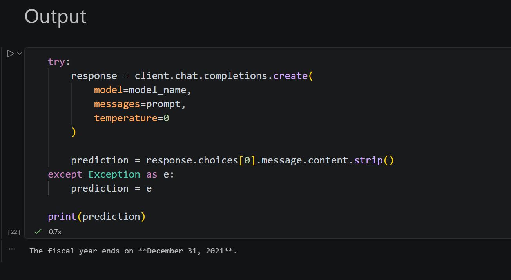

# Assignment 03 - Hypothetical Question Generation for Retrieval-Augmented Generation (RAG)

## Participant Name

**Vaibhav Kesarwani**

## Project Title

**Hypothetical Question Generation and Retrieval using ChromaDB, LangChain, and NVIDIA LLM**

---

## Description

This project implements a **Hypothetical Questions retrieval pipeline** using Tesla 10-K annual report data stored in a ChromaDB vector database.

The workflow consists of:

1. Loading Tesla 10-K document chunks from a persistent ChromaDB collection.
2. Generating three hypothetical questions for each document chunk using the Groq LLM.
3. Storing the generated hypothetical questions in a separate vector database.
4. Retrieving the most relevant hypothetical questions for a user query.
5. Mapping the retrieved questions back to their original document chunks.
6. Using the retrieved context to generate a final answer to the user's query.

This approach improves retrieval quality by searching against generated questions rather than directly searching document embeddings.

---

## Technologies Used

* Python
* ChromaDB
* LangChain
* NVIDIA LLM API
* HuggingFace Sentence Transformers
* dotenv
* tqdm

---

## Libraries / Packages Required

All required dependencies are listed in `requirements.txt`.

Install them using **uv**:

```bash
uv add -r requirements.txt
```

---

## Environment Variables

Create a `.env` file in the project root:

```env
NVIDIA_API_KEY="..."
```

---

## How to Run

### 1. Create a virtual environment

```bash
uv venv
```

### 2. Activate the virtual environment

**Windows**

```bash
.venv\Scripts\activate
```

**Linux / macOS**

```bash
source .venv/bin/activate
```

### 3. Install dependencies

```bash
uv add -r requirements.txt
```

### 4. Configure environment variables

Create a `.env` file and add your Groq API key:

```env
NVIDIA_API_KEY="..."
```

### 5. Open and run

```text
main.ipynb
```

Execute all notebook cells sequentially.

---

## Workflow

### Step 1: Load Existing Tesla 10-K Vector Database

The application connects to a persistent ChromaDB collection containing Tesla annual report chunks.

### Step 2: Generate Hypothetical Questions

For each document chunk, the NVIDIA LLM generates exactly three hypothetical questions that could be answered using that chunk.

### Step 3: Create Question Vector Store

Generated questions are embedded and stored in a separate ChromaDB collection.

### Step 4: Retrieve Relevant Questions

User queries are matched against the hypothetical-question collection.

### Step 5: Fetch Original Documents

The retrieved questions are mapped back to their source document chunks.

### Step 6: Generate Final Answer

Relevant document chunks are provided to the LLM to generate an answer grounded in the retrieved context.

---

## Example Query

```text
What is the fiscal year end date for the annual report of Tesla, Inc. as presented in the document?
```

---

## Example Output

```text
The fiscal year ends on **December 31, 2021**.
```

(The actual output depends on the retrieved document context.)

---

## Assumptions Made

1. A populated ChromaDB collection named:

```text
tesla-10k-2019-to-2023
```

already exists inside the `tesla_db` directory.

2. The NVIDIA API key is valid and has sufficient quota.

3. Internet connectivity is available for:

   * NVIDIA API calls
   * Downloading the embedding model (first run)

4. The embedding model used is:

```text
sentence-transformers/all-mpnet-base-v2
```

5. Each document chunk generates exactly three hypothetical questions.

---

## Model Configuration

### Embedding Model

```text
sentence-transformers/all-mpnet-base-v2
```

### LLM

```text
meta/llama-3.1-8b-instruct
```

### Retrieval Settings

```python
k = 5
```

for hypothetical-question retrieval.

---

## Output Explanation

The system retrieves the most relevant hypothetical questions, maps them back to their parent Tesla 10-K document chunks, and uses those chunks as context for generating a final answer.

This retrieval strategy can improve semantic search performance by capturing potential user intents through generated questions.

