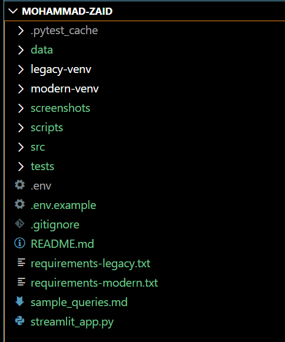
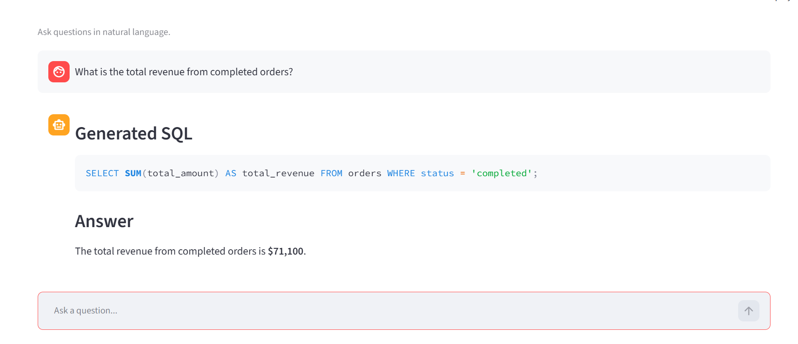
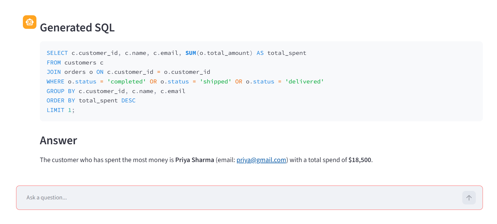
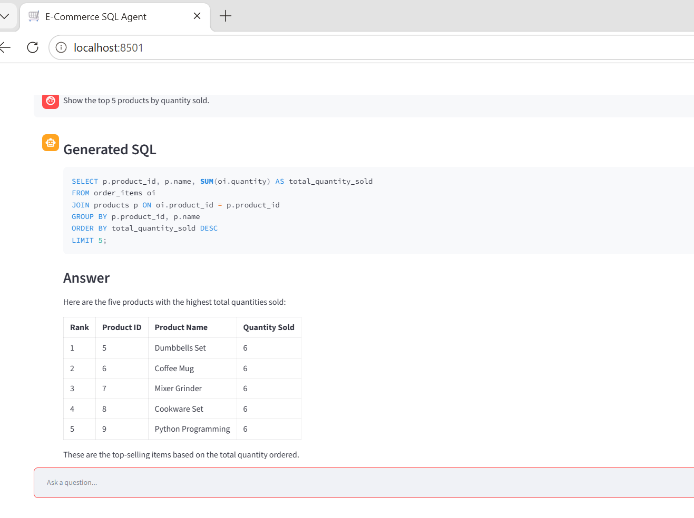
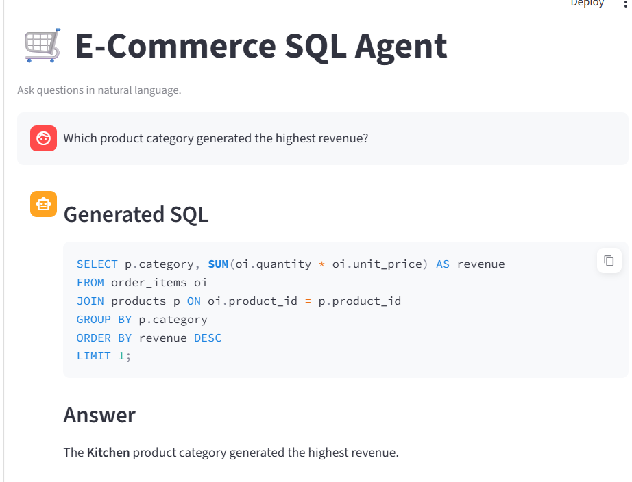
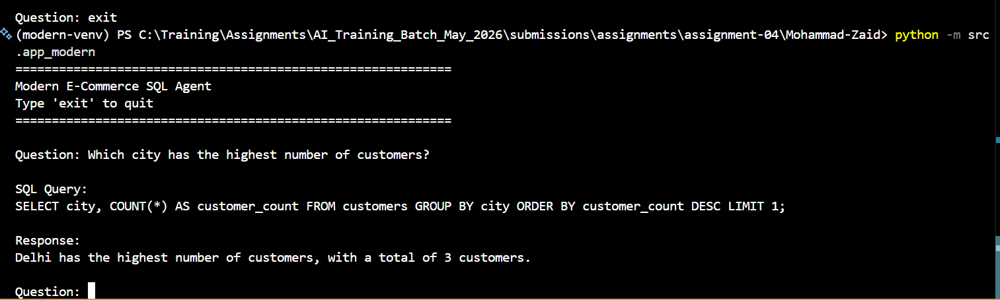
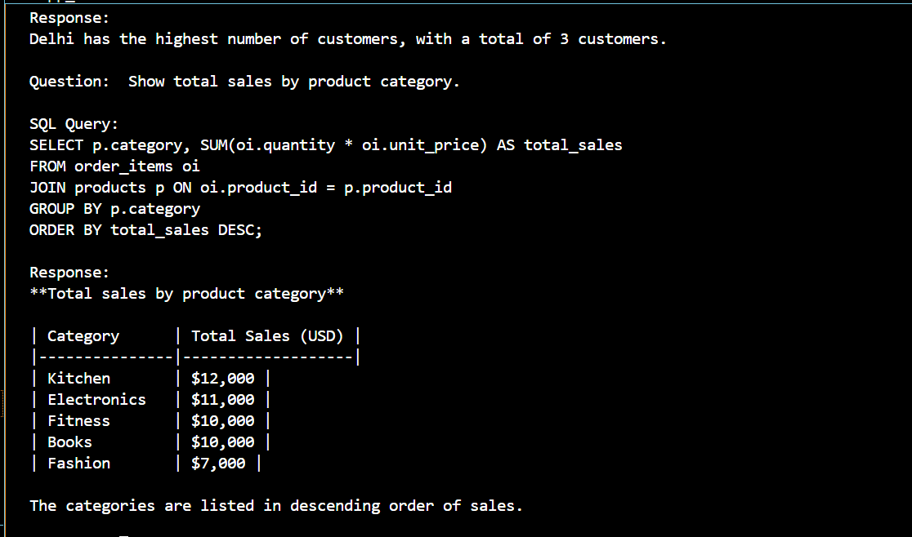

# Natural Language E-Commerce Database Agent

## Project Overview

This project implements an AI-powered E-Commerce Database Assistant using LangChain, SQLite, and Groq LLMs. The application allows business users to ask natural language questions and receive accurate business-friendly answers from an SQLite e-commerce database without writing SQL.

The system uses a custom LangChain tool to safely query the database and supports both:

* Legacy LangChain Implementation (Version < 1.0)
* Modern LangChain Implementation (Version >= 1.0)

The project demonstrates agent-based reasoning, tool calling, SQL generation, database interaction, and security controls for production-style AI applications.

---

## Business Use Case

Business teams frequently require information such as:

* Total revenue generated
* Highest spending customers
* Low-stock products
* Customer distribution by city
* Sales by category

Traditionally, such requests require SQL knowledge or support from developers and analysts.

This project enables business users to ask questions in plain English while the AI agent:

1. Understands the question.
2. Generates a safe SQL query.
3. Retrieves data from SQLite.
4. Returns a business-friendly response.

---

## Technology Stack

### Programming Language

* Python 3.11

### Database

* SQLite

### LLM

* GPT-OSS-120B via Groq

### Frameworks

* LangChain 0.3.27 (Legacy Implementation)
* LangChain 1.x (Modern Implementation)

### Additional Libraries

* LangChain Groq
* Python Dotenv
* Streamlit
* Pytest

---

## Project Structure

```text
Mohammad-Zaid/
│
├── data/
│   └── ecommerce.db
│
├── screenshots/
│
├── scripts/
│   ├── create_database.py
│   └── seed_database.py
│
├── src/
│   ├── agents/
│   │   ├── legacy_agent.py
│   │   └── modern_agent.py
│   │
│   ├── db/
│   │   ├── connection.py
│   │   └── schema_description.py
│   │
│   ├── prompts/
│   │   └── system_prompt.py
│   │
│   ├── tools/
│   │   └── ecommerce_sql_tool.py
│   │
│   ├── app.py
│   └── app_modern.py
│
├── tests/
│   ├── test_database.py
│   ├── test_sql_tool.py
│   ├── test_agent_queries.py
│   └── conftest.py
│
├── streamlit_app.py
├── sample_queries.md
├── requirements-legacy.txt
├── requirements-modern.txt
├── .env.example
└── README.md
```
Folder Structure With Dual Virtual Environment


---

## Database Schema

### customers

| Column      | Type                |
| ----------- | ------------------- |
| customer_id | INTEGER PRIMARY KEY |
| name        | TEXT                |
| email       | TEXT                |
| city        | TEXT                |
| signup_date | TEXT                |

### products

| Column         | Type                |
| -------------- | ------------------- |
| product_id     | INTEGER PRIMARY KEY |
| name           | TEXT                |
| category       | TEXT                |
| price          | REAL                |
| stock_quantity | INTEGER             |

### orders

| Column       | Type                |
| ------------ | ------------------- |
| order_id     | INTEGER PRIMARY KEY |
| customer_id  | INTEGER             |
| order_date   | TEXT                |
| status       | TEXT                |
| total_amount | REAL                |

### order_items

| Column        | Type                |
| ------------- | ------------------- |
| order_item_id | INTEGER PRIMARY KEY |
| order_id      | INTEGER             |
| product_id    | INTEGER             |
| quantity      | INTEGER             |
| unit_price    | REAL                |

---

## Environment Variables

Create a `.env` file in the project root:

```env
GROQ_API_KEY=your_groq_api_key
```

Example file is provided as:

```text
.env.example
```

---

## Setup Instructions

### Clone Repository

```bash
git clone <repository_url>
cd Mohammad-Zaid
```

---

## Create and Seed Database

### Create Database

```bash
python scripts/create_database.py
```

### Seed Database

```bash
python scripts/seed_database.py
```

This creates:

```text
customers   : 10
products    : 15
orders      : 25
order_items : 50
```

---

# Legacy LangChain Implementation (< 1.0)

## Install Dependencies

```bash
pip install -r requirements-legacy.txt
```

## Run Legacy Agent

```bash
python -m src.app
```

Example:

```text
Question:
Which city has the highest number of customers?

Generated SQL:
SELECT city, COUNT(*) AS customer_count
FROM customers
GROUP BY city
ORDER BY customer_count DESC
LIMIT 1;

Answer:
Delhi has the highest number of customers.
```

---

# Modern LangChain Implementation (>= 1.0)

## Install Dependencies

```bash
pip install -r requirements-modern.txt
```

## Run Modern Agent

```bash
python -m src.app_modern
```

Example:

```text
Question:
Which city has the highest number of customers?

SQL Query:
SELECT city, COUNT(*) AS customer_count
FROM customers
GROUP BY city
ORDER BY customer_count DESC
LIMIT 1;

Response:
Delhi has the highest number of customers.
```

---

# Streamlit Interface

Launch the web application:

```bash
streamlit run streamlit_app.py
```

Features:

* Natural language chat interface
* Generated SQL display
* Business-friendly answers
* SQLite database integration

---

# SQL Safety Controls

The custom database tool implements the following protections:

### Allowed

```sql
SELECT * FROM customers
```

### Blocked

```sql
INSERT
UPDATE
DELETE
DROP
ALTER
TRUNCATE
CREATE
REPLACE
```

### Multiple Statement Protection

Blocked:

```sql
SELECT * FROM customers;
DROP TABLE orders;
```

### Error Handling

The system gracefully handles:

* Invalid SQL
* Missing database file
* Database connection errors
* Empty query results

---

# Sample Questions

The Question and Answer is inserted in this file:

```text
sample_queries.md
```

---

# Screenshots

## Legacy Agent - Streamlit Demo

### Query 1



### Query 2



### Query 3



### Query 4



---

## Modern Agent - CLI Demo

### Query 1



### Query 2



---

# Tool Design

The custom LangChain tool:

```python
query_ecommerce_database()
```

Responsibilities:

1. Validate SQL safety.
2. Allow only SELECT queries.
3. Connect to SQLite database.
4. Execute query.
5. Return results to the agent.
6. Handle errors gracefully.

The tool is reusable and not hardcoded for any specific question.

---

# Testing

Run tests:

```bash
pytest
```

Tests cover:

* Database creation
* SQL validation
* Tool execution
* Agent responses

---

# Known Limitations

1. Database size is intentionally small for demonstration.
2. SQL generation depends on LLM reasoning quality.
3. Complex analytical queries may require additional optimization.
4. The agent currently supports a single SQLite database.

---

# Future Improvements

1. Add LangSmith tracing.
2. Add query caching.
3. Add CSV export functionality.
4. Add support for multiple databases.
5. Add authentication and user roles.
6. Add conversation memory.
7. Deploy using Docker and cloud infrastructure.
8. Add advanced analytics dashboards.

---
