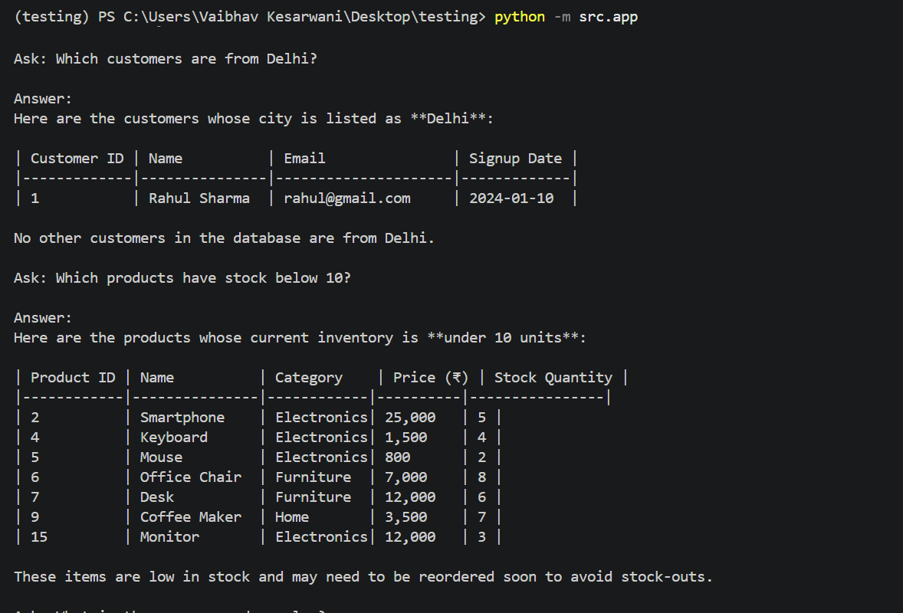
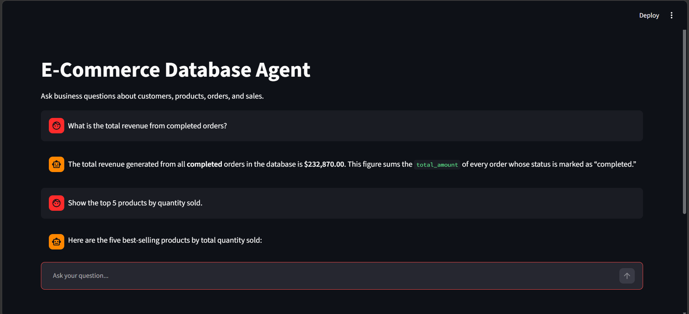
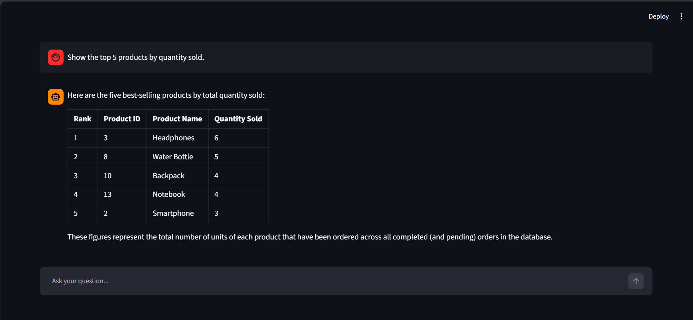

# Assignment 04 - Natural Language E-commerce Database Agent

## Participant Name

**Vaibhav Kesarwani**

## Assignment Title

### Natural Language E-commerce Database Agent

## Project Overview

This project implements a Natural Language E-commerce
Database Agent using LangChain and Large Language Models (LLMs). The application supports conversation memory, database persistence, and tool-assisted question answering.

Two implementations are provided:

* Legacy LangChain implementation (v0.3.3)
* Modern LangChain implementation using the latest LangChain architecture (>= v1.0.0)

---

## Business Use Case

You are working as an AI engineer for an e-commerce company. The business team frequently asks 
data-related questions, but they do not know SQL. They usually depend on developers or data 
analysts to extract information from the database.

The company wants to build a prototype of an AI-powered database assistant that allows business 
users to ask questions in plain English and receive accurate answers from the e-commerce database.

The prototype should use Python, LangChain, SQLite, an LLM with tool-calling capability, a custom 
database tool, and a simple natural language interface

---

## Technology Stack

| Component              | Technology            |
| ---------------------- | --------------------- |
| Language               | Python 3.10+          |
| Framework              | LangChain             |
| LLM Provider           | GROQ API              |
| Database               | SQLite                |

---

## Project Structure

```bash
vaibhav-kesarwani/
|
|-- README.md
|-- .env.example
|-- requirements-legacy.txt
|-- requirements-modern.txt
|
|-- data/
|   |-- ecommerce.db
|
|-- scripts/
|   |-- create_database.py
|   |-- seed_database.py
|
|-- src/
|   |-- db/
|   |   |-- connection.py
|   |   |-- schema_description.py
|   |
|   |-- tools/
|   |   |-- ecommerce_sql_tool.py
|   |
|   |-- agents/
|   |   |-- legacy_agent.py
|   |   |-- modern_agent.py
|   |
|   |-- prompts/
|   |   |-- system_prompt.py
|   |
|   |-- app.py
|
|-- sample_queries.md
```

---

## Database Schema

The application uses a SQLite database containing four tables: `customers`, `products`, `orders`, and `order_items`.

### Customers Table

Stores customer information.

| Column      | Type    | Description                |
| ----------- | ------- | -------------------------- |
| customer_id | INTEGER | Primary Key                |
| name        | TEXT    | Customer name              |
| email       | TEXT    | Unique customer email      |
| city        | TEXT    | Customer city              |
| signup_date | TEXT    | Customer registration date |

### Products Table

Stores product catalog information.

| Column         | Type    | Description         |
| -------------- | ------- | ------------------- |
| product_id     | INTEGER | Primary Key         |
| name           | TEXT    | Product name        |
| category       | TEXT    | Product category    |
| price          | REAL    | Product price       |
| stock_quantity | INTEGER | Available inventory |

### Orders Table

Stores customer orders.

| Column       | Type    | Description                                  |
| ------------ | ------- | -------------------------------------------- |
| order_id     | INTEGER | Primary Key                                  |
| customer_id  | INTEGER | Foreign key to customers                     |
| order_date   | TEXT    | Date of order                                |
| status       | TEXT    | Order status (completed, pending, cancelled) |
| total_amount | REAL    | Total order value                            |

### Order Items Table

Stores individual products included in each order.

| Column        | Type    | Description                    |
| ------------- | ------- | ------------------------------ |
| order_item_id | INTEGER | Primary Key                    |
| order_id      | INTEGER | Foreign key to orders          |
| product_id    | INTEGER | Foreign key to products        |
| quantity      | INTEGER | Quantity purchased             |
| unit_price    | REAL    | Product price at purchase time |

---

## Setup Instructions

### 1. Create Virtual Environment

```bash
uv venv
```

Activate the environment:

**Linux / macOS**

```bash
source venv/bin/activate
```

**Windows**

```bash
.venv\Scripts\activate
```

### 3. Install Dependencies
Depend on which agent you want to use the leagacy or modern. 

```bash
uv pip install -r requirements-legacy.txt # For the Legacy agent

or

uv pip install -r requirements-modern.txt # For the Modern agent
```

---

## How to Create and Seed the Database

### Create Database

```bash
python scripts/create_database.py
```

### Seed Database

```bash
python scripts/seed_database.py
```

---

## How to Run

```bash
streamlit run src/app.py
```
---

## Environment Variables Required

Create a `.env` file:

```env
GROQ_API_KEY="..."
```

---

## Sample Questions

- What is the total revenue from completed orders?
- Which customer has spent the most money?
- Show the top 5 products by quantity sold.
---

## Screenshots

### Terminal CLI :-




### Streamlit App :-





---

## Safety Checks

#### Database Safety

Parameterized SQL queries are used to prevent SQL injection attacks.

```python
cursor.executemany("""
INSERT INTO customers (name, email, city, signup_date)
VALUES (?, ?, ?, ?)
""", customers)
```

#### LLM Safety

* System prompts restrict unsafe behavior
* Prompt injection attempts are filtered
* Sensitive information is not persisted

#### Error Handling

```python
try:
    if tool_name == "query_ecommerce_database":
        result = query_ecommerce_database.invoke(tool_args)            
    else:
        result = f"Unknown tool: {tool_name}"

except Exception as e:
    result = f"Tool execution error: {str(e)}"
```

#### Data Privacy

* API keys stored in environment variables
* No secrets hardcoded in source code
* User conversations stored only in designated databases

---
