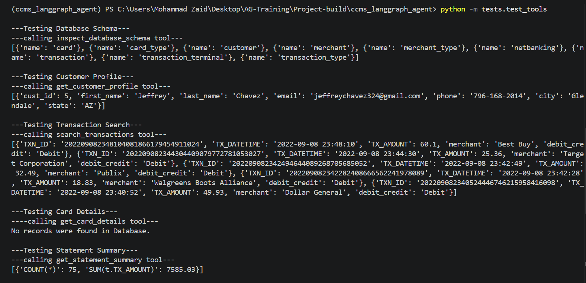
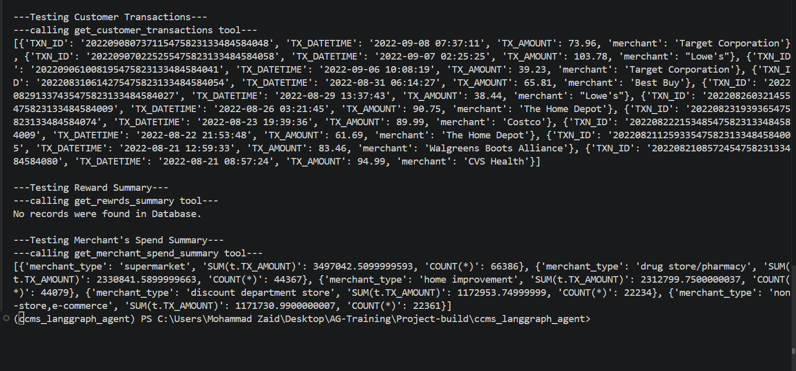

# CCMS AI Agent using LangGraph

## 1. Project Overview

The Credit Card Management System (CCMS) AI Agent is a tool-enabled conversational assistant built using LangGraph, LangChain, Groq LLM, and SQLite3.

The agent answers user questions related to customer profiles, card details, transactions, statements, rewards, and merchant spending by querying the `ccms.db` database through specialized tools.

I have followed **Pre-built ReAct Agent** approach in this project Assignment using LangGraph's `create_react_agent()` implementation.

---

## 2. Setup Instructions

### Clone the Repository

```bash
git clone <repository-url>
cd ccms_langgraph_agent
```

### Create Virtual Environment

```bash
uv venv
```
or
```bash
uv init
uv venv
```

### Activate Virtual Environment

Windows:

```bash
.venv\Scripts\activate
```

Linux/Mac:

```bash
source .venv/bin/activate
```

### Install Dependencies

```bash
uv pip install -r requirements.txt
```
```bash
or uv add -r requirements.txt if initialized venv using uv init
```

the requirements.txt contains the following version of the packages as mentioned:
```txt
ipykernel>=7.3.0
python-dotenv>=1.2.2
langchain-groq==0.3.8
langchain==0.3.20 
langchain-community==0.3.19 
langgraph==0.3.21
langchain-core>=0.3.0
```
---

## 3. How to Place ccms.db

Place the SQLite database file inside the `data` directory.

Project structure:

```text
ccms_langgraph_agent/
│
├── data/
│   └── ccms.db
│
├── app.py
├── prebuilt_agent.py
├── db_tools.py
├── db_utils.py
|── output_parser
|── prebuilt_agent.py
|── prompts.py
|── requirements.txt
|── .env.example
|──.venv
└── test/tes_tools.py
```

location:

```text
data/ccms.db
```

---

## 4. Environment Variable Setup

Create a `.env` file in the project root.

Example:

```env
GROQ_API_KEY=your_groq_api_key
GROQ_MODEL=llama-3.3-70b-versatile
DB_PATH=./data/ccms.db
```

Replace the API key with your valid Groq API key.

---

## 5. To Run Pre-built Agent

Run:

```bash
python app.py
```

Example:

```text
Please Enter Your Question:
Show customer profile for customer ID 100
```

The agent will:

1. Understand the request.
2. Select the appropriate tool.
3. Query the database.
4. Generate a natural language response.
---

### Test Cases:




---
## 6. Tool List and Purpose
Dedicated print is implemented on every tool call for debugging.

### inspect_database_schema

Returns available database tables and columns.

### get_customer_profile

Returns customer profile information using customer ID.

### get_card_details

Returns card details associated with a customer.

### search_transactions

Returns recent transaction records from the database.

### get_customer_transactions

Returns transaction history for a specific customer.

### get_statement_summary

Returns statement-related transaction summary for a customer.

### get_rewards_summary

Returns reward-related transaction information.

### get_merchant_spend_summary

Returns spending aggregated by merchant category.

---

## 8. Sample Questions

### Database

* Show me the database schema.
* What tables exist in the database?

### Customer

* Show customer profile for customer ID 100.
* Get details for customer 250.

### Card

* Show card details for customer ID 100.
* What card is linked to customer 250?

### Transactions

* Show recent transactions.
* Show transaction history for customer 100.
* List the latest 10 transactions.

### Statements

* Show statement summary for customer 100.
* What is the transaction summary for customer 250?

### Rewards

* Show rewards summary for customer 100.
* How many reward-related transactions does customer 250 have?
* Note: Reward is Hardcoded as the Exact method to calculate the reward is not provided

### Merchant Analytics

* Show merchant spend summary.
* Which merchant categories have the highest spending?

### Mask email function 

* The function is implemented in the db_tools.py file for demonstration but never used.
---

## 9. Sensitive Data Masking Rules

The agent must never expose sensitive customer information.

Restricted information includes:

* Full card numbers
* Card security codes (CVV)
* Net banking passwords
* Security questions
* Security answers
* Authentication credentials

If sensitive fields exist in the database, they must not be disclosed in responses.

---

## 10. Known Limitations

* No dedicated rewards table exists in the current schema.
* No billing or statement table exists in the current schema.
* No payment due date information exists in the database.
* No fraud detection model is implemented.
* Responses depend on the quality and availability of database records.
* The agent currently supports only the provided SQLite schema.

---

## 11. Future Improvements

* Implement custom LangGraph workflow.
* Add fraud detection and anomaly detection tools.
* Introduce customer spending analytics.
* Add support for payment and billing tables.
* Improve transaction search with advanced filters.

---

## Technology Stack

* Python
* LangGraph
* LangChain
* Groq LLM
* SQLite
* dotenv

---

## Author

CCMS AI Agent - LangGraph Tool Calling Project
