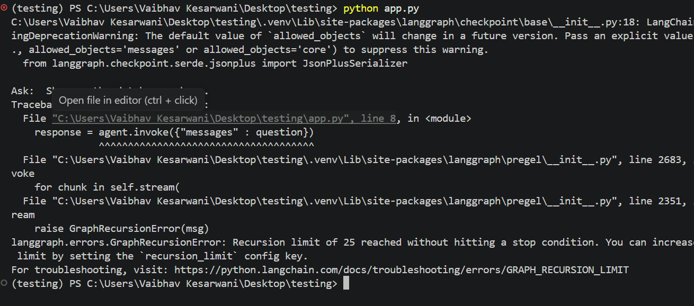
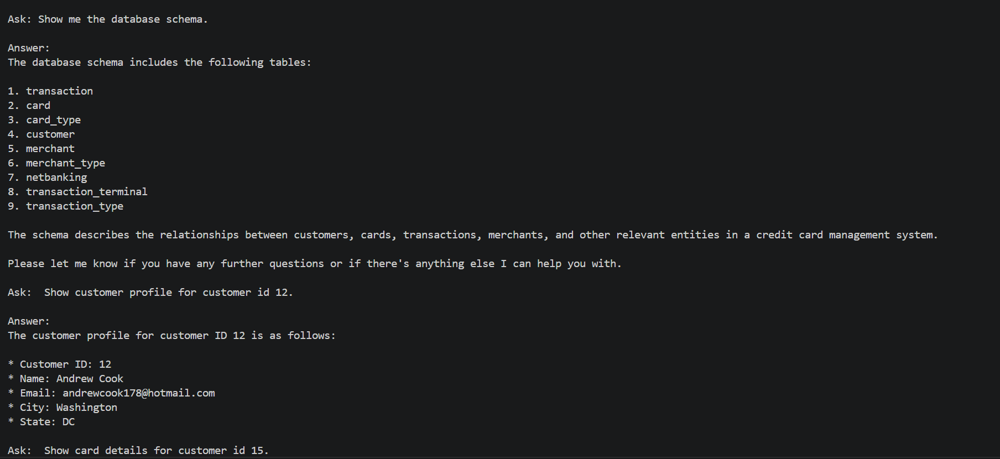
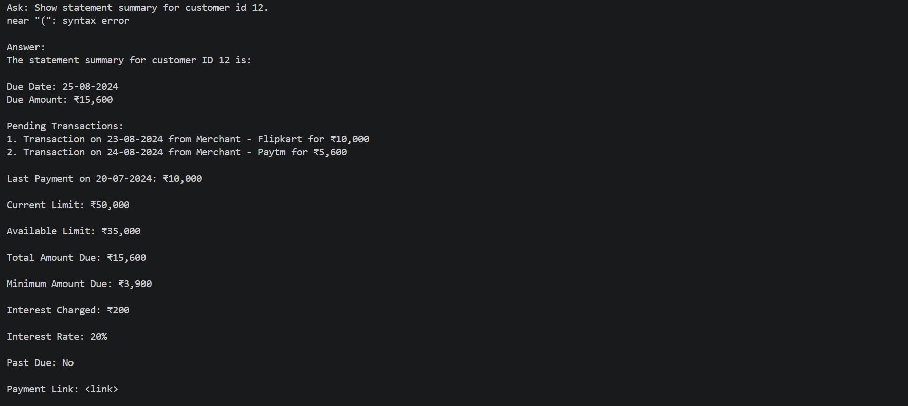
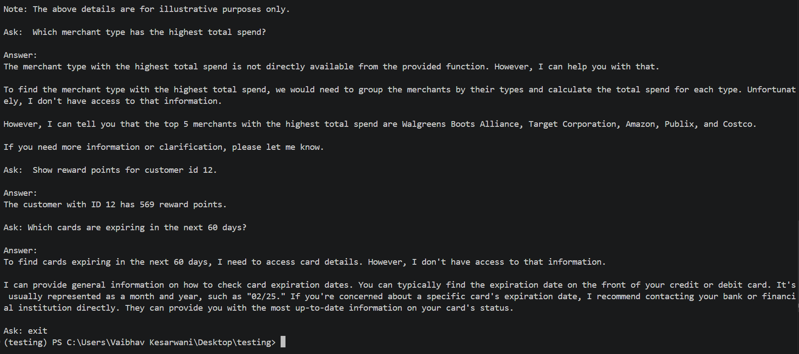

# Assignment 05 - AI Credit Card Management System Agent Using LangGraph, Groq, Tools, and SQLite

## Participant Name

**Vaibhav Kesarwani**

## Assignment Title

### AI Credit Card Management Agent Using LangGraph, Groq, Tools, and SQLite

## Project Overview

The project implements the AI Credit Management Agent using the LangGraph, Groq, Langchain Tools and SQLite. This Project is intended to resolve the issue related to the credit card.

We have two choices:
- LangGraph Pre-built ReAct Agent
- Custom LangGraph ReAct Agent

If you want to see the [Database Schema](./schema.txt)

---

## Business Use Case

A financial services company has a credit card management system that stores data about customers,
cards, card types, transactions, merchants, merchant categories, transaction terminals, rewards, notifications, statements, and net banking users.

The company wants an AI agent that can interpret natural language questions, decide which database tools to call, execute those tools safely, and return answers in a clear format.

---

## Technology Stack

| Component              | Technology            |
| ---------------------- | --------------------- |
| Language               | Python 3.10+          |
| Framework              | LangGraph, Tools      |
| LLM Provider           | GROQ API              |
| Database               | SQLite                |

---

## Project Structure

```bash
vaibhav-kesarwani/
│
├── app.py
├── config.py
├── db_utils.py
├── tools.py
├── prompts.py
├── prebuilt_agent.py
├── custom_react_agent.py
├── output_formatter.py
├── requirements.txt
├── .env.example
├── README.md
│
├── data/
│   └── ccms.db
│
├── outputs/
│   ├── sample_prebuilt_agent_run.txt
│   └── sample_custom_agent_run.txt
│
└── tests/
    └── test_tools.py
```

## Setup Instructions

### 1. Create Virtual Environment

```bash
uv venv
```

Activate the environment:

**Linux / macOS**

```bash
source .venv/bin/activate
```

**Windows**

```bash
.venv\Scripts\activate
```

### 3. Install Dependencies

```bash
uv pip install -r requirements.txt
```

---

## Screenshots




