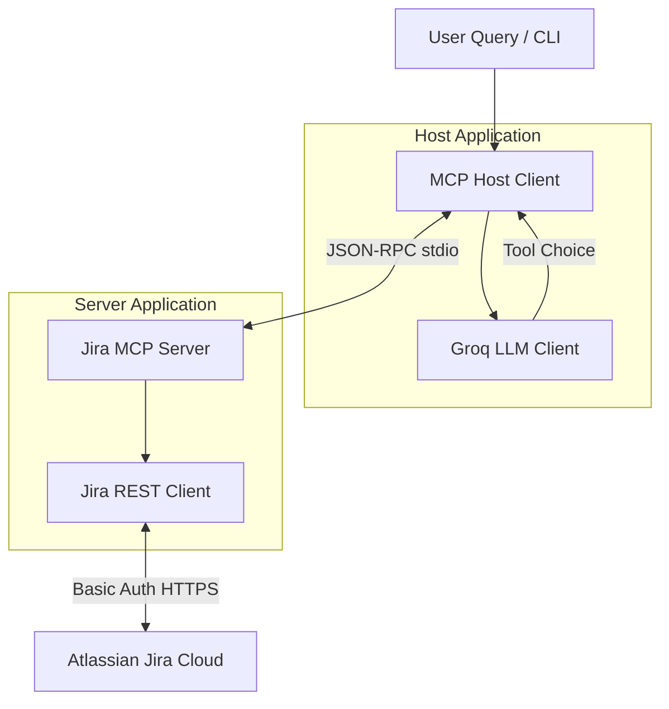

# A006: MCP Host for Jira Issue Assistant

An LLM-powered agentic system using the Model Context Protocol (MCP), Groq LLM, FastMCP, and Jira Cloud REST APIs. It provides a natural language interface to query, analyze, and update Jira issues, projects, comments, and statuses.

---

## 1. Architecture

The application comprises two main components that communicate via standard input/output streams (`stdio` transport):



### Flow description:
1. **User Request:** The user submits a natural language question (e.g. *"Summarize issue ABC-12 including comments"*).
2. **MCP Host Initialization:** The Host starts the Jira MCP Server as a subprocess and establishes a standard `stdio` connection.
3. **Tool Discovery:** The Host queries the MCP Server to discover available tools.
4. **Groq Integration:** The Host maps the discovered tools and their schemas to Groq-compatible tool schemas and initializes the agent conversation.
5. **Agent Reasoning Loop:** 
   - The Host sends the message history to the Groq LLM.
   - The LLM decides whether to call a tool or issue a final answer.
   - If a tool is called, the Host executes it on the MCP Server subprocess, gets the result, appends it to the history, and queries the LLM again.
   - This allows multi-step logic (e.g., getting details, then getting comments, then combining them).
6. **Execution Output:** The Host closes the connection and returns a structured JSON payload detailing the query, tools used, final answer, and whether write actions were performed.

---

## 2. Setup and Installation

### Prerequisites
- Python 3.11 or higher
- A Jira Cloud instance (you can create a free developer site at [Atlassian Developer](https://developer.atlassian.com/))
- A Groq API Key

### Installation

1. Navigate to the project directory:
   ```bash
   cd "C:\Users\Poonam Bhatt\Desktop\a006_mcp_host_jira_assistant"
   ```

2. Create a Python virtual environment:
   ```bash
   python -m venv .venv
   ```

3. Activate the virtual environment:
   - **Command Prompt:**
     ```cmd
     .venv\Scripts\activate.bat
     ```
   - **PowerShell:**
     ```powershell
     .venv\Scripts\Activate.ps1
     ```

4. Install the dependencies:
   ```bash
   pip install -r requirements.txt
   ```

---

## 3. Configuration (.env)

Create a `.env` file in the root of the project (copying `.env.example` as a starting point) and configure the following variables:

```env
# Groq Configuration
GROQ_API_KEY=your_actual_groq_api_key
GROQ_MODEL=llama-3.3-70b-versatile

# Jira Configuration
JIRA_BASE_URL=https://your-domain.atlassian.net
JIRA_EMAIL=your_email@example.com
JIRA_API_TOKEN=your_jira_api_token
```

> [!NOTE]
> To generate a Jira API token, go to **Atlassian Account Settings > Security > Create and manage API tokens** at [Atlassian Account Security](https://id.atlassian.com/manage-profile/security/api-tokens).

---

## 4. Running the MCP Server (stdio Mode)

The MCP Server is designed to run in standard stdio mode. When run directly, it blocks and communicates via stdin and stdout using the JSON-RPC Model Context Protocol:

```bash
python server/jira_mcp_server.py
```

---

## 5. Running the MCP Host Client

You can run the MCP Host with a natural language query directly as a command-line argument. The host will perform tool discovery, run the agent reasoning loop, output the result in a clean terminal panel, and save the structured JSON execution summary in the `outputs/` folder.

### Run Command:
```bash
python src/host.py "List all Jira projects"
```

### JSON Output Format (FR-7):
```json
{
  "user_query": "List all Jira projects",
  "tools_used": [
    "list_projects"
  ],
  "final_answer": "I found the following Jira project:\n\n| Key  | Name          | Style   |\n|------|---------------|---------|\n| DEMO | Demo Project  | classic |",
  "write_action_performed": false
}
```

---

## 6. Supported MCP Tools

The server exposes the following 6 tools:

| Tool Name | Type | Purpose | Parameters |
| :--- | :--- | :--- | :--- |
| `list_projects` | Read | Lists all projects in the Jira instance | *None* |
| `search_issues` | Read | Searches issues using JQL | `jql` (str), `max_results` (int, optional), `start_at` (int, optional) |
| `get_issue_details` | Read | Fetches issue summary, description, and status | `issue_key` (str) |
| `get_issue_comments` | Read | Fetches the comment stream of an issue | `issue_key` (str) |
| `add_issue_comment` | Write | Adds a comment to the issue | `issue_key` (str), `comment_text` (str) |
| `update_issue_status` | Write | Transitions the issue status | `issue_key` (str), `status_name` (str) |

---

## 7. Sample Queries

Refer to [sample_queries.md](file:///C:/Users/Poonam%20Bhatt/Desktop/a006_mcp_host_jira_assistant/sample_queries.md) for full expected behaviors. Example queries:
- **Project Discovery:** `List all Jira projects`
- **Issue Search:** `Show open issues` or `Show high-priority issues` or `Which issues are assigned to me?`
- **Detail Extraction:** `Summarize ABC-12`
- **Multi-Step Flow:** `Summarize ABC-12 including comments` (sequentially runs details and comments)
- **Comment Creation (Write):** `Add a comment to ABC-5 saying QA validation is pending`
- **Status Transitions (Write):** `Update status of ABC-12 to Done` (checks and triggers transition IDs automatically)

---

## 8. Running Automated Tests

A comprehensive suite of unit tests covers the server's tools, mock connections, and host reasoning flows using mock data so that testing does not require live API connections or credentials.

Run tests with:
```bash
pytest tests/
```

### Test Coverage includes:
- `test_mcp_server_runs`: Validates registered FastMCP tools
- `test_tool_discovery`: Confirms the host client successfully discovers tools
- `test_query_execution`: Mocks Groq/Jira to verify single-step flow
- `test_multi_tool_flow`: Tests sequential loop processing
- `test_write_operation`: Assures that `write_action_performed` becomes `True` for comment additions or status transitions.

(.venv) C:\Users\Poonam Bhatt\Desktop\a006_mcp_host_jira_assistant>pytest tests/
===================== test session starts =====================
platform win32 -- Python 3.11.9, pytest-9.0.3, pluggy-1.6.0
rootdir: C:\Users\Poonam Bhatt\Desktop\a006_mcp_host_jira_assistant
plugins: anyio-4.13.0, deepeval-4.0.5, langsmith-0.3.45, asyncio-1.4.0, mock-3.15.1, repeat-0.9.4, rerunfailures-16.3, xdist-3.8.0
asyncio: mode=Mode.STRICT, debug=False, asyncio_default_fixture_loop_scope=None, asyncio_default_test_loop_scope=function
collected 13 items                                             

tests\test_host.py ....                                  [ 30%]
tests\test_mcp_server.py .........                        [100%]

===================== 13 passed in 3.37s ======================

(.venv) C:\Users\Poonam Bhatt\Desktop\a006_mcp_host_jira_assistant>
