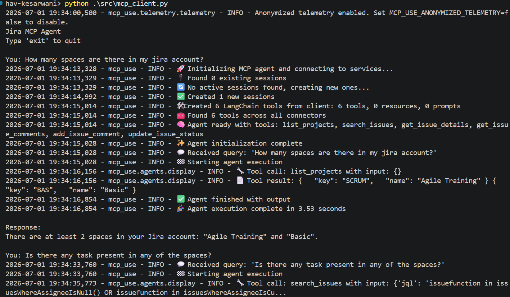
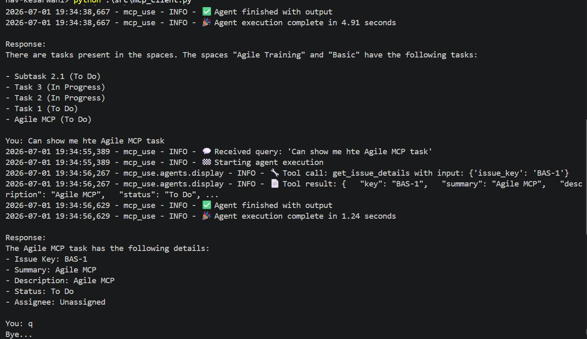

# Assignment 06 - MCP Host for Jira Issue Assistant Using FastMCP / mcp-use, Groq LLM, and Jira MCP Server

## Participant Name

**Vaibhav Kesarwani**

## Assignment Title

### MCP Host for Jira Issue Assistant Using FastMCP / mcp-use, Groq LLM, and Jira MCP Server

## Project Overview

This project demonstrate the Jira MCP server using the FastMCP / mcp-use that runs in the stdio mode.
which is powered with the jira tools to make the changes in the jira workspace and the task list of the spaces / projects.

---

## Business Use Case

A project manager wants to query Jira issues using natural language.

Participants must:

1. Create dummy Jira issues in their own Jira instance
2. Use the MCP server to expose Jira operations
3. Ask questions through the MCP Host

---

## Screen shots




---

## Technology Stack

| Component              | Technology            |
| ---------------------- | --------------------- |
| Language               | Python 3.11+          |
| Framework              | MCP-use / FastMCP     |
| LLM Provider           | GROQ API              |
| Techinque              | stdio                 |
| Testing                | PyTest                |

---

##  MCP tools list

- list_projects
- search_issues
- get_issue_details
- get_issue_comments
- add_issue_comment
- update_issue_status

---

## Setup Instructions

### 1. Create Virtual Environment

```bash
uv venv
```

Activate the environment:

**Linux / macOS**

```bash
source venv/bin/activate
```

**Windows**

```bash
.venv\Scripts\activate
```

### 3. Install Dependencies

```bash
uv pip install -r requirements.txt
```

---

## Environment Variables Required

Create a `.env` file:

```env
GROQ_API_KEY="..."
GROQ_MODEL=llama-3.3-70b-versatile
JIRA_BASE_URL="..."
JIRA_EMAIL="..."
JIRA_API_TOKEN="..."
```

---

## How to run the MCP server

To run the mcp server you have to run the server/jira_mcp_server.py file by using the below command and make it running till session exit.

```bash
python server/jira_mcp_server.py
```

---

## How to Run the client

```bash
python src/mcp_client.py
```

---

## How to run integration tests

```bash
pytest -v
```

---

## Final report schema

This is the final report schema of the required output

```json
[
    {
        "user_query": "How many spaces are there in my jira account?",
        "tools_used": [
            "list_projects"
        ],
        "final_answer": "There are at least 2 spaces in your Jira account: \"Agile Training\" and \"Basic\".",
        "write_action_performed": false
    },
    {
        "user_query": "Is there any task present in any of the spaces?",
        "tools_used": [
            "search_issues"
        ],
        "final_answer": "There are tasks present in the spaces. The spaces \"Agile Training\" and \"Basic\" have the following tasks:\n\n- Subtask 2.1 (To Do)\n- Task 3 (In Progress)\n- Task 2 (In Progress)\n- Task 1 (To Do)\n- Agile MCP (To Do)",
        "write_action_performed": false
    },
    {
        "user_query": "Can show me hte Agile MCP task",
        "tools_used": [
            "get_issue_details"
        ],
        "final_answer": "The Agile MCP task has the following details:\n- Issue Key: BAS-1\n- Summary: Agile MCP\n- Description: Agile MCP\n- Status: To Do\n- Assignee: Unassigned",
        "write_action_performed": false
    }
]
```

---

## Project Structure

```bash
a006_mcp_host_jira_assistant/
│
├── README.md
├── requirements.txt
├── .env.example
│
├── server/
│   └── jira_mcp_server.py
│
├── src/
│   ├── host.py
│   ├── llm.py
│   ├── mcp_client.py
│   ├── prompts.py
│
├── tests/
│
├── outputs/
│
└── sample_queries.md
```

---

## Future improvements

This is the basic demonstration of the MCP use case using the `mcp-use` and the `FastMCP` framework which helps us to get the idea about how the mcp work.

But for this particular project the future improvements can be:

1. Making the UI for the agent using the `streamlit` package
2. We can use the `code execution` strategy in MCP for less token consumption which will allow the model to call the tool when needed.