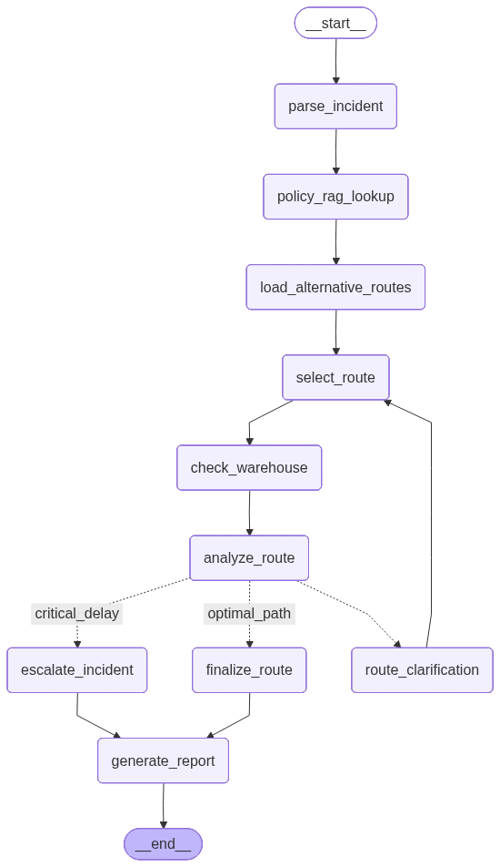

# Capstone Build 01 - Supply Chain Crisis Management and Logistics Re-Router 

## Participant Name

**Vaibhav Kesarwani**

## Capstone Title

### Supply Chain Crisis Management and Logistics Re-Router

## Project Overview

This is the supply chain crisis management and logistics Re-Router which can be used at the time of emergenecy like strike, weather disruption, or operational failure

This will cause the major damage to the company profit and reliability of there service. 

In this build i have created the management system which use the agentic system to recommend and evaluate the suitable alternatives routes.

---

## Bussiness Usecase

A major shipping port has suddenly become unavailable because of a strike, weather disruption, or operational failure.

A shipment is already in transit and must be rerouted.
The logistics team needs to quickly determine:

- What shipment is affected?
- What type of cargo is being transported?
- How much delay can the shipment tolerate?
- Which alternative routes are available?
- Can the warehouse assigned to the alternative route accept the shipment?
- Do any logistics rules prevent the route from being selected?
- Should another route be checked?
- Should the incident be escalated?

I build an AI-powered Logistics Incident Assistant that evaluates the disruption and recommends a suitable alternative route.

---

## Solution Approach

This application use the langgraph agentic ai system to find the alternative routes and evaluate those routes also which will be usefull for this complex management system in which we can direct the flow of the agent in our own way.

Firstly, we are doing the parsing using incident_id which fetched from the .json file in the data folder which contains multiple incident in that user can select any incident and from that incident we fetch the `manifest_text` inside the incident and than parse that into the JSON format with the required fileds.

```json
{
    "shipment_id" : ""
    "cargo_weight_tons" : ""
    "cargo_type" : ""
    "target_warehouse_id" : ""
    "has_perishables" : ""
    "maximum_tolerable_delay_hours" : ""   # If not define than mark it as None.
}
```

The above is the json format which we get from the `GROQ model`.

Than after this we used the `manifest_text` to fetch the `logistics knowledge base` using the RAG which will allows us to only fetch the required chunks from the .txt file.

And, after that we load all the alternate routes from the json file and than store it in the state. After we do that we go to select the one path from all those alternative paths which have fetch from the json.

Than we are checking the assign warehouse to that route and saving that information inside the state also and than we analyze / evaluate the route and decide which route to be proceed like:

- Optimal Path
- Route Clarrification 
- Critcial Delay

Inside the optimal path we simply generate the final report and inside the critical delay after the esclate incident we generate the final route and in the route clarriffication loop through again from the select route function.

---

## Architecture

```bash
Incident
    ↓
LangChain Extraction
    ↓
RAG Rule Retrieval
    ↓
Route and Warehouse Tools
    ↓
LangGraph Decision and Retry Loop
    ↓
Final Report
```

---

## Project Structure

```bash
supply_chain_logistics_rerouter/
│
├── README.md
├── pyproject.toml
├── .env.example
├── .gitignore
│
├── data/
│   ├── logistics_knowledge_base.txt
│   ├── inventory_status.json
│   ├── route_options.json
│   └── sample_incidents.json
│
├── src/
│   ├── main.py
│   ├── config.py
│   ├── state.py
│   ├── graph.py
│   ├── nodes.py
│   ├── tools.py
│   ├── rag.py
│   ├── schemas.py
│   └── report_writer.py
│
├── tests/
│   ├── test_tools.py
│   ├── test_routing.py
│   ├── test_nodes.py
│   └── test_graph.py
│
└── outputs/
├── INC-001_reroute_advisory_report.json
├── INC-002_reroute_advisory_report.json
├── INC-003_reroute_advisory_report.json
└── test_results.txt
```

---

## Setup Instructions

---

## Setup `.env`

```bash
GROQ_API_KEY=...
GROQ_MODEL=llama-3.3-70b-versatile
HF_TOKEN=...
```

---

## Setup Instructions

### 1. Create Virtual Environment

```bash
uv venv
```

Activate the environment:

**Linux / macOS**

```bash
source .venv/bin/activate
```

**Windows**

```bash
.venv\Scripts\activate
```

### 2. Install Dependencies

```bash
uv pip install -r requirements.txt
```

## Running Application

Use the below command to run the script.

```bash
uv run src/main.py
```

---

## Input

The Input of the agent consist these fields

- incident_id
- manifest_text
- disrupted_port_id

```json
{
    "incident_id": "INC-003",
    "manifest_text": "Cargo SH-4208 contains 700 tons of industrial machinery. The primary maritime route is unavailable and delivery was planned for WHEAST-101.",
    "disrupted_port_id": "PORT-SEATTLE-02"
}
```

---

## Output

```json
{
    "incident_id": "INC-001",
    "original_incident_summary": "",
    "parsed_metadata": {
        "shipment_id": "SH-4002",
        "target_warehouse_id": "WH-WEST-202",
        "cargo_weight_tons": 550,
        "cargo_type": "industrial electronics",
        "has_perishables": true,
        "maximum_tolerable_delay_hours": 72
    },
    "rag_validation_rules_applied": [],
    "routes_evaluated": [],
    "final_selected_route": {},
    "queried_warehouse_metrics": {},
    "graph_routing_metadata": {
        "loops_executed": 0,
        "final_decision_state": "",
        "reroute_impact_score": 0
    },
    "final_operations_brief": ""
}
```

---

## LangGraph Workflow



---

## RAG Implementation

To Implement the rag i use the chromadb as the vector database and it retrieves the top-k 4 chunks from the database. I used the `RecursiveTextSplitter` which comes from the `langchain_text_splitters` and this is the persisted database.

And, I use the hugging face embedding model which `sentence-transformers/all-mpnet-base-v2`.

---

## Tools Implemented

In this agentic ai system we have created two tools are:

- query_warehouse_inventory_tool
- get_alternative_routes_tool

1. **query_warehouse_inventory_tool**: 

In this tool we need the warehouse_id as an input and we output it as the dictonary details which fetched from the `data/inventory_status.json`

2. **get_alternative_routes_tool**: 

In this tool we are bascially try to find the list of alternatove routes which are present inside the `data/route_options.json` in this we output the result as list of alternative routes.

---

