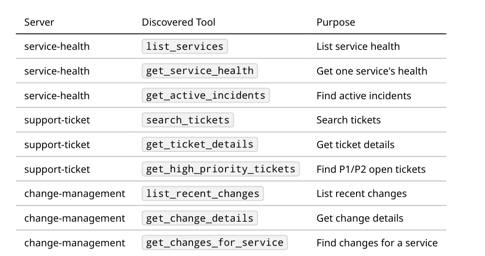

# Enterprise Operations Assistant (MCP-Based)

## 1. Project Overview
Enterprise operations teams monitor business applications and respond to service disruptions. During an incident, engineers must check service health, active incidents, support tickets, and application changes across siloed systems. This project unifies operational investigation into a single natural language interface [source: 3].

## 2. Project Objective
Build an LLM-powered assistant using Model Context Protocol (MCP) that accepts natural-language questions, dynamically selects tools across multiple MCP servers, retrieves read-only operational data, and synthesizes accurate investigation summaries.

## 3. Architecture
The architecture separates the LLM reasoning layer from data execution.
* **User:** Submits natural language queries.
* **MCP Host (`src/host.py`):** Hosts the Groq LLM (`llama-3.3-70b-versatile`), manages the MCP Client (`mcp-use`), routes tool executions, and combines evidence.
* **MCP Servers:** Expose specific operational tools via local STDIO processes without containing any LLM logic [source: 3].

## 4. MCP Servers
The project implements three isolated FastMCP servers [source: 3]:
1. **Service Health MCP Server:** Reads `data/service_health.json` for service metrics and operational incidents [source: 3].
2. **Support Ticket MCP Server:** Queries `data/tickets.db` (SQLite) using parameterized queries for customer support tickets [source: 3].
3. **Change Management MCP Server:** Reads `data/changes.json` for deployment records. [source: 3].

## 5. Server-Tools
```bash
service-health
├── list_services
├── get_service_health
└── get_active_incidents
support-ticket
├── search_tickets
├── get_ticket_details
└── get_high_priority_tickets
change-management
├── list_recent_changes
├── get_change_details
└── get_changes_for_service
```

---
## 6. Flow:
```bash
                            User
                              │
                              ▼
                     MCP Host + Groq LLM
                              │
                 MCP Client / mcp-use
                              │
            ┌─────────────────┼─────────────────┐
            │                 │                 │
            ▼                 ▼                 ▼
   Service Health MCP   Support Ticket MCP   Change Management MCP
          Server              Server                Server
            │                 │                 │
            ▼                 ▼                 ▼
 service_health.json       tickets.db          changes.json
```
---

## 7. Application Execution Flow
```bash
User enters an operations question
              ↓
MCP Host receives the question
              ↓
Groq LLM interprets the request
              ↓
MCP Agent reviews available MCP tools
              ↓
LLM selects required MCP tool
              ↓
MCP Client calls the correct MCP server
              ↓
MCP server reads local operational data
              ↓
Structured tool result returned
              ↓
LLM decides whether another tool is required
              │
              ├── Yes → Call another MCP tool
              │
              └── No
                   ↓
           Combine operational evidence
                   ↓
          Generate final operations answer
                   ↓
              Display response
```
---
## 8. Folder Structure

```
mcp_enterprise_operations_assistant/
│
├── README.md
├── pyproject.toml
├── .env.example
├── .gitignore
│
├── data/
│   ├── service_health.json
│   ├── tickets.db
│   ├── changes.json
│   └── sample_queries.json
│
├── scripts/
│   └── create_ticket_db.py
│
├── servers/
│   ├── service_health_server.py
│   ├── support_ticket_server.py
│   └── change_management_server.py
│
├── src/
│   ├── __init__.py
│   ├── host.py
│   ├── config.py
│   ├── prompts.py
│   ├── tool_discovery.py
│   └── output_writer.py
│
├── tests/
|   ├── screenshots/non-integration-ss.png
│   ├── test_service_health_tools.py
│   ├── test_ticket_tools.py
│   ├── test_change_tools.py
│   ├── test_mcp_discovery.py
│   └── test_host_queries.py
│
└── outputs/
├── tool_discovery.json
├── mandatory_query_results.json
├── sample_run_outputs.md
└── test_results.txt
```
---
## 9. Dataset
# Capstone Project Build 2 - Enterprise Operations Dataset

This package contains all local data required by the MCP-Based Enterprise Operations Assistant capstone.
## 10. Output Format
```bash
{
"user_query": "",
"servers_used": [],
"tools_used": [],
"evidence": {
"services": [],
"incidents": [],
"tickets": [],
"changes": [],
"operations_summary": "",
"possible_change_correlation": "",
"recommended_next_actions": [],
"limitations": []
}
```
### Files

- `data/service_health.json` - service health records and operational incidents.
- `data/tickets.db` - SQLite support-ticket database.
- `data/changes.json` - recent change-management records.
- `data/sample_queries.json` - eight mandatory queries for end-to-end validation.
- `scripts/create_ticket_db.py` - recreates `data/tickets.db`.
---

## Tool Discovery
The MCP host can discover available tools across all MCP servers. The discovery output is saved to `
outputs/tool_discovery.json`


### Tool Discovery Test
```text
Create MCP client
    ↓
Start all configured sessions
    ↓
Connect to service-health
    ↓
Call list_tools()
    ↓
Connect to support-ticket
    ↓
Call list_tools()
    ↓
Connect to change-management
    ↓
Call list_tools()
    ↓
Validate mandatory tool names
    ↓
Close sessions
```
## 10. Setup
Install `uv` and sync dependencies:
```bash
uv sync
or uv pip install -r requirements.txt (Recommended for this project - issue with pyproject.toml)
uv run python scripts/create_ticket_db.py
```
## Run the MCP host:
```bash
uv run python src/host.py
```

## Run unit tests (offline tools + discovery)
uv run pytest tests/ -v -m "not integration"

## Run LLM integration tests
uv run pytest tests/ -v -m "integration"

## Save test execution log
uv run pytest tests/ -v > outputs/test_results.txt

## Components Tested
- Service Health MCP tools
- Support Ticket MCP tools
- Change Management MCP tools
- Invalid service handling
- Invalid ticket handling
- MCP server connectivity
- MCP tool discovery
- Multi-server host query
- Groq MCP agent integration