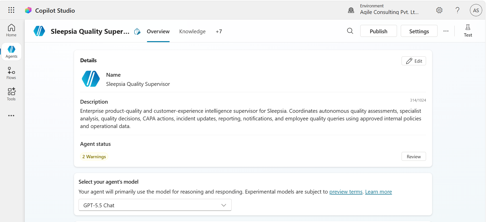
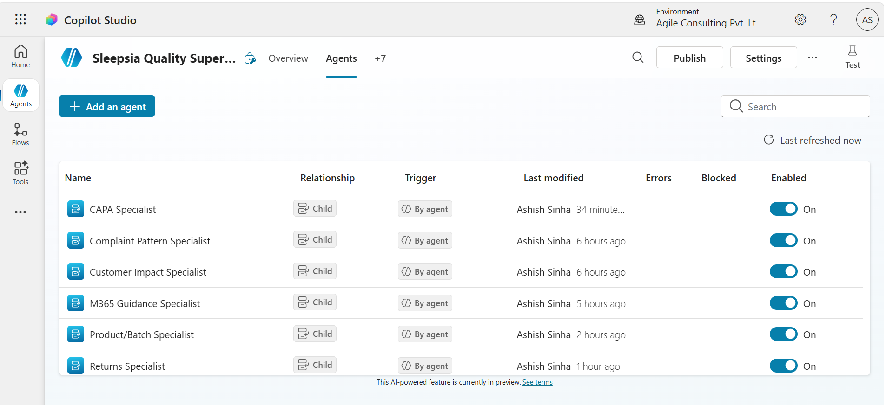
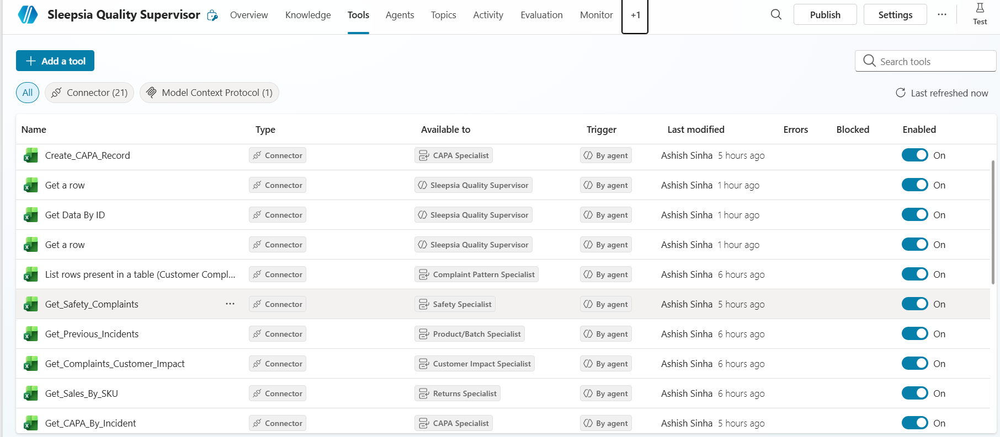
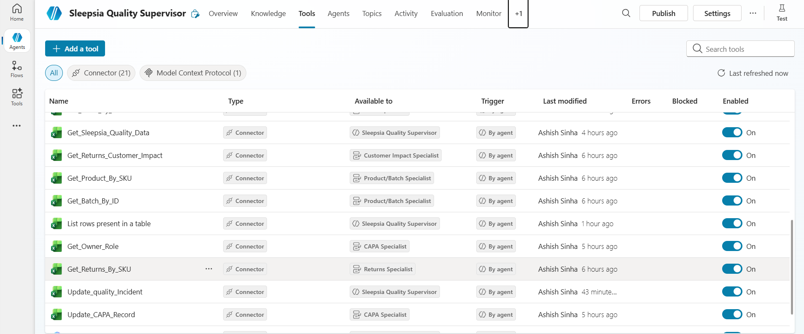
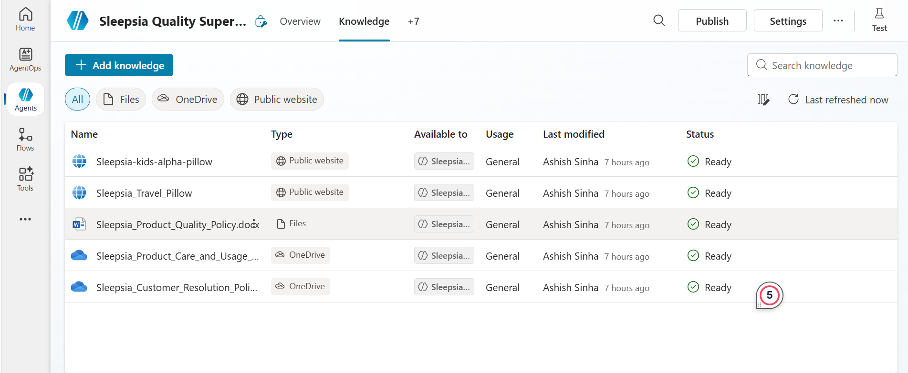
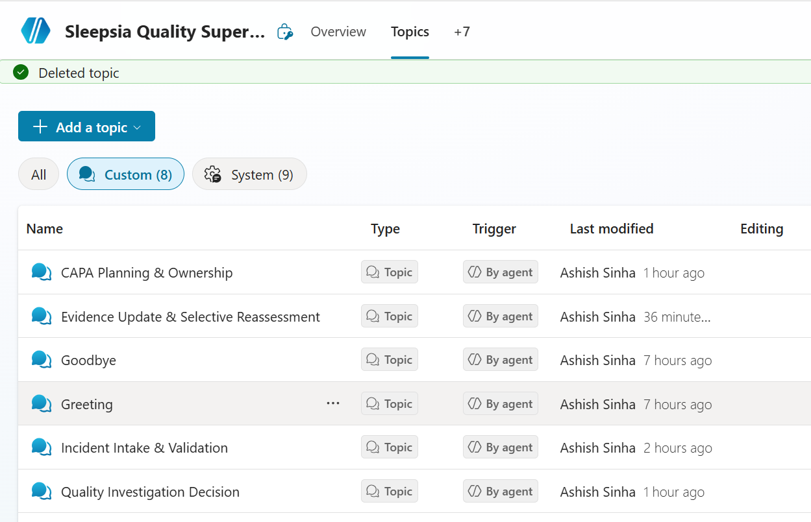
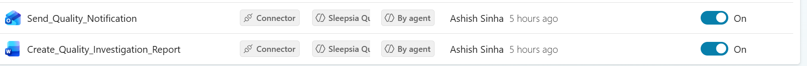

# Architecture

## 1. Supervisor
The Quality Supervisor is the parent orchestrator and sole final quality decision owner. Child agents return domain findings only.

## 2. Child Agents
| Agent | Responsibility |
|---|---|
| Complaint Pattern Specialist | Complaint clustering/patterns |
| Returns Specialist | Return count, rate and reasons |
| Product/Batch Specialist | SKU, batch, supplier-lot and prior incidents |
| Customer Impact Specialist | Customers affected and repeated impact |
| Safety Specialist | Safety indicators and safety complaints |
| CAPA Specialist | Containment, corrective/preventive actions and ownership |
| M365 Guidance Specialist | Microsoft 365 operational guidance only |

M365 Guidance must never influence Sleepsia quality severity.

## 3. Operational Data
Excel Online (Business) stores/reads Product_Master, Batch_Register, Customer_Complaints, Sales_Summary, Returns, Quality_Incidents, CAPA_Register, Owners, Quality_Rules and Test_Scenarios.

## 4. Knowledge
Internal policy/care/customer-resolution documents are the authoritative knowledge layer. Approved public Sleepsia URLs provide public product facts only.

## 5. Reporting
Word Online (Business) generates the investigation report after Supervisor validation. Outlook sends conditional internal notification.

## 6. Failure Boundary
Retry failed specialist/tool operations once where applicable. Record second failure. Never fabricate missing data or tool success.

## Screenshot Evidence
Use these relative GitHub paths. Replace filenames only if your actual PNG names differ.

- Supervisor: 
- Child agents: 

- Excel tool: 

- Excel tool 1: 
- Knowledge Base:

- MCP Server: 

- Topics: 
- Word/Outlook: 

