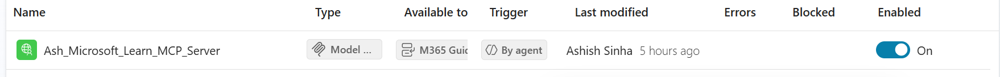

# MCP Implementation

## Microsoft Learn MCP
Used by M365 Guidance Specialist for Microsoft 365/Copilot Studio operational guidance.

## Boundary
MCP must not determine Sleepsia quality severity or override internal quality policy.

## Failure
If unavailable:
1. record unavailable status;
2. do not fabricate Microsoft guidance;
3. continue core quality workflow;
4. do not block quality classification.

## Evidence
Capture configuration, discovered tools, successful invocation and unavailable/failure behavior.

Required test: TC-11 — MCP unavailable -> core quality flow continues.

## Screenshot Evidence
Use these relative GitHub paths. Replace filenames only if your actual PNG names differ.

- MCP Server: 

