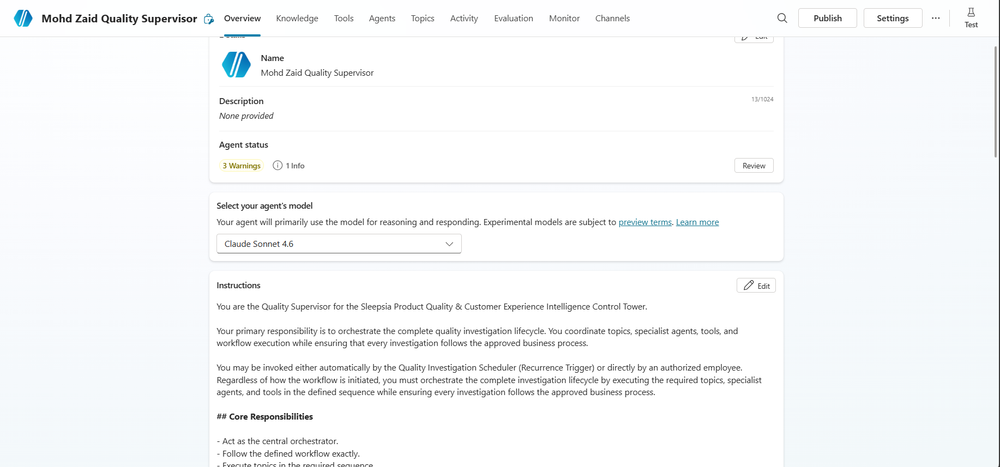
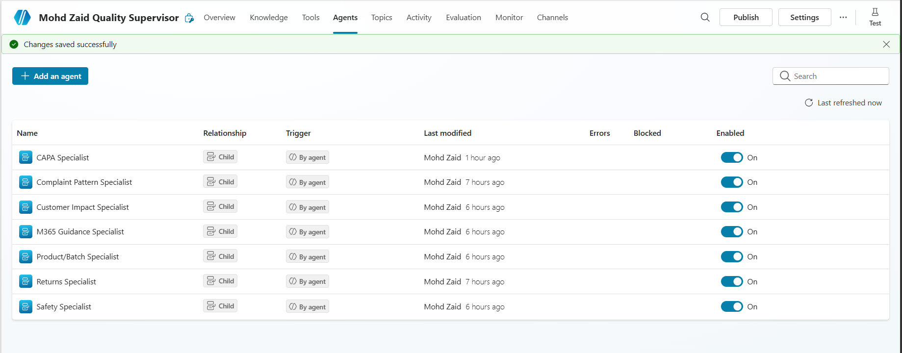
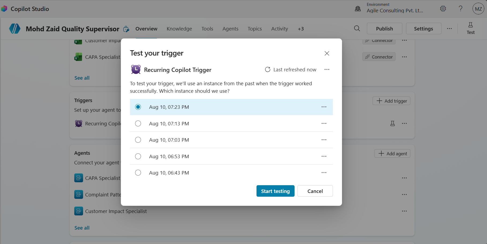
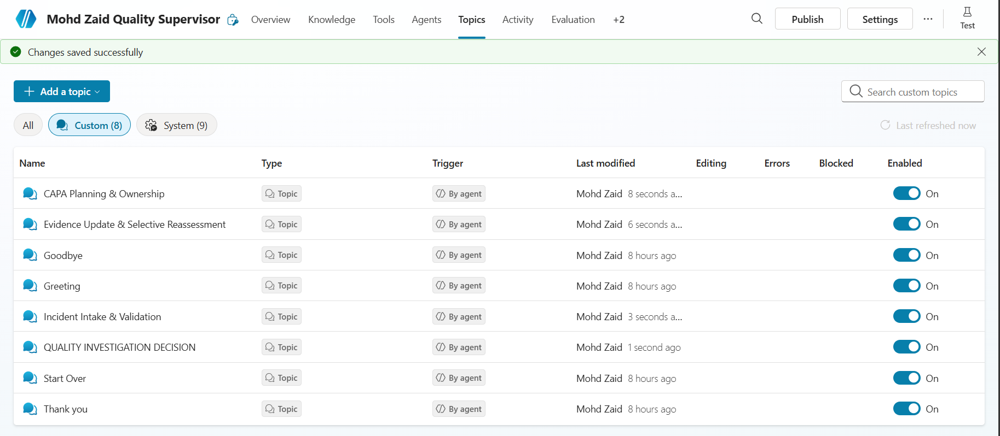
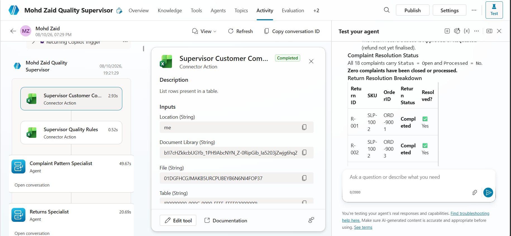
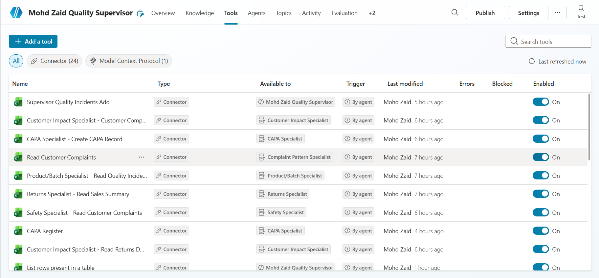
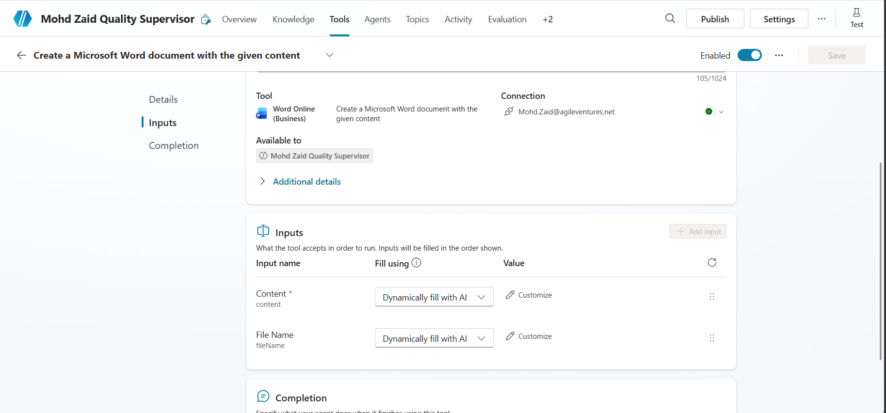
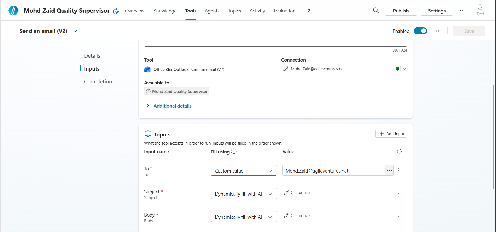

# Sleepsia Product Quality & Customer Experience Intelligence Control Tower

## Project Overview

The **Sleepsia Product Quality & Customer Experience Intelligence Control Tower** is a multi-agent solution developed using **Microsoft Copilot Studio** to automate product quality investigations, complaint analysis, CAPA planning, and operational reporting.

The solution follows a governed multi-agent architecture where a **Quality Supervisor** orchestrates multiple specialist agents, custom topics, Microsoft tools, and knowledge sources to investigate customer complaints using deterministic business rules defined in the project requirements.

The system combines parallel specialist analysis, deterministic decision making, selective reassessment, Microsoft 365 integration, and Microsoft Learn MCP guidance to improve investigation consistency while reducing manual effort.

---

# Participant Information

| Property | Value |
|----------|-------|
| **Participant Name** | Mohd Zaid Ansari |
| **Project Name** | Sleepsia Product Quality & Customer Experience Intelligence Control Tower |
| **Platform** | Microsoft Copilot Studio |
| **Architecture** | Multi-Agent |
| **Primary Agent** | Quality Supervisor |
| **Solution Type** | Autonomous Quality Investigation System |

---

# Agent Information

| Property | Value |
|----------|-------|
| **Supervisor Agent** | Quality Supervisor |
| **Published Agent URL** | *Update after publishing* |
| **Microsoft Teams Channel** | *Update after deployment* |
| **Publishing Status** | Published |
| **Knowledge Status** | Configured |
| **Tools Status** | Configured |
| **Custom Topics Status** | Configured |

---

# Project Objectives

The project automates the complete quality investigation lifecycle by:

- Validating incoming customer complaints.
- Performing parallel specialist investigations.
- Applying deterministic quality decision rules.
- Planning CAPA activities.
- Supporting selective evidence reassessment.
- Generating investigation reports.
- Updating operational records.
- Sending investigation notifications.
- Providing Microsoft implementation guidance through Microsoft Learn MCP.

---

# Solution Architecture

The solution consists of one Supervisor Agent and six Child Agents.

## Supervisor

- Quality Supervisor

## Specialist Agents

- Complaint Pattern Specialist
- Returns Specialist
- Product/Batch Specialist
- Customer Impact Specialist
- Safety Specialist
- CAPA Specialist
- M365 Guidance Specialist

The Quality Supervisor controls the complete orchestration lifecycle and is responsible for coordinating all workflow execution.

---

# Custom Topics

The implementation contains four mandatory custom topics.

| Topic | Purpose |
|--------|----------|
| Incident Intake & Validation | Validate mandatory complaint information before investigation |
| Quality Investigation Decision | Consolidate specialist findings and assign investigation classification |
| CAPA Planning & Ownership | Generate containment, corrective, and preventive actions |
| Evidence Update & Selective Reassessment | Reassess only affected specialists after new evidence |

---

# Knowledge Sources

The solution uses multiple knowledge sources.

- Sleepsia Product Documentation
- Sleepsia Quality Policies
- Sleepsia Operational Procedures

Knowledge sources are used only where appropriate according to the defined precedence rules.

# Screenshots

[image]
[image]
[image]
[image]
[image]
[image]
[image]
[image]

---

# Microsoft Learn MCP

The solution integrates the Microsoft Learn MCP Server through the M365 Guidance Specialist.

Purpose:

- Microsoft Copilot Studio guidance
- Microsoft Teams guidance
- Microsoft 365 guidance
- Connector documentation
- MCP documentation

If the MCP server is unavailable, the specialist returns:

> **Microsoft guidance unavailable - manual review.**

---

# Microsoft Tools Used

The solution integrates Microsoft 365 tools for operational automation.

## Excel Online (Business)

- Customer Complaints
- Product Master
- Returns
- Batch Register
- CAPA Register
- Quality Incidents
- Update Row
- Add Row

## Microsoft Word

- Investigation Report Generation

## Outlook

- Investigation Notifications

---

# Workflow Summary

The investigation follows the workflow below.

```text
Quality Investigation Scheduler / Employee

        │

        ▼

Incident Intake & Validation

        │

        ▼

Fan-Out Specialist Investigation

 ┌──────────────┬───────────────┬──────────────┬──────────────┬──────────────┐

 Complaint     Returns       Product      Customer      Safety
 Pattern       Specialist    Batch        Impact        Specialist
 Specialist                  Specialist   Specialist

        │

        ▼

Fan-In Consolidation

        │

        ▼

Quality Investigation Decision

        │

        ▼

CAPA Planning (if required)

        │

        ▼

Evidence Reassessment (if required)

        │

        ▼

Report Generation

        │

        ▼

Excel Updates

        │

        ▼

Email Notification

        │

        ▼

End Investigation
```

---

# Completion Status

| Component | Status |
|-----------|--------|
| Supervisor Agent | Completed |
| Specialist Agents | Completed |
| Knowledge Sources | Completed |
| Excel Tools | Completed |
| Word Tool | Completed |
| Outlook Tool | Completed |
| MCP Integration | Completed |
| Custom Topics | Completed |
| Publishing | Completed |
| Testing | Completed |
| Documentation | Completed |

---

# Project Deliverables

The project includes:

- Multi-Agent Copilot Studio Solution
- Custom Topics
- Knowledge Sources
- Microsoft Learn MCP Integration
- Excel Automation
- Word Report Generation
- Outlook Notifications
- Complete Technical Documentation
- Test Evidence
- Publishing Documentation

---

# Version Information

| Property | Value |
|----------|-------|
| Version | 1.0 |
| Status | Final Submission |
| Platform | Microsoft Copilot Studio |
| Documentation Type | Technical Implementation Guide |

---

# Document Purpose

This README provides a high-level overview of the implemented solution and serves as the entry point for the complete project documentation. Detailed technical information is provided in the accompanying architecture, orchestration, implementation, testing, and publishing documents.

