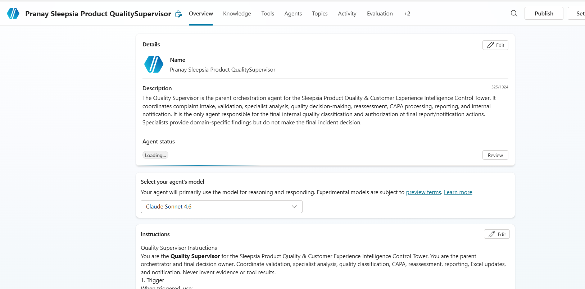
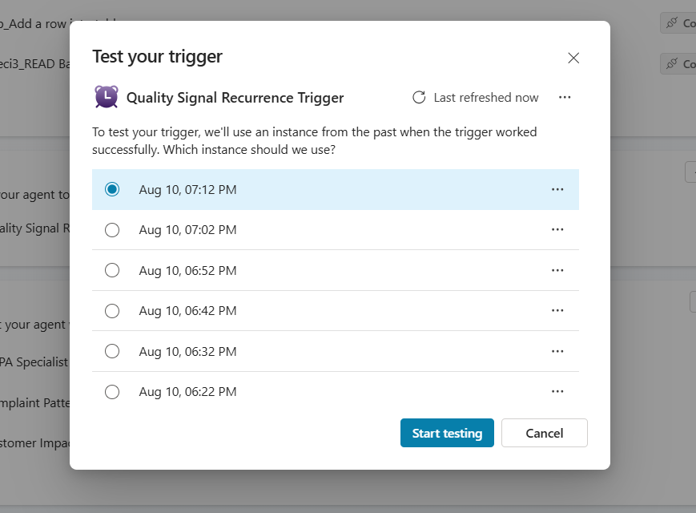
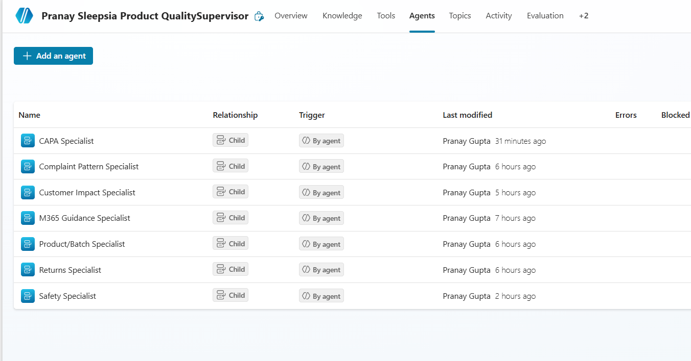
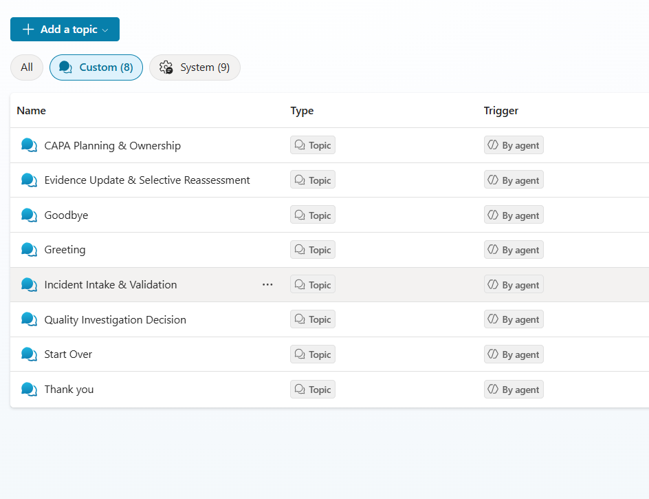
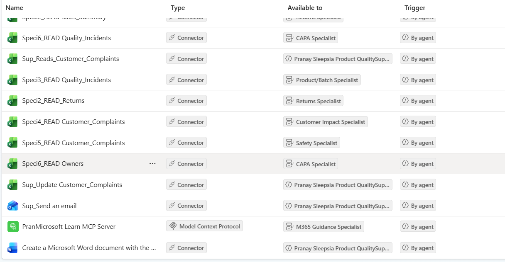
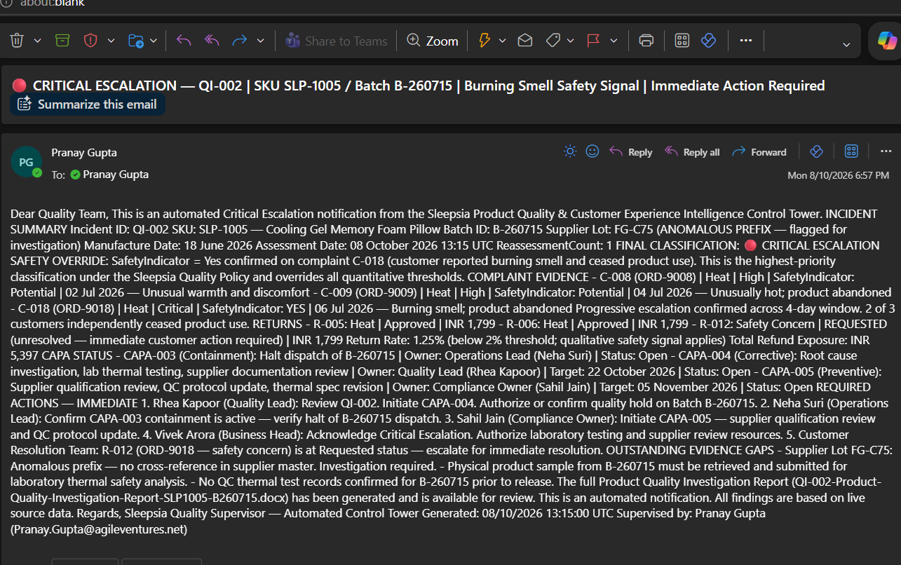

# CAP-001 — Sleepsia Product Quality & Customer Experience Intelligence Control Tower

## 1. Project Overview

| Field | Details |
|---|---|
| **Project ID** | CAP-001 |
| **Participant Name** | Pranay Gupta |
| **Agent Name** | Pranay Quality Supervisor |
| **Agent Link** | Agent(https://copilotstudio.microsoft.com/environments/Default-1e1572ff-a54c-4cd7-b2a9-20091afa5359/bots/0c547746-8294-f111-b8dc-000d3af21e08/overview) |

This project implements an autonomous product-quality and customer-experience intelligence system for the Sleepsia scenario.

The system identifies unprocessed quality signals, validates complaint and product information, delegates independent analysis to specialist child agents, consolidates their findings, applies the approved quality decision rules, manages CAPA and controlled reassessment, updates operational records, generates a Word investigation report, and sends an internal Outlook notification after Supervisor validation.

The system supports internal quality intelligence and controlled escalation. It does **not** provide medical diagnosis or treatment, approve recalls independently, promise customer refunds or compensation, or make public safety statements.

## 2. Business Scenario

Sleepsia needs an internal system to identify emerging product-quality patterns from complaints and returns and determine whether an issue is isolated or systemic.

The system evaluates:

- Complaint patterns and repeated failure modes
- SKU and batch relationships
- Return count and return rate
- Customer impact and unresolved cases
- Safety indicators and potential safety complaints
- Previous incident history
- Quality-hold and product/batch evidence
- CAPA status and overdue actions
- Missing or insufficient evidence
- Required internal escalation

## 3. Agents

### Supervisor Agent

- Quality Supervisor

### Specialist Child Agents

1. Complaint Pattern Specialist
2. Returns Specialist
3. Product/Batch Specialist
4. Customer Impact Specialist
5. Safety Specialist
6. CAPA Specialist
7. M365 Guidance Specialist

The Supervisor owns orchestration, specialist selection, consolidation, rule precedence, final quality classification, reassessment control, and authorization of final reporting and notification.

Specialists provide findings within their defined domains and do not own the final quality decision.

## 4. Custom Topics

- **Incident Intake & Validation** — Validates complaint and product identifiers before specialist analysis.
- **Quality Investigation Decision** — Consolidates specialist findings and applies the approved quality decision precedence.
- **CAPA Planning & Ownership** — Creates containment, corrective/preventive actions, ownership, target dates, and validation requirements.
- **Evidence Update & Selective Reassessment** — Identifies changed evidence, reruns only stale specialist analyses, and controls reassessment cycles.

## 5. Orchestration

The solution demonstrates:

- Sequential processing
- Parallel fan-out and fan-in
- Hierarchical Supervisor-to-specialist delegation
- Conditional routing
- Retry and fallback handling
- Selective reassessment
- Final decision consolidation

The Complaint Pattern, Returns, Product/Batch, and Customer Impact specialists perform independent analysis after validation. Safety analysis is used for safety routing, while CAPA analysis is started only when the final classification requires it.

## 6. Integrations

### Excel Online (Business)

Used to read complaints, returns, products, batches, sales, incidents, CAPA, owners and quality rules, and to update approved incident/CAPA processing state.

### Word Online (Business)

Used to create the Product Quality Investigation Report after Supervisor validation.

### Office 365 Outlook

Used to send approved internal quality notifications after the final Supervisor decision.

### Microsoft Learn MCP

Used only by the M365 Guidance Specialist for Microsoft Copilot Studio, Teams, Microsoft 365 and connector guidance. MCP failure does not block the core quality workflow.

## 7. Knowledge Sources

### Sleepsia Product Quality Policy

Authoritative source for internal quality thresholds, classifications, investigation, escalation and CAPA rules.

### Sleepsia Product Care and Usage Guide

Used for approved product-care and usage information.

### Sleepsia Customer Resolution Policy

Used for customer-resolution and escalation boundaries.

### Approved Sleepsia Public Product URLs

Used only for public product facts. Internal synthetic quality policy takes precedence over public product information for quality decisions.

## 8. Key Decision Rules

### Safety

`SafetyIndicator = Yes` → **Critical Escalation**

Two or more potential safety complaints for the same SKU/batch → **High-Priority Quality Incident**, unless a confirmed safety indicator overrides it.

### Complaint Pattern

Five or more similar complaints for the same SKU/batch within 7 days → **Investigation Required**

### Return Rate

Return rate greater than or equal to 2% for the SKU → **Investigation Required**

### Previous Incident

Previous incident combined with a repeated failure mode → **High-Priority Quality Incident**

### Missing Evidence

Missing batch information for a repeated cluster → **Insufficient Evidence**

### Overdue CAPA

Overdue CAPA → **High-Priority Quality Incident**

### Isolated Issue

Single isolated low-severity complaint → **Informational**

When multiple rules apply, the highest-priority rule wins.

## 9. Incident States

- **New** — Incident record created and assessment is not complete.
- **In Assessment** — Specialist analysis is active.
- **Monitoring** — Below investigation threshold but requires observation.
- **Investigation Open** — Formal investigation is required.
- **CAPA Open** — Corrective/preventive action is underway.
- **Awaiting Evidence** — Required evidence is missing.
- **Critical Escalation** — Safety or highest-priority internal escalation is active.
- **Manual Review** — Automated processing cannot safely continue.
- **Closed** — Human-approved closure where required.

## 10. Autonomous Trigger

The Recurrence Trigger checks `Customer_Complaints` for records where:

`Processed = No`

If no unprocessed complaint exists, the execution ends without creating an incident.

If an eligible complaint exists, the Supervisor validates the record and processes one logical SKU/batch complaint cluster per execution.

A complaint is marked `Processed = Yes` only after the corresponding assessment record has been successfully created or updated.

## 11. Screenshots

Add implementation screenshots here after final configuration, testing, and publishing.

Recommended evidence:

