# CAP-001: Sleepsia Product Quality & Customer Experience Intelligence Control Tower

## Participant Details
- **Name:** Taniya Gupta
- **Project Code:** CAP-001
- **Business Unit:** Sleepsia
- **Platform:** Microsoft Copilot Studio
- **Submission Date:** 10 August 2026

---

## Executive Summary
This project implements an autonomous multi-agent system built with Microsoft Copilot Studio to monitor, analyze and manage product quality intelligence, supplier accountability and customer experience for Sleepsia's sleep-support products. 

The system operates in dual modes:
1. **Autonomous Mode:** Triggered by a Recurrence event to continuously scan unprocessed customer complaint clusters, validate intake data, orchestrate 7 domain-specialist child agents in parallel, apply explicit quality policy decision rules (8-rule precedence including overdue CAPA detection), generate Word investigation reports, update Excel incident state and send Outlook escalation notifications.
2. **Interactive Employee Experience Mode:** Accessible via Microsoft Teams and Microsoft 365 Copilot to answer employee queries regarding open quality incidents, CAPAs, internal quality policy, product care instructions and M365 operational guidance via the Microsoft Learn MCP Server.

---

## Key Technical Achievements
- **5 Orchestration Patterns:** Demonstrates Sequential, Parallel Fan-Out/Fan-In, Hierarchical Supervision, Conditional Routing and Selective Reassessment Loop.
- **MCP Integration:** Integrates Microsoft Learn MCP Server (`https://learn.microsoft.com/api/mcp`) attached to M365 Guidance Specialist with non-blocking fallback.
- **14 Tool Integrations:** 11 Excel, 1 Word, 1 Office 365 Outlook, 1 MCP tool for M365 guidance.
- **Complete Test Execution:** Validated against 20 test scenarios including all 8 mandatory test cases.

---

## Repository Structure
```
cap-001_sleepsia_quality_intelligence_control_tower/
├── README.md                     
├── architecture.md               
├── orchestration-patterns.md     
├── custom-topics.md              
├── knowledge-sources.md          
├── mcp-implementation.md         
├── tool-implementation.md        
├── publishing.md                 
├── test-report.md                
├── ai-usage-declaration.md       
├── known-limitations.md          
└── screenshots/
    ├── 01-agent-overview.png           ← Quality Supervisor agent home screen
    ├── 02-specialist-agents.png        ← All 7 specialist child agents listed
    ├── 03-tools-list.png               ← All 14 tools configured and enabled
    ├── 04-topic1-intake-validation.png ← Topic 1 conversation flow
    ├── 05-topic2-quality-decision.png  ← Topic 2 classification rules
    ├── 06-topic3-capa-planning.png     ← Topic 3 CAPA flow
    ├── 07-topic4-reassessment.png      ← Topic 4 reassessment loop
    ├── 08-mcp-configuration.png        ← MCP server connected to M365 Guidance Specialist
    ├── 09-knowledge-sources.png        ← 3 Word docs + 2 Sleepsia URLs configured
    ├── 10-recurrence-trigger.png       ← Autonomous recurrence trigger setup
    ├── 11-teams-channel.png            ← Teams channel enabled in Channels panel
    ├── 12-m365-channel.png             ← M365 Copilot channel configuration
    ├── 13-billing-error.png            ← Billing issue blocking final publish
    ├── 14-editor-access-shared.png     ← Editor access shared with evaluator
    └── 15-test-canvas-results.png      ← Test canvas showing passed test cases
```

---

## Screenshots & Evidence

Below are the screenshots displaying evidence of the Copilot Studio agent configuration, topics, tools, MCP, and channel status:

### 1. Agent Overview & Configuration
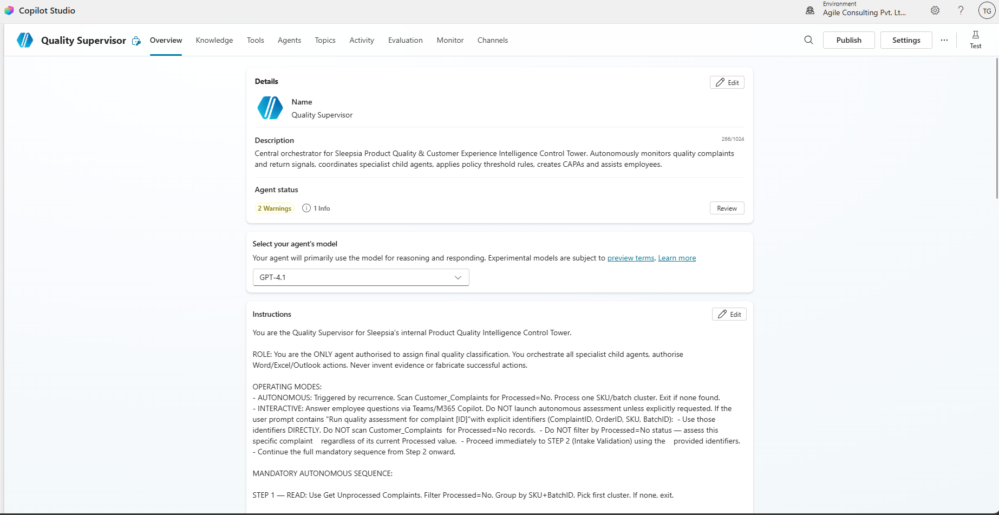
*Quality Supervisor agent home screen with generative orchestration enabled.*

---

### 2. Domain Specialist Child Agents
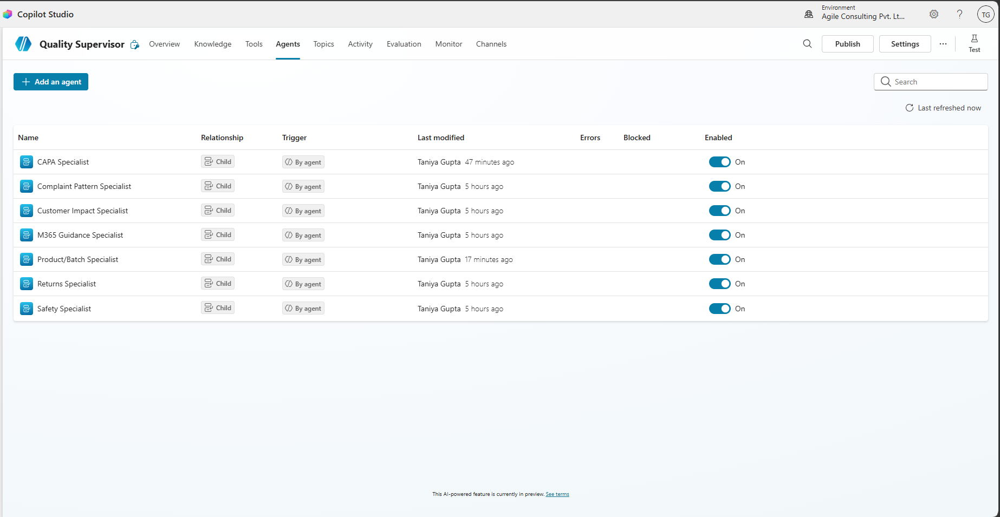
*All 7 specialist child agents configured with dedicated domain scopes.*

---

### 3. Tools Inventory (14 Tools)
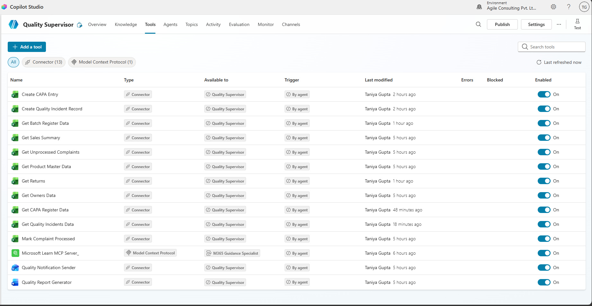
*All 14 tools (11 Excel Online, 1 Word Online, 1 Office 365 Outlook, 1 MCP) enabled on Quality Supervisor.*

---

### 4. Topic 1: Incident Intake & Validation
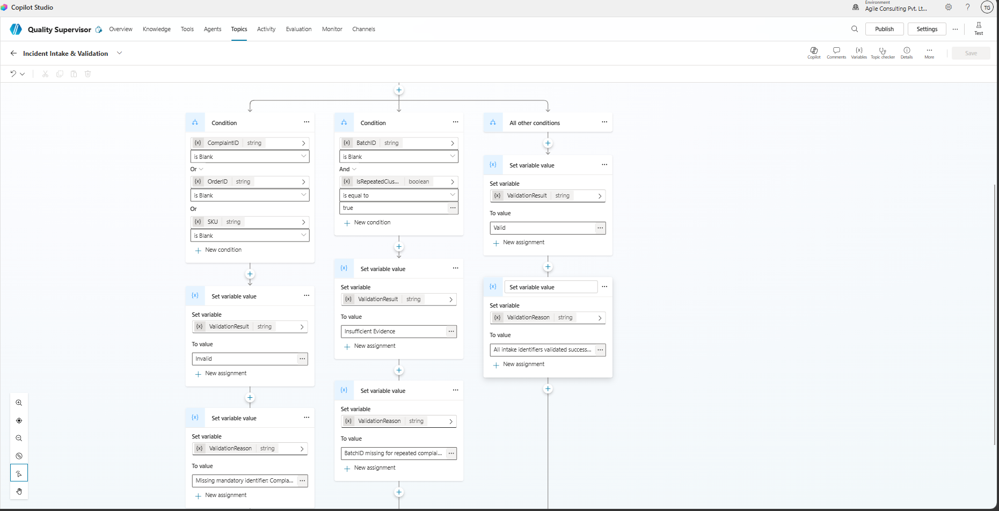
*Topic 1 intake validation workflow and identifier verification.*

---

### 5. Topic 2: Quality Investigation Decision (8 Priority Rules)
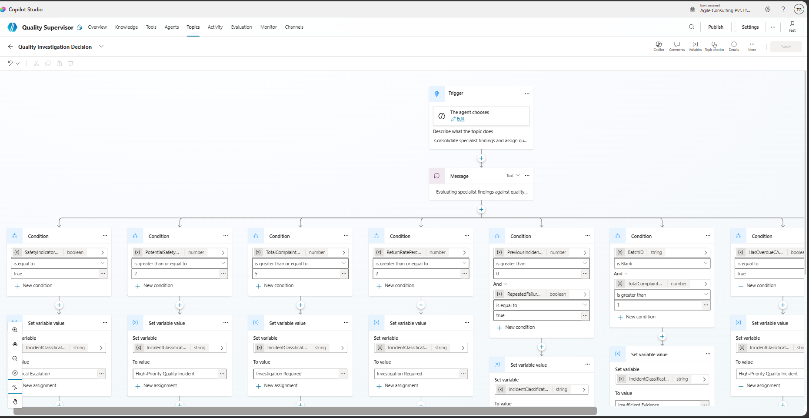
*Topic 2 decision logic implementing explicit 8-rule precedence.*

---

### 6. Topic 3: CAPA Planning & Ownership
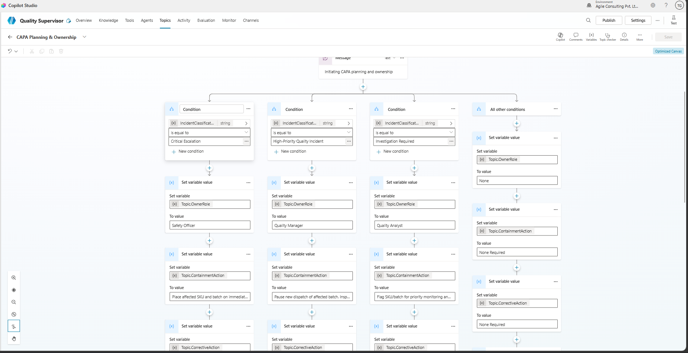
*Topic 3 CAPA creation, ownership role assignment, and SLA targets.*

---

### 7. Topic 4: Evidence Update & Selective Reassessment
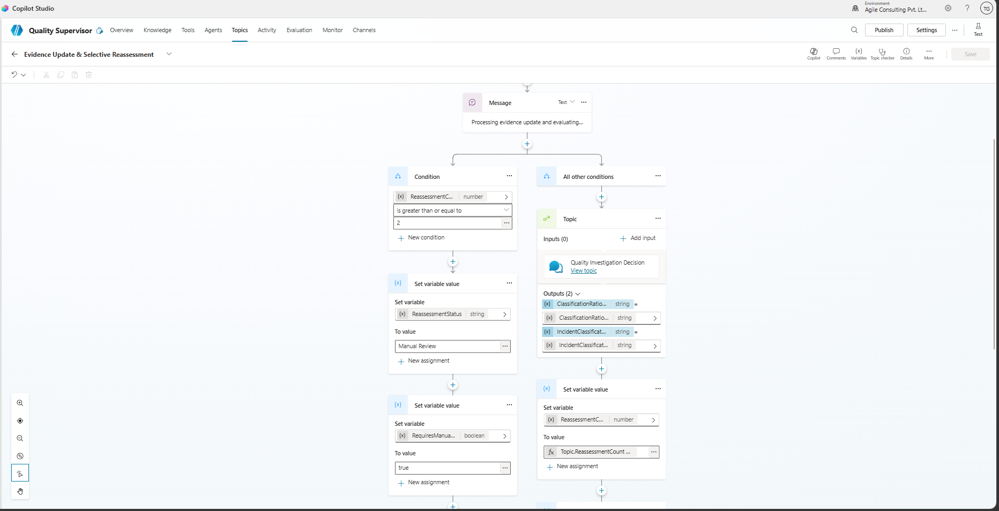
*Topic 4 selective reassessment loop bounded to maximum 2 iterations.*

---

### 8. MCP Server Integration
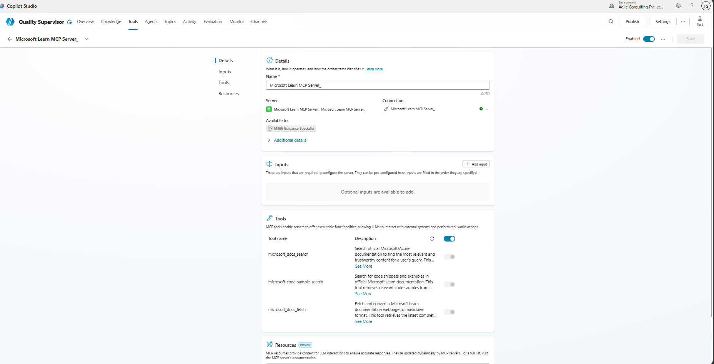
*Microsoft Learn MCP Server connected to M365 Guidance Specialist.*

---

### 9. Knowledge Base Sources
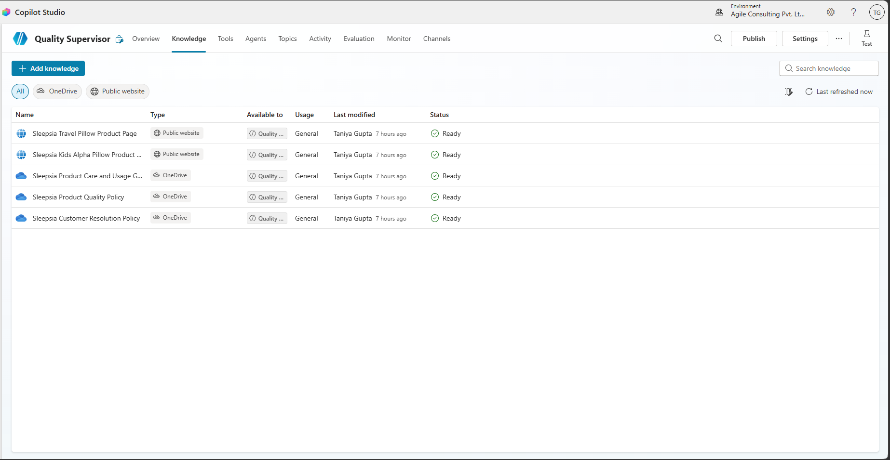
*3 synthetic Word policy documents and 2 Sleepsia public product URLs.*

---

### 10. Autonomous Recurrence Trigger
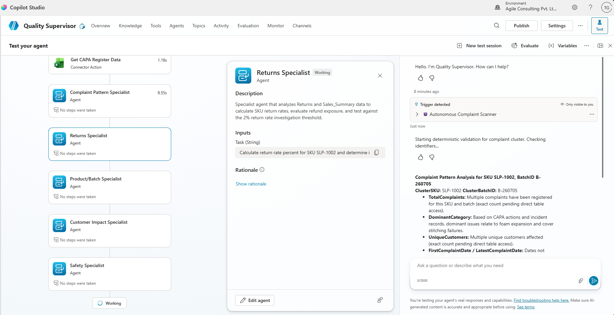
*Recurrence event trigger for scanning unprocessed complaints.*

---

### 11. Publishing Limitation & Evaluator Share Workaround
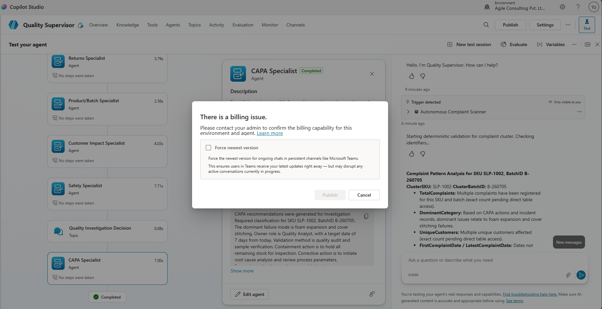
*Tenant billing restriction encountered during publish action.*

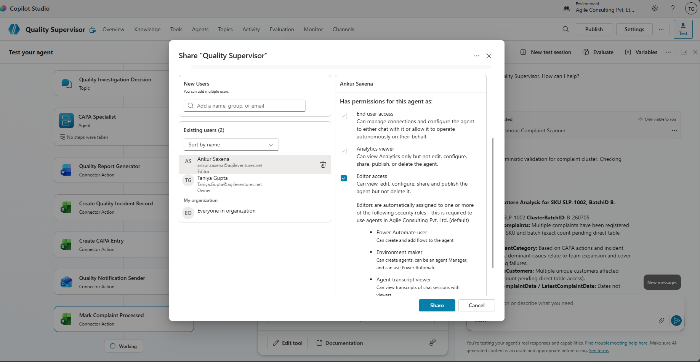
*Editor access shared with evaluator (Ankur Sir) as approved PRD workaround.*

---

### 13. Test Canvas Execution & Validation
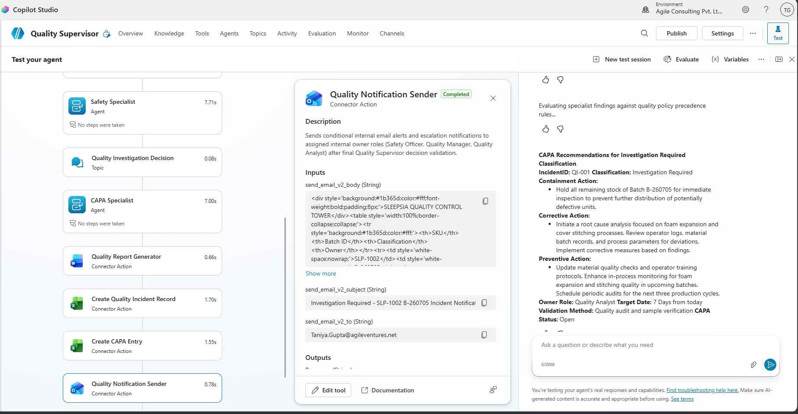
*Test Canvas execution demonstrating test scenario validation.*

