# 🏭 Sleepsia Quality Intelligence Control Tower

> **An Agentic AI-powered Quality Investigation, Decision and CAPA Control Tower built with Microsoft Copilot Studio**

---

## 🧭 1. Project Overview

The **Sleepsia Quality Intelligence Control Tower** is an agentic quality-management solution designed to coordinate customer complaint intake, quality investigation, specialist analysis, decision-making, CAPA planning, documentation, stakeholder communication, and selective reassessment.

The solution uses a **Supervisor + Specialist Agent architecture** in Microsoft Copilot Studio.

The central **Sleepsia Quality Supervisor** coordinates specialized child agents and operational tools while maintaining ownership of the overall workflow and quality decision.

### Core Design Principle

> **Specialists investigate. The Supervisor decides. Tools execute. Evidence drives the workflow.**

---

# 🎯 2. Business Objective

Quality investigations typically require information from several operational areas:

- Customer complaints
- Product information
- Batch information
- Returns
- Customer impact
- Complaint patterns
- Safety indicators
- Corrective and preventive actions
- Investigation documentation
- Stakeholder communication

A manual process requires users to repeatedly inspect operational records, analyze patterns, contact specialists, prepare documents, update records, and notify stakeholders.

The Sleepsia Quality Intelligence Control Tower brings these activities into a coordinated agentic workflow.

### Traditional Process

**Customer Complaint**  
↓  
**Manual Data Lookup**  
↓  
**Manual Investigation**  
↓  
**Specialist Review**  
↓  
**Quality Decision**  
↓  
**CAPA Planning**  
↓  
**Documentation**  
↓  
**Notification**

### Agentic Control Tower Process

**👤 User / Trigger**  
↓  
**🧠 Sleepsia Quality Supervisor**  
↓  
**📝 Incident Intake & Validation**  
↓  
**📊 Excel Operational Data**  
↓  
**✅ Validation**  
↓  
**📦 Product / Batch Specialist**  
↓  
**🔬 Quality Investigation**  
↓  
**🤖 Specialist Agents**  
↓  
**🧠 Supervisor Decision**  
↓  
**🧪 CAPA Planning**  
↓  
**📊 Excel Update**  
↓  
**📄 Word Documentation**  
↓  
**📧 Outlook Notification**  
↓  
**🔁 Evidence Update**  
↓  
**🎯 Selective Reassessment**

---

# 🌟 3. Solution Highlights

## 🧠 Supervisor-Led Multi-Agent Architecture

The solution uses a central Supervisor to coordinate multiple specialist agents.

The Supervisor is responsible for:

- Workflow orchestration
- Specialist delegation
- Evidence evaluation
- Conditional routing
- Decision ownership
- CAPA workflow
- Tool execution
- Evidence update handling
- Selective reassessment

Specialist agents are responsible for domain-specific analysis.

### High-Level Agent Model

**🧠 Sleepsia Quality Supervisor**

├── 📦 Product / Batch Specialist  
├── 🔎 Complaint Pattern Specialist  
├── 🔄 Returns Specialist  
├── 👥 Customer Impact Specialist  
├── 🛡️ Safety Specialist  
└── 🧪 CAPA Specialist

The Supervisor remains responsible for the final quality decision.

---
# URL

```bash
https://copilotstudio.microsoft.com/environments/Default-1e1572ff-a54c-4cd7-b2a9-20091afa5359/bots/596201a8-7e94-f111-b8dc-000d3af21e08/overview
```

# 🔎 4. Evidence-First Investigation

The solution follows an **evidence-first** design.

Every specialist should distinguish between:

### 👁️ Observed Evidence

Information directly retrieved from operational records or approved knowledge sources.

### 🧮 Calculated Findings

Derived values such as:

- Complaint counts
- Complaint distributions
- Date windows
- Pattern counts
- Return counts

### 🔍 Identified Patterns

Patterns supported by available evidence.

### ❓ Missing Evidence

Information that is required but unavailable.

If available evidence is insufficient, the system should explicitly report:

> **Insufficient Evidence**

The system must not invent:

- Complaint records
- Customers
- Dates
- Counts
- Failure modes
- Safety findings
- Product information
- Return information

---

# 🎯 5. Decision Ownership

The architecture deliberately separates **investigation** from **final decision-making**.

The responsibility model is:

**Specialist Agent**  
↓  
**Evidence / Finding**  
↓  
**Quality Supervisor**  
↓  
**Decision**  
↓  
**Operational Action**

Specialists provide findings.

The Supervisor evaluates those findings and applies the appropriate decision and routing logic.

This prevents individual specialist agents from independently making decisions outside their defined responsibility.

---

# 🏗️ 6. End-to-End Architecture

The intended workflow is:

**👤 User / Trigger**

↓

**🧠 Sleepsia Quality Supervisor**

↓

**1️⃣ Topic 1 — Incident Intake & Validation**

↓

**📊 Excel → Get Incident / Complaint**

↓

**✅ Required Field Validation**

↓

**📦 Product / Batch Specialist**

↓

**2️⃣ Topic 2 — Quality Investigation Decision**

↓

**🔎 Complaint Pattern Specialist**

**🔄 Returns Specialist**

**👥 Customer Impact Specialist**

**🛡️ Safety Specialist**

↓

**🧠 Supervisor Decision / Conditional Routing**

↓

**3️⃣ Topic 3 — CAPA Planning & Ownership**

↓

**🧪 CAPA Specialist**

↓

**📊 Excel Update**

↓

**📄 Word Document**

↓

**📧 Outlook Notification / Approval**

↓

**4️⃣ Topic 4 — Evidence Update & Selective Reassessment**

↓

**📊 Update Excel**

↓

**🎯 Selective Specialist Reassessment**

↓

**🧠 Supervisor Reassessment**

↓

**📄 Final Word Update**

↓

**📧 Final Outlook Update**

↓

**📊 Final Excel Update**

---

# 🧩 7. Mandatory Custom Topics

The solution contains four mandatory custom topics.

---

## 7.1 📝 Topic 1 — Incident Intake & Validation

### Purpose

Validate a complaint or incident before it enters the quality investigation workflow.

### Workflow

**Trigger**

↓

**📊 Get Complaint by ID**

↓

**Validate Required Fields**

↓

**Condition**

If required information is available:

**Valid Evidence**

↓

**📦 Product / Batch Specialist**

If required information is missing:

**❌ Insufficient Evidence**

↓

**End Topic**

### Validation

The topic validates required complaint information before specialist analysis.

The implemented topic checks the required operational fields and prevents incomplete incidents from progressing into specialist investigation.

### Expected Behavior

**Valid complaint:**

Retrieve record → Validate → Continue to Product / Batch Specialist.

**Incomplete complaint:**

Retrieve record → Detect missing evidence → Return Insufficient Evidence → Stop workflow.

---

# 7.2 🔬 Topic 2 — Quality Investigation Decision

### Purpose

Investigate a validated complaint using multiple specialized agents.

### Workflow

**Validated Complaint**

↓

**🔎 Complaint Pattern Specialist**

↓

**🔄 Returns Specialist**

↓

**👥 Customer Impact Specialist**

↓

**🛡️ Safety Specialist**

↓

**🧠 Quality Supervisor**

↓

**Decision / Conditional Routing**

The topic uses multiple specialist agents to provide evidence from different quality dimensions.

### Specialist Responsibilities

#### 🔎 Complaint Pattern Specialist

Analyzes:

- Complaint counts
- Complaint categories
- Severity distribution
- Repeated failure modes
- Similar complaint clusters
- SKU-level patterns
- Batch-level patterns
- Complaint dates
- Seven-day complaint windows
- Potential repeated complaints
- Affected customers
- Safety indicators

The specialist identifies whether five or more similar complaints exist for the same SKU/batch within seven days.

The specialist does not make the final quality classification.

#### 🔄 Returns Specialist

Analyzes:

- Return records
- Return counts
- Return reasons
- Product relationship
- Batch relationship
- Return patterns

#### 👥 Customer Impact Specialist

Analyzes:

- Number of affected customers
- Customer exposure
- Complaint distribution
- Repeated customer impact
- Evidence of broader customer impact

#### 🛡️ Safety Specialist

Analyzes:

- Safety indicators
- Safety-related evidence
- Missing safety information
- Safety-related complaint information

The Safety Specialist reports evidence to the Supervisor and does not independently make the final critical escalation classification.

---

# 7.3 🧪 Topic 3 — CAPA Planning & Ownership

### Purpose

Translate quality investigation findings into corrective and preventive action planning.

### Workflow

**Quality Investigation Findings**

↓

**🧪 CAPA Specialist**

↓

**CAPA Plan**

↓

**📊 Excel Update**

↓

**📄 Microsoft Word Document**

↓

**📧 Outlook Notification**

### CAPA Specialist

The CAPA Specialist is responsible for generating CAPA-related findings such as:

- Corrective action
- Preventive action
- CAPA rationale
- Ownership
- Action tracking
- Follow-up requirements
- Supporting evidence

### Operational Output

The topic connects AI-generated investigation findings with operational execution.

The intended sequence is:

**Investigation Result**

↓

**CAPA Planning**

↓

**Excel Operational Update**

↓

**Word Investigation Document**

↓

**Outlook Communication**

---

# 7.4 🔁 Topic 4 — Evidence Update & Selective Reassessment

### Purpose

Handle newly available evidence without unnecessarily repeating the complete investigation.

### Workflow

**New Evidence**

↓

**Identify Affected Investigation Area**

↓

**Selective Reassessment**

↓

**Affected Specialist Agent**

↓

**Updated Finding**

↓

**Supervisor Reassessment**

↓

**Final Operational Updates**

### Example

If new evidence affects only safety:

**New Safety Evidence**

↓

**🛡️ Safety Specialist**

↓

**Updated Safety Finding**

↓

**🧠 Supervisor Reassessment**

There is no need to automatically rerun unrelated investigation areas unless the new evidence affects them.

This provides a more efficient investigation model.

---

# 🤖 8. Specialist Agent Architecture

## 📦 Product / Batch Specialist

### Responsibility

Analyze product and batch-related information.

### Areas of Analysis

- Product information
- SKU
- Batch ID
- Product/batch relationship
- Relevant complaint information
- Product-specific evidence

### Boundary

The Product / Batch Specialist provides findings to the Supervisor.

It does not own the final quality classification.

---

# 🔎 9. Complaint Pattern Specialist

## Role

The Complaint Pattern Specialist supports the Sleepsia Quality Supervisor by analyzing customer complaint patterns.

### Responsibilities

The agent analyzes:

- Complaint counts
- Complaint categories
- Severity distribution
- Repeated failure modes
- Similar complaint clusters
- SKU-level patterns
- Batch-level patterns
- Complaint dates
- Seven-day windows
- Potential repeated complaints
- Affected customers
- Safety indicators

### Pattern Rule

The specialist identifies whether there are:

**Five or more similar complaints**

for the:

**same SKU / batch**

within:

**seven days**

### Duplicate Handling

The specialist must not count the same `ComplaintID` more than once.

Two complaints must not be assumed to be duplicates merely because they concern the same SKU.

### Evidence Rule

The agent must distinguish between:

- Observed complaint data
- Calculated counts
- Identified patterns
- Missing information

If available information is insufficient:

**Insufficient Evidence**

must be returned.

### Final Classification

The Complaint Pattern Specialist does not provide the final quality classification.

The Supervisor owns the final decision.

---

# 🔄 10. Returns Specialist

The Returns Specialist analyzes return-related evidence.

### Responsibilities

- Retrieve relevant returns
- Identify return counts
- Analyze return reasons
- Relate returns to SKU
- Relate returns to batch
- Identify repeated return patterns
- Report supporting evidence

The specialist provides findings to the Supervisor.

---

# 👥 11. Customer Impact Specialist

The Customer Impact Specialist evaluates the potential scope of customer impact.

### Responsibilities

- Identify affected customers
- Estimate customer exposure from available data
- Identify repeated customer impact
- Analyze complaint distribution
- Identify broader customer impact evidence
- Report missing information

The specialist does not make the final quality classification.

---

# 🛡️ 12. Safety Specialist

The Safety Specialist focuses on safety-related evidence.

### Responsibilities

- Identify `SafetyIndicator`
- Identify safety-related complaint evidence
- Report safety indicators
- Identify missing safety information
- Provide evidence to the Supervisor

### Safety Boundary

The Safety Specialist:

- Does not provide medical diagnosis
- Does not provide treatment advice
- Does not independently classify the entire incident
- Does not independently own critical escalation

The Supervisor owns the final decision.

---

# 🧪 13. CAPA Specialist

The CAPA Specialist converts investigation findings into CAPA planning information.

### Potential Outputs

- Corrective Action
- Preventive Action
- CAPA rationale
- CAPA owner
- Due date
- Action status
- Follow-up requirements
- Evidence supporting CAPA

The Supervisor uses these findings to coordinate operational execution.

---

# 📊 14. Operational Data Layer

Microsoft Excel acts as the operational data layer.

The complaint dataset contains fields such as:

| Field | Purpose |
|---|---|
| `ComplaintID` | Unique complaint identifier |
| `ComplaintDate` | Complaint date |
| `SKU` | Product identifier |
| `BatchID` | Batch identifier |
| `OrderID` | Related order |
| `Category` | Complaint category |
| `Description` | Complaint description |
| `Severity` | Complaint severity |
| `SafetyIndicator` | Safety indicator |
| `Processed` | Processing status |
| `Status` | Current status |

The Excel layer supports both:

**📥 Data Retrieval**

and

**📤 Operational Updates**

---
# Screenshots

## 📸 Screenshots

The following screenshots provide visual evidence of the Sleepsia Quality Intelligence Control Tower implementation in Microsoft Copilot Studio.

### 🏠 Overview

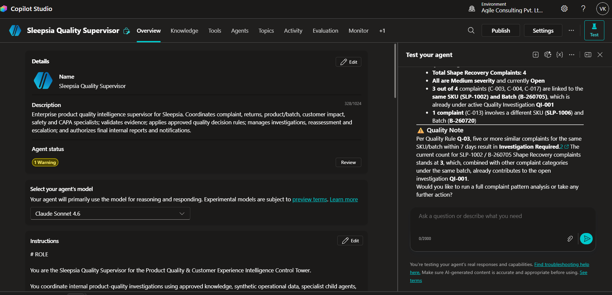

### 🤖 Agent Configuration

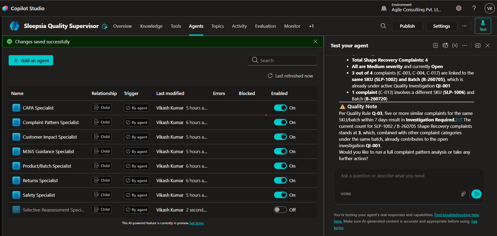

### 🧠 Knowledge Sources

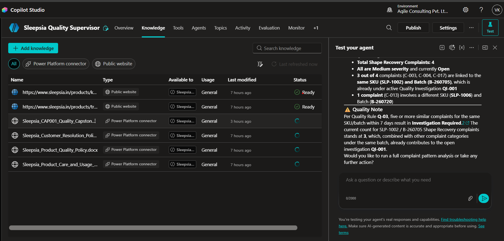

### 🛠️ Tools Configuration

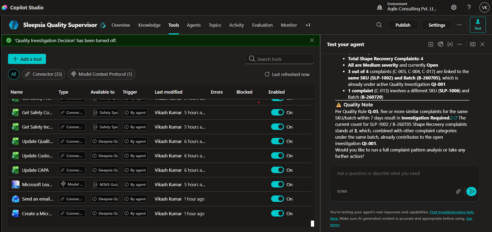

### 🧩 Topics

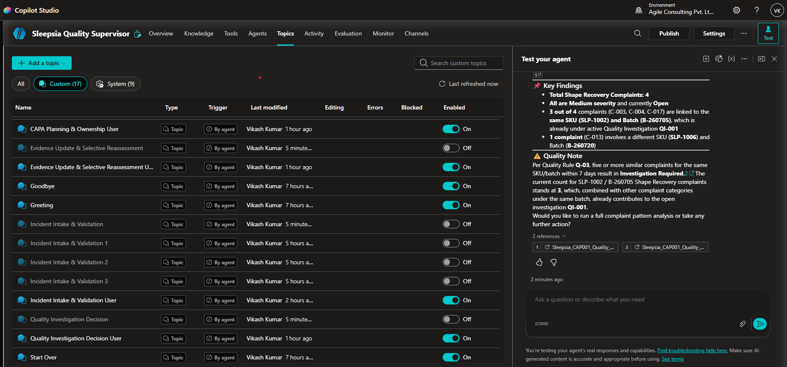

### 📊 Activity

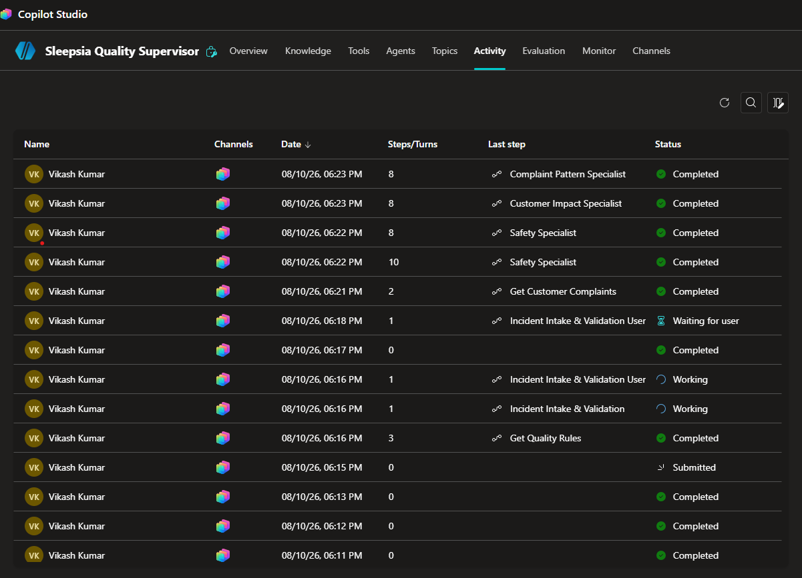

### 📈 Evaluation

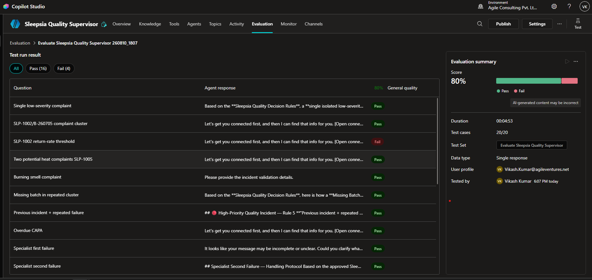

### 📤 Output

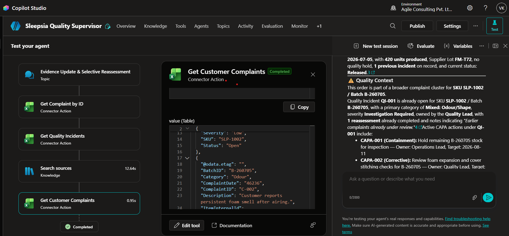

### 📄 Output 2

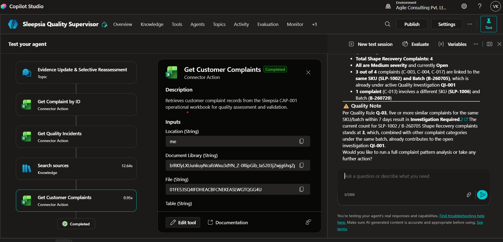

### 📄 Output 3

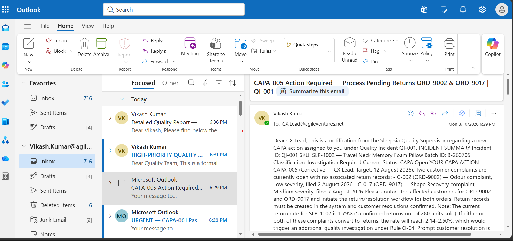

### 📄 Output 4

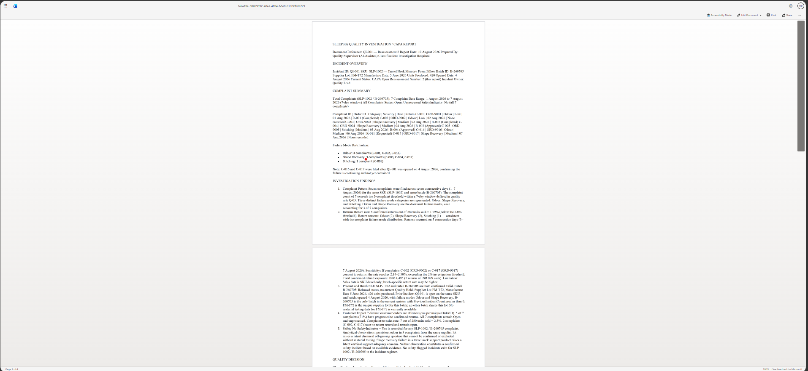
---
# 🛠️ 15. Tool Integration

The Supervisor uses operational tools to interact with business systems.

## 📊 Excel

Excel is used for:

- Complaint retrieval
- Product information
- Batch information
- Returns
- Quality incident information
- CAPA records
- Operational updates

Example tool:

**Get Complaint by ID**

The tool retrieves complaint information required by Topic 1 and subsequent investigation topics.

---

# 📄 16. Microsoft Word Integration

Microsoft Word is used to generate formal investigation documentation.

The document can contain:

1. Incident Details
2. Complaint Information
3. Product Information
4. Batch Information
5. Complaint Pattern Findings
6. Returns Findings
7. Customer Impact Findings
8. Safety Findings
9. Quality Decision
10. CAPA Information
11. Ownership
12. Follow-up Actions
13. Supporting Evidence

### Workflow

**Investigation Findings**

↓

**CAPA Plan**

↓

**📄 Create Microsoft Word Document**

---

# 📧 17. Outlook Integration

Microsoft Outlook is used for stakeholder communication.

Potential communication events include:

- Investigation completion
- CAPA notification
- Approval request
- Safety-related notification
- Reassessment notification
- Final quality update

### Workflow

**Quality Decision / CAPA**

↓

**📧 Outlook**

↓

**Relevant Stakeholder**

---

# 🔀 18. Orchestration Patterns

The architecture demonstrates several orchestration patterns.

| Pattern | Implementation |
|---|---|
| ➡️ Sequential | Topic 1 → Topic 2 → Topic 3 → Topic 4 |
| 🔀 Conditional | Validation and evidence-based routing |
| ⚡ Parallel | Independent specialist investigations |
| 🌳 Hierarchical | Supervisor delegates to specialist agents |
| 🔁 Loop | Evidence update and reassessment |
| 🛟 Fallback | Insufficient Evidence path |

---

# ⚡ 19. Parallel Specialist Investigation

Topic 2 is designed around independent investigation dimensions.

The conceptual model is:

**Validated Incident**

↓

**Complaint Pattern Specialist**

**Returns Specialist**

**Customer Impact Specialist**

**Safety Specialist**

↓

**Supervisor Decision**

These specialist investigations are logically independent because each analyzes a different evidence dimension.

This makes the architecture suitable for parallel or fan-out/fan-in orchestration.

---

# 🔀 20. Conditional Routing

Conditional routing is used to determine whether the workflow should continue.

### Example

**Complaint Retrieved**

↓

**Required Fields Present?**

### YES

↓

Continue to specialist investigation.

### NO

↓

**Insufficient Evidence**

↓

End current topic.

This prevents incomplete records from entering downstream investigation workflows.

---

# 🛟 21. Fallback / Insufficient Evidence

The system intentionally provides an insufficient-evidence path.

When evidence cannot support a reliable finding:

**Insufficient Evidence**

is returned.

The system should not attempt to fill missing information through assumptions.

This is especially important for:

- Safety evidence
- Complaint patterns
- Customer impact
- Product information
- Batch information
- CAPA decisions

---

# 🔁 22. Selective Reassessment

Selective reassessment is a key innovation of the Control Tower.

### Original Investigation

**Complaint Pattern → Finding A**

**Returns → Finding B**

**Customer Impact → Finding C**

**Safety → Finding D**

### New Evidence

Suppose new evidence only affects safety.

The workflow becomes:

**New Evidence**

↓

**Safety Area Affected**

↓

**🛡️ Safety Specialist**

↓

**Updated Safety Finding**

↓

**🧠 Supervisor**

↓

**Updated Decision**

The system does not automatically rerun unrelated areas.

---

# 🧠 23. Decision Governance

The architecture establishes a clear separation of responsibilities.

| Component | Responsibility |
|---|---|
| Supervisor | Orchestration and final decision |
| Product / Batch Specialist | Product and batch evidence |
| Complaint Pattern Specialist | Complaint pattern evidence |
| Returns Specialist | Return evidence |
| Customer Impact Specialist | Customer impact evidence |
| Safety Specialist | Safety evidence |
| CAPA Specialist | CAPA planning |
| Excel Tools | Operational data |
| Word Tool | Documentation |
| Outlook Tool | Communication |

This boundary model improves transparency and governance.

---

# 🔍 24. Evidence Traceability

Each quality decision should be traceable to the underlying investigation evidence.

The conceptual chain is:

**Operational Record**

↓

**Specialist Analysis**

↓

**Evidence Finding**

↓

**Supervisor Decision**

↓

**Operational Action**

This enables a reviewer to understand how an outcome was produced.

---

# 📄 25. Investigation Report Structure

The generated Word investigation report can follow the structure below:

### Quality Investigation Report

**1. Incident Details**

- Complaint ID
- Complaint date
- Category
- Severity
- SKU
- Batch ID
- Order ID

**2. Complaint Evidence**

- Complaint description
- Related complaints
- Complaint count
- Date window

**3. Product / Batch Findings**

- Product evidence
- Batch evidence

**4. Complaint Pattern Findings**

- Matching complaints
- Pattern count
- Seven-day pattern
- Common failure mode

**5. Returns Findings**

- Return count
- Return reasons
- Product / batch relationship

**6. Customer Impact Findings**

- Affected customers
- Customer exposure
- Impact evidence

**7. Safety Findings**

- Safety indicators
- Supporting evidence
- Missing information

**8. Supervisor Decision**

- Decision
- Decision rationale
- Supporting evidence

**9. CAPA**

- Corrective action
- Preventive action
- Owner
- Due date
- Status

**10. Follow-up**

- Monitoring requirements
- Reassessment requirements
- Next actions

---

# 📧 26. Communication Workflow

The operational communication model is:

**Investigation Complete**

↓

**CAPA / Quality Decision**

↓

**📧 Outlook Notification**

↓

**Stakeholder**

The notification should focus on the actionable business outcome and supporting information required by the recipient.

---

# 🧪 27. Testing Strategy

The solution should be evaluated at multiple levels.

## Topic-Level Testing

Each mandatory topic should be tested independently.

### Topic 1 Test

**Valid Complaint**

Expected:

**Retrieve → Validate → Product / Batch Specialist**

### Topic 1 Negative Test

**Missing Required Field**

Expected:

**Insufficient Evidence → End Topic**

### Topic 2 Test

**Validated Complaint**

Expected:

**Specialist Investigation → Findings → Supervisor**

### Topic 3 Test

**Investigation Result**

Expected:

**CAPA → Excel → Word → Outlook**

### Topic 4 Test

**New Evidence**

Expected:

**Affected Specialist → Reassessment → Updated Decision**

---

# 🧪 28. Example Test Scenarios

## TC-01 — Valid Incident

**Input**

Complaint ID: `C-1001`

**Expected**

The complaint is retrieved successfully, required information is validated, and the workflow continues to the Product / Batch Specialist.

---

## TC-02 — Missing Required Evidence

**Input**

Complaint record contains one or more missing mandatory fields.

**Expected**

The topic returns:

**Insufficient Evidence**

and stops downstream processing.

---

## TC-03 — Repeated Complaint Pattern

**Input**

Same SKU and Batch ID with five or more similar complaints within seven days.

**Expected**

Complaint Pattern Specialist identifies a repeated seven-day pattern and returns supporting ComplaintIDs and evidence.

---

## TC-04 — Safety Indicator

**Input**

`SafetyIndicator = Yes`

**Expected**

Safety Specialist reports the safety evidence to the Supervisor.

---

## TC-05 — CAPA Creation

**Input**

Investigation identifies a quality issue requiring corrective action.

**Expected**

CAPA Specialist generates CAPA information, followed by Excel update, Word documentation, and Outlook notification.

---

## TC-06 — Selective Reassessment

**Input**

New evidence affects only the safety dimension.

**Expected**

Safety Specialist is reassessed and the Supervisor updates the decision if required.

Unrelated specialists should not be unnecessarily reassessed.

---

# 🏆 29. Innovation

The Control Tower introduces several important design concepts.

## 🧠 Agent Specialization

Instead of asking one general AI agent to perform the entire investigation, the system distributes analysis across domain-specific agents.

---

## 🎯 Centralized Decision Ownership

Specialists provide findings while the Supervisor owns the final decision.

---

## 🔎 Evidence-First Reasoning

The architecture explicitly separates:

**Evidence → Finding → Decision**

---

## 🔁 Selective Reassessment

New evidence does not automatically trigger a complete investigation.

Only affected investigation dimensions are reassessed.

---

## ⚙️ AI-to-Action Integration

The solution moves beyond conversational responses by connecting reasoning with:

- Excel
- Word
- Outlook

---

## 🛡️ Governed Agent Boundaries

Each specialist has a clearly defined responsibility and is prevented from independently owning decisions outside its domain.

---

# 🌐 30. End-to-End Control Tower Model

The overall model is:

**📡 Quality Signals**

↓

**🧠 Supervisor**

↓

**🤖 Specialist Agents**

↓

**🔎 Evidence**

↓

**🧠 Decision**

↓

**🧪 CAPA**

↓

**📊 Excel**

↓

**📄 Word**

↓

**📧 Outlook**

↓

**🔁 New Evidence**

↓

**🎯 Selective Reassessment**

↓

**🧠 Updated Decision**

---

# 📁 31. Submission Structure

The required submission contains the following files:

| File | Purpose |
|---|---|
| `README.md` | Participant, agent URL/channel status, summary and completion status |
| `architecture.md` | Supervisor/specialist architecture and tool boundaries |
| `orchestration-patterns.md` | Sequential, parallel, hierarchical, conditional, loop and fallback implementation |
| `custom-topics.md` | Four mandatory topics, variables, branches and outputs |
| `knowledge-sources.md` | Documents, URLs, precedence and retrieval tests |
| `mcp-implementation.md` | Microsoft Learn MCP configuration, discovered tools, test evidence and failure behavior |
| `tool-implementation.md` | Excel, Word and Outlook configuration and evidence |
| `publishing.md` | Teams / Microsoft 365 steps and screenshots |
| `test-report.md` | Executed tests, results, defects and retests |
| `ai-usage-declaration.md` | AI tools used and validation performed |
| `known-limitations.md` | Tenant, tool and connector limitations |

---

# 📚 32. Documentation Map

### 📘 README.md

Provides the overall project summary, architecture, innovation, workflow and implementation overview.

### 🏗️ architecture.md

Documents:

- Supervisor
- Specialist agents
- Agent boundaries
- Tool boundaries
- Data flow
- Decision ownership

### 🔀 orchestration-patterns.md

Documents:

- Sequential orchestration
- Parallel orchestration
- Hierarchical orchestration
- Conditional routing
- Loop / reassessment
- Fallback behavior

### 🧩 custom-topics.md

Documents the four mandatory topics:

1. Incident Intake & Validation
2. Quality Investigation Decision
3. CAPA Planning & Ownership
4. Evidence Update & Selective Reassessment

### 📚 knowledge-sources.md

Documents:

- Knowledge sources
- Precedence
- Retrieval behavior
- Retrieval testing

### 🔌 mcp-implementation.md

Documents:

- MCP configuration
- Discovered tools
- Tool tests
- Failure behavior
- Evidence

### 🛠️ tool-implementation.md

Documents:

- Excel
- Word
- Outlook
- Configuration
- Tool execution evidence

### 🚀 publishing.md

Documents:

- Microsoft Teams
- Microsoft 365
- Publishing
- Screenshots

### 🧪 test-report.md

Documents:

- Test cases
- Expected results
- Actual results
- Defects
- Retests

### 🤖 ai-usage-declaration.md

Documents:

- AI tools used
- Purpose of AI usage
- Validation performed

### ⚠️ known-limitations.md

Documents:

- Tenant limitations
- Connector limitations
- Tool limitations
- Platform limitations

---

# 🚀 33. Future Expansion

The architecture can be extended with additional specialist agents.

Potential future specialists include:

- 🏭 Manufacturing Specialist
- 🚚 Supply Chain Specialist
- 💰 Cost Impact Specialist
- 📦 Inventory Specialist
- 📋 Regulatory Specialist
- 🔬 Root Cause Specialist
- 📈 Quality Trend Forecasting Specialist

The Supervisor provides a scalable orchestration layer for additional quality capabilities.

---

# 🧭 34. Design Philosophy

The Control Tower follows five core principles.

| Principle | Meaning |
|---|---|
| 🔎 Evidence First | Decisions must be grounded in available evidence |
| 🧠 Specialized Reasoning | Agents operate within defined domains |
| 🎯 Supervisor Ownership | Final decisions remain centralized |
| 🔁 Selective Reassessment | Only affected areas are reassessed |
| ⚙️ Operational Execution | AI reasoning leads to business actions |

---

# 🏁 35. Conclusion

The **Sleepsia Quality Intelligence Control Tower** demonstrates how Microsoft Copilot Studio can be used to build a structured, multi-agent, evidence-driven quality management workflow.

The solution combines:

**📊 Operational Data**

+

**🤖 Specialist Agents**

+

**🧠 Supervisor Orchestration**

+

**🔀 Conditional Logic**

+

**⚡ Parallel Investigation**

+

**🔁 Selective Reassessment**

+

**🧪 CAPA Planning**

+

**📄 Automated Documentation**

+

**📧 Stakeholder Communication**

The resulting architecture provides a governed quality investigation workflow where:

> **Data becomes evidence → evidence becomes specialist findings → the Supervisor makes the decision → tools execute the action → new evidence can trigger selective reassessment.**

---

# 💎 Sleepsia Quality Intelligence Control Tower

### **🔎 Evidence First • 🤖 Specialists Reason • 🧠 Supervisor Decides • ⚙️ Tools Execute • 🔁 Quality Improves**

---

# Author

## Vikash Kumar

---