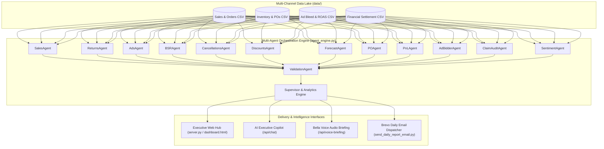

# Sleepsia Executive Intelligence Hub & Multi-Agent Autonomous Reporting System

[](https://www.python.org/downloads/)
[](https://github.com/)
[](https://github.com/)
[](https://elevenlabs.io/)
[](https://www.brevo.com/)

---

## Executive Overview

The **Sleepsia Executive Intelligence Hub** is an enterprise-grade, multi-agent AI analytics and automated reporting platform engineered specifically for **Sleepsia** (orthopedic & sleep comfort brand). It aggregates real-time multi-channel e-commerce telemetry across major marketplaces—**Amazon IN, Flipkart, Blinkit, and Swiggy Instamart**—processing sales, returns, ad performance, logistics, inventory runways, and net financial margins.

The platform combines an **Autonomous 13-Agent Orchestration Engine**, a responsive **Executive Web Dashboard**, **Bella Voice AI Audio Synthesis**, an interactive **AI Copilot**, and automated **8:00 AM IST Executive Email Newsletters**.

---

## Key Features & Capabilities

- **Autonomous Multi-Agent Architecture**: 13 specialized Python sub-agents process raw marketplace data concurrently to surface revenue trends, high-return anomalies, ad bidding recommendations, inventory runways, auto-drafted Purchase Orders, and reimbursement claim audits.
- **Interactive Executive Control Dashboard**: Live telemetry web interface with DoD (Day-over-Day) and WoW (Week-over-Week) time-series views, platform breakdown charts, SKU search & modal analytics, and performance trajectory indicators.
- **"Bella Voice" AI Executive Audio Briefing**: Integrated voice synthesis powered by ElevenLabs API generating hands-free audio briefings for leadership on the move, with automatic local caching and fallback sound drivers.
- **AI Executive Copilot**: Natural language query assistant built into the dashboard for immediate SKU telemetry lookup and real-time strategic advice.
- **Automated Executive Email Newsletter**: Daily HTML report generator featuring dark-mode formatting, platform margin tables, stock runway alerts, auto-drafted POs, and ad bidding adjustments dispatched via Brevo API / SMTP.
- **Automated Task Scheduling**:
  - **Local**: Windows Task Scheduler registration script (`register_task.py`) for automated 8:00 AM IST daily dispatch.
  - **Cloud**: GitHub Actions workflow (`daily_8am_report.yml`) scheduled for `02:30 UTC` (8:00 AM IST).
- **Live Data Watcher**: Automated synchronization watcher (`watch_csv.py`) that monitors the `data/` data lake and rebuilds HTML assets upon CSV changes.

---

## Multi-Agent Architecture



### Specialized Agents Breakdown

| Agent Name | Core Responsibilities | Key Metrics & Signals |
| :--- | :--- | :--- |
| **SalesAgent** | Aggregates revenue and unit volume | Gross Sales, Platform Split, Top SKU Revenue |
| **ReturnsAgent** | Identifies return anomalies and quality risks | Overall Return Rate %, High-Return Flag (>7.5%) |
| **AdsAgent** | Evaluates marketing spend efficiency | Total Ad Spend, Paid vs. Organic Revenue, ROAS |
| **BSRAgent** | Monitors Amazon BSR & competitor pricing | Amazon Best Sellers Rank, Price Competitiveness Index |
| **CancellationsAgent** | Tracks cancellation volume and ratios | Cancellation Count, Overall Cancel Rate % |
| **DiscountsAgent** | Evaluates price realization and promo depth | Catalog Average Discount % |
| **ForecastAgent** | Calculates 30-day unit demand forecasts | Category Velocity Multipliers, 30-Day Demand |
| **POAgent** | Detects low runway stock (<14 days) | Auto-drafted POs, Supplier Lead Times, Estimated INR |
| **PnLAgent** | Computes net contribution margin | Gross Rev, COGS, Market Fees, FBA Fees, Net Margin % |
| **AdBidderAgent** | Autonomous ad bidding controller | `SCALE_UP_25%`, `SCALE_DOWN_50%`, `MAINTAIN` |
| **ClaimAuditAgent** | Audits uncredited marketplace losses | Reclaimable FBA transit damage & return losses |
| **SentimentAgent** | Analyzes customer review feedback | Average Sentiment Score, Low Score SKUs (<75) |
| **ValidationAgent** | Ensures data integrity & schema compliance | Anomaly detection alerts & schema checks |

---

## Repository Structure

```
.
├── agent_engine.py           # Core multi-agent pipeline & SupervisorAgent logic
├── build_executive_hub.py    # Generator script compiling data into index.html / dashboard.html
├── server.py                 # Python HTTP web server & REST API backend (Port 8000)
├── send_daily_report_email.py# Executive email briefing compiler & Brevo API dispatcher
├── email_service.py          # HTML email template generator & email sending utilities
├── elevenlabs_service.py     # ElevenLabs text-to-speech audio briefing service
├── data_generator.py         # Multi-channel e-commerce dataset generator for Sleepsia SKUs
├── watch_csv.py              # File watcher auto-rebuilding dashboard on CSV modifications
├── register_task.py          # Windows Task Scheduler registration script for 8:00 AM daily run
├── send_8am_report.py        # Trigger script invoked by daily task schedule
├── start_dashboard.bat       # Windows Command Prompt launcher for Web Hub
├── start_dashboard.ps1       # Windows PowerShell launcher for Web Hub
├── dashboard.html            # Compiled Executive Control Hub interface
├── index.html                # Main entry point web page (serves dashboard)
├── email_config.json         # Local configuration file for email recipients & API keys
├── .env                      # Environment secrets (Brevo API key, ElevenLabs API key)
├── data/                     # Data Lake containing CSV telemetry files
│   ├── daily_executive_metrics.csv
│   ├── sales_performance.csv
│   ├── orders_logistics_returns.csv
│   ├── inventory_ledger.csv
│   ├── ad_bleed_campaigns.csv
│   ├── financial_settlement.csv
│   ├── products.csv
│   ├── purchase_orders.csv
│   └── warehouse_details.csv
└── .github/
    └── workflows/
        └── daily_8am_report.yml # Cloud Cron GitHub Actions workflow (02:30 UTC / 8:00 AM IST)
```

---

## Requirements & Installation

### Prerequisites

- **Python**: `3.8` or higher
- **OS**: Windows, macOS, or Linux

### Setup Instructions

1. **Clone the Repository**:
   ```bash
   git clone https://github.com/AG0856-Taniya/sleepsia-report.git
   cd sleepsia-report
   ```

2. **(Optional) Create a Virtual Environment**:
   ```bash
   python -m venv venv
   # On Windows:
   venv\Scripts\activate
   # On macOS/Linux:
   source venv/bin/activate
   ```

3. **Install Dependencies**:
   *(The core system relies primarily on Python standard library modules `http.server`, `json`, `urllib`, `csv`, `subprocess`, `datetime`, `random`, `base64`).*

   Optional dependencies:
   ```bash
   pip install python-dotenv
   ```

4. **Environment Configuration**:
   Create a `.env` file in the root directory (or update `email_config.json`):
   ```ini
   BREVO_API_KEY=your_brevo_api_key_here
   ELEVENLABS_API_KEY=your_elevenlabs_api_key_here
   ELEVENLABS_VOICE_ID=hpp4J3VqNfWAUOO0d1Us
   ```

   `email_config.json` sample:
   ```json
   {
     "brevo_api_key": "xkeysib-...",
     "recipients": ["management@sleepsia.com"],
     "elevenlabs_api_key": "sk_..."
   }
   ```

---

## Quick Start & Usage

### 1. Launching the Executive Web Hub

To start the HTTP server on port `8000` and automatically launch your default web browser:

**Windows (PowerShell)**:
```powershell
.\start_dashboard.ps1
```

**Windows (Command Prompt)**:
```cmd
start_dashboard.bat
```

**Cross-Platform (Python Direct)**:
```bash
python server.py
```
Access the dashboard at `http://localhost:8000`.

---

### 2. Rebuilding the Executive Dashboard

If you modify raw CSV datasets or update generator logic, run:
```bash
python build_executive_hub.py
```
This re-compiles data into [`dashboard.html`](file:///c:/Users/Taniya%20Gupta/Desktop/report/dashboard.html) and [`index.html`](file:///c:/Users/Taniya%20Gupta/Desktop/report/index.html).

---

### 3. Live Telemetry File Watcher

To enable auto-syncing during development or active data ingestion:
```bash
python watch_csv.py
```
The watcher checks `data/daily_executive_metrics.csv` every second and automatically rebuilds the dashboard when changes are detected.

---

### 4. Dispatching Executive Email Briefings

To manually compile and send today's Executive Intelligence Email report:
```bash
python send_daily_report_email.py
```

---

### 5. Automated Daily 8:00 AM IST Schedule

#### Local Machine (Windows Task Scheduler)
To register an automated daily task that triggers at 8:00 AM IST:
```bash
python register_task.py
```

#### Cloud Automation (GitHub Actions)
The repository includes `.github/workflows/daily_8am_report.yml` configured to trigger every day at `02:30 UTC` (8:00 AM IST). To enable cloud delivery:
1. Navigate to your GitHub repository **Settings** -> **Secrets and variables** -> **Actions**.
2. Add a new repository secret named `BREVO_API_KEY`.
3. The workflow will automatically execute daily or can be triggered manually via **Workflow Dispatch**.

---

## REST API Reference

The backend server (`server.py`) exposes several endpoints:

### `GET /api/sku`
Retrieves detailed telemetry and history for a given SKU.
- **Query Parameter**: `id` (e.g., `SLP-BAM-01`)
- **Response**: JSON containing SKU properties, 7-day revenue trend, return rate, inventory runway, and current BSR rank.

### `POST /api/chat`
Processes questions sent to the AI Executive Copilot.
- **Body**: `{"message": "What is our top returning SKU today?"}`
- **Response**: JSON containing AI agent response, relevant metrics, and recommended follow-up questions.

### `POST /api/voice-briefing`
Generates an audio voice briefing using ElevenLabs API.
- **Body**: `{}`
- **Response**: JSON containing `status`, `audio_b64` (base64-encoded MP3), and `text` (transcript).

### `POST /api/send-email`
Triggers an immediate executive email report dispatch.
- **Body**: `{"email": "exec@sleepsia.com"}`
- **Response**: JSON status output from Brevo API dispatch.

---

## Key Sleepsia SKUs Tracked

- `SLP-BAM-01`: Bamboo Memory Foam Cervical Pillow (Orthopedic)
- `SLP-GEL-02`: Gel-Infused Orthopedic Pillow (Cooling)
- `SLP-SHR-03`: Shredded Memory Foam Pillow (Standard)
- `SLP-MIC-04`: Microfiber Cooling Pillow (Microfiber)
- `SLP-PREG-05`: Full Body Pregnancy Pillow (Specialty)
- `SLP-LUM-06`: Ergonomic Lumbar Support Cushion (Cushion)

---

## License

Internal Project for **Sleepsia Executive Intelligence**. All rights reserved.
