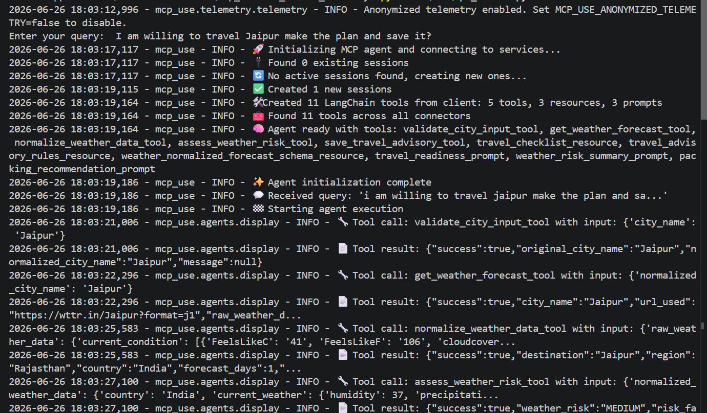
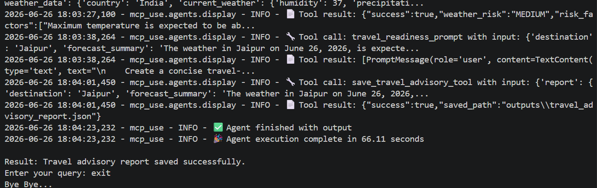

# Project Build - Weather and Travel Advisory MCP Server Using wttr.in API

## Participant Name

**Vaibhav Kesarwani**

## Assignment Title

### Weather and Travel Advisory MCP Server Using wttr.in API

## Project Overview

Tha main objective of this project is to make the Weather and Travel advisory Agent which is capable of using MCP server as the tools and the wttr.in API for the weather information.

It is implemented using the MCP `stdio` and `streamable-http` it support tools, resources and prompts

---

## Business Use Case

A traveler wants to check whether the weather is suitable for travel to a city.

Example questions:

1. Should I travel to Jaipur this weekend?
2. What should I pack for Pune based on the weather?
3. Is Mumbai risky for outdoor travel?
4. Can I travel comfortably to New Delhi over the next few days?

The MCP server should not behave like a generic weather chatbot. It should 

expose well-defined MCP tools, resources, and prompts so that an MCP compatible client can use them in a structured way.

---

## Screen shots





---

## Technology Stack

| Component              | Technology            |
| ---------------------- | --------------------- |
| Language               | Python 3.11+          |
| Framework              | MCP-use / FastMCP     |
| LLM Provider           | GROQ API              |
| Techinque              | stdio, streamable-http|
| Testing                | PyTest                |

---

## wttr.in API usage details

It is the weather forecast api which gives you data on the basic of the city it doesn't need any king of `API KEY` it can acessed using this URL:

```bash
https://wttr.in/{city_name}?format=j1
```

Example:
```bash
https://wttr.in/Jaipur?format=j1
```

For city names with spaces, replace spaces with `+`

```bash
https://wttr.in/New+Delhi?format=j1
```

Its normalised data look something like this:

```json
{
    "success": true,
    "destination": "Jaipur",
    "region": "Rajasthan",
    "country": "India",
    "forecast_days": 1,
    "current_weather": {
        "temperature_c": 37.0,
        "humidity": 37,
        "precipitation_mm": 0.0,
        "wind_speed_kmph": 15.0,
        "weather_description": "Haze"
    },
    "daily_forecast": [
        {
            "date": "2026-06-26",
            "max_temp_c": 39.0,
            "min_temp_c": 30.0,
            "avg_temp_c": 35.0,
            "total_precipitation_mm": 0.0,
            "max_wind_kmph": 11.0,
            "max_chance_of_rain": 2,
            "weather_description": "Clear "
        }
    ]
}
```

The python code which is used to access the raw weather forecast is:

```py
def get_weather_from_wttr(normalized_city_name: str) -> dict:
    urls = [
        f"{WTTR_PRIMARY_URL}/{normalized_city_name}?format=j1",
        f"{WTTR_FALLBACK_URL}/{normalized_city_name}?format=j1"
    ]

    last_error = None

    for url in urls:
        try:
            response = requests.get(url, timeout=10)

            if response.status_code != 200:
                last_error = f"status code: {response.status_code}"
                continue

            try:
                weather_data = response.json()

                result = {
                    "success": True,
                    "city_name": normalized_city_name.replace("+", " "),
                    "url_used": url,
                    "raw_weather_data": weather_data
                }

                with open("tools_outputs/raw_weather.json", "w", encoding="utf-8") as f:
                    json.dump(result, f, ensure_ascii=False, indent=4)

            except ValueError:
                last_error = "Invalid JSON response"
                continue

            return result

        except Exception as e:
            last_error = str(e)

    return {
        "success": False,
        "city_name": normalized_city_name.replace("+", " "),
        "message": f"Unable to fetch weather data. Error -> {last_error}"
    }
```

---

##  MCP tools list

1. validate_city_input_tool
2. get_weather_forecast_tool
3. normalize_weather_data_tool
4. calculate_weather_risk_tool
5. save_travel_advisory_tool

These tools can accessed from the `src/tools.py` and can be tested using the `test/test_tools.py`

---

## MCP resources list

1. resource://travel/checklist
2. resource://travel/advisory-rules
3. resource://weather/normalized-forecast-schema

These resources can accessed from the `src/resources.py` and can be tested using the `test/test_resources.py`

---

## MCP prompts list

1. travel_readiness_prompt
2. weather_risk_summary_prompt
3. packing_recommendation_prompt

These Prompts can accessed from the `src/prompts.py` and can be tested using the `test/test_prompts.py`

---

## Setup Instructions

### 1. Create Virtual Environment

```bash
uv venv
```

Activate the environment:

**Linux / macOS**

```bash
source venv/bin/activate
```

**Windows**

```bash
.venv\Scripts\activate
```

### 3. Install Dependencies

```bash
uv pip install -r requirements.txt #
```

---

## Environment Variables Required

Create a `.env` file:

```env
GROQ_API_KEY="...."
GROQ_MODEL=llama-3.3-70b-versatile
WTTR_PRIMARY_URL=https://wttr.in
WTTR_FALLBACK_URL=https://wttr.is
OUTPUT_PATH=outputs
```

---

## How to run the MCP server

To run the mcp server you have to run the server.py file by using the below command and make it running till session exit.

```bash
python server.py
```

---

## How to Run the client

```bash
python src/api_client.py
```

---

## How to run integration tests

```bash
pytest tests/
pytest -m integration
```

## Final report schema

This is the final report schema of the required output 

```json
{
    "destination": "",
    "region": "",
    "country": "",
    "forecast_days": 3,
    "current_weather": {
        "temperature_c": 0,
        "humidity": 0,
        "precipitation_mm": 0,
        "wind_speed_kmph": 0,
        "weather_description": ""
    },
    "daily_forecast": [
        {
            "date": "",
            "max_temp_c": 0,
            "min_temp_c": 0,
            "avg_temp_c": 0,
            "total_precipitation_mm": 0,
            "max_wind_kmph": 0,
            "max_chance_of_rain": 0,
            "weather_description": ""
        }
    ],
    "weather_risk": "LOW | MEDIUM | HIGH",
    "risk_factors": [],
    "recommended_actions": [],
    "packing_suggestions": [],
    "travel_readiness_advisory": "",
    "weather_risk_explanation": "",
    "resources_used": [
        "resource://travel/checklist",
        "resource://travel/advisory-rules",
        "resource://weather/normalized-forecast-schema"
    ],
    "tools_used": [
        "validate_city_input_tool",
        "get_weather_forecast_tool",
        "normalize_weather_data_tool",
        "calculate_weather_risk_tool",
        "save_travel_advisory_tool"
    ],
    "prompts_used": [
        "travel_readiness_prompt",
        "weather_risk_summary_prompt",
        "packing_recommendation_prompt"
    ]
}
```

The sample output which is generated by the agent is

```json
{
    "destination": "Jaipur",
    "region": "Rajasthan",
    "country": "India",
    "forecast_days": 1,
    "current_weather": {
        "temperature_c": 37.0,
        "humidity": 37,
        "precipitation_mm": 0.0,
        "wind_speed_kmph": 15.0,
        "weather_description": "Haze"
    },
    "daily_forecast": [
        {
            "date": "2026-06-26",
            "max_temp_c": 39.0,
            "min_temp_c": 30.0,
            "avg_temp_c": 35.0,
            "total_precipitation_mm": 0.0,
            "max_wind_kmph": 11.0,
            "max_chance_of_rain": 2,
            "weather_description": "Clear "
        }
    ],
    "weather_risk": "MEDIUM",
    "risk_factors": [
        "Maximum temperature is expected to be above 35°C."
    ],
    "recommended_actions": [
        "Carry water and avoid long outdoor exposure during afternoon hours."
    ]
}
```

---

## Project Structure

```bash
mcp_weather_travel_advisory/
│
├── README.md
├── requirements.txt
├── .env.example
│
├── src/
│   ├── utils.py
│   ├── config.py
│   ├── server.py
│   ├── tools.py
│   ├── resources.py
│   ├── prompts.py
│   ├── api_client.py
│   ├── schemas.py
│   └── report_writer.py
│
├── tests/
│   ├── test_api_client.py
│   ├── test_tools.py
│   ├── test_resources.py
│   ├── test_prompts.py
│   └── test_report_schema.py
│
├── outputs/
│   └── travel_advisory_report.json
│
└── tools_outputs/
    └── ***.json
```


---


## Future improvements

This is the basic demonstration of the MCP use case using the `mcp-use` and the `FastMCP` framework which helps us to get the idea about how the mcp work.

But for this particular project the future improvements can be:

1. Making the UI for the agent using the `streamlit` package
2. We can use the `code execution` strategy in MCP for less token consumption which will allow the model to call the tool when needed.