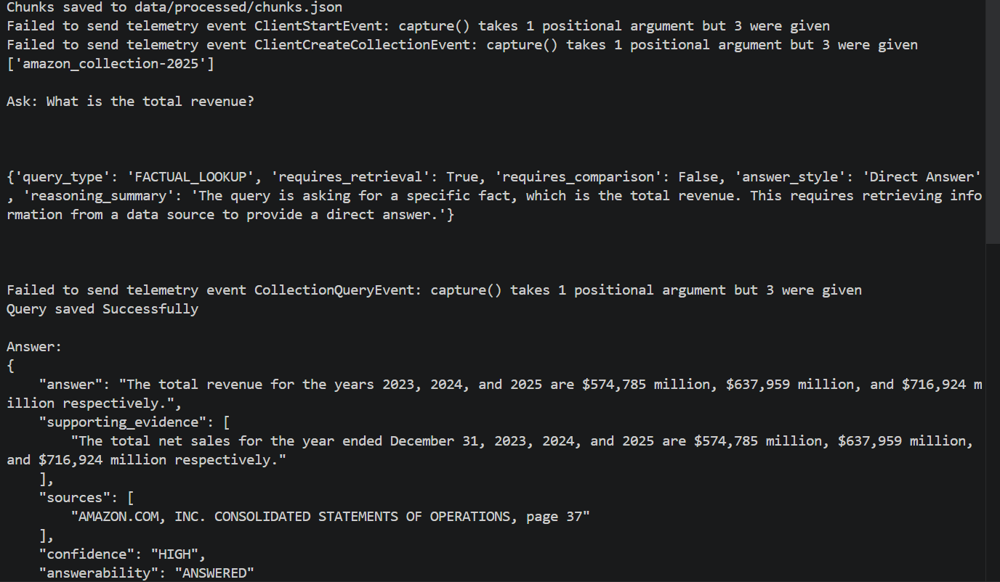
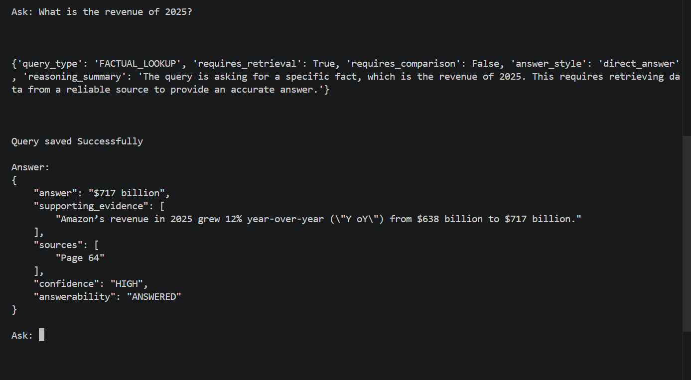

# Assignment 04 - AI Knowledge Assistant 

## Participant Name

**Vaibhav Kesarwani**

## Assignment Title

### AI Knowledge Assistant Using 

## Project Overview

A business team has a large set of internal knowledge documents such as annual 
reports, policies, product documentation, operating procedures, and compliance 
documents. Employees often spend significant time searching through these 
documents to find accurate answers.

The company wants to build an AI Knowledge Assistant that can answer user 
questions using only the provided document collection.
The assistant must retrieve relevant document chunks, pass them as context to an 
LLM, generate a grounded answer, and show source references so the user can 
verify the response.

The application should behave like a realistic enterprise knowledge assistant, not a 
simple chatbot. It must support document ingestion, chunking, embeddings, 
vector storage, retrieval, prompt-based answer generation, source citations, 
fallback behavior, and basic evaluation

---

## Business Use Case

Business users face the following challenges:

1. Knowledge is spread across long documents.
2. Users do not know where to search.
3. Manual document reading is time-consuming.
4. Answers from normal LLMs may hallucinate.
5. Users need source references before trusting answers.
6. Similar business questions may require comparing multiple document sections.
7. Some questions cannot be answered from the available documents and should be handled safely.

The proposed system should reduce document search time and improve answer reliability by using Retrieval-Augmented Generation.

## Technology Stack

| Component              | Technology            |
| ---------------------- | --------------------- |
| Language               | Python 3.10+          |
| Framework              | LangChain, RAG        |
| LLM Provider           | GROQ API              |
| Database               | SQLite                |

---


## Project Structure

```bash
ai_knowledge_assistant_rag/
│
├── app.py
├── config.py
├── loaders.py
├── chunking.py
├── embeddings.py
├── vector_store.py
├── retriever.py
├── prompts.py
├── chains.py
├── logger.py
├── requirements.txt
├── .env.example
├── README.md
│
├── data/
│   ├── raw/
│   ├── processed/
│   └── vector_store/
│
├── logs/
│   └── query_logs.json
```

---

## Setup Instructions

### 1. Create Virtual Environment

```bash
uv venv
```

Activate the environment:

**Linux / macOS**

```bash
source venv/bin/activate
```

**Windows**

```bash
.venv\Scripts\activate
```

### 3. Install Dependencies
 ```bash
uv pip install -r requirements.txt
```

---

## How to Run

```bash
python app.py
```
---

## Environment Variables Required

Create a `.env` file:

```env
GROQ_API_KEY=
GROQ_MODEL=llama-3.3-70b-versatile
EMBEDDING_MODEL=sentence-transformers/all-MiniLM-L6-v2
VECTOR_DB=chroma
CHUNK_SIZE=1000
CHUNK_OVERLAP=150
TOP_K=5
```

---

## Screenshots


