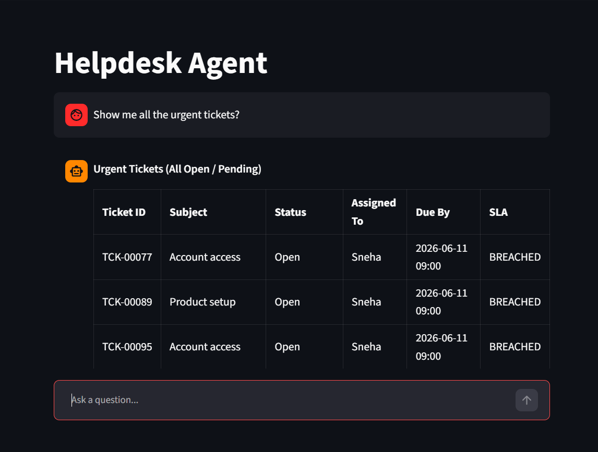
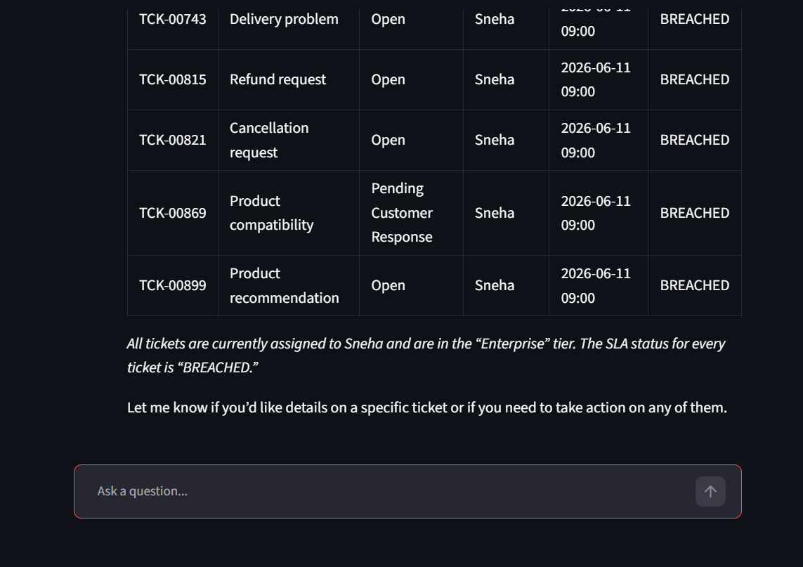
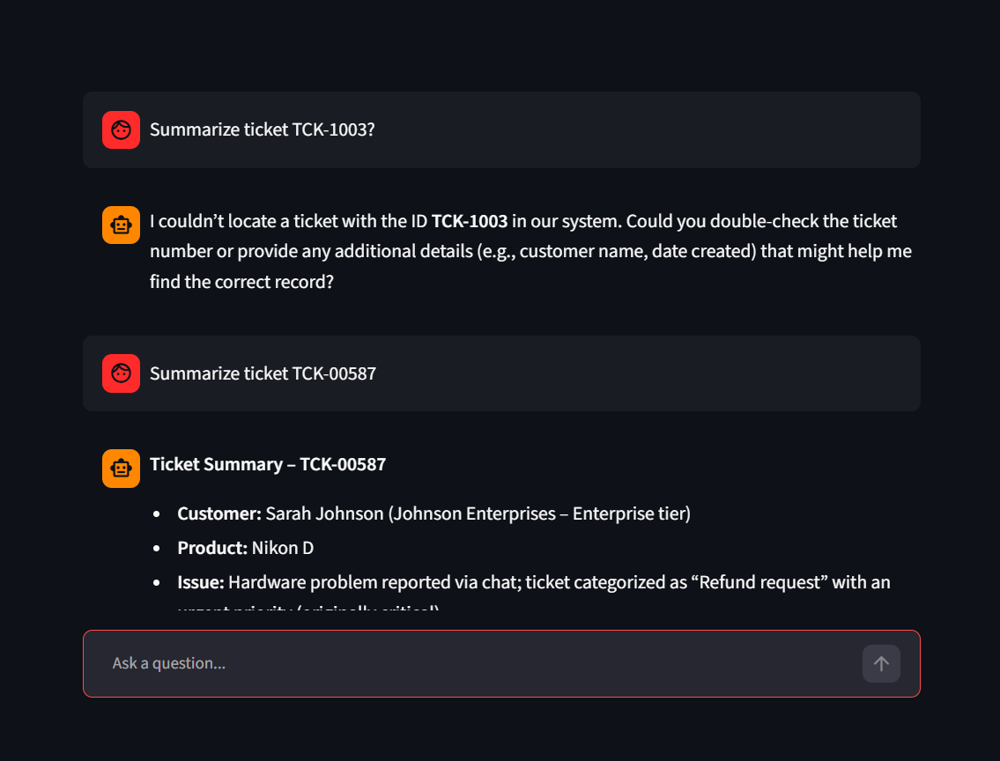
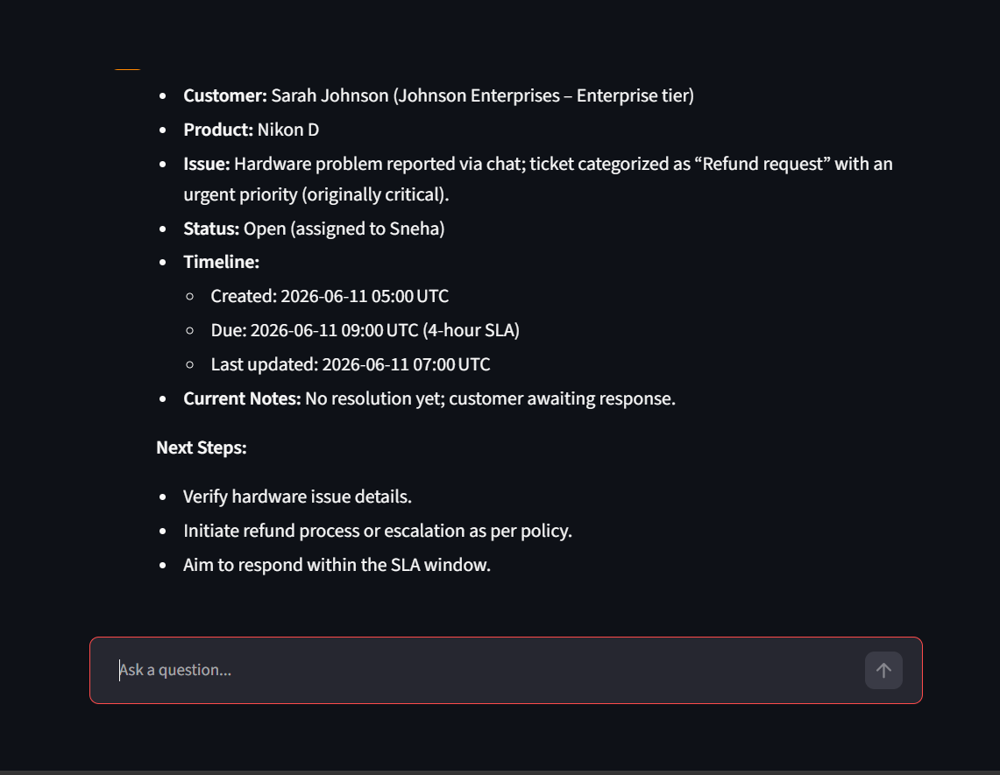

# Langchain Application -  AI Helpdesk Ticket Operations Agent 

## Participant Name

**Vaibhav Kesarwani**

## Assignment Title

### AI Helpdesk Ticket Operations Agent

A helpdesk operations team receives and manages thousands of customer support tickets. In a real
enterprise setup, this data may be stored in ServiceNow, Jira Service Management, Zendesk, Freshservice, or a similar ITSM platform.

For this project build, access to ServiceNow or any external helpdesk platform is not required. A local SQLite database will be used to simulate a ServiceNow-style helpdesk backend.

The agent should help support team members:

1. Search support tickets.
2. Identify overdue and high-priority tickets.
3. Summarize ticket details and ticket history.
4. Recommend which tickets should be handled first.
5. Add internal ticket comments.
6. Update ticket status safely.
7. Remember user preferences.
8. Recall earlier conversations.
9. Summarize conversations and store them in memory.
10. Use planning and reflection before producing final answers.

The application must behave like an operational assistant, not a simple chatbot.

---

## Business Use Case

Helpdesk agents often struggle with:
 
1. Too many open tickets.
2. Difficulty identifying which tickets are overdue.
3. Manual effort in checking ticket history.
4. Inconsistent prioritization.
5. Lack of memory across conversations.
6. Repeated context gathering.
7. Risk of missing enterprise or urgent customer issues.
8. Manual status updates and work notes.

The proposed AI agent should reduce operational effort by using tools to inspect ticket data, reason over ticket priority, remember user preferences, and assist with ticket updates.

---

## Technology Stack

| Component              | Technology            |
| ---------------------- | --------------------- |
| Language               | Python 3.10+          |
| Framework              | LangChain, Agent      |
| LLM Provider           | GROQ API              |
| Database               | SQLite                |

---

## Project Structure

```bash
helpdesk_ticket_agent/
│
├── app.py
├── agent.py
├── tools.py
├── db_utils.py
├── prompts.py
├── memory.py
├── requirements.txt
├── .env.example
├── README.md
│
├── data/
│   └── helpdesk_agent.db
│
└── outputs/
└── sample_agent_run.json
```

---

## Setup Instructions

### 1. Create Virtual Environment

```bash
uv venv
```

Activate the environment:

**Linux / macOS**

```bash
source venv/bin/activate
```

**Windows**

```bash
.venv\Scripts\activate
```

### 3. Install Dependencies
 ```bash
uv pip install -r requirements.txt
```

---

## How to Run

```bash
streamlit run app.py
```

---

## Environment Variables Required

Create a `.env` file:

```env
GROQ_API_KEY=
GROQ_MODEL=llama-3.3-70b-versatile
DB_PATH=data/helpdesk_agent.db
```

---

## Screenshots




