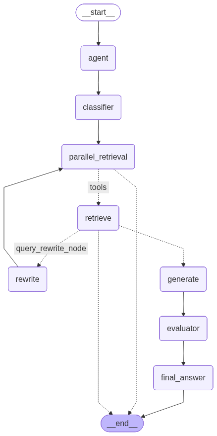
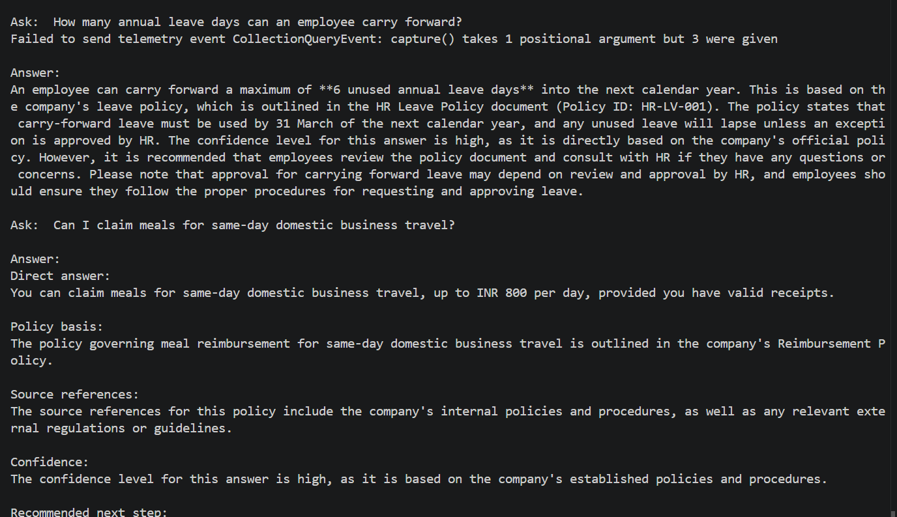
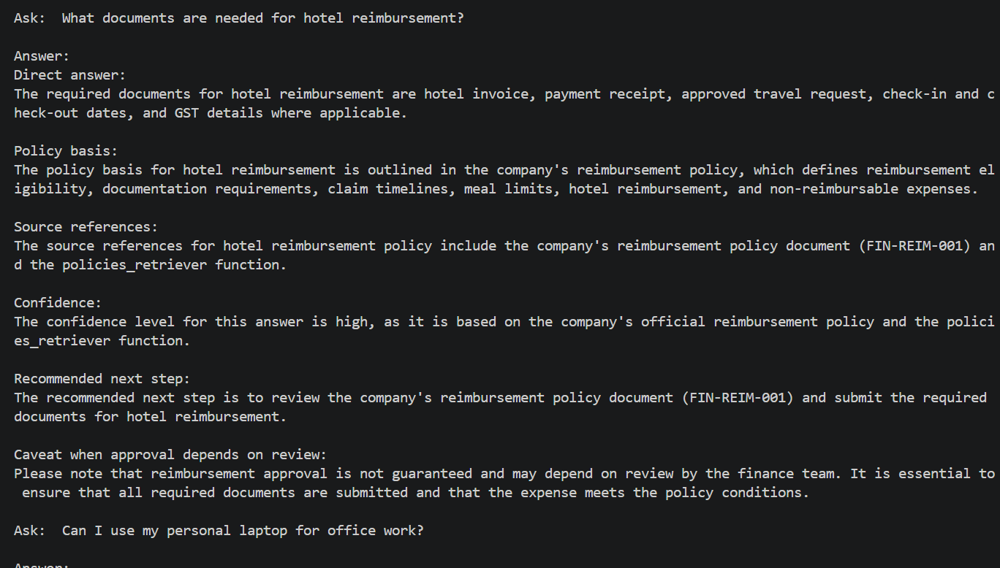
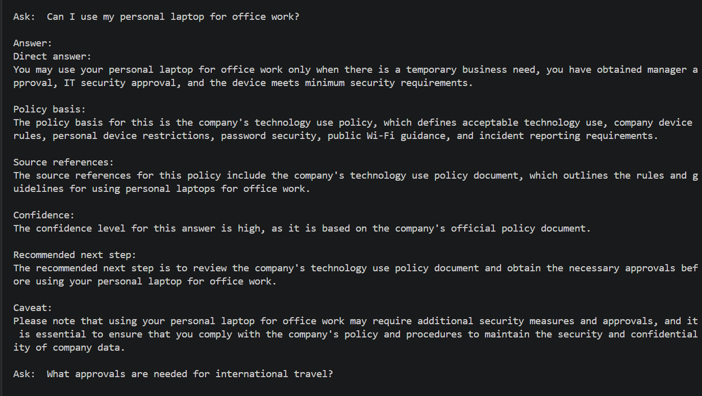

# Project Build - Enterprise Policy Assistant with Agentic RAG Using LangGraph 

## Participant Name

**Vaibhav Kesarwani**

## Assignment Title

### Enterprise Policy Assistant with Agentic RAG Using LangGraph 

## Project Overview

It is an Agentic RAG AI Assistant which is made using the LangGraph Framework it will make the policy documentation easy to maintain across  HR, travel, reimbursement, IT security, data privacy, and AI usage. Employee often strugle to find the correct related documents for the required policy section which they have to understand about that policy, like leaves and many other things related to the internal policies.

The Agentic RAG Assistant have the capabilites to answer accross the policies document using the feede data in the vector database using the original documents of the policies.

---

## Business Use Case

Employees ask policy questions such as: 

> *Can I claim meals during same-day business travel?*

> *Can I upload customer data to a public AI tool?* 

What approvals are needed for international travel? 

Currently, employees may: 

1. Search manually across multiple documents. 
2. Misinterpret policy rules. 
3. Ask HR or Finance repeatedly. 
4. Receive inconsistent answers. 
5. Make unsupported assumptions. 
6. Miss required approvals or documentation. 

The proposed assistant should help employees find policy-backed answers quickly and safely.

---

## Solution Approach

The RAG Agentic AI assistant is made using two approaches:

1. Prebuilt `creat-react-agent`
2. Cutom Agent using `GRAPH API`

For using both the approaches you can uncomment the line in the `app.py`

```py
from graph import graph
from prebuilt_agent import agent
from output_parser import output_parser
from langchain_core.messages import HumanMessage

while True: 
    question = input("\nAsk: ") 
    if question.lower() in ["quit", "exit", "stop"]: 
        break 
    
    prebuilt_agent_input = [HumanMessage(content=question)]
    
    try:
        prebuilt_agent_response = agent.invoke({"messages" : prebuilt_agent_input})
        final_prebuilt_agent_response = prebuilt_agent_response["messages"][-1].content

        # custom_agent_response = graph.invoke({"user_question" : question})
        # final_custom_agent_response = custom_agent_response["messages"][-1].content

        output_parser(prebuilt_agent_response["messages"], "sample_prebuilt_agent_run.txt")
        # output_parser(custom_agent_response["messages"], "sample_custom_agent_run.txt")

        print("\nAnswer:") 
        print(final_prebuilt_agent_response) 
    except Exception as e:
        print(e)
```

In the prebuilt and custom agent i have provided the custom retrival tool for the vector database.

```py
from langchain.tools.retriever import create_retriever_tool
from retrievers import retriever

try:
    retriever_tool = create_retriever_tool(
        retriever=retriever,
        name="policies_retriever",
        description="Search and return information about Enterprise policies."
    )

    tools = [retriever_tool]
except Exception as e:
    print(e)
```

And we use this approach for the custom and the prebuilt agent to provide them the tool for the required queries from the user to provide them the proper context.

if you don't have the database folder ./vector_store you can get that simply running the `loaders.py`

```bash
python loaders.py
```

And, for the retriever you will have the `retriever.py` file. At the time of retrieving the context for the proper retrieval i am doing the `query expansion` technique for the better context.


All the tested outputs are saved inside the `output/` folder.

Did the basic testing using the `deepeval` framework.

---

## Graph API Diagram



---

## Technology Stack

| Component              | Technology            |
| ---------------------- | --------------------- |
| Language               | Python 3.10+          |
| Framework              | LangGraph, Tools      |
| LLM Provider           | GROQ API              |
| Vector Database        | Chroma DB             |

---

## Project Structure

```bash
enterprise_policy_agentic_rag/ 
│ 
├── app.py 
├── config.py 
├── loaders.py 
├── chunking.py 
├── retrievers.py 
├── tools.py 
├── graph.py 
├── prebuilt_agent.py 
├── custom_agent.py 
├── prompts.py 
├── output_parser.py 
├── requirements.txt 
├── .env.example 
├── README.md 
│ 
├── data/ 
│   └── policies/ 
│        │       
│        ├── hr_leave_policy.md 
│        ├── travel_policy.md  
│        ├── reimbursement_policy.md 
│        ├── it_security_policy.md
│        └── ai_usage_policy.md      
│ 
├── vector_store/ 
│ 
└── outputs/ 
    ├── sample_run_outputs.md 
    └── evaluation_results.json 
```

---

## Setup `.env`

```bash
GROQ_API_KEY=... 
GROQ_MODEL=llama-3.3-70b-versatile 
EMBEDDING_MODEL=sentence-transformers/all-MiniLM-L6-v2 
HF_TOKE=...
POLICY_DATA_PATH=data/policies 
VECTOR_STORE_PATH=vector_store 
CHUNK_SIZE=700 
CHUNK_OVERLAP=100 
TOP_K=5
CONFIDENT_API_KEY=...
```


---

## Setup Instructions

### 1. Create Virtual Environment

```bash
uv venv
```

Activate the environment:

**Linux / macOS**

```bash
source .venv/bin/activate
```

**Windows**

```bash
.venv\Scripts\activate
```

### 3. Install Dependencies

```bash
uv pip install -r requirements.txt
```

---

## Screenshots



