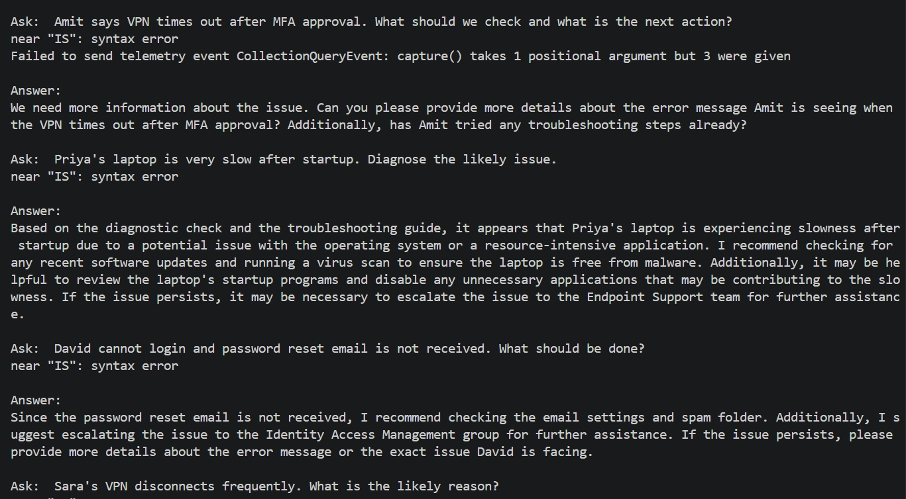
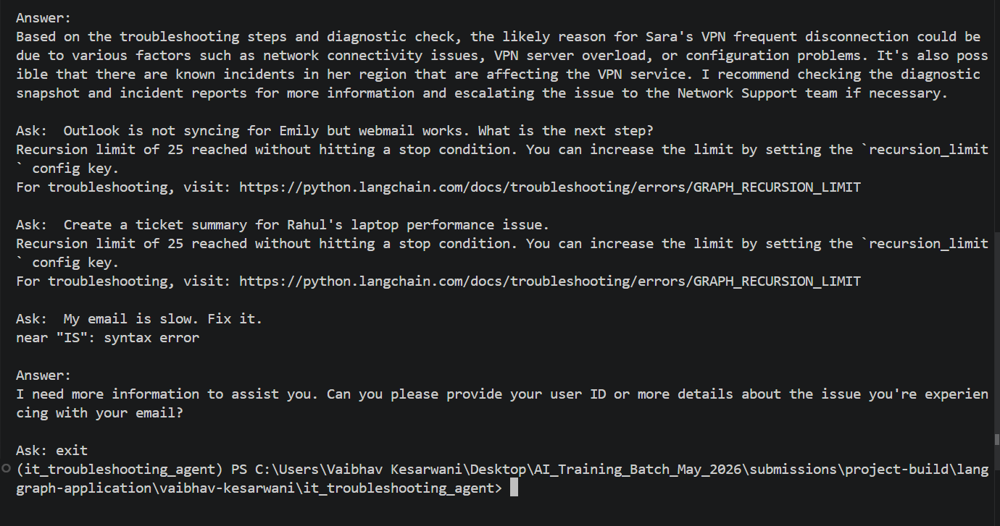

# Project Build - IT Troubleshooting Agent with Tool-Using Workflow Using LangGraph

## Participant Name

**Vaibhav Kesarwani**

## Assignment Title

### IT Troubleshooting Agent with Tool-Using Workflow Using LangGraph

## Project Overview

This is an IT Troubleshooting Agent which helps the enterprises to tackle the frequent tickes for issues such as VPN failure, Outlook sync problems, password reset issues, slow laptops, network connectivity problems, and printer access problems.

This Support Agent will help the Enterprises to manage and troubleshoot this problem more easily.

---

## Business Use Case

IT support teams face the following challenges:

1. Repetitive troubleshooting questions.
2. Manual lookup of device/user/incident data.
3. Inconsistent escalation decisions.
4. Slow diagnosis for common issues.
5. Unsafe handling of passwords, OTPs, and MFA information.
6. Poor ticket summaries.
7. Lack of structured diagnostic flow.
8. Difficulty combining knowledge-base guidance with operational tool data.

The proposed agent should assist IT support engineers by combining **retrieved troubleshooting guidance** with **tool-based diagnostics**.

---

## Proposed Solution

This Agentic AI Troubleshooter is made using two approaches:

1. Prebuilt `creat-react-agent`
2. Cutom Agent using `GRAPH API`

For using both the approaches you can uncomment the line in the `app.py`

```bash
from graph import graph
from prebuilt_agent import agent
from output_parser import output_parser
from langchain_core.messages import HumanMessage

while True: 
    question = input("\nAsk: ") 
    if question.lower() in ["quit", "exit", "stop"]: 
        break 
    
    prebuilt_agent_input = [HumanMessage(content=question)]
    
    try:
        prebuilt_agent_response = agent.invoke({"messages" : prebuilt_agent_input})
        final_prebuilt_agent_response = prebuilt_agent_response["messages"][-1].content

        # custom_agent_response = graph.invoke({"user_question" : question})
        # final_custom_agent_response = custom_agent_response["messages"][-1].content

        output_parser(prebuilt_agent_response["messages"], "sample_prebuilt_agent_run.txt")
        # output_parser(custom_agent_response["messages"], "sample_custom_agent_run.txt")

        print("\nAnswer:") 
        print(final_prebuilt_agent_response) 
    except Exception as e:
        print(e)
```

The prebuilt and custom agent will have the acces to the `10 tools` which can be seen into `tools.py`
 
These are the 10 Tools which are used to make the `action node` in the prebuilt agent:

1. retrieve_troubleshooting_steps
2. get_user_profile
3. get_device_status
4. check_known_incidents
5. run_diagnostic_check
6. get_ticket_details
7. create_resolution_plan
8. classify_issue_type
9. create_ticket_summary
10. get_active_incidents

And we use this approach for the custom and the prebuilt agent to provide them the tool for the required queries from the user to provide them the proper context.

if you don't have the database folder `vector_store/` you can get that simply running the `loaders.py`

```bash
python loaders.py
```

And, for the retriever you will have the `retriever.py` file. At the time of retrieving the context for the user query `retrieve_troubleshooting_steps` tool get called.

```py
retriever_tool = create_retriever_tool(
    retriever=retriever,
    name="retrieve_troubleshooting_steps",
    description="Search and return information about the troubleshooting steps from Knowledge_base."
)
```


All the tested outputs are saved inside the `output/` folder.

Did the basic testing using the `deepeval` framework.

---

## Technology Stack

| Component              | Technology            |
| ---------------------- | --------------------- |
| Language               | Python 3.10+          |
| Framework              | LangGraph, Tools      |
| LLM Provider           | GROQ API              |
| Vector Database        | Chroma DB             |

---

## Project Structure

```bash
it_troubleshooting_agent/
│
├── app.py
├── config.py
├── loaders.py
├── retrievers.py
├── db_utils.py
├── tools.py
├── graph.py
├── prebuilt_agent.py
├── custom_agent.py
├── prompts.py
├── output_parser.py
├── requirements.txt
├── .env.example
├── README.md
│
├── data/
│   ├── knowledge_base/
│   └── database/
│
├── vector_store/
│
└── outputs/
    └── sample_run_outputs.md
```

---

## Setup `.env`

```bash
GROQ_API_KEY=...
GROQ_MODEL=llama-3.3-70b-versatile
HF_TOKEN=...
DB_PATH=data/database/it_support.db
KB_PATH=data/knowledge_base
VECTOR_STORE_PATH=vector_store
EMBEDDING_MODEL=sentence-transformers/all-MiniLM-L6-v2
CHUNK_SIZE=700
CHUNK_OVERLAP=100
TOP_K=5
CONFIDENT_API_KEY=...
```


---

## Setup Instructions

### 1. Create Virtual Environment

```bash
uv venv
```

Activate the environment:

**Linux / macOS**

```bash
source .venv/bin/activate
```

**Windows**

```bash
.venv\Scripts\activate
```

### 3. Install Dependencies

```bash
uv pip install -r requirements.txt
```

---

## Screenshots


