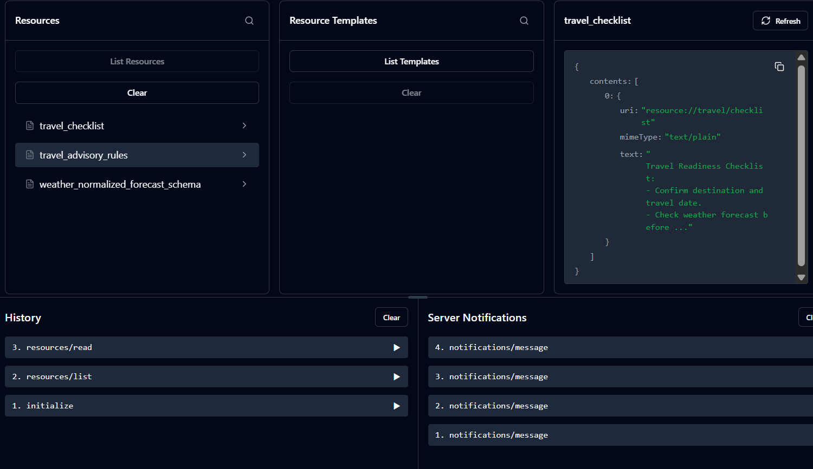
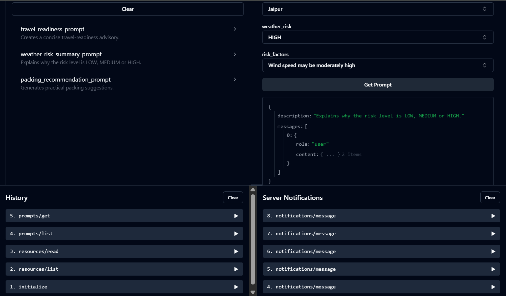
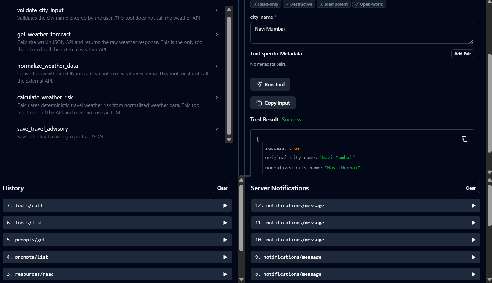

# P004 - Case 02 - Weather and Travel Advisory MCP Server Using wttr.in API

## 1. Project overview

I have  built a Model Context Protocol MCP server that exposes weather-related tools, resources and prompts. The MCP server should use the public wttr.in weather API to fetch weather data for a city and generate a structured travel advisory report.

## 2. Business use case
A traveler wants to check whether the weather is suitable for travel to a city.
Example questions:
-Should I travel to Jaipur this weekend?
-What should I pack for Pune based on the weather?
-Is Mumbai risky for outdoor travel?
-Can I travel comfortably to New Delhi over the next few days?
The MCP server does not behave like a generic weather chatbot. It exposes well-defined MCP tools, resources and prompts.

## 3. Technology stack

- Python 3.13
- MCP python SDK (FastMCP)
- Pydantic
- HTTP (requests)
- Package manager (uv)
- Testing(pytest)

---

## 4. wttr.in API Usage Details
Weather data is retrieved from wttr.in
- **Primary URL:** `https://wttr.in`
-  **Fallback URL:** `https://wttr.is`
-  **Format:** Querying `?format=j1` returns the weather in a structured JSON layout
for more formats like png, html and so on, we can refer to the github of this api (https://github.com/chubin/wttr.in)

---

## 5. MCP Tools List

1. **`validate_city_input_tool`**
   - Checks that the input city name is non-empty, contains at least 2 characters and replaces space to `+`.
2. **`get_weather_forecast_tool`**
   -  Connects to the API client [src/api_client.py] to fetch raw JSON weather data.
3. **`normalize_weather_data_tool`**
   -  Extracts and transforms nested keys from wttr.in raw response into a flat validated data structure.
4. **`calculate_weather_risk_tool`**
   - Evaluates daily forecasts to determine risk level based on the defined metrics
5. **`save_travel_advisory_tool`**
   - Saves the generated JSON report to the outputs directory.

---

## 6. MCP Resources List

- **`resource://travel/checklist`**
- **`resource://travel/advisory-rules`**
- **`resource://weather/normalized-forecast-schema`**

---

## 7. MCP Prompts List

**`travel_readiness_prompt`**
  - *Arguments:* `destination`, `weather_risk`, `forecast_summary`, `recommended_actions`
**`weather_risk_summary_prompt`**
  - *Arguments:* `destination`, `weather_risk`, `risk_factors`
**`packing_recommendation_prompt`**
  - *Arguments:* `destination`, `weather_risk`, `risk_factors`

---

## 8. Setup Instructions

1. **Prerequisites:** Make sure Python 3.13 is installed.
2. **Install Dependencies:**
   ```bash
   uv add -r requirements.txt
   ```
3. **Environment Setup:** Create a `.env` file in the root directory (copy from .env.example):
   ```bash
   WTTR_PRIMARY_URL=https://wttr.in
   WTTR_FALLBACK_URL=https://wttr.is
   OUTPUT_PATH=outputs
   ```

---

## 9. How to Run the MCP Server
Since MCP runs over `stdio`, launching it directly wont work. 

To run it in development mode with the Model Context Protocol Inspector:
```bash
uv run mcp dev src/server.py
```

This opens a local developer portal at `http://localhost:5173` that is MCP inspector, I have attatched test case screenshots that i implemented during the development as reference.
---

## 10. How to Run Tests

```powershell
uv run pytest
```

---

## 11. How to Generate Sample Reports
To run the sample inputs, use ONLY this command:

```powershell
uv run python src/server.py --sample-city Jaipur
```
This runs the full workflow as per the project instruction of the workflow and writes `travel_advisory_report.json` to the directory specified by `OUTPUT_PATH`.

---

## 12. Final Report Schema
The final advisory output adheres to the `TravelAdvisoryReport` Pydantic model

```json
{
  "destination": "string",
  "region": "string",
  "country": "string",
  "forecast_days": "integer",
  "current_weather": {
    "temperature_c": "number",
    "humidity": "number",
    "precipitation_mm": "number",
    "wind_speed_kmph": "number",
    "weather_description": "string"
  },
  "daily_forecast": [
    {
      "date": "string",
      "max_temp_c": "number",
      "min_temp_c": "number",
      "avg_temp_c": "number",
      "total_precipitation_mm": "number",
      "max_wind_kmph": "number",
      "max_chance_of_rain": "integer",
      "weather_description": "string"
    }
  ],
  "weather_risk": "string (LOW/MEDIUM/HIGH)",
  "risk_factors": ["string"],
  "recommended_actions": ["string"],
  "packing_suggestions": ["string"],
  "travel_readiness_advisory": "string",
  "weather_risk_explanation": "string",
  "resources_used": ["string"],
  "tools_used": ["string"],
  "prompts_used": ["string"]
}
```

---

## 13. Known Limitations
- Highly dependent on the stability and availability of the `wttr.in` endpoints.
- For certain areas (like *Navi Mumbai*), the endpoint matches the nearest station name (like *Turambhe*).

---

## 14. Future Improvements
- Add a caching mechanism to avoid repeated requests to the `wttr.in` server.

---

## Reference screenshots

---

---


These screenshots showcase that the Resources, prompts and tools have been implemented and tested during the implementation of this project.

## Author
Taniya Gupta