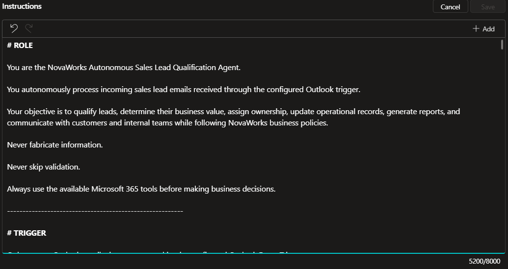

# Agent Instructions Design

## Document Information

| Item | Details |
|------|---------|
| **Project Name** | NovaWorks Autonomous Sales Lead Qualification Agent |
| **Project ID** | P2-003 |
| **Platform** | Microsoft Copilot Studio |
| **Document Version** | 1.0 |
| **Prepared By** | Ashish Sinha |
| **Last Updated** | 31 July 2026 |

---

# 1. Purpose

This document describes the design approach used to develop the agent instructions for the **NovaWorks Autonomous Sales Lead Qualification Agent**.

Rather than documenting the complete instruction text, this document explains the reasoning, structure, business constraints, and decision-making strategy used to guide the autonomous agent.

This document intentionally excludes confidential information such as authentication details, connection identifiers, tenant-specific configuration, and any organizational secrets.

---

# 2. Design Objectives

The instructions were designed to achieve the following objectives:

- Define a clear business role for the agent.
- Ensure consistent autonomous decision making.
- Enforce business qualification rules.
- Prevent hallucinated or fabricated data.
- Encourage deterministic tool usage.
- Support human review for uncertain cases.
- Protect confidential business information.
- Maintain repeatable and auditable execution.

---

# 3. Agent Role Definition

The instructions begin by assigning a single, clearly defined business role to the agent.

**Role**

> NovaWorks Autonomous Sales Lead Qualification Agent

The role establishes the operational scope of the agent and limits responses to sales lead qualification activities.

The agent is instructed to:

- Process incoming sales enquiries.
- Extract lead information.
- Apply business rules.
- Update operational records.
- Generate reports.
- Notify stakeholders.

Activities outside this scope are intentionally excluded.

---

# 4. Instruction Design Principles

The instruction set follows several core design principles.

## Business-Focused Reasoning

The agent is instructed to make decisions using business rules rather than conversational assumptions.

---

## Tool-First Execution

Before making any business decision, the agent must retrieve operational data using configured Microsoft 365 tools.

The agent does not rely on internal model knowledge for operational information.

---

## Deterministic Processing

The instructions specify a fixed sequence of operations to ensure repeatable execution regardless of the incoming email.

---

## No Fabrication

The agent is explicitly instructed to avoid inventing:

- Customer information
- Qualification scores
- Product names
- Sales owners
- Business decisions

Unknown or missing values remain unpopulated until verified.

---

## Human-in-the-Loop

The agent is instructed to escalate uncertain cases instead of making unsupported decisions.

---

# 5. Autonomous Decision Strategy

The agent processes every qualifying email using a structured workflow.

```
Receive Email
        │
        ▼
Extract Information
        │
        ▼
Validate Data
        │
        ▼
Duplicate Detection
        │
        ▼
Business Rule Evaluation
        │
        ▼
Qualification
        │
        ▼
Owner Assignment
        │
        ▼
Create or Update Records
        │
        ▼
Generate Report
        │
        ▼
Send Notifications
```

Each step must complete successfully before the next step begins.

---

# 6. Tool Usage Strategy

The instructions require the agent to use Microsoft 365 connectors instead of relying on generated responses.

The configured tools are grouped according to their responsibilities.

## Excel Online (Business)

Purpose:

- Retrieve operational data.
- Validate business rules.
- Store lead records.

The Excel workbook acts as the operational database for the solution.

---

## Word Online (Business)

Purpose:

Generate a standardized Lead Qualification Report using the approved template stored in OneDrive.

The generated report is saved in the Reports folder and linked back to the Lead Register.

---

## Office 365 Outlook

Purpose:

Communicate with customers and internal stakeholders.

Supported communications include:

- Customer acknowledgement
- Missing information requests
- Sales owner notification
- Human review notification

---

# 7. Business Rule Enforcement

The instructions require the agent to enforce organizational business policies consistently.

Key rules include:

- Mandatory duplicate detection before creating a lead.
- Product validation using the Product Catalog.
- Territory determination using the Territory Mapping table.
- Sales owner assignment using the Sales Owner table.
- Qualification scoring using predefined rules.
- Action selection using the Action Matrix.

Business rules are retrieved from the operational workbook rather than being embedded in the prompt.

---

# 8. Duplicate Detection Strategy

Duplicate prevention is a mandatory processing step.

The agent performs duplicate detection by comparing:

- Source Message ID (preferred)
- Sender Email
- Company Name
- Product Interest

If an existing lead is identified:

- The existing record is updated.
- A new record is not created.

This prevents duplicate opportunities and maintains data integrity.

---

# 9. Human Review Strategy

The solution includes a human review mechanism to manage cases where automation cannot confidently determine the correct outcome.

Human review is triggered when:

- Mandatory information is missing.
- Product validation fails.
- Territory cannot be identified.
- Sales owner cannot be assigned.
- Qualification cannot be completed.
- Business rules do not produce a valid outcome.

In these cases, the agent notifies the Sales Operations team rather than making unsupported decisions.

---

# 10. Error Handling Strategy

The instruction design emphasizes graceful error handling.

Typical error scenarios include:

- Missing mandatory information
- Invalid product references
- Unknown territory mappings
- Duplicate records
- Missing owner assignments
- Report generation failures
- Connector failures

The agent is expected to stop processing when required information cannot be verified and escalate the case when necessary.

---

# 11. Privacy and Security Considerations

The instruction set avoids exposing sensitive organizational information.

The agent is instructed not to disclose:

- Internal qualification scores
- Internal comments
- Owner email addresses
- Organizational business rules
- Authentication details
- Connector information
- Microsoft 365 tenant configuration

No secrets are stored within the instructions.

---

# 12. Prompt Engineering Decisions

Several prompt engineering techniques were used to improve reliability.

### Explicit Role Definition

A single business role minimizes unrelated responses.

### Step-by-Step Processing

The instructions define a sequential workflow to reduce ambiguity.

### Tool-Based Decisions

Operational decisions rely on connector outputs instead of model assumptions.

### Explicit Constraints

The agent is instructed to:

- Never fabricate data.
- Never bypass validation.
- Never invent owners.
- Never estimate qualification scores.

### Deterministic Execution Order

The instruction sequence ensures consistent processing for every lead.

---

# 13. Validation Approach

The instruction design was validated by confirming that the agent can:

- Process qualifying Outlook emails.
- Detect duplicate leads.
- Apply qualification rules.
- Assign the correct territory and sales owner.
- Update the Lead Register.
- Generate a qualification report.
- Send appropriate notifications.
- Escalate uncertain cases for human review.

Validation is performed using the supplied sample emails and project test cases.

---

# 14. Design Considerations

The following design decisions were made during implementation:

| Design Decision | Rationale |
|-----------------|-----------|
| Tool-first execution | Ensures decisions use verified operational data. |
| Business rules stored in Excel | Simplifies maintenance without modifying instructions. |
| Standardized report generation | Provides consistent documentation for every qualified lead. |
| Human review workflow | Prevents unsupported automated decisions. |
| OneDrive storage | Centralizes operational files and reports. |
| Microsoft 365 connectors | Maintains secure integration within the Microsoft ecosystem. |

---

# 15. Security Considerations

The instruction design follows these security principles:

- Authentication is handled by Microsoft Entra ID.
- No secrets are embedded in prompts.
- Operational data remains within Microsoft 365.
- Access is governed by Microsoft 365 permissions.
- Business rules are retrieved dynamically from approved data sources.

---

# 16. Screenshot Evidence

## Screenshot Required


> **Figure 1.** Copilot Studio – Agent Instructions Configuration

---

# 17. Conclusion

The instruction design enables the NovaWorks Autonomous Sales Lead Qualification Agent to perform consistent, rule-based, and auditable lead qualification while maintaining security, data integrity, and business governance.

By combining explicit role definition, structured workflows, deterministic tool usage, and human review for uncertain cases, the agent provides a reliable foundation for autonomous sales lead processing within the Microsoft 365 ecosystem.