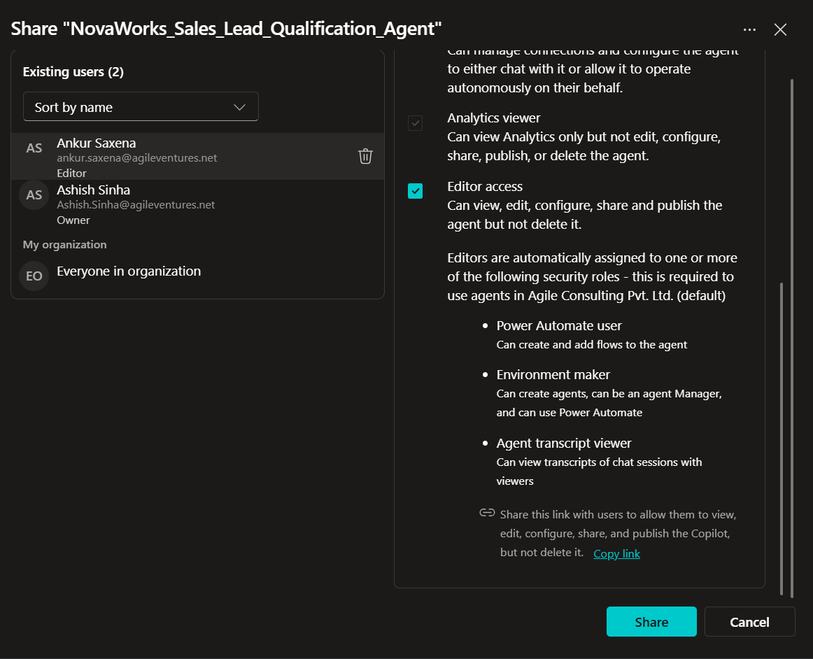

# Agent URL

## Document Information

| Item | Details |
|------|---------|
| **Project Name** | NovaWorks Autonomous Sales Lead Qualification Agent |
| **Project ID** | P2-003 |
| **Platform** | Microsoft Copilot Studio |
| **Document Version** | 1.0 |
| **Last Updated** | 31 July 2026 |
| **Prepared By** | Ashish Sinha |

---

# 1. Purpose

This document records the deployment details of the **NovaWorks Autonomous Sales Lead Qualification Agent**, including the published agent URL, authentication method, access limitations, and verification status.

This document provides deployment evidence and allows reviewers to verify that the agent has been successfully published.

---

# 2. Published Agent Information

| Property | Value |
|----------|-------|
| **Agent Name** | NovaWorks_Sales_Lead_Qualification_Agent |
| **Project ID** | P2-003 |
| **Environment** | `Development / Trial / Production` |
| **Status** | ✅ Published |
| **Published Date** | 31 July 2026 |
| **Published By** | Ashish Sinha |

---

# 3. Published URL

**Agent URL**

```text
https://copilotstudio.microsoft.com/environments/Default-1e1572ff-a54c-4cd7-b2a9-20091afa5359/bots/143ef138-a48c-f111-8077-000d3af21e08/overview
```

> **Note:** If the agent URL contains tenant-specific information, include only the published URL that reviewers are authorized to access.

---

# 4. Authentication

The agent uses Microsoft 365 authentication provided by Microsoft Copilot Studio.

| Property | Value |
|----------|-------|
| Authentication Method | Microsoft Entra ID |
| User Sign-in Required | Yes |
| Microsoft Account Required | Yes |
| Tenant Restricted | Yes |
| Anonymous Access | No |

Only authenticated users within the configured Microsoft 365 tenant can access the published agent.

---

# 5. Connection Configuration

The agent uses authenticated Microsoft 365 connections for all business operations.

Configured connections include:

- Office 365 Outlook
- Excel Online (Business)
- Word Online (Business)
- OneDrive for Business

All connections use Microsoft Entra ID authentication.

No API keys, tokens, or credentials are embedded within the agent instructions.

---

# 6. Access Limitations

The following limitations apply to the published agent:

- Access is restricted to authenticated Microsoft 365 users.
- Users must have permission to access the configured OneDrive for Business resources.
- Users must have permission to access the connected Outlook mailbox.
- Users without the required Microsoft 365 permissions cannot execute the agent successfully.
- Connector permissions are governed by Microsoft Copilot Studio and the associated Microsoft 365 environment.

---

# 7. Verification

The published agent was verified after deployment using the following checks:

| Verification Item | Status |
|-------------------|--------|
| Agent Published Successfully | ✅ |
| Agent Opens Successfully | ✅ |
| Outlook Trigger Configured | ✅ |
| Required Connectors Available | ✅ |
| Tool Configuration Verified | ✅ |
| Agent Instructions Saved | ✅ |

---

# 8. Validation Procedure

The following validation process was performed after publishing:

1. Confirm the agent status is **Published**.
2. Open the published agent URL.
3. Verify that authentication is requested.
4. Confirm that the agent loads successfully.
5. Verify that configured tools are available.
6. Confirm that the Outlook trigger is enabled.
7. Verify that the agent is ready to receive qualifying emails.

---

# 9. Known Access Constraints

The published agent cannot be accessed if:

- The Microsoft 365 account is not authenticated.
- The user does not belong to the configured tenant.
- Required connector permissions are missing.
- The Outlook mailbox connection has expired.
- OneDrive for Business permissions have been revoked.

These constraints are expected behavior and are managed through Microsoft 365 security controls.

---

# 10. Security Considerations

To protect organizational resources:

- Do not share the published URL publicly unless intended.
- Do not expose connector credentials.
- Do not include access tokens, client secrets, or passwords in documentation.
- Ensure connector permissions follow the principle of least privilege.
- Use Microsoft Entra ID authentication for all users.

---

# 11. Screenshots

Include the following screenshots before project submission.

## Screenshot 1 – Published Agent


**Description**

Show the Copilot Studio page displaying:

- Agent Name
- Published Status
- Publish Date
- Environment

**Status**

Added

---

## Screenshot 2 – Agent Overview


**Description**

Capture the Agent Overview page showing:

- Agent Name
- Description
- Instructions
- Trigger
- Publication Status

**Status**

Added

---


---

# 12. Reviewer Notes

Reviewers should verify:

- The agent is published.
- The URL is valid.
- Authentication is enforced.
- The configured environment matches the project.
- No secrets or credentials are exposed.

---

# 13. Revision History

| Version | Date | Author | Description |
|----------|------|--------|-------------|
| 1.0 | 31-Jul-2026 | Ashish Sinha | Initial documentation for published agent URL and access verification |

---

# Submission Checklist

- Published agent URL added
- Environment confirmed
- Authentication verified
- Access limitations documented
- Verification completed
- Required screenshots inserted
- No secrets, tokens, passwords, or customer information included