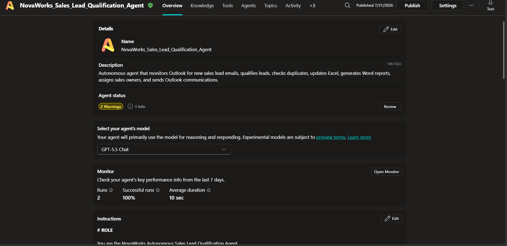

# Solution Summary

## Document Information

| Item | Details |
|------|---------|
| **Project Name** | NovaWorks Autonomous Sales Lead Qualification Agent |
| **Project ID** | P2-003 |
| **Platform** | Microsoft Copilot Studio |
| **Document Version** | 1.0 |
| **Last Updated** | 31 July 2026 |
| **Prepared By** | Ashish Sinha |

---

# 1. Executive Summary

The **NovaWorks Autonomous Sales Lead Qualification Agent** is an AI-powered enterprise automation solution developed using **Microsoft Copilot Studio** and Microsoft 365 services. The agent automates the complete lifecycle of processing incoming sales enquiries received through Outlook by extracting lead information, validating business data, qualifying opportunities, assigning ownership, generating reports, updating operational records, and notifying relevant stakeholders.

The solution eliminates repetitive manual work, enforces consistent business rules, and improves response times while maintaining a human review path for uncertain or exceptional cases.

---

# 2. Business Problem

Sales organizations receive a large number of enquiries from prospective customers through email. Processing these enquiries manually introduces several operational challenges:

- Delayed response to customer enquiries.
- Inconsistent lead qualification decisions.
- Duplicate lead creation.
- Manual assignment of territories and sales owners.
- Lack of standardized documentation.
- Human errors in data entry.
- Limited visibility into lead processing status.

These challenges reduce operational efficiency and may result in delayed follow-up or lost sales opportunities.

---

# 3. Business Objectives

The solution was designed to achieve the following objectives:

- Automate lead qualification from incoming Outlook emails.
- Standardize business decision making using predefined qualification rules.
- Prevent duplicate lead creation.
- Automatically assign the appropriate sales owner.
- Generate standardized qualification reports.
- Notify customers and internal stakeholders.
- Route uncertain cases for human review.
- Maintain a centralized operational record of all processed leads.

---

# 4. Proposed Solution

The solution uses a Microsoft Copilot Studio autonomous agent integrated with Microsoft 365 services.

The agent continuously monitors a configured Outlook mailbox for qualifying sales enquiries. When a new email matching the required criteria is received, the agent executes a predefined business workflow that includes:

1. Extracting lead information.
2. Validating mandatory fields.
3. Detecting duplicate leads.
4. Reading business rules from Excel.
5. Calculating qualification scores.
6. Determining territory and owner assignment.
7. Creating or updating the operational lead register.
8. Generating a standardized Word qualification report.
9. Sending customer and internal notification emails.

The workflow is executed without manual intervention unless a business rule requires human review.

---

# 5. Solution Architecture

## High-Level Architecture

```text
                     Customer
                         │
                         ▼
                Sales Inquiry Email
                         │
                         ▼
               Office 365 Outlook
                         │
                         ▼
          Outlook Trigger (When New Email Arrives)
                         │
                         ▼
      Microsoft Copilot Studio Autonomous Agent
                         │
      ┌──────────────────┼──────────────────┐
      │                  │                  │
      ▼                  ▼                  ▼
Excel Online       Word Online      Office 365 Outlook
(Business)         (Business)       (Business)
      │                  │                  │
      ▼                  ▼                  ▼
Lead Register      Qualification      Customer &
Business Rules     Report             Internal Emails
```

---

# 6. Solution Components

## Microsoft Copilot Studio

Acts as the central orchestration engine responsible for:

- AI reasoning
- Information extraction
- Business workflow execution
- Tool selection
- Decision making
- Error handling

---

## Outlook Trigger

Automatically starts the agent whenever a qualifying email arrives.

---

## Excel Online (Business)

Provides the operational data store used for:

- Lead Register
- Qualification Rules
- Product Catalog
- Territory Mapping
- Sales Owner Mapping
- Action Matrix

---

## Word Online (Business)

Generates standardized Lead Qualification Reports based on the approved report template.

---

## Office 365 Outlook

Handles all outbound communication, including:

- Customer acknowledgements
- Requests for missing information
- Sales owner notifications
- Human review notifications

---

# 7. End-to-End Workflow

```text
Incoming Email
      │
      ▼
Extract Lead Information
      │
      ▼
Duplicate Detection
      │
      ▼
Product Validation
      │
      ▼
Qualification Scoring
      │
      ▼
Territory Assignment
      │
      ▼
Sales Owner Assignment
      │
      ▼
Create / Update Lead Register
      │
      ▼
Generate Qualification Report
      │
      ▼
Send Notifications
```

---

# 8. Business Logic

The solution applies business rules stored in the operational Excel workbook.

The agent performs:

- Duplicate detection before creating records.
- Product validation using the Product Catalog.
- Territory determination using Territory mappings.
- Sales owner assignment using Sales Owner mappings.
- Qualification scoring using Qualification Rules.
- Action selection using the Action Matrix.

If mandatory information is missing or a decision cannot be determined confidently, the lead is routed for human review.

---

# 9. Operational Data Sources

The solution uses a centralized Excel workbook containing the following operational tables:

| Table | Purpose |
|--------|----------|
| LeadsRegisterTable | Stores processed leads |
| QualificationRulesTable | Qualification scoring rules |
| ProductCatalogTable | Product validation |
| TerritoryOwnersTable | Territory mapping |
| SalesOwnersTable | Sales owner assignment |
| ActionMatrixTable | Business actions |

---

# 10. Folder Structure

```text
P2-003_Autonomous_Sales_Lead_Qualification/
│
├── Data/
│   └── Operational Excel Workbook
│
├── Templates/
│   └── Lead Qualification Report Template
│
├── Reports/
│   └── Generated Qualification Reports
│
├── Documentation/
│
└── TestData/
```

---

# 11. Key Features

The solution provides the following capabilities:

- Autonomous email processing
- AI-based information extraction
- Duplicate lead prevention
- Rule-based qualification
- Territory determination
- Sales owner assignment
- Standardized report generation
- Automated customer communication
- Human review escalation
- Centralized operational tracking

---

# 12. Expected Business Outcomes

The solution is expected to provide the following operational benefits:

| Area | Expected Outcome |
|------|------------------|
| Processing Time | Reduced manual processing effort |
| Consistency | Standardized qualification decisions |
| Data Quality | Reduced duplicate records |
| Customer Experience | Faster acknowledgement of enquiries |
| Reporting | Standardized qualification reports |
| Productivity | Reduced repetitive administrative tasks |
| Governance | Consistent application of business rules |

---

# 13. Security Considerations

The solution uses Microsoft 365 security capabilities, including:

- Microsoft Entra ID authentication.
- OneDrive for Business storage.
- Microsoft 365 connector permissions.
- Tenant-based access control.

No secrets, API keys, or customer credentials are stored within the agent instructions.

---

# 14. Human Review Process

The agent routes a lead for human review when:

- Mandatory information is missing.
- Product validation fails.
- Territory cannot be determined.
- Sales owner cannot be assigned.
- Business rules cannot determine a classification.
- The confidence of the automated decision is insufficient.

Human review ensures that uncertain cases are handled appropriately without compromising data quality.

---

# 15. Benefits of the Solution

The implementation provides several business advantages:

- Faster lead processing.
- Consistent application of business policies.
- Improved operational efficiency.
- Reduced manual data entry.
- Better visibility into lead status.
- Standardized reporting.
- Improved collaboration between sales and operations teams.

---

# 16. Screenshots

The following screenshots should be included before submission.

## Screenshot 1 – Agent Overview

**Status**



---

# 17. Conclusion

The NovaWorks Autonomous Sales Lead Qualification Agent demonstrates how Microsoft Copilot Studio and Microsoft 365 services can be combined to automate a complete business process. By integrating Outlook, Excel Online, Word Online, and OneDrive for Business, the solution delivers a structured, repeatable, and scalable lead qualification workflow while maintaining governance through predefined business rules and human review for exceptional scenarios.