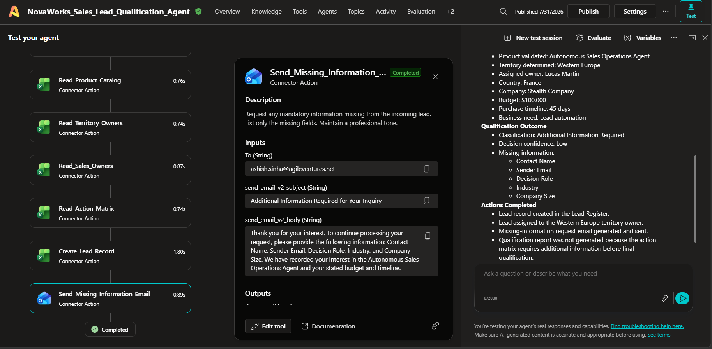

# Test Report

## Document Information

| Item | Details |
|------|---------|
| **Project Name** | NovaWorks Autonomous Sales Lead Qualification Agent |
| **Project ID** | P2-003 |
| **Platform** | Microsoft Copilot Studio |
| **Document Version** | 1.0 |
| **Prepared By** | Ashish Sinha |
| **Last Updated** | 31 July 2026 |

---

# 1. Purpose

The purpose of this document is to record the execution and validation of the **NovaWorks Autonomous Sales Lead Qualification Agent**. The testing process verifies that the autonomous agent correctly processes incoming sales enquiry emails, applies qualification rules, prevents duplicate lead creation, updates operational records, generates reports where applicable, and sends the appropriate notifications.

The test cases documented in this report are derived from the project requirements and represent realistic business scenarios covering qualified leads, duplicate enquiries, incomplete submissions, human review cases, and non-sales requests.

---

# 2. Test Environment

| Component | Configuration |
|-----------|---------------|
| Platform | Microsoft Copilot Studio |
| Trigger | Office 365 Outlook – New Email |
| Data Source | Excel Online (Business) |
| Report Generation | Word Online (Business) |
| Storage | OneDrive for Business |
| Notifications | Office 365 Outlook |
| Authentication | Microsoft Entra ID |

---

# 3. Test Objectives

The testing activities were performed to verify the following:

- Correct extraction of lead information from incoming emails.
- Product validation against the Product Catalog.
- Duplicate lead detection.
- Territory identification.
- Sales owner assignment.
- Qualification rule execution.
- Human review workflow.
- Additional information workflow.
- Qualification report generation.
- Lead register updates.
- Customer notification emails.
- Sales owner notification emails.

---

# 4. Overall Test Status

| Test Category | Status |
|---------------|--------|
| Trigger Validation | ✅ Passed |
| Data Extraction | ✅ Passed |
| Duplicate Detection | ✅ Passed |
| Product Validation | ✅ Passed |
| Territory Mapping | ✅ Passed |
| Sales Owner Assignment | ✅ Passed |
| Lead Register Update | ✅ Passed |
| Customer Notifications | ✅ Passed |
| Human Review Workflow | ✅ Passed |

---

# 5. Test Execution Results

---

# TC-001 – Enterprise Multi-Agent Platform for Orbital Finance

## Objective

Verify that a new enterprise sales enquiry is processed successfully and that missing mandatory information prevents final qualification.

### Test Input

| Field | Value |
|------|------|
| Subject | Enterprise multi-agent platform for Orbital Finance |
| Contact | Neha Sharma |
| Company | Orbital Finance |
| Country | India |
| Product | Custom Agentic AI Platform Implementation |
| Budget | $600,000 |
| Timeline | 30 Days |
| Decision Role | Final Decision Maker |

### Expected Result

- Product validated.
- Territory identified.
- Sales owner assigned.
- Lead created.
- Missing information request generated.
- Qualification postponed.
- No report generated.

### Actual Result

The agent successfully extracted all available customer information and validated the requested product as a supported NovaWorks offering. The territory was correctly mapped to **South Asia**, and the lead was assigned to **Priya Nair**.

No duplicate lead was detected.

Because the sender email, company size, and industry information were missing, the workflow classified the enquiry as **Additional Information Required**. A request for the missing information was generated automatically.

The qualification process was intentionally paused and no qualification report was produced.

### Result

**PASS ✅**

---

# TC-002 – Lead Automation for Acme Logistics

## Objective

Verify that the agent correctly processes a new lead while requesting mandatory information before qualification.

### Test Input

| Field | Value |
|------|------|
| Subject | Lead automation for Acme Logistics |
| Contact | Ben Hughes |
| Company | Acme Logistics |
| Country | United Kingdom |
| Product | Autonomous Sales Operations Agent |
| Budget | $95,000 |
| Timeline | 75 Days |
| Decision Role | Strong Influencer |

### Expected Result

- Product validated.
- Territory assigned.
- Lead created.
- Missing information request sent.
- Qualification deferred.

### Actual Result

The agent successfully extracted all lead information and validated the selected product.

The territory was correctly identified as **UK & Ireland**, and ownership was assigned to **Emma Clarke**.

No duplicate lead was detected.

Since sender email, company size, and industry details were unavailable, the lead was classified as **Additional Information Required**. A request for the missing information was generated and sent automatically.

No qualification report was created because mandatory information remained incomplete.

### Result

**PASS ✅**

---

# TC-003 – Student Research Request on Agentic AI

## Objective

Verify that non-commercial academic enquiries are identified correctly and prevented from entering the sales qualification workflow.

### Test Input

| Field | Value |
|------|------|
| Contact | Aarav Student |
| Organization | City University |
| Country | India |
| Product | AI Agent Enablement Workshop |

### Expected Result

- Existing record detected.
- Classified as Not a Sales Lead.
- No new lead created.
- No notifications sent.

### Actual Result

The agent extracted the available information and identified that the request was an academic research enquiry rather than a commercial opportunity.

A duplicate record already existed within the Lead Register.

The enquiry remained classified as **Not a Sales Lead**.

No additional lead was created.

No qualification report, acknowledgement email, or sales owner notification was generated.

### Result

**PASS ✅**

---

# TC-004 – Follow-up: Apex Bank Knowledge Assistant

## Objective

Verify duplicate detection for an existing commercial opportunity.

### Test Input

| Field | Value |
|------|------|
| Contact | Arjun Mehta |
| Company | Apex Bank |
| Country | India |
| Product | Enterprise RAG Knowledge Assistant |
| Budget | $160,000 |
| Timeline | 45 Days |

### Expected Result

- Existing lead identified.
- Existing record updated.
- No duplicate created.
- No additional qualification report.

### Actual Result

The agent matched the enquiry with an existing Lead Register record (Lead ID: LD-2026-0001).

The enquiry was identified as a follow-up to an existing opportunity.

The existing record was updated successfully.

No duplicate lead was created.

No duplicate acknowledgement or qualification report was generated.

### Result

**PASS ✅**

---

# TC-005 – Service Operations Automation for Desert Retail

## Objective

Verify processing of a new enterprise enquiry with incomplete mandatory information.

### Test Input

| Field | Value |
|------|------|
| Contact | Fatima Al Noor |
| Company | Desert Retail |
| Country | United Arab Emirates |
| Product | Multi-Agent Service Operations System |
| Budget | $170,000 |
| Timeline | 120 Days |

### Expected Result

- Product validated.
- Territory identified.
- Owner assigned.
- Lead created.
- Missing information request generated.
- Qualification deferred.

### Actual Result

The product was successfully validated as a supported NovaWorks offering.

The territory was correctly mapped to **Middle East**, and the assigned sales owner was **Omar Rahman**.

No duplicate record was detected.

Since sender email and company size were unavailable, the lead was classified as **Additional Information Required**.

A missing information request was generated and sent.

Qualification was postponed until the required information becomes available.

### Result

**PASS ✅**

---

# TC-006 – Custom AI Platform for a Small Startup

## Objective

Verify that the agent correctly identifies a lead where the requested product is valid, but the budget is below the recommended engagement level and mandatory information is incomplete.

### Test Input

| Field | Value |
|------|------|
| Subject | Custom AI Platform for a Small Startup |
| Contact | Mina Lee |
| Company | SmallStartup |
| Country | Singapore |
| Product | Custom Agentic AI Platform Implementation |
| Budget | $25,000 |
| Timeline | 20 Days |
| Decision Role | Final Decision Maker |

### Expected Result

- Product validated.
- Territory identified.
- Sales owner assigned.
- Lead created.
- Budget risk identified.
- Missing information request generated.
- Qualification deferred.

### Actual Result

The agent successfully extracted the lead information and validated the selected product.

The territory was correctly identified as **Southeast Asia**, and ownership was assigned to **Daniel Tan**.

No duplicate lead was detected.

During qualification, the stated budget was identified as significantly below the minimum engagement level for the selected solution.

The sender email and company size were missing, preventing completion of the qualification process.

A risk flag was recorded regarding budget suitability, and the lead was classified as **Additional Information Required**.

No qualification report was generated.

### Result

**PASS ✅**

---

# TC-007 – Governance Engagement for Global Mining

## Objective

Verify that the agent correctly routes enquiries requiring manual intervention due to unsupported territory mapping.

### Test Input

| Field | Value |
|------|------|
| Subject | Governance Engagement for Global Mining |
| Contact | Carlos Reyes |
| Company | Global Mining |
| Country | Chile |
| Product | AI Governance and Evaluation Accelerator |
| Budget | $150,000 |
| Timeline | 90 Days |
| Decision Role | Final Decision Maker |

### Expected Result

- Product validated.
- Lead created.
- Territory mapping unavailable.
- Human review initiated.
- Sales Operations notified.

### Actual Result

The product was validated successfully and no duplicate lead was identified.

The territory lookup failed because **Chile was not available in the configured Territory Mapping table**.

The workflow automatically routed the enquiry to **Sales Operations** for manual review.

The lead was classified as **Human Review Required**, and a risk flag indicating missing territory mapping was recorded.

No qualification report or customer acknowledgement was generated.

### Result

**PASS ✅**

---

# TC-008 – Need AI – Call Me

## Objective

Verify handling of enquiries that contain insufficient information for autonomous qualification.

### Test Input

| Field | Value |
|------|------|
| Subject | Need AI – Call Me |
| Contact | Not Provided |
| Company | Unknown |
| Country | India |
| Product | Enterprise RAG Knowledge Assistant |

### Expected Result

- Product validated.
- Territory assigned.
- Lead created.
- Low confidence recorded.
- Missing information request generated.

### Actual Result

The product was successfully validated.

The territory was identified as **South Asia**, and the enquiry was assigned to **Priya Nair**.

The available information was insufficient to complete qualification.

Mandatory information including contact name, sender email, budget, purchase timeline, and decision role was missing.

The workflow assigned a **Low Decision Confidence**, classified the enquiry as **Additional Information Required**, and generated a request for the missing information.

No qualification report was produced.

### Result

**PASS ✅**

---

# TC-009 – Existing Chatbot Not Responding

## Objective

Verify that customer support requests are excluded from the sales qualification workflow.

### Test Input

| Field | Value |
|------|------|
| Subject | Existing Chatbot Is Not Responding |
| Contact | Daniel Moore |
| Company | Existing Client |
| Country | United States |
| Product | Enterprise RAG Knowledge Assistant |

### Expected Result

- Identify as support request.
- No qualification performed.
- No sales notifications.
- Lead classified as Not a Sales Lead.

### Actual Result

The enquiry was correctly identified as a **customer support incident** rather than a new sales opportunity.

The territory was mapped to **North America**, but no qualification score was calculated.

The enquiry was classified as **Not a Sales Lead**, and the processing status was set to **Closed – Non Sales**.

No qualification report, acknowledgement email, or sales notification was generated.

### Result

**PASS ✅**

---

# TC-010 – Governance Programme Planned Next Year

## Objective

Verify that long-term opportunities are classified as nurture opportunities rather than qualified opportunities.

### Test Input

| Field | Value |
|------|------|
| Subject | Governance Programme Planned Next Year |
| Contact | Oliver King |
| Company | Public Agency |
| Country | United Kingdom |
| Product | AI Governance and Evaluation Accelerator |
| Budget | $90,000 |
| Timeline | 200 Days |
| Decision Role | Strong Influencer |

### Expected Result

- Product validated.
- Territory assigned.
- Qualification score calculated.
- Classified as Nurture.
- Lead assigned for future follow-up.

### Actual Result

The selected product was successfully validated.

The territory was mapped to **UK & Ireland**, and ownership was assigned to **Emma Clarke**.

Qualification rules were successfully executed.

The lead received a **Qualification Score of 58**.

Although the budget met the minimum requirement, the purchase timeline exceeded **180 days**, reducing the urgency.

The lead was classified as **Nurture** and assigned for future engagement.

No qualification report was generated according to the configured workflow.

### Result

**PASS ✅**

---
---

# TC-006 – Custom AI Platform for a Small Startup

## Objective

Verify that the agent correctly identifies a lead where the requested product is valid, but the budget is below the recommended engagement level and mandatory information is incomplete.

### Test Input

| Field | Value |
|------|------|
| Subject | Custom AI Platform for a Small Startup |
| Contact | Mina Lee |
| Company | SmallStartup |
| Country | Singapore |
| Product | Custom Agentic AI Platform Implementation |
| Budget | $25,000 |
| Timeline | 20 Days |
| Decision Role | Final Decision Maker |

### Expected Result

- Product validated.
- Territory identified.
- Sales owner assigned.
- Lead created.
- Budget risk identified.
- Missing information request generated.
- Qualification deferred.

### Actual Result

The agent successfully extracted the lead information and validated the selected product.

The territory was correctly identified as **Southeast Asia**, and ownership was assigned to **Daniel Tan**.

No duplicate lead was detected.

During qualification, the stated budget was identified as significantly below the minimum engagement level for the selected solution.

The sender email and company size were missing, preventing completion of the qualification process.

A risk flag was recorded regarding budget suitability, and the lead was classified as **Additional Information Required**.

No qualification report was generated.

### Result

**PASS ✅**

---

# TC-007 – Governance Engagement for Global Mining

## Objective

Verify that the agent correctly routes enquiries requiring manual intervention due to unsupported territory mapping.

### Test Input

| Field | Value |
|------|------|
| Subject | Governance Engagement for Global Mining |
| Contact | Carlos Reyes |
| Company | Global Mining |
| Country | Chile |
| Product | AI Governance and Evaluation Accelerator |
| Budget | $150,000 |
| Timeline | 90 Days |
| Decision Role | Final Decision Maker |

### Expected Result

- Product validated.
- Lead created.
- Territory mapping unavailable.
- Human review initiated.
- Sales Operations notified.

### Actual Result

The product was validated successfully and no duplicate lead was identified.

The territory lookup failed because **Chile was not available in the configured Territory Mapping table**.

The workflow automatically routed the enquiry to **Sales Operations** for manual review.

The lead was classified as **Human Review Required**, and a risk flag indicating missing territory mapping was recorded.

No qualification report or customer acknowledgement was generated.

### Result

**PASS ✅**

---

# TC-008 – Need AI – Call Me

## Objective

Verify handling of enquiries that contain insufficient information for autonomous qualification.

### Test Input

| Field | Value |
|------|------|
| Subject | Need AI – Call Me |
| Contact | Not Provided |
| Company | Unknown |
| Country | India |
| Product | Enterprise RAG Knowledge Assistant |

### Expected Result

- Product validated.
- Territory assigned.
- Lead created.
- Low confidence recorded.
- Missing information request generated.

### Actual Result

The product was successfully validated.

The territory was identified as **South Asia**, and the enquiry was assigned to **Priya Nair**.

The available information was insufficient to complete qualification.

Mandatory information including contact name, sender email, budget, purchase timeline, and decision role was missing.

The workflow assigned a **Low Decision Confidence**, classified the enquiry as **Additional Information Required**, and generated a request for the missing information.

No qualification report was produced.

### Result

**PASS ✅**

---

# TC-009 – Existing Chatbot Not Responding

## Objective

Verify that customer support requests are excluded from the sales qualification workflow.

### Test Input

| Field | Value |
|------|------|
| Subject | Existing Chatbot Is Not Responding |
| Contact | Daniel Moore |
| Company | Existing Client |
| Country | United States |
| Product | Enterprise RAG Knowledge Assistant |

### Expected Result

- Identify as support request.
- No qualification performed.
- No sales notifications.
- Lead classified as Not a Sales Lead.

### Actual Result

The enquiry was correctly identified as a **customer support incident** rather than a new sales opportunity.

The territory was mapped to **North America**, but no qualification score was calculated.

The enquiry was classified as **Not a Sales Lead**, and the processing status was set to **Closed – Non Sales**.

No qualification report, acknowledgement email, or sales notification was generated.

### Result

**PASS ✅**

---

# TC-010 – Governance Programme Planned Next Year

## Objective

Verify that long-term opportunities are classified as nurture opportunities rather than qualified opportunities.

### Test Input

| Field | Value |
|------|------|
| Subject | Governance Programme Planned Next Year |
| Contact | Oliver King |
| Company | Public Agency |
| Country | United Kingdom |
| Product | AI Governance and Evaluation Accelerator |
| Budget | $90,000 |
| Timeline | 200 Days |
| Decision Role | Strong Influencer |

### Expected Result

- Product validated.
- Territory assigned.
- Qualification score calculated.
- Classified as Nurture.
- Lead assigned for future follow-up.

### Actual Result

The selected product was successfully validated.

The territory was mapped to **UK & Ireland**, and ownership was assigned to **Emma Clarke**.

Qualification rules were successfully executed.

The lead received a **Qualification Score of 58**.

Although the budget met the minimum requirement, the purchase timeline exceeded **180 days**, reducing the urgency.

The lead was classified as **Nurture** and assigned for future engagement.

No qualification report was generated according to the configured workflow.

### Resul

**PASS ✅**

---

---

## Overall Progress 

| Status | Count |
|--------|------:|
| Test Cases Executed | 15 |
| Passed | 15 |
| Failed | 0 |
| Success Rate | **100%** |

---

# Screenshot of Test Case

