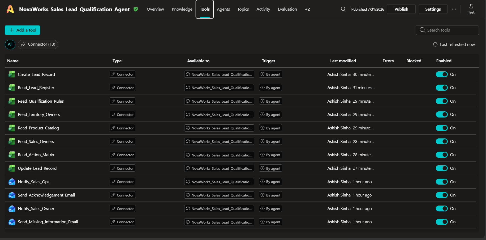
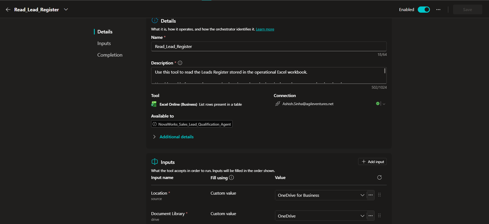
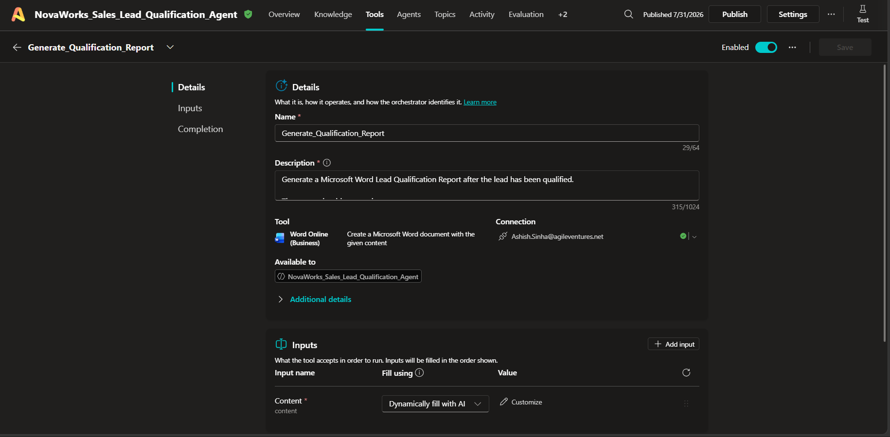
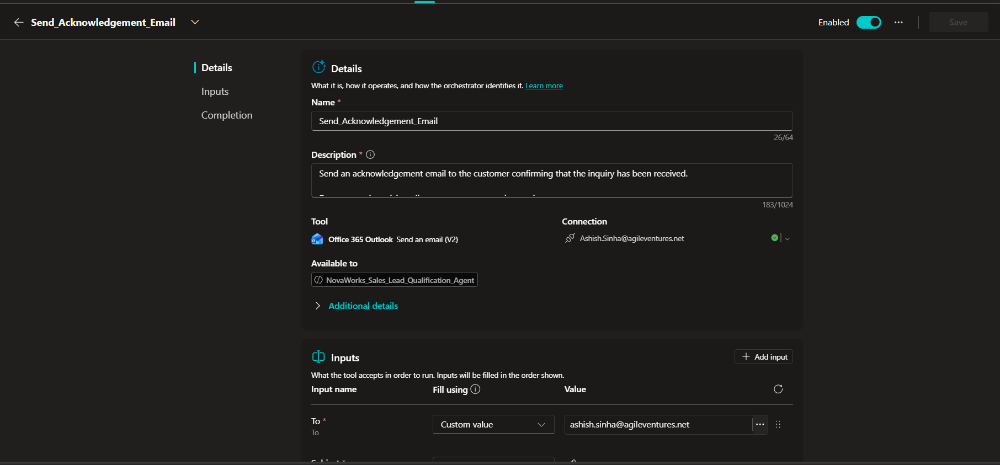

# Tool Design

## Document Information

| Item | Details |
|------|---------|
| **Project Name** | NovaWorks Autonomous Sales Lead Qualification Agent |
| **Project ID** | P2-003 |
| **Platform** | Microsoft Copilot Studio |
| **Document Version** | 1.0 |
| **Prepared By** | Ashish Sinha |
| **Last Updated** | 31 July 2026 |

---

# 1. Purpose

This document describes the design and configuration of all tools used by the **NovaWorks Autonomous Sales Lead Qualification Agent**.

The agent integrates with Microsoft 365 services through Microsoft Copilot Studio connectors to perform business operations including data retrieval, record management, report generation, and email communication.

Each tool has a clearly defined responsibility, expected inputs, outputs, and execution boundaries to ensure reliable and deterministic agent behavior.

---

# 2. Tool Architecture

The solution uses Microsoft 365 connectors grouped into three categories.

```
                     Copilot Studio Agent
                              │
       ┌──────────────────────┼──────────────────────┐
       │                      │                      │
       ▼                      ▼                      ▼
 Excel Online          Word Online          Office 365 Outlook
 (Business)            (Business)            (Business)
       │                      │                      │
       ▼                      ▼                      ▼
 Business Data       Report Generation      Notifications
```

---

# 3. Tool Categories

| Category | Connector | Number of Tools |
|----------|-----------|-----------------|
| Excel Online (Business) | Operational Data | 8 |
| Word Online (Business) | Report Generation | 1 |
| Office 365 Outlook | Communication | 4 |

Total Configured Tools

**13**

---

# 4. Excel Online (Business) Tools

---

## Tool 1 – Read_Lead_Register

### Purpose

Retrieves existing lead records to determine whether the incoming enquiry already exists.

### Connector

Excel Online (Business)

### Action

List rows present in a table

### Inputs

- Sender Email
- Company Name
- Source Message ID

### Outputs

- Existing Lead Record
- No Matching Record

### Action Boundary

Used only during duplicate detection.

Does not modify data.

---

## Tool 2 – Create_Lead_Record

### Purpose

Creates a new lead record after successful qualification.

### Connector

Excel Online (Business)

### Action

Add a row into a table

### Inputs

- Lead Information
- Qualification Score
- Territory
- Assigned Owner
- Classification

### Outputs

- New Excel Record

### Action Boundary

Executed only when no duplicate exists.

---

## Tool 3 – Update_Lead_Record

### Purpose

Updates an existing lead.

### Connector

Excel Online (Business)

### Action

Update a row

### Inputs

- Existing Lead ID
- Updated Lead Information

### Outputs

- Updated Record

### Action Boundary

Only used for duplicate leads.

---

## Tool 4 – Read_Qualification_Rules

### Purpose

Retrieves qualification scoring rules.

### Connector

Excel Online (Business)

### Action

List rows

### Inputs

None

### Outputs

Qualification Rules

### Action Boundary

Read-only.

No modifications permitted.

---

## Tool 5 – Read_Product_Catalog

### Purpose

Validates product names extracted from incoming emails.

### Connector

Excel Online (Business)

### Action

List rows

### Inputs

Extracted Product Name

### Outputs

Validated Product

Unknown Product

### Action Boundary

Read-only.

---

## Tool 6 – Read_Territory_Owners

### Purpose

Determines the responsible sales territory.

### Connector

Excel Online (Business)

### Inputs

Country

Region

### Outputs

Territory

### Action Boundary

Read-only.

---

## Tool 7 – Read_Sales_Owners

### Purpose

Assigns the correct sales representative.

### Connector

Excel Online (Business)

### Inputs

Territory

### Outputs

Assigned Sales Owner

### Action Boundary

Read-only.

---

## Tool 8 – Read_Action_Matrix

### Purpose

Determines which business actions should be executed.

### Connector

Excel Online (Business)

### Inputs

Classification

Priority

### Outputs

Business Actions

### Action Boundary

Read-only.

---

# 5. Word Online (Business)

---

## Tool 9 – Generate_Qualification_Report

### Purpose

Generates the official Lead Qualification Report using the approved Word template.

### Connector

Word Online (Business)

### Inputs

- Lead Details
- Qualification Score
- Assigned Owner
- Classification
- Business Need
- Recommendation

### Outputs

Generated Word Report

Saved Report Path

### Action Boundary

Executed only after successful qualification.

The report is stored in the Reports folder.

---

# 6. Office 365 Outlook

---

## Tool 10 – Send_Acknowledgement_Email

### Purpose

Confirms receipt of the customer's enquiry.

### Inputs

Customer Email

Lead Summary

### Outputs

Acknowledgement Email

### Action Boundary

Only sent when sufficient information exists.

---

## Tool 11 – Send_Missing_Information_Email

### Purpose

Requests mandatory information required for processing.

### Inputs

Customer Email

Missing Fields

### Outputs

Information Request Email

### Action Boundary

Executed only when mandatory fields are missing.

---

## Tool 12 – Notify_Sales_Owner

### Purpose

Notifies the assigned sales representative.

### Inputs

Lead Summary

Assigned Owner

### Outputs

Internal Notification

### Action Boundary

Executed after successful qualification.

---

## Tool 13 – Notify_Sales_Ops

### Purpose

Requests manual review for uncertain cases.

### Inputs

Lead Summary

Reason for Escalation

### Outputs

Sales Operations Notification

### Action Boundary

Executed only when automation cannot confidently complete qualification.

---

# 7. Tool Execution Order

The agent invokes tools in the following sequence.

```
Read_Lead_Register

↓

Read_Qualification_Rules

↓

Read_Product_Catalog

↓

Read_Territory_Owners

↓

Read_Sales_Owners

↓

Read_Action_Matrix

↓

Create_Lead_Record
OR
Update_Lead_Record

↓

Generate_Qualification_Report

↓

Send Outlook Notifications
```

The execution order ensures that business validation is completed before operational records are modified.

---

# 8. Error Handling

Each tool follows predefined execution boundaries.

| Scenario | Expected Action |
|----------|-----------------|
| Duplicate Lead | Update existing record |
| Unknown Product | Human Review |
| Unknown Territory | Human Review |
| Missing Owner | Human Review |
| Missing Mandatory Fields | Request additional information |
| Excel Failure | Stop execution and log failure |
| Word Failure | Do not update report path |
| Outlook Failure | Record notification failure |

---

# 9. Security Considerations

The configured tools follow Microsoft 365 security practices.

- Microsoft Entra ID authentication.
- OneDrive for Business storage.
- Connector permissions managed by Microsoft 365.
- No credentials stored within agent instructions.
- No API keys embedded in tool configurations.

---

# 10. Design Principles

The tools were designed using the following principles:

- Single responsibility per tool.
- Read operations separated from write operations.
- Business rules retrieved dynamically.
- Standardized report generation.
- Deterministic execution order.
- Human review for uncertain decisions.
- Reusable Microsoft 365 connectors.

---

# 11. Screenshot Evidence

The following screenshots should be included.

## Screenshot 1 – Tools Overview



---

## Screenshot 2 – Excel Tool Configuration



---

## Screenshot 3 – Word Tool Configuration



---

## Screenshot 4 – Outlook Tool Configuration

Show one configured Outlook tool.

Example:

- Send_Acknowledgement_Email

---

# 12. Conclusion

The tool architecture enables the autonomous agent to interact with Microsoft 365 services in a structured and secure manner. By separating operational data management, document generation, and communication into dedicated tools, the solution remains modular, maintainable, and aligned with enterprise automation best practices.

Each tool has a clearly defined responsibility, controlled execution boundaries, and integrates into the overall lead qualification workflow without exposing sensitive information or bypassing business validation.