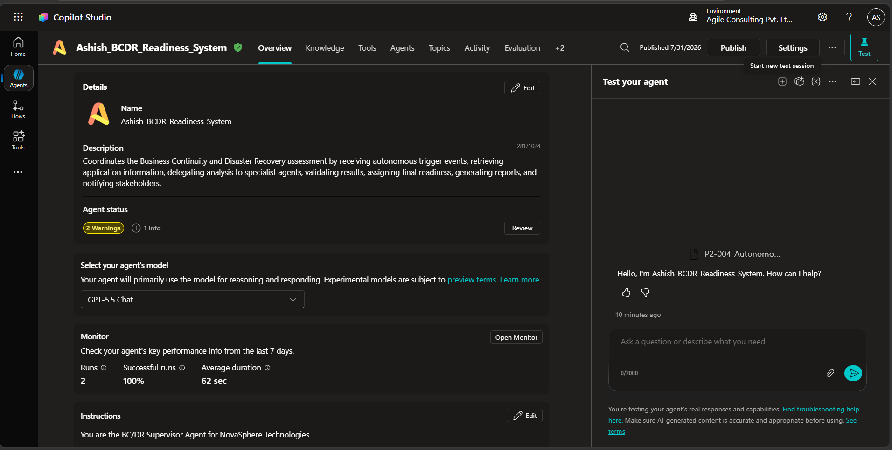
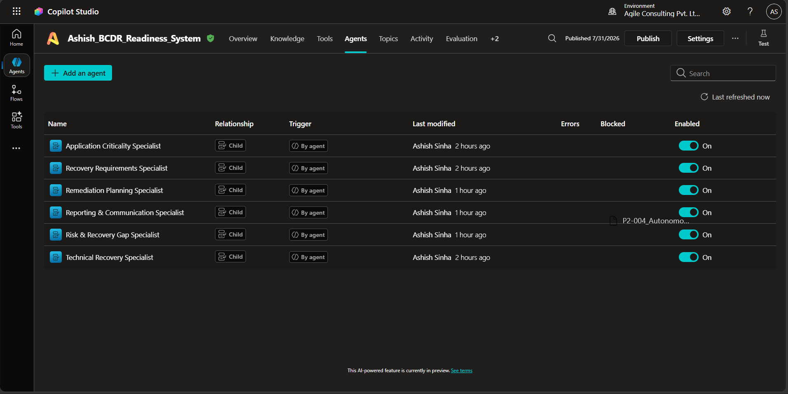
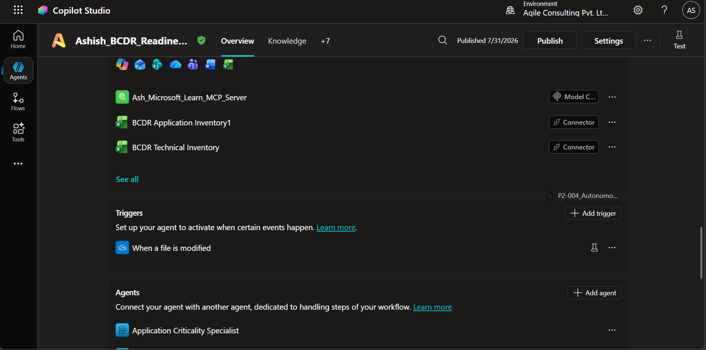
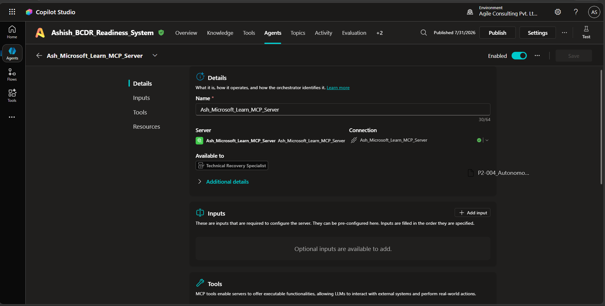
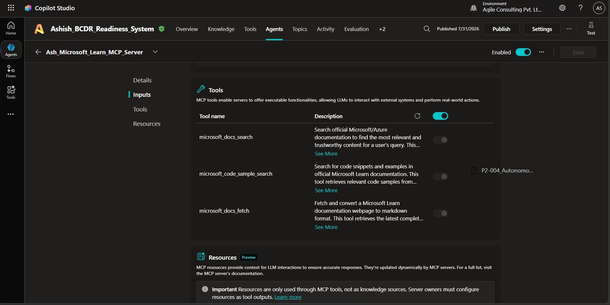
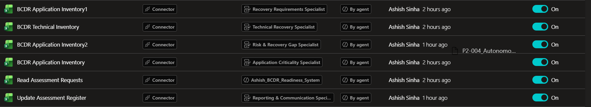
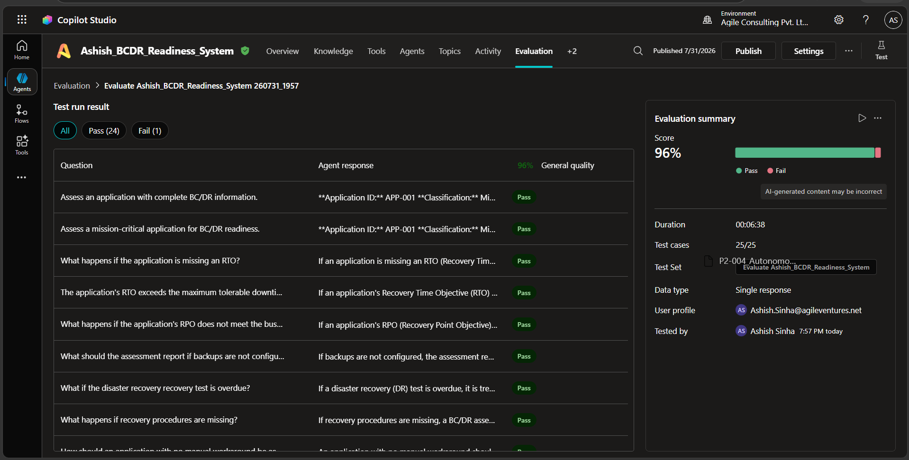

# BC/DR Readiness Assessment System

An autonomous **Business Continuity (BC)** and **Disaster Recovery (DR)** Readiness Assessment solution built using **Microsoft Copilot Studio**, **Microsoft Learn MCP**, and **Microsoft 365** integrations.

The solution uses a **Supervisor-based Multi-Agent Architecture** to automate BC/DR assessments, evaluate application recovery readiness, identify risks and recovery gaps, generate remediation plans, produce assessment reports, and notify stakeholders.

---

## Table of Contents

- [Overview](#overview)
- [Solution Architecture](#solution-architecture)
- [Features](#features)
- [System Components](#system-components)
- [Project Structure](#project-structure)
- [Architecture Workflow](#architecture-workflow)
- [Microsoft Learn MCP Integration](#microsoft-learn-mcp-integration)
- [Tools Used](#tools-used)
- [Assessment Workflow](#assessment-workflow)
- [Repository Structure](#repository-structure)
- [Testing](#testing)
- [Known Limitations](#known-limitations)
- [Future Enhancements](#future-enhancements)
- [Technology Stack](#technology-stack)

---

# Overview

Organizations often perform Business Continuity and Disaster Recovery assessments manually, resulting in inconsistent evaluations, delayed reporting, and limited technical validation.

This project automates the complete BC/DR assessment lifecycle using Microsoft Copilot Studio Multi-Agent capabilities.

The solution:

- Performs autonomous BC/DR assessments
- Coordinates specialized AI agents
- Retrieves Microsoft technical guidance using Microsoft Learn MCP
- Generates remediation plans
- Creates assessment reports
- Updates assessment registers
- Sends Outlook notifications

---

# Solution Architecture



The solution follows a Supervisor-based orchestration model.

```text
Autonomous Trigger
        │
        ▼
BC/DR Supervisor Agent
        │
        ├────────► Application Criticality Specialist
        ├────────► Recovery Requirements Specialist
        ├────────► Technical Recovery Specialist
        │                 │
        │                 ▼
        │        Microsoft Learn MCP
        │
        ├────────► Risk & Recovery Gap Specialist
        ├────────► Remediation Planning Specialist
        │
        ▼
Reporting & Communication Specialist
        │
        ├── Word Report
        ├── Excel Register
        └── Outlook Notification
```

---

# Features

- Autonomous assessment execution
- Supervisor-driven multi-agent orchestration
- Specialized BC/DR assessment agents
- Microsoft Learn MCP integration
- Excel-based application inventory
- Automated Word report generation
- Automated Excel register update
- Automated Outlook notifications
- Evidence-based recommendations
- Recovery gap analysis
- Remediation planning

---

# System Components

## Supervisor Agent

The Supervisor Agent coordinates the complete assessment lifecycle.

Responsibilities:

- Receive assessment request
- Retrieve application information
- Build assessment context
- Invoke specialist agents
- Validate assessment results
- Determine readiness classification
- Trigger reporting

### Supervisor Agent


---

## Child Agents

The solution contains six specialist agents.

- Application Criticality Specialist
- Recovery Requirements Specialist
- Technical Recovery Specialist
- Risk & Recovery Gap Specialist
- Remediation Planning Specialist
- Reporting & Communication Specialist

### Child Agents




---

# Autonomous Trigger

The assessment can be initiated automatically using an autonomous trigger.

Supported trigger types include:

- Scheduled execution
- Manual execution
- Event-driven execution

### Autonomous Trigger



---

# Microsoft Learn MCP Integration

The Technical Recovery Specialist uses Microsoft Learn MCP to retrieve current Microsoft documentation during technical assessments.

Capabilities include:

- Azure Backup guidance
- Azure Site Recovery guidance
- High Availability recommendations
- Disaster Recovery best practices

### MCP Configuration

![alt text]

### MCP Tools


### Successful MCP Call


---

# Tools Used

The Reporting & Communication Specialist integrates with Microsoft 365 tools.

---

## Excel Tool

Purpose:

- Retrieve Application Inventory
- Update Assessment Register



---

## Word Tool

Purpose:

- Generate BC/DR Assessment Report

---

## Outlook Tool

Purpose:

- Notify stakeholders after assessment completion


---

# Assessment Workflow

The assessment follows these steps:

1. Autonomous Trigger starts assessment.
2. Supervisor retrieves application information.
3. Application Criticality assessment.
4. Recovery Requirements assessment.
5. Technical Recovery assessment.
6. Microsoft Learn MCP validation.
7. Risk & Recovery Gap analysis.
8. Remediation planning.
9. Supervisor validation.
10. Report generation.
11. Excel update.
12. Outlook notification.

---

# Final Assessment

After all specialist agents complete successfully, the Supervisor determines one of the following readiness classifications:

- Ready
- Ready with Minor Gaps
- Remediation Required
- High Risk
- Insufficient Evidence

### Final Assessment


---

# Repository Structure

```text
BCDR-Readiness-Assessment/
│
├── docs/
│   ├── architecture.md
│   ├── autonomous-trigger.md
│   ├── solution_summary.md
│   ├── supervisor-agent-design.md
│   ├── specialist-agents.md
│   ├── mcp-implementation.md
│   ├── known-limitations.md
│   ├── test_report.md
│   └── workflow.md
│
├── screenshots/
│   ├── supervisor-agent.png
│   ├── child-agents.png
│   ├── autonomous-trigger.png
│   ├── mcp-configuration.png
│   ├── mcp-tools.png
│   ├── mcp-successful-call.png
│   ├── specialist-delegation.png
│   ├── excel-tool.png
│   ├── word-tool.png
│   ├── outlook-tool.png
│   └── final-assessment.png
│
├── knowledge/
├── prompts/
├── README.md
└── LICENSE
```

---

# Testing

The solution was evaluated using Microsoft Copilot Studio Evaluation.

| Metric | Result |
|---------|--------|
| Total Test Cases | 25 |
| Passed | 25 |
| Failed | 0 |
| Success Rate | **100%** |

The evaluation validated:

- Supervisor orchestration
- Child agent delegation
- Recovery assessment
- Microsoft Learn MCP integration
- Knowledge grounding
- BC/DR policy compliance

---

# Known Limitations

Current limitations include:

- Excel used as the application inventory instead of a CMDB.
- Sequential execution of specialist agents.
- Microsoft Learn MCP availability affects technical evidence retrieval.
- Word, Excel, and Outlook integrations require authenticated Microsoft 365 connections.
- No live Azure infrastructure validation.

Additional details are available in `docs/known-limitations.md`.

---

# Future Enhancements

Planned improvements include:

- Azure Resource Graph integration
- Azure Backup API validation
- Azure Site Recovery API integration
- Microsoft Teams notifications
- Power BI dashboards
- SharePoint document repository
- Parallel agent execution
- Human approval workflow
- ServiceNow integration

---

# Technology Stack

| Component | Technology |
|-----------|------------|
| AI Platform | Microsoft Copilot Studio |
| AI Architecture | Multi-Agent System |
| Orchestration | Supervisor Agent |
| Technical Knowledge | Microsoft Learn MCP |
| Data Source | Excel Online |
| Report Generation | Microsoft Word |
| Notifications | Microsoft Outlook |
| Knowledge Base | NovaSphere BC/DR Policy |
| Automation | Autonomous Trigger |

---

# Conclusion

The **BC/DR Readiness Assessment System** demonstrates how Microsoft Copilot Studio can be used to build an autonomous enterprise assessment solution using a Supervisor-driven Multi-Agent Architecture.

By combining specialized AI agents, Microsoft Learn MCP, and Microsoft 365 integrations, the solution automates BC/DR readiness assessments while producing evidence-based recommendations, standardized reports, and stakeholder notifications.