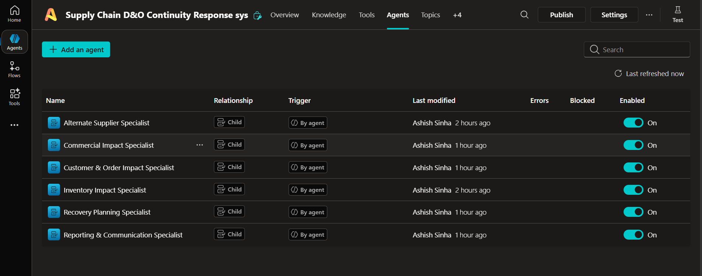
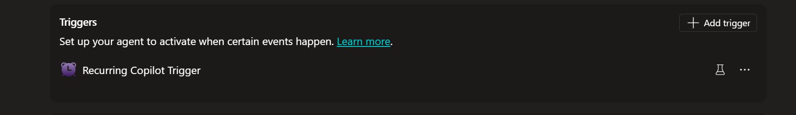
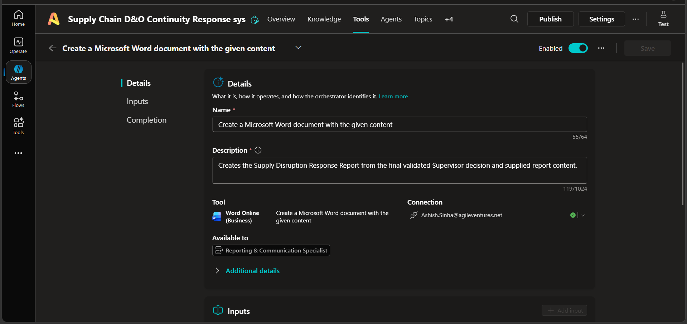
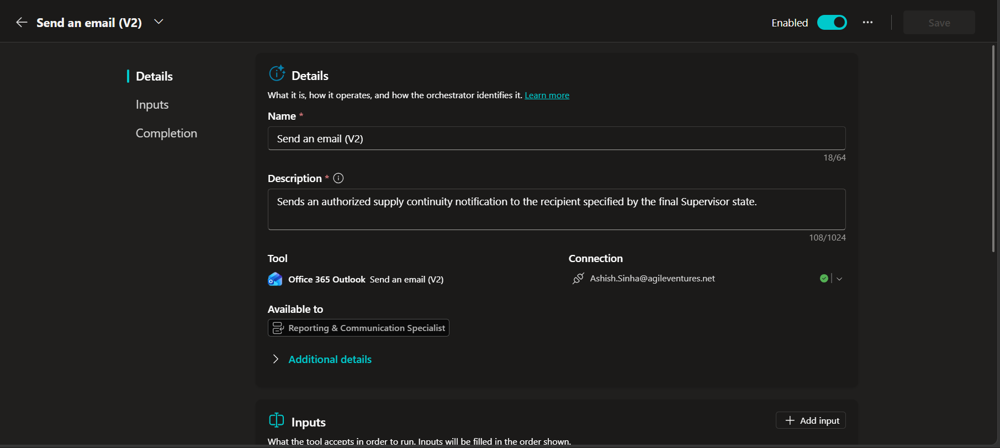
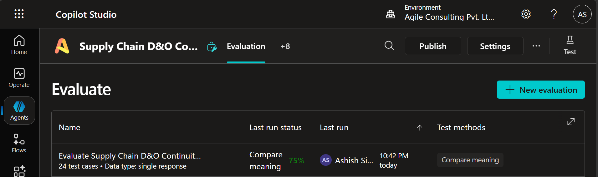

# P2-006 — Autonomous Supply Chain Disruption & Order Continuity Response System

## Project
- **Project ID:** P2-006
- **Platform:** Microsoft Copilot Studio
- **Project Type:** Autonomous Multi-Agent System
- **Company:** NovaSphere Technologies Pvt. Ltd.
- **Primary Patterns:** Sequential, Parallel Fan-Out/Fan-In, Hierarchical, Conditional Routing, Conflict Resolution, Selective Reassessment, Retry/Fallback

## Purpose
Build an autonomous Copilot Studio solution that identifies an unprocessed supply disruption, validates it, identifies affected SKU/PO/customer orders, obtains independent specialist assessments, consolidates findings, proposes a continuity strategy, routes required human approvals, selectively reassesses changed conditions, updates the disruption register, creates a Word report, and sends conditional Outlook notifications.

## Architecture
```text
Autonomous Trigger
      ↓
Supply Continuity Supervisor
      ↓
Disruption Intake & Validation
      ↓
Scope Identification
      ↓
┌──────────┬──────────┬──────────┬──────────┐
Inventory  Alternate  Customer   Commercial
Specialist Supplier   & Order    Specialist
           Specialist Specialist
└──────────┴──────────┴──────────┴──────────┘
      ↓
Supervisor Fan-In
      ↓
Recovery Planning Specialist
      ↓
Recovery Strategy Resolution
      ↓
Approval / Exception / Selective Reassessment
      ↓
Supervisor Validation & Final Decision
      ↓
Reporting & Communication
   ├── Word Report
   ├── Excel Status Update
   └── Conditional Outlook Notification
```

## Required components
1. Supply Continuity Supervisor
2. Six specialist child agents
3. Custom Topic 1 — Disruption Intake & Validation
4. Custom Topic 2 — Recovery Strategy Resolution
5. Custom Topic 3 — Approval, Exception & Selective Reassessment
6. Autonomous recurrence/event trigger
7. Excel Online (Business) integration
8. NovaSphere Supply Continuity Policy knowledge source
9. Word Online (Business) reporting
10. Outlook notification
11. Test evidence and documentation

## System Screenshots & Documentation Evidence

### 1. Supply Continuity Supervisor Agent


### 2. Child Specialist Agents Overview


### 3. Autonomous Recurrence Trigger


### 4. Custom Topics Authoring
| Topic 1: Intake & Validation | Topic 2: Strategy Resolution | Topic 3: Approval & Reassessment |
|---|---|---|
|  |  |  |

### 5. Specialized Connectors & Tool Scoping




### 6. Copilot Studio Evaluation Run (75% Pass Rate)


## Human approval boundary
The system recommends and routes actions but must not fabricate or autonomously perform supplier approval, purchase-order placement, commercial approval, customer agreement, or other human-authorized actions.

## Repository structure
```text
p2-006_supply_chain_disruption_order_continuity/
├── README.md
├── solution-summary.md
├── architecture.md
├── orchestration-patterns.md
├── supervisor-agent-design.md
├── specialist-agent-design.md
├── custom-topics.md
├── autonomous-trigger.md
├── decision-rules.md
├── test-report.md
├── known-limitations.md
├── ai-usage-declaration.md
└── data/
    └── dataset-notes.md
```

## Implementation note
The PRD requires at least 18 executed test cases and evidence for sequential, parallel/fan-in, hierarchical, conditional, conflict-resolution, reassessment, failure/fallback, and end-to-end behavior. This repository documentation does not claim tests were executed unless actual evidence is recorded in `test-report.md`.
