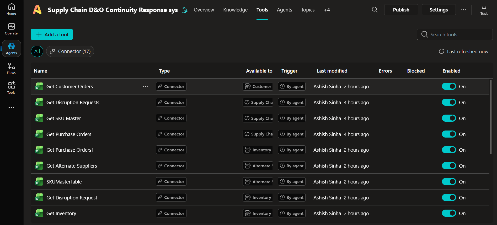
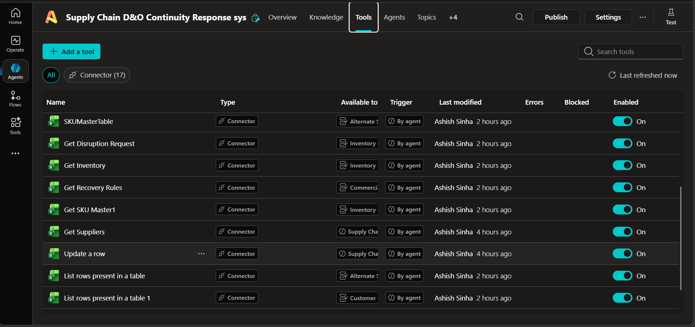

# Architecture

## Logical architecture

```text
                         Autonomous Trigger
                                │
                                ▼
                    Supply Continuity Supervisor
                                │
                                ▼
                    Topic 1: Intake & Validation
                                │
                       Valid Record?
                       /           \
                     No             Yes
                     │               │
                    Hold       In Assessment
                                     │
                                     ▼
                         Scope Identification
                         SKU / PO / Orders
                                     │
            ┌────────────────────────┼────────────────────────┐
            ▼                        ▼                        ▼
   Inventory Impact       Alternate Supplier       Customer & Order
      Specialist                Specialist              Specialist
            │                        │                        │
            └────────────────────────┼────────────────────────┘
                                     ▼
                           Commercial Specialist
                                     │
                                     ▼
                              FAN-IN / CONSOLIDATION
                                     │
                                     ▼
                         Recovery Planning Specialist
                                     │
                                     ▼
                     Topic 2: Recovery Strategy Resolution
                                     │
                                     ▼
                 Topic 3: Approval / Exception / Reassessment
                                     │
                                     ▼
                        Supervisor Validation
                                     │
                                     ▼
                           FINAL SUPERVISOR DECISION
                                     │
                                     ▼
                   Reporting & Communication Specialist
                          │                    │
                          ▼                    ▼
                     Word Report        Outlook Notification
                          │
                          ▼
                    Excel Status Update
```

## Component responsibilities

| Component | Responsibility |
|---|---|
| Autonomous trigger | Starts processing when a new/eligible disruption is available |
| Supervisor | Orchestration, state, fan-out/fan-in, validation, conflict resolution, final risk/strategy validation |
| Topic 1 | Deterministic input validation and duplicate/state protection |
| Inventory Specialist | Usable inventory, ATP, safety stock, quality holds |
| Alternate Supplier Specialist | Supplier feasibility, qualification, capacity, lead time, cost |
| Customer & Order Specialist | Affected orders, strategic/SLA priority, revenue risk, partial fulfilment |
| Commercial Specialist | Cost premium, expedite premium, revenue exposure, approval |
| Recovery Planning Specialist | Consolidated recovery plan after fan-in |
| Topic 2 | Deterministic recovery strategy resolution |
| Topic 3 | Approval, exception, retry, and selective reassessment |
| Reporting Specialist | Word report and authorized Outlook communication |
| Excel | Operational source/state register |
| Policy knowledge | Authoritative continuity rules and precedence |

## Data sources
Required Excel tables:
- DisruptionRequestsTable
- SuppliersTable
- SKUMasterTable
- InventoryTable
- PurchaseOrdersTable
- CustomerOrdersTable
- AlternateSuppliersTable
- RecoveryRulesTable
- StakeholdersTable

The authoritative knowledge source is **NovaSphere Supply Continuity Policy**.

## Tool scoping
Tools are scoped by responsibility. Specialists should not receive every connector/table. The Supervisor owns orchestration and state; assessment specialists receive only the data required for their domain; Recovery Planning receives consolidated findings plus policy; Reporting receives Word/Outlook capabilities.




