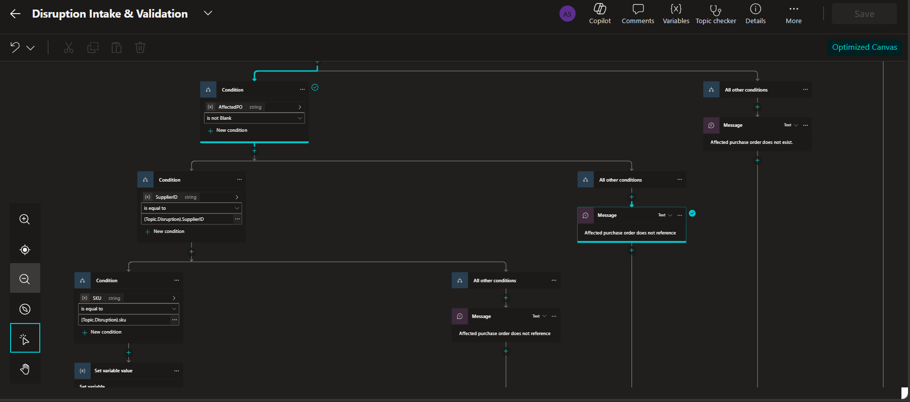
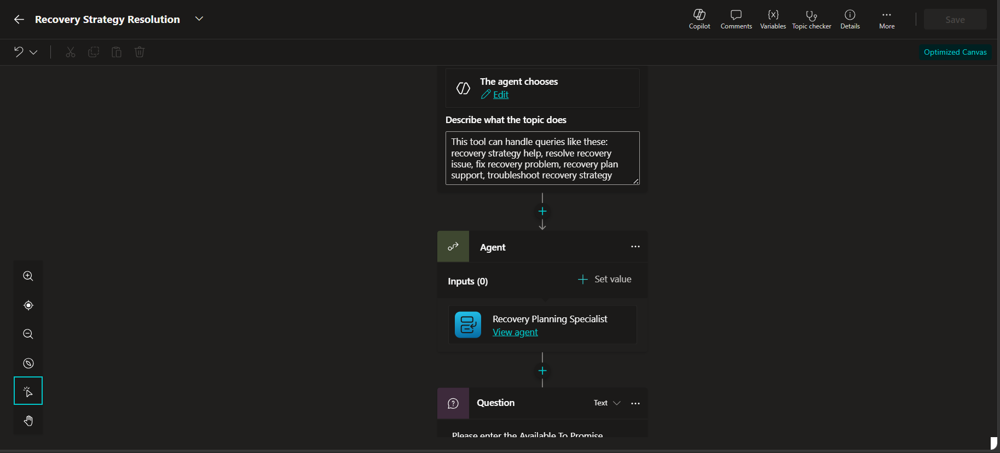
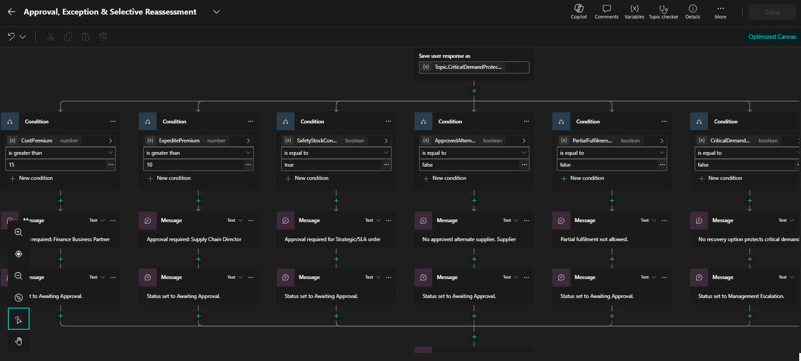

# Custom Topics

## Topic 1 — Disruption Intake & Validation

### Purpose
Deterministic validation before specialist assessment.

### Required validations
- Disruption ID exists
- Disruption ID is unique
- Status is Pending
- Supplier ID exists
- SKU exists
- Disruption type exists
- Reported date exists and is valid
- Affected PO exists
- PO references same supplier and SKU
- Affected quantity is positive
- Supplier exists
- SKU exists in SKU Master

### Variables
DisruptionID, SupplierID, SKU, DisruptionType, ReportedDate, ExpectedRecoveryDate, AffectedPO, AffectedQty, ReportedSeverity, ValidationStatus, DuplicateDetected.

### Failure
If validation fails:
- do not invoke specialists
- record validation reason
- hold/stop the record safely

---

## Topic 2 — Recovery Strategy Resolution

### Purpose
Resolve competing specialist recommendations after fan-in using deterministic policy rules.

### Inputs
- Inventory output
- Alternate supplier output
- Customer/order output
- Commercial output
- Policy rules

### Main branches
A. Existing inventory can protect demand → prefer existing supply; check safety-stock use.
B. Partial inventory → protect highest-priority orders; evaluate partial fulfilment and alternate supply.
C. Approved alternate can meet demand → evaluate cost/approval and combine with inventory if required.
D. Alternate exists but is unapproved → manual qualification; no autonomous sourcing.
E. No viable recovery → management escalation and critical risk where appropriate.

### Approval thresholds
- Cost premium >15%
- Expedite premium >10%
- Strategic/SLA safety-stock consumption
- No approved alternate
- Partial fulfilment not allowed
- No recovery option protecting critical demand

### Required outputs
ProposedStrategy, StrategyComponents, OrdersProtected, OrdersRemainingAtRisk, RequiredApprovals, ResidualRisk, ResolutionStatus.

---

## Topic 3 — Approval, Exception & Selective Reassessment

### Purpose
Handle approvals, exceptions, retries, and reassessment after data changes.

### Approval behavior
- Determine required approver.
- Set state to Awaiting Approval.
- Record approval reason.
- Never invent approval.
- Resume only when approval data/state changes.

### Selective reassessment
- Identify stale specialist result.
- Rerun only affected specialist(s).
- Preserve unaffected results.
- Re-enter fan-in.
- Recalculate strategy.

### Loop limit
Maximum automated reassessment cycles = 2.
After two unresolved cycles = Manual Review.

### Example
Alternate capacity changes:
- rerun Alternate Supplier Specialist
- rerun Commercial Specialist if cost changes
- preserve Inventory and Customer results unless their data changed.
