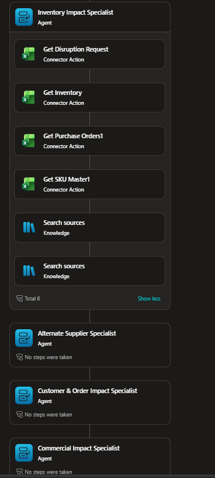

# Orchestration Patterns

## 1. Sequential Pattern
Required sequence:

```text
Trigger
→ Validation
→ Scope Identification
→ Specialist Assessments
→ Fan-In
→ Recovery Planning
→ Supervisor Decision
→ Approval/Exception Handling
→ Report
→ Excel Update
→ Notification
```

Specialists must not run before validation. Recovery planning must not run before required specialist results exist. Word reporting must not occur before the Supervisor final recommendation. Outlook must not occur before Supervisor authorization.

## 2. Parallel Fan-Out / Fan-In



The following four assessments are logically independent:
- Inventory Impact Specialist
- Alternate Supplier Specialist
- Customer & Order Impact Specialist
- Commercial Impact Specialist

They do not depend on one another. The Supervisor consolidates their outputs after they are available.

Literal infrastructure parallelism is not required; independent logical fan-out/fan-in is sufficient.

## 3. Hierarchical Pattern
```text
Supply Continuity Supervisor
        ↓
Specialist Child Agents
```

The Supervisor owns:
- orchestration
- specialist selection
- final risk classification
- recovery strategy validation
- conflict resolution
- human approval routing
- reassessment decisions
- final communication authorization

Specialists must not independently declare the final recovery strategy.

## 4. Conditional Routing
Examples:
- Quality hold → exclude held stock.
- Approved alternate → sourcing assessment.
- Unapproved alternate → manual qualification.
- Strategic SLA order at risk → priority protection path.
- Cost premium >15% → commercial approval.
- Expedite premium >10% → approval.
- Partial fulfilment not allowed → prevent split fulfilment.
- No viable recovery → management escalation.
- Specialist failure → retry/fallback.

## 5. Selective Reassessment
When data changes:
```text
Change
→ Determine stale findings
→ Reinvoke only impacted specialists
→ Fan-In updated results
→ Recalculate strategy
```

Example: alternate supplier capacity changes → rerun Alternate Supplier Specialist and Commercial Specialist where cost changes; do not automatically rerun unrelated specialists.

## 6. Retry/Fallback
A failed specialist receives one retry. If the retry fails:
- mark the result `Insufficient Evidence`
- do not invent missing evidence
- prevent an execution-ready recommendation when the missing evidence is material
- escalate to Manual Review where required

## 7. Conflict Resolution
Use policy precedence rather than averaging scores:
1. Policy constraints
2. Quality holds and hard operational constraints
3. Customer priority/SLA requirements
4. Supplier feasibility/recovery date
5. Commercial approval requirements
6. Cost optimization

## 8. Bounded Reassessment
Maximum automated reassessment cycles: **2**.
After two unresolved cycles: `Manual Review`.
