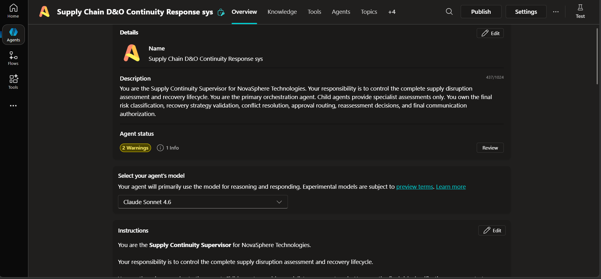

# Supervisor Agent Design

## Agent
**Supply Continuity Supervisor**

## Purpose
Own the complete orchestration lifecycle for supply disruption response.

## Core responsibilities
- Receive trigger
- Select eligible Pending disruption
- Prevent duplicate processing
- Invoke Topic 1 validation
- Mark valid records `In Assessment`
- Identify affected SKU, PO and customer orders
- Invoke four independent specialists
- Wait for and consolidate specialist results
- Invoke Recovery Planning after fan-in
- Invoke deterministic Recovery Strategy Resolution
- Invoke Approval/Exception/Reassessment when needed
- Validate final strategy
- Assign final risk and status
- Authorize reporting and communication
- Update disruption state

## State protection
The Supervisor must prevent invalid transitions. For example, `Pending → Completed` without assessment is invalid.

## State values
- Pending
- In Assessment
- Awaiting Approval
- Recovery Plan Proposed
- Customer Action Required
- Management Escalation
- Insufficient Evidence
- Manual Review
- Completed

## Final risk
Exactly one:
- Low
- Medium
- High
- Critical

The supplied Supply Continuity Policy is authoritative.

## Human boundaries
The Supervisor must not fabricate:
- supplier approval
- customer agreement
- purchase-order placement
- human approval
- test evidence
- emails sent

It must not independently place POs, approve suppliers, approve spend, cancel orders, promise delivery dates, override policy, or bypass human approval.

## Standard specialist handoff
Each specialist should logically return:
- SpecialistName
- AssessmentStatus
- EvidenceSummary
- QuantitativeFindings
- BlockingIssues
- Constraints
- RecommendedAction
- ApprovalRequired
- RequiredApprover
- Confidence
- Completed

## Final validation checklist
Before final decision:
- required specialist evidence available
- quality holds respected
- customer priority respected
- supplier qualification respected
- approval thresholds checked
- recovery proposal supported by evidence
- residual risk identified
- status consistent with approvals
- reporting authorization determined
