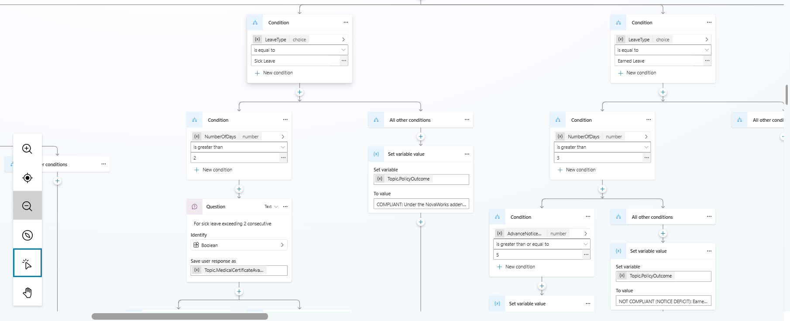

# P2-001: NovaHR Assist — Architecture & Verification Screenshots

*Instructions for Submission: Insert the captured screenshots from your Microsoft Copilot Studio environment directly below each corresponding section header before converting/saving as `screenshots.docx`.*

---

### Screenshot 1: Agent Overview and System Instructions Canvas and KnowledgeBase
* **PRD Requirement:** Section 15.4 (Agent overview and instructions)
* **Description:** Demonstrates the configuration of NovaHR Assist's identity, professional description, English language setting, and the comprehensive system prompt enforcing operational boundaries, RAG precedence, and safety guardrails.
---

---

---

---

---

### Screenshot 2: Leave Request Advisor — Authoring Canvas & Variable Setup
* **PRD Requirement:** Section 15.4 (Leave Request Advisor topic)
* **Description:** Shows the visual authoring canvas for the `Leave Request Advisor` topic, highlighting the trigger phrases, introductory message, choice question, and variable initialization.
screenshots/Screenshot 2026-07-24 135854.png

---

### Screenshot 3: Conditional Branches — Leave Compliance Rules
* **PRD Requirement:** Section 15.4 (Conditional branches)

---

### Screenshot 4: Workplace Concern and Escalation — Immediate Safety Branch
* **PRD Requirement:** Section 15.4 (Workplace Concern topic & Conditional branches)

### Screenshot 5: Published Agent & Channel Configuration
* **PRD Requirement:** Section 15.4 ( sharing configuration)
---

