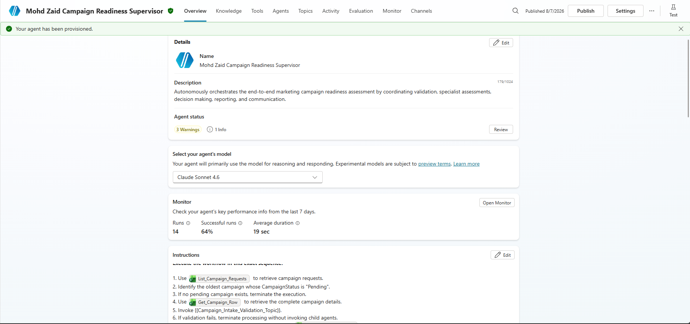
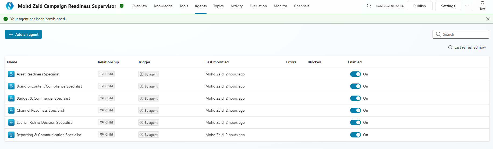
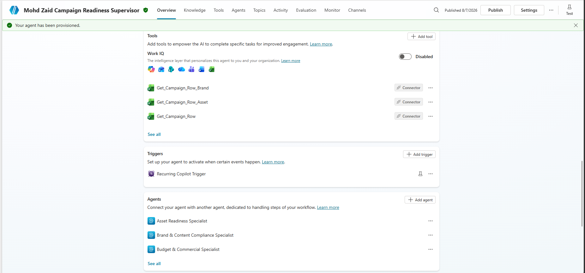
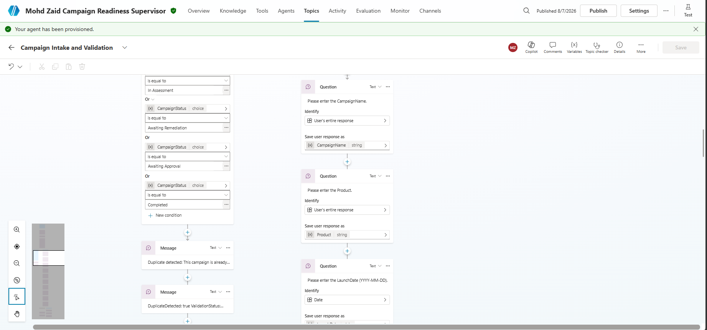
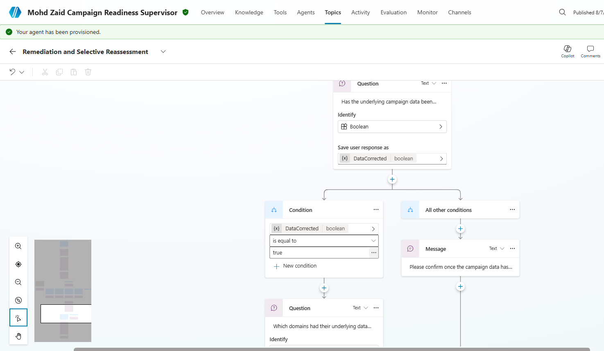
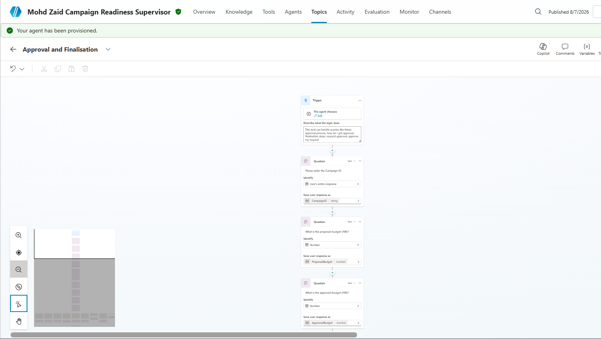
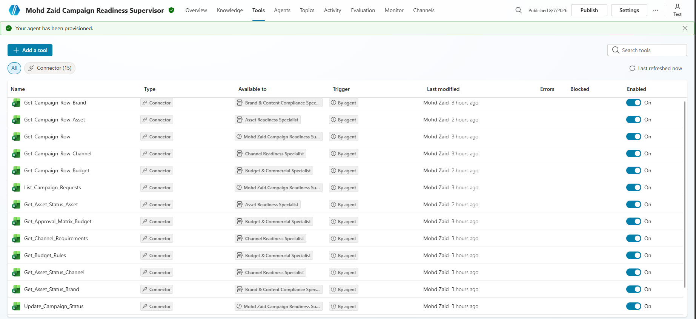
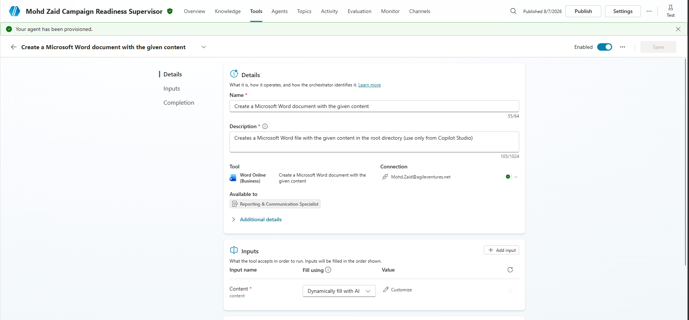
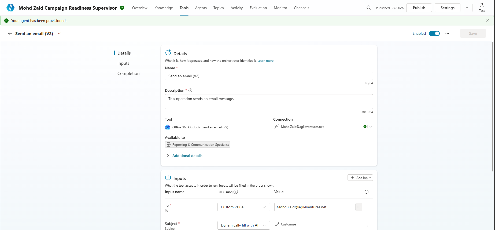

# Mohd Zaid Campaign Readiness Supervisor Agent 

## Overview

The Marketing Campaign Readiness Assessment Agent is a multi-agent solution built using Microsoft Copilot Studio. It automates the assessment of marketing campaigns before launch by validating campaign information, coordinating specialist evaluations, consolidating findings, generating readiness reports, and notifying stakeholders.

The solution follows a Supervisor–Specialist architecture where a single Supervisor Agent orchestrates multiple domain-specific Child Agents. Campaign data is retrieved from structured Excel datasets, governance policies are referenced through Knowledge Sources, and Microsoft Word and Outlook are used to generate reports and communicate results.

| Field            | Details                                 |
| ---------------- | --------------------------------------- |
| Project ID       | P2-005                                  |
| Participant Name | Mohd Zaid Ansari                        |
| Agent Name       | Mohd Zaid Campaign Readiness Supervisor |
| Agent-link       | [Agent](https://copilotstudio.microsoft.com/environments/Default-1e1572ff-a54c-4cd7-b2a9-20091afa5359/bots/4b343542-2792-f111-b8dc-000d3af21e08/overview )                         |

---

# Objectives

The solution aims to:

- Automatically detect campaigns awaiting assessment.
- Validate campaign information before assessment begins.
- Execute specialist assessments independently.
- Consolidate findings into a single readiness decision.
- Generate standardized readiness reports.
- Notify stakeholders automatically.
- Maintain governance and auditability.

---

# Architecture

The solution consists of:

- 1 Supervisor Agent
- 6 Child Agents
- 3 Topics
- 1 Recurrence Trigger
- Excel-based operational datasets
- Knowledge Sources
- Microsoft Word integration
- Outlook integration

---

# Components

## Supervisor Agent

Responsible for:

- Workflow orchestration
- Campaign lifecycle management
- Child agent coordination
- Conflict resolution
- Final readiness validation
- Report authorization
- Notification authorization

---

## Child Agents

- Budget & Commercial Specialist
- Brand & Content Compliance Specialist
- Channel Readiness Specialist
- Asset Readiness Specialist
- Launch Risk & Decision Specialist
- Reporting & Communication Specialist

Each specialist performs only its assigned responsibility.

---

# Data Sources

Operational data is stored in:

P2-005_Marketing_Campaign_Readiness_Lab_Data.xlsx

Major tables include:

- Campaign_Requests
- Budget_Rules
- Approval_Matrix
- Channel_Requirements
- Asset_Status

---

# Knowledge Sources

The solution uses:

- NovaSphere Brand & Content Guidelines
- NovaSphere Marketing Governance Policy

---

# Trigger

A Recurrence Trigger automatically starts the Supervisor Agent at a scheduled interval.

The Supervisor:

1. Retrieves campaign requests.
2. Selects the oldest Pending campaign.
3. Starts the readiness workflow.

---

# Workflow

High-level workflow:

Recurrence Trigger

↓

Supervisor

↓

Campaign Validation

↓

Budget Assessment

↓

Brand Assessment

↓

Channel Assessment

↓

Asset Assessment

↓

Launch Risk Assessment

↓

Supervisor Decision

↓

Report Generation

↓

Email Notification

↓

Campaign Status Update

---

# Screenshots

[image]
[image]
[image]
[image]
[image]
[image]
[image]
[image]
[image]

# Technologies

- Microsoft Copilot Studio
- Microsoft Excel Online
- Microsoft Word Online
- Office 365 Outlook

---

# Expected Outputs

The solution produces:

- Campaign readiness assessment
- Risk evaluation
- Approval recommendation
- Readiness report
- Stakeholder notification
- Updated campaign status

---

# Author

**Mohd Zaid Ansari**