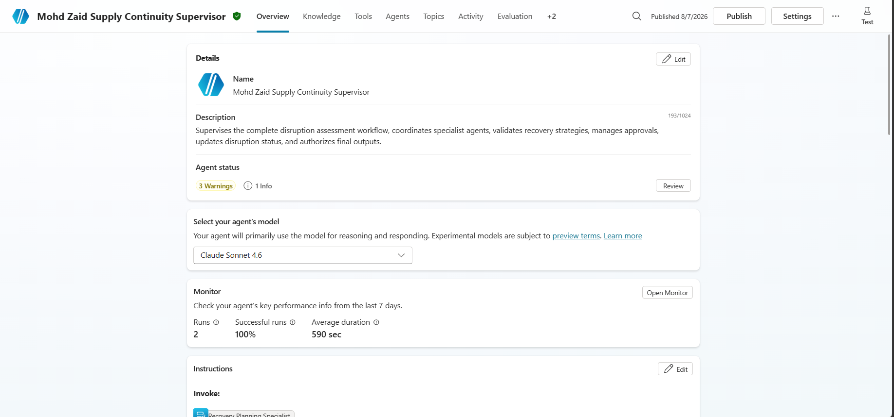
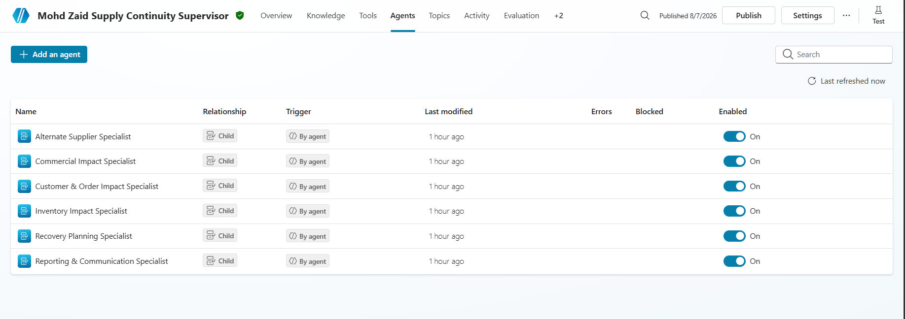
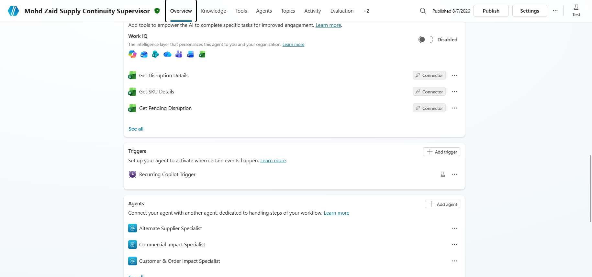
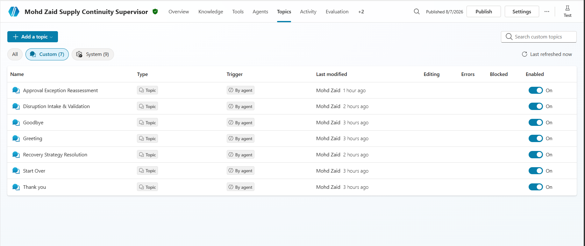
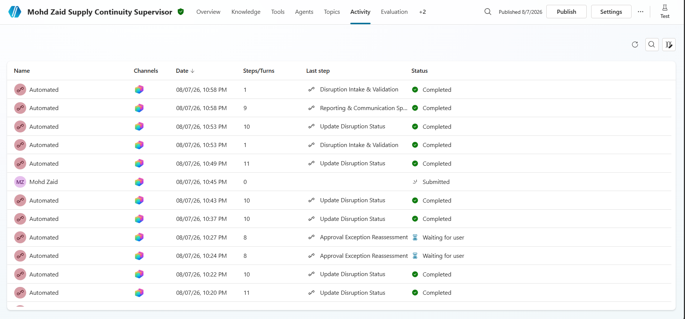
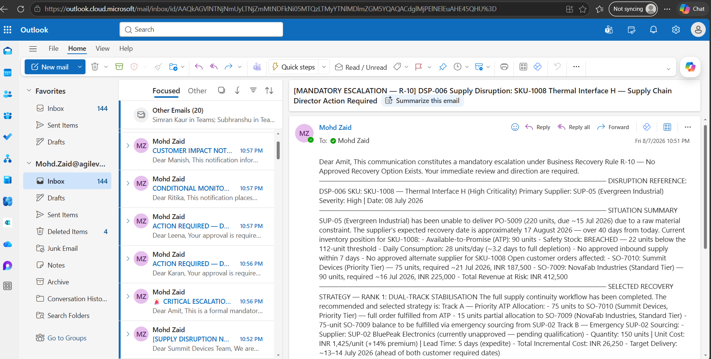
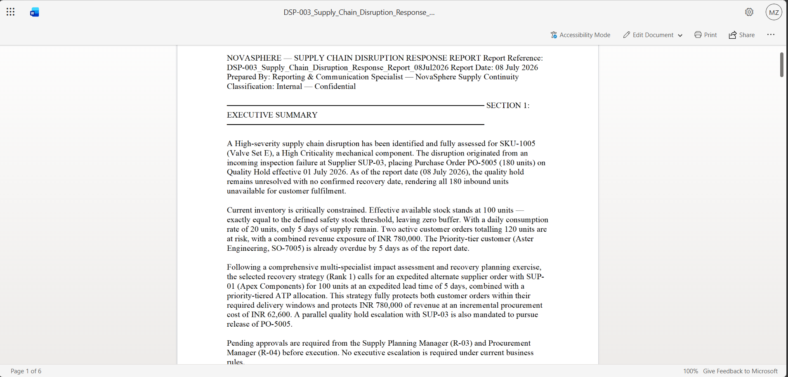
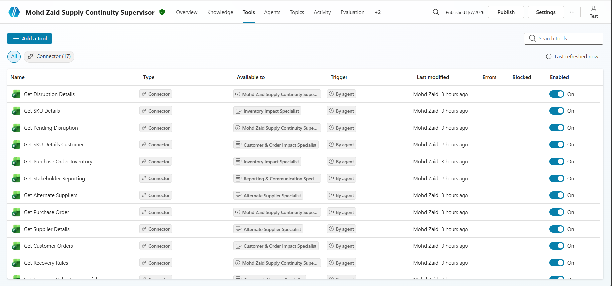
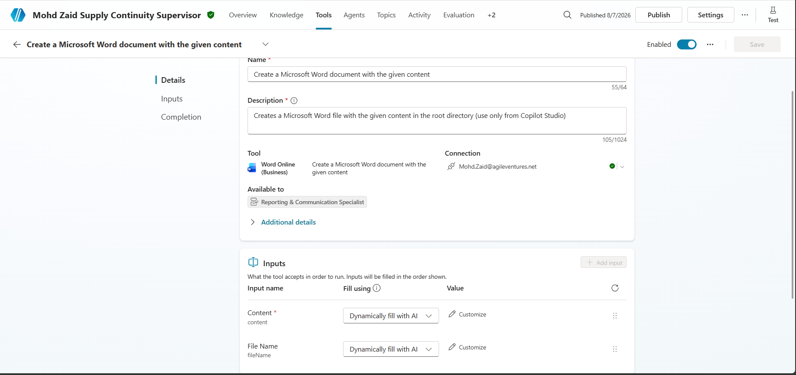
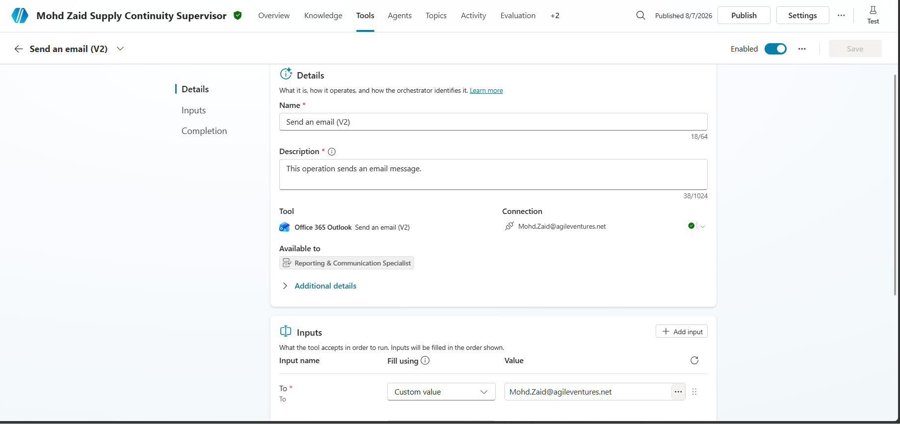

# NovaSphere Supply Chain Continuity Management System

## Overview

This project implements an AI-powered **Supply Chain Continuity Management System** using **Microsoft Copilot Studio**. The solution autonomously monitors supply disruptions, coordinates multiple AI specialist agents, evaluates business impacts, recommends recovery strategies, validates approval requirements, generates stakeholder reports, and updates disruption status.

The project follows a **multi-agent architecture**, where a **Supply Continuity Supervisor** orchestrates multiple specialist agents, reusable topics, and Excel Online (Business) tools.


| Field            | Details                                 |
| ---------------- | --------------------------------------- |
| Project ID       | P2-006                                 |
| Participant Name | Mohd Zaid Ansari                        |
| Agent Name       | Mohd Zaid Supply Continuity Supervisor |
| Agent-link       | [Agent](https://copilotstudio.microsoft.com/environments/Default-1e1572ff-a54c-4cd7-b2a9-20091afa5359/bots/a44f4141-6592-f111-b8dc-000d3af21e08/overview )                         |

---

# Project Objectives

- Automate supply disruption monitoring.
- Assess operational, inventory, supplier, customer, and commercial impacts.
- Recommend optimal recovery strategies.
- Validate approval requirements.
- Generate executive and stakeholder reports.
- Update disruption status automatically.
- Demonstrate autonomous orchestration using Microsoft Copilot Studio.

---

# Technology Stack

- Microsoft Copilot Studio
- Excel Online (Business)
- Microsoft 365
- Autonomous Recurrence Trigger
- Multi-Agent Orchestration
- AI Topics
- AI Tools

---

# Project Architecture

```
Recurrence Trigger
        │
        ▼
Supply Continuity Supervisor
        │
        ▼
Disruption Intake & Validation
        │
        ▼
Inventory Impact Specialist
        │
        ▼
Alternate Supplier Specialist
        │
        ▼
Customer & Order Impact Specialist
        │
        ▼
Commercial Impact Specialist
        │
        ▼
Recovery Planning Specialist
        │
        ▼
Recovery Strategy Resolution
        │
        ▼
Approval Exception Reassessment
        │
        ▼
Reporting & Communication Specialist
        │
        ▼
Update Disruption Status
```

---

# Screenshots

[image]
[image]
[image]
[image]
[image]
[image]
[image]
[image]
[image]
[image]

# Excel Workbook

```
P2-006_Supply_Chain_Continuity_Lab_Data.xlsx
```

Tables used:

- DisruptionRequestsTable
- SuppliersTable
- SKUMasterTable
- InventoryTable
- PurchaseOrdersTable
- CustomerOrdersTable
- AlternateSuppliersTable
- RecoveryRulesTable
- StakeholdersTable

---

# AI Agents

## Supervisor

- Mohd Zaid Supply Continuity Supervisor

Responsible for:

- Workflow orchestration
- Validation
- Agent coordination
- Recovery recommendation
- Approval validation
- Reporting
- Workflow completion

---

## Specialist Agents

### Inventory Impact Specialist

Analyzes inventory availability and stock risks.

### Alternate Supplier Specialist

Evaluates alternate supplier availability.

### Customer & Order Impact Specialist

Determines customer order impact.

### Commercial Impact Specialist

Assesses commercial and financial risks.

### Recovery Planning Specialist

Generates ranked recovery strategies.

### Reporting & Communication Specialist

Generates executive summaries and stakeholder communications.

---

# Supervisor Topics

## 1. Disruption Intake & Validation

Purpose

- Validate disruption requests.
- Retrieve disruption information.
- Verify purchase order information.

Tools

- /Get Pending Disruption
- /Get Disruption Details
- /Get Purchase Order

---

## 2. Recovery Strategy Resolution

Purpose

- Compare recovery strategies.
- Select the best recovery option.

---

## 3. Approval Exception Reassessment

Purpose

- Validate approval requirements.
- Review recovery rules.

Tool

- /Get Recovery Rules

---

# Excel Online (Business) Tools

| Tool | Excel Table |
|------|-------------|
| Get Pending Disruption | DisruptionRequestsTable |
| Get Disruption Details | DisruptionRequestsTable |
| Get Purchase Order | PurchaseOrdersTable |
| Get Inventory | InventoryTable |
| Get Supplier | SuppliersTable |
| Get Customer Orders | CustomerOrdersTable |
| Get Alternate Supplier | AlternateSuppliersTable |
| Get Recovery Rules | RecoveryRulesTable |
| Get Stakeholders | StakeholdersTable |
| Update Disruption Status | DisruptionRequestsTable |

---

# Trigger

This project uses the built-in **Recurrence Trigger** available in Microsoft Copilot Studio.

Purpose

- Monitor pending disruptions.
- Start the Supervisor workflow automatically.
- Process one disruption per execution.

---

# Workflow

1. Recurrence Trigger starts.
2. Supervisor begins orchestration.
3. Validate disruption.
4. Execute specialist agents.
5. Generate recovery strategy.
6. Resolve best strategy.
7. Validate approvals.
8. Generate reports.
9. Update disruption status.
10. End workflow.

---

# Testing

The project includes the following test scenarios.

- Successful workflow
- No pending disruptions
- Missing purchase order
- Missing supplier
- Alternate supplier available
- No alternate supplier
- High commercial risk
- Inventory shortage
- Approval required
- Report generation

---

# Folder Structure

```
p2-006_supply_chain_disruption_order_continuity/
│
├── README.md
├── solution-summary.md
├── architecture.md
├── orchestration-patterns.md
├── supervisor-agent-design.md
├── specialist-agent-design.md
├── custom-topics.md
├── autonomous-trigger.md
├── decision-rules.md
├── test-report.md
├── known-limitations.md
├── ai-usage-declaration.md
│
├── data/
│   └── dataset-notes.md
│
└── screenshots/
├── supervisor-agent.png
├── child-agents.png
├── recurrence-trigger.png
├── intake-validation-topic.png
├── fan-out-specialists.png
├── fan-in-consolidation.png
├── recovery-strategy-topic.png
├── approval-reassessment-topic.png
├── excel-tools.png
├── word-tool.png
├── outlook-tool.png
└── final-response.png
```

---

# Key Features

- Autonomous AI workflow
- Multi-agent orchestration
- Excel Online (Business) integration
- Autonomous recurrence trigger
- Recovery strategy recommendation
- Approval validation
- Executive reporting
- Automatic disruption status updates

---

# Future Enhancements

- Microsoft Teams integration
- Power BI dashboards
- Azure AI Search
- Dataverse integration
- SAP/ERP connectivity
- Predictive disruption analytics

---

# Author

**Mohd Zaid Ansari**