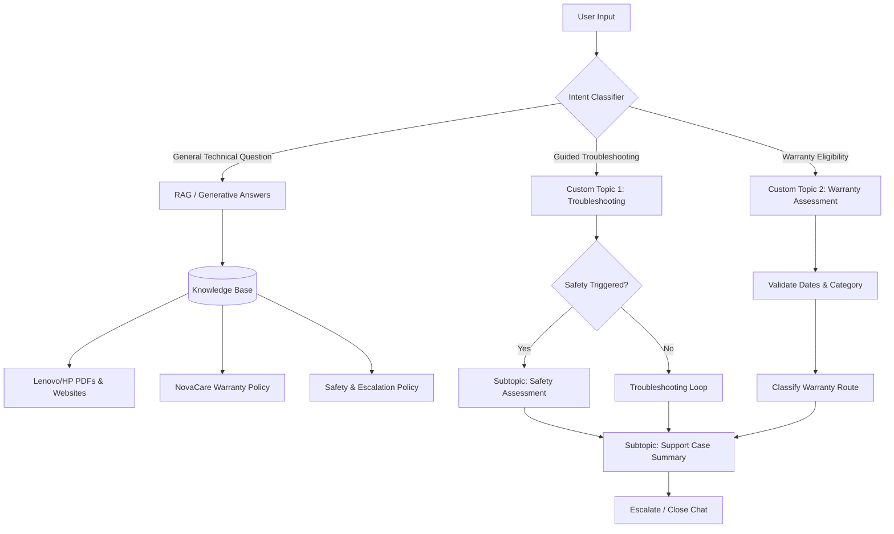

# Solution Summary

This document provides a high-level summary of the **NovaRetail Support and Warranty Assistant** solution, highlighting the business objectives, user profiles, technical architecture, and implementation decisions.

---

## 1. Business Problem and Target Users

### Business Problem
NovaRetail Technologies Pvt. Ltd. experienced a high volume of repetitive customer support requests regarding device setup, hardware troubleshooting (such as blank displays, power failures, and paper jams), and warranty eligibility checks. This created several challenges:
- High workload for support agents handling routine queries.
- Risks of customers performing unsafe troubleshooting (e.g. dismantling power chargers).
- Inconsistent application of the NovaCare warranty policy and duration rules.
- Human errors in distinguishing manufacturing defects from exclusions like accidental or liquid damage.

### Target Users
- **NovaRetail Customers:** Seeking fast, self-service support for setup, technical troubleshooting, and warranty checks.
- **NovaRetail Support Agents:** Receiving escalated, structured case summaries for complex technical issues (Level 2), warranty disputes (Level 3), or safety-critical situations (Level 4).

---

## 2. Product Portfolio and Scope

The chatbot support scope is restricted to:
- **Laptops:** Lenovo ThinkPad E14 Gen 5 (and E16 Gen 1 User Guide reference).
- **Printers:** HP LaserJet Pro MFP M428-M429.
- **Laptop Accessories:** Bundled charger (connection, power-delivery, visible-damage).
- **Printer Accessories:** Bundled power cable (connection, damage check).
- **Consumables:** Printer toner and paper (supported for setup/wear queries, but excluded from warranty coverage).

All other models or product families are classified as **out-of-scope** and route to Level 2 technical support.

---

## 3. Knowledge and Topic Architecture

The solution uses a hybrid architecture combining **Retrieval-Augmented Generation (RAG)** for unstructured content and **Custom Conversational Flows** for structured policy evaluation.

### Core Capabilities
1. **Safety Triage & Controls:** Prioritizes customer safety by performing checks before troubleshooting and routing Level 4 hazards immediately.
2. **Grounded RAG Answers:** Uses official Lenovo and HP user guides to answer general inquiries while enforcing source precedence.
3. **Controlled Troubleshooting Loops:** Guides the customer step-by-step up to a maximum of 3 attempts, exiting when resolved, cancelled, or if a hazard is detected.
4. **Structured Warranty Logic:** Automatically evaluates product age, validates dates, handles DOA, checks exclusions, and classifies eligibility.
5. **Cross-Topic Redirection:** Smoothly transitions between troubleshooting and warranty assessments while reusing variables to avoid duplicate questioning.

---

## 4. Key Implementation Decisions

- **Unauthenticated Public Canvas:** The assistant is hosted on a public Copilot Studio Demo Website for accessibility.
- **Power Fx Date Arithmetic:** Formulated date validation rules to ensure purchase dates are not in the future and calculate precise product age in months.
- **Validation Blocks:** Implemented strict validation checks for `Yes/No` inputs and choice entities, preventing progression on invalid data.
- **Level 3 Repeat-Repair Escalation:** Defined logic to automatically route customers to a Warranty Specialist if they report the same issue returning after two prior repairs.
- **Disclaimer Banner:** Mandated a preliminary-assessment disclaimer at the end of the warranty assessment to manage customer expectations and protect the company from legal liability.
