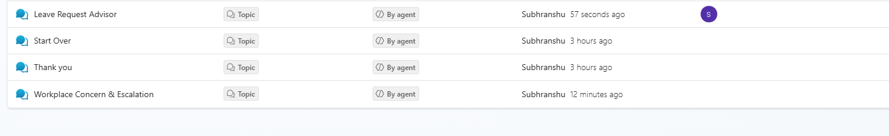
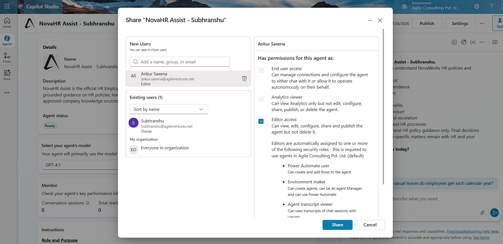
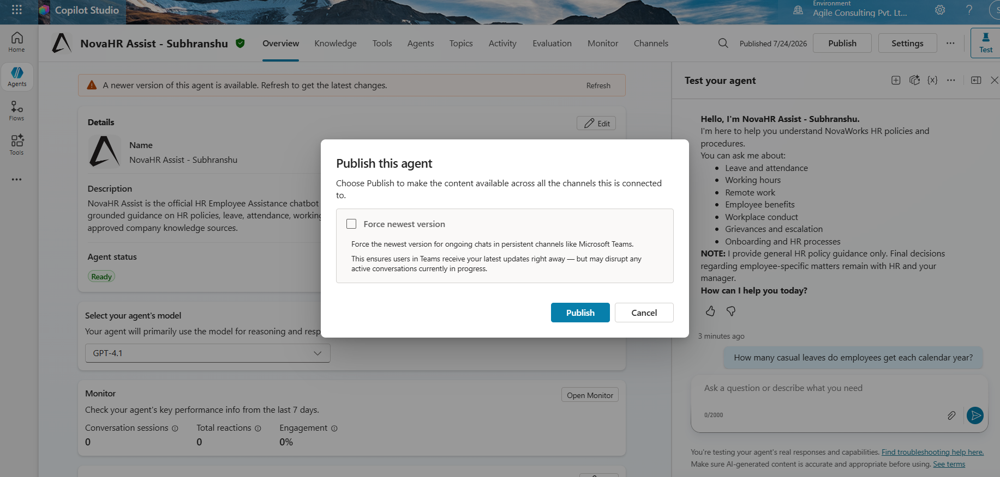

# Screenshots

The following screenshots are included in the project submission.

---

## Agent Configuration

- Agent Overview and Agent Identity

- Agent Instructions

.png>) 
.png>) 
.png>) 
.png>) 
.png>) 
.png>) 
.png>) 
.png>) 
.png>)

---

## Knowledge Sources

- NovaWorks HR Policy Addendum, IIMA HR Policy Manual and University of Rochester HR Website

---

## Leave Request Advisor and Workplace Concern & Escalation

---

## Conditional Branches

.png>) 
.png>)

---

## Conversation Example

---

## Publishing

- Published Agent and Sharing

 

---