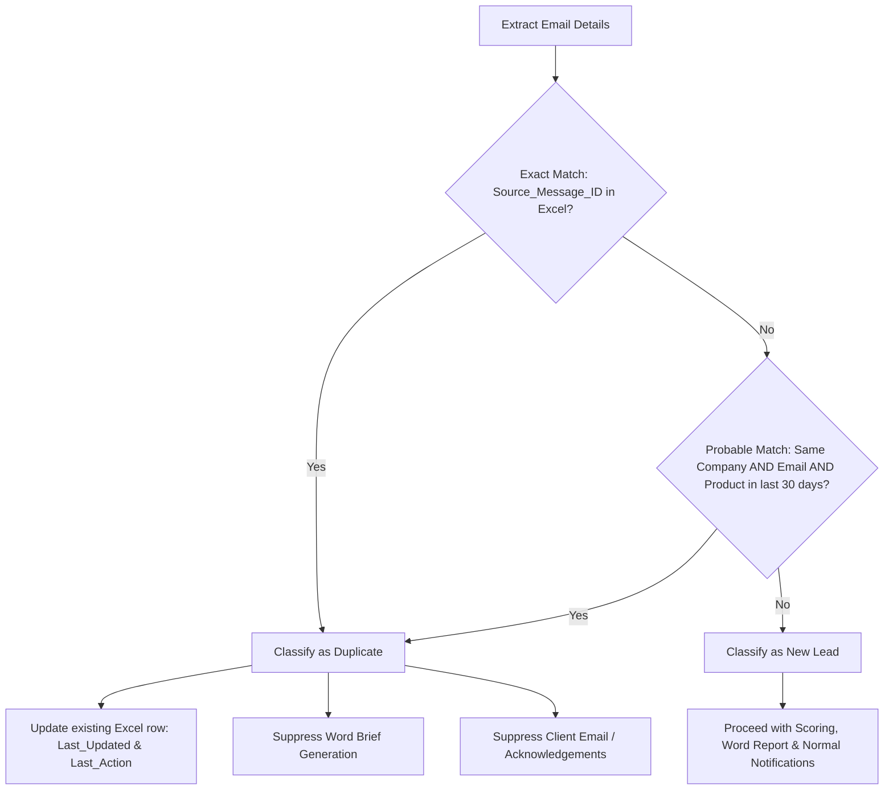

# Qualification Logic Design

# P2-003 Autonomous Sales Lead Qualification Agent

---

## 1. Lead Normalization Rules

Before applying scoring or duplicate detection, the agent normalizes extracted email inputs to match corporate reference schemas:

- **Country Normalization:** Countries are cross-referenced with `TerritoryOwnersTable`. Exact match is required (e.g., `United Kingdom` maps to territory `UK & Ireland`). Mismatched or missing countries default to `Other` territory with `Territory_Status = Management Review` and are routed to Sales Operations.
- **Product Normalization:** Customer inquiries are mapped to canonical product names in `ProductCatalogTable` (e.g. "proposal automation" maps to `Autonomous Sales Operations Agent`). If no matching product is found, it is mapped to `Product not identified` with `Product_Fit = Unsupported` (triggering Human Review).
- **Company Size Categorization:**
  - `Enterprise`: 1,000+ employees
  - `Mid-Market`: 200 - 999 employees
  - `SMB`: 20 - 199 employees
  - `Startup/Micro`: < 20 employees
- **Decision Role Categorization:**
  - `Decision Maker`: Contact is a budget holder or final approver (e.g., CIO, CTO, Founder, CDO, VP).
  - `Strong Influencer`: Contact can shape decision but cannot approve (e.g., Operations Director, Manager, Lead).
  - `Researcher/User`: Contact is an early-stage evaluator or end-user (e.g., Student, Analyst, Administrator).
  - `Unknown`: Stated role is missing or cannot be inferred.
- **Missing Value Handling:** Missing budget and timeline remain `unknown` rather than defaulting to zero. This allows the scoring system to award `0` points for that dimension without causing calculation failures.

---

## 2. Multi-Factor Scoring Framework

The agent calculates a total qualification score up to **100 points** based on the following rules:

| Scoring Dimension | Band or Value | Points | Rule Condition |
|---|---|---|---|
| **Product Fit (Max 20)** | Strategic | 20 | Direct match to a strategic NovaWorks offering. |
| | Standard | 12 | Valid but non-strategic or smaller engagement (e.g. Workshop). |
| | Limited | 5 | Partial match; requires discovery. |
| | Unsupported | -20 | No supported offering or non-sales requirement. |
| **Budget Viability (Max 20)**| At or above minimum | 20 | Budget meets or exceeds canonical minimum budget in catalog. |
| | 75% to below minimum | 15 | Potentially viable with scope adjustment. |
| | 50% to below 75% | 10 | Material budget gap. |
| | Below 50% of minimum | 4 | Low commercial viability. |
| | Unknown | 0 | Budget information is missing. |
| **Purchase Timeline (Max 15)**| 0–30 days | 15 | Immediate purchase window. |
| | 31–90 days | 10 | Near-term purchase window. |
| | 91–180 days | 5 | Medium-term purchase window. |
| | Over 180 days or unknown| 0 | Long-term or missing timeline. |
| **Decision Role (Max 15)** | Decision Maker | 15 | Budget holder or final approver. |
| | Strong Influencer | 8 | Can shape the decision but cannot approve. |
| | Researcher/User | 3 | Early-stage evaluator or end user. |
| | Unknown | 0 | Role is missing or unclear. |
| **Company Size (Max 10)** | Enterprise | 10 | 1,000 or more employees. |
| | Mid-Market | 7 | 200–999 employees. |
| | SMB | 4 | 20–199 employees. |
| | Startup/Micro | 2 | Fewer than 20 employees. |
| **Territory (Max 10)** | Supported | 10 | Mapped sales owner is available. |
| | Management Review | 5 | Requires sales operations review. |
| **Lead Source (Max 5)** | Executive/Partner | 5 | High-trust referral source. |
| | Customer/Event | 4 | Known or engaged source. |
| | Website/Inbound | 3 | Standard inbound lead. |
| | Cold/Unknown | 1 | Unverified or low-context source. |
| **Completeness (Max 5)** | All mandatory | 5 | No mandatory information missing. |
| | 1 or 2 fields missing | 3 | Follow-up can resolve gaps. |
| | 3 or more missing | 0 | Insufficient info for autonomous qualification. |

---

## 3. Classification Thresholds

The total calculated score determines the primary classification:

- **Hot:** Score **85–100** (with no exception condition).
- **Qualified:** Score **70–84** (with no exception condition).
- **Nurture:** Score **50–69**.
- **Low Priority:** Score **below 50** or triggered by commercial viability overrides.

---

## 4. Exception Overrides & Safety Rules

To protect margins and ensure operational safety, the agent applies three overrides:

1. **Commercial Viability (Startup/Micro) Override:**
   - *Condition:* If Company Size = `Startup/Micro` AND the extracted budget is less than 50% of the canonical minimum budget.
   - *Logic:* The lead is forced to `Low Priority` regardless of the overall score.
2. **Competitor & Security Risk Override:**
   - *Condition:* If the sender's organization is identified as a competitor (e.g. `Rival AI`) or the body requests sensitive IP (pricing models, margin models, delivery architectures).
   - *Logic:* The lead is immediately classified as `Human Review Required`, routing to Sales Operations. All external emails are blocked.
3. **Unmapped Territory/Product Exception:**
   - *Condition:* If Country resolves to `Other` (Management Review) or Product Fit is `Unsupported`.
   - *Logic:* Classified as `Human Review Required`.
4. **Low Confidence Assessment:**
   - *Condition:* If the AI model's assessment confidence is `Low` or critical fields contain conflicting data.
   - *Logic:* Routed to `Human Review Required` and blocks external communications.

---

## 5. Duplicate Detection & Prevention Logic

To maintain a clean database and prevent redundant communications, the agent runs a two-step duplicate validation before writing new entries:

This prevents multiple sales representatives from acting on the same inquiry and ensures prospects do not receive repetitive auto-responses.
