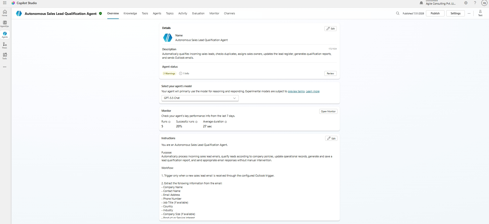
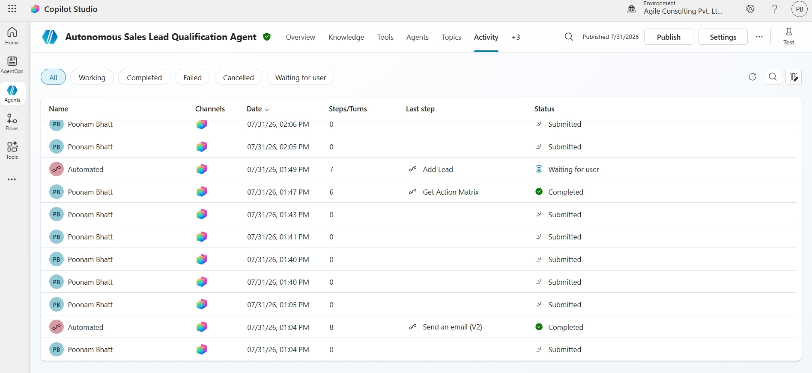
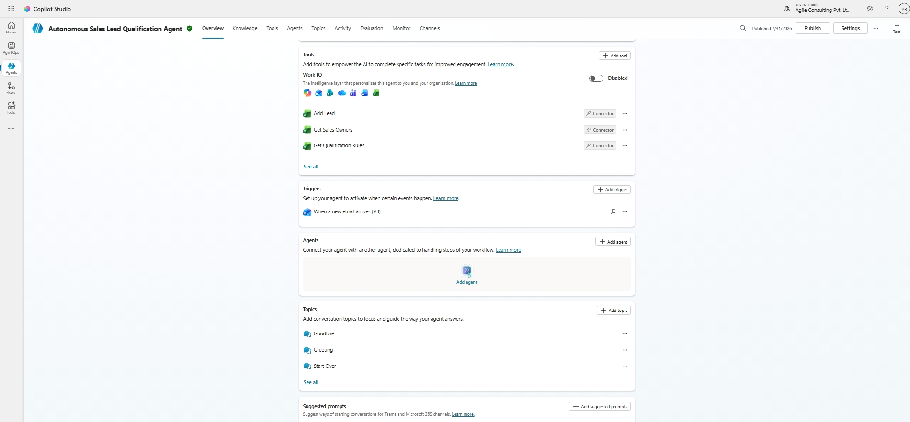
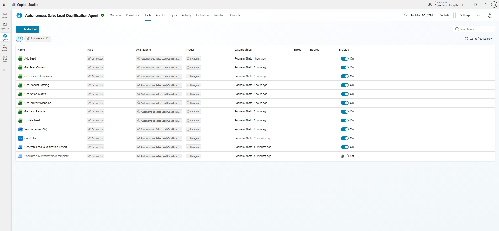
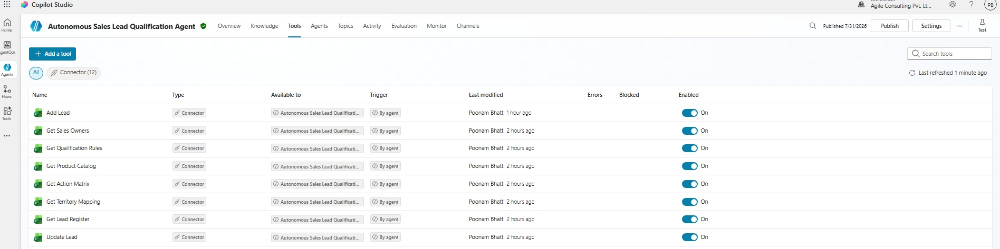
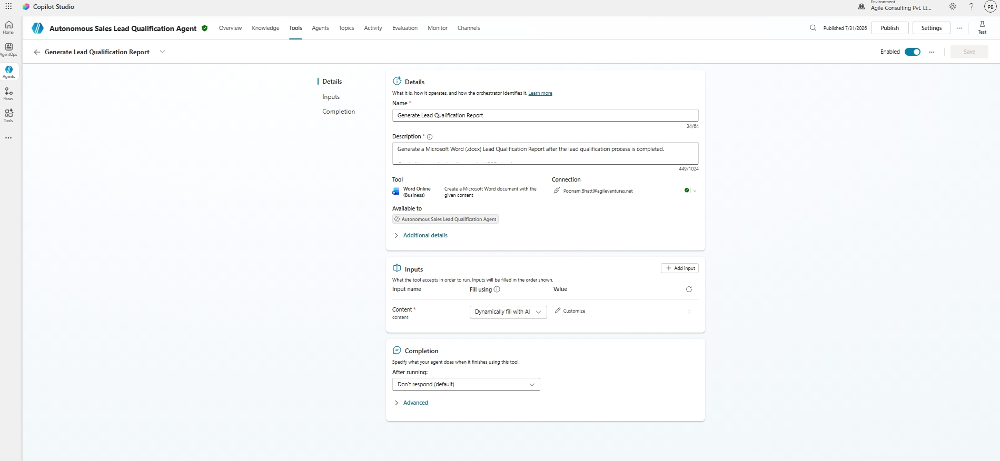
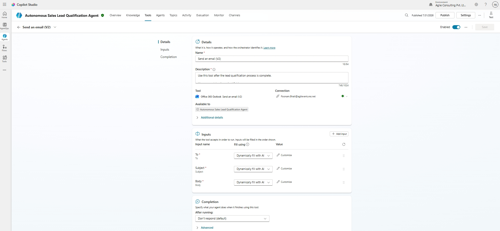
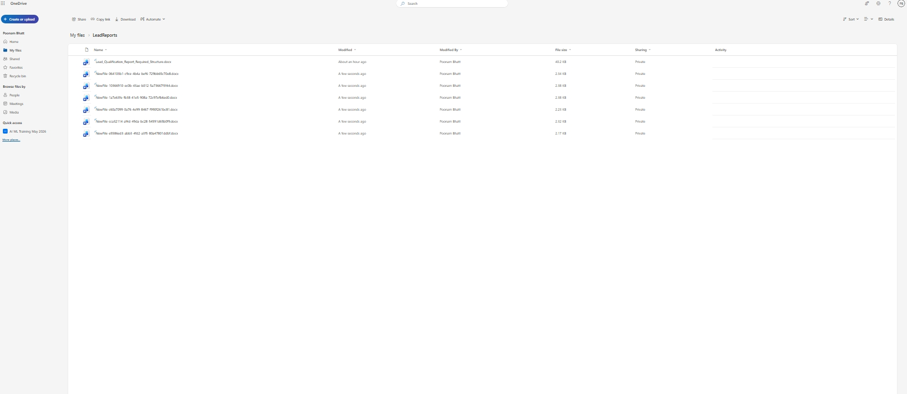
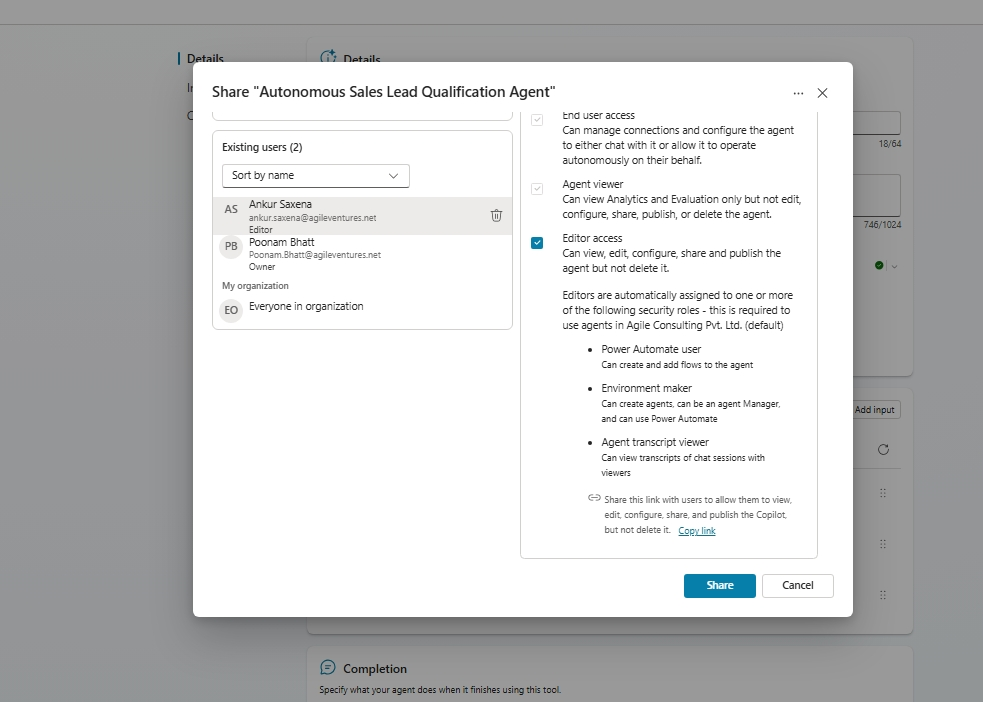

# Required Screenshots Directory

This directory is prepared for committing the required visual evidence of your Copilot Studio build to GitHub. Please capture the following screenshots from your Copilot Studio interface, name them exactly as listed below, and save them in this folder.

---

## Required Screenshot List

### 1. `agent-overview.png`

### 2. `generative-orchestration.png`

### 3. `outlook-trigger.png`

### 4. `tools-list.png`

### 5. `excel-configuration.png`

### 6. `word-configuration.png`

### 7. `outlook-configuration.png`

### 8. `successful-run.png`

### 10. `generated-word-report.png`

### 11. `published-agent.png`

---

