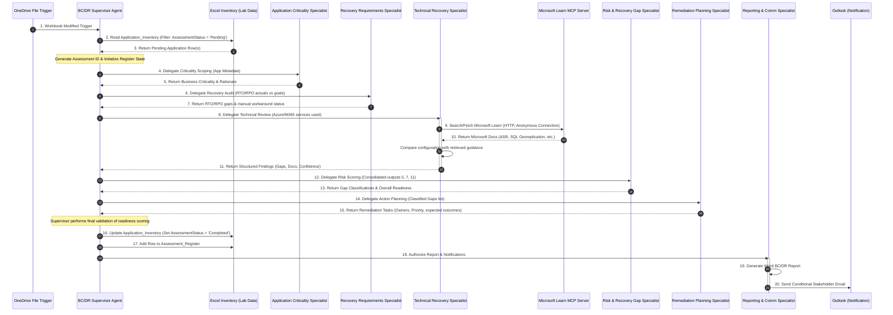

# System Architecture

# P2-004: Autonomous Multi-Agent BC/DR Readiness System

## 1. Multi-Agent System Overview
The **P2-004 Autonomous BC/DR Readiness System** is built on a **Supervisor-Specialist** design pattern within Microsoft Copilot Studio (2026 Modern Experience), utilizing connected agents (skills) and generative orchestration.

The architecture is split into two branches:
- **Left Branch (Data & Control Flow)**: Responsible for the autonomous OneDrive file modification trigger, reading pending items from the consolidated workbook `P2-004_BCDR_Lab_Data.xlsx`, writing completed audits back to the register, and generating report files.
- **Right Branch (MCP Grounding & Communication)**: Responsible for connecting to the external Microsoft Learn MCP Server under the Technical Recovery Specialist, and managing Outlook stakeholder notifications.

---

## 2. System Architecture Diagram

Below is the sequence diagram showing how the OneDrive file modification trigger initiates the assessment and how the Supervisor coordinates the connected specialist agents:

---

## 3. Component Details & Responsibilities

### 3.1 Orchestration Path (BC/DR Supervisor Agent)
- **Trigger Check**: Executed automatically by the **When a file is modified (OneDrive for Business)** trigger. It reads the inventory table and processes only rows marked `Pending`.
- **Delegation**: Instead of performing calculations, the Supervisor routes structured JSON payloads containing relevant context variables to connected specialist agents.
- **Conflict Resolution**: Applies overrides (e.g. defaulting to the highest risk classification when specialists diverge).
- **Validation**: Checks for missing specialist results, network failures (handling `Technical evidence unavailable`), and assigns readiness.
- **Register Update**: Updates the inventory row status to `Completed` and appends a row to the register.

### 3.2 Specialist Branch (Connected Agents)
- **Application Criticality Specialist**: Uses business parameters (user count, customer-facing, regulatory impact, etc.) to scope business importance.
- **Recovery Requirements Specialist**: Detects logical contradictions like critical workloads missing RTO/RPO goals or slow recovery targets in parent dependencies.
- **Technical Recovery Specialist**: Invokes the Microsoft Learn MCP Server and compares hosting configurations (e.g. Azure SQL, Azure VM) against live guidance. It returns a strict, structured layout (Technology Evaluated, Gaps, Recommendations, Evidence Status, and Confidence Level).
- **Risk & Recovery Gap Specialist**: Categorizes risks from Critical to Low and calculates the final readiness level.
- **Remediation Planning Specialist**: Creates distinct remediation cards mapping directly to identified gaps.
- **Reporting & Communication Specialist**: Uses Word integration to format the executive report, and executes email logic based on readiness (e.g. Routine completion notification vs. Management escalation).
