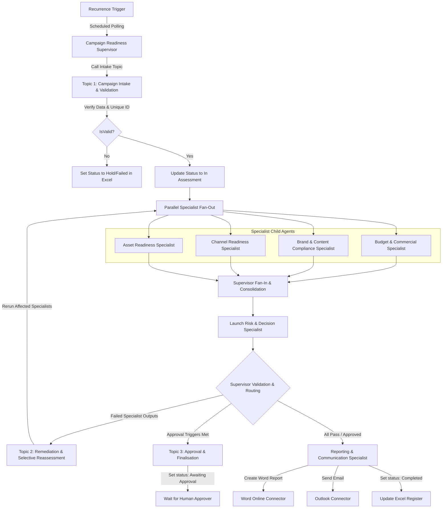

# System Architecture & Technical Specifications

## 1. Multi-Agent System Design
The solution is built as an autonomous multi-agent system on Microsoft Copilot Studio. It leverages a parent-child relationship where the **Campaign Readiness Supervisor Agent** coordinates a roster of specialized child agents.

## 2. Agent Scoping and Separation of Duties
To prevent orchestrator confusion and comply with narrow tool-scoping, each child agent has access only to its specific knowledge and tools:
*   **Supervisor (Parent):** Overall orchestration, state control, conflict resolution, and final readiness classification.
*   **Budget Specialist:** Audits financial data against budget rules and the approval matrix.
*   **Brand Specialist:** Grounded in brand guidelines. Audits product naming, regulatory claims, and sensitivity.
*   **Channel Specialist:** Audits channel-specific launch lead times and tracking pixels.
*   **Asset Specialist:** Audits availability and QA status of creative assets.
*   **Risk Specialist:** Consolidates reviews and proposes risk levels.
*   **Reporting Specialist:** Triggers Word document creation and Outlook notifications.

## 3. Data Integration Layer
The system uses the native **Excel Online (Business)** connector to read and write data to the SharePoint/OneDrive workbook. The Supervisor uses specific connector operations (`Get Pending Campaign`, `Record Campaign Assessment`) to maintain campaign status without requiring any external Power Automate workflows.
