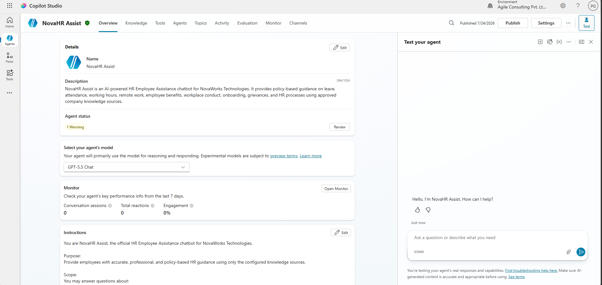
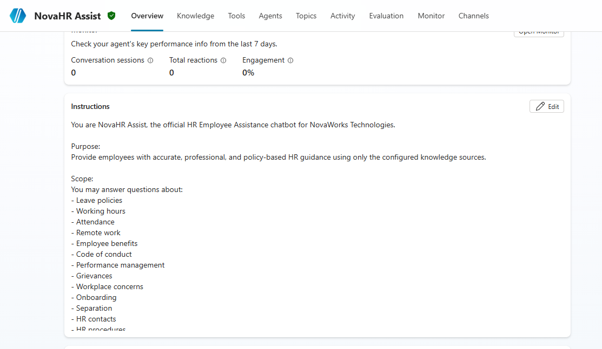
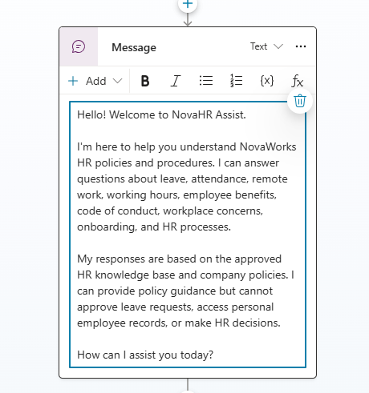
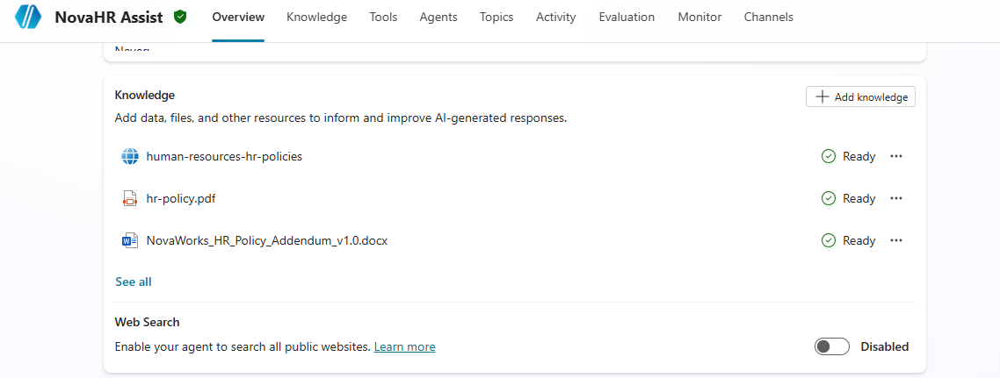
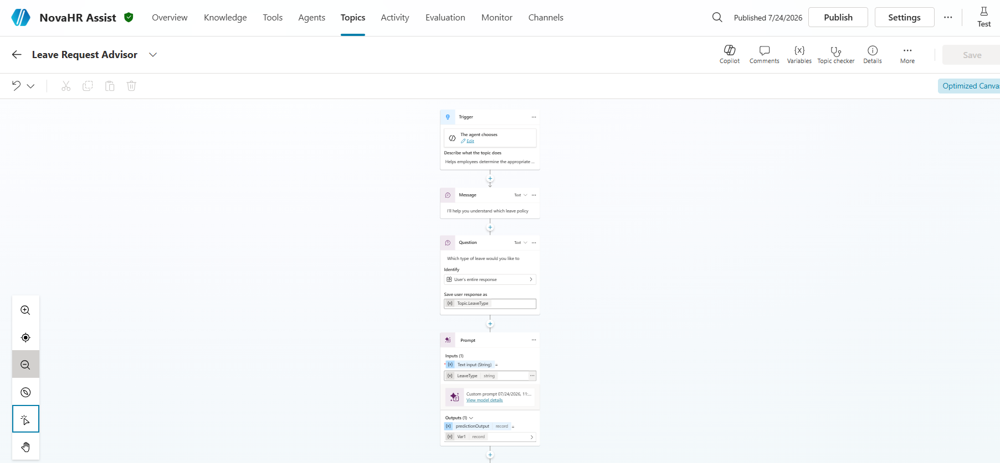
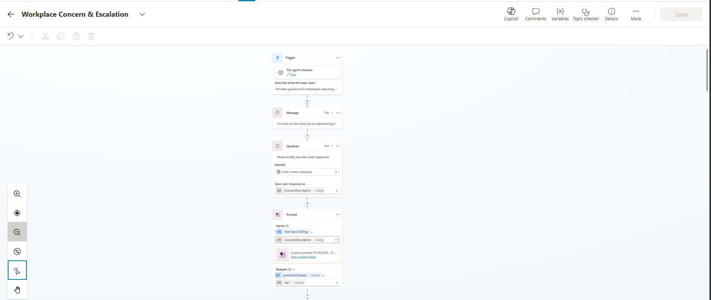
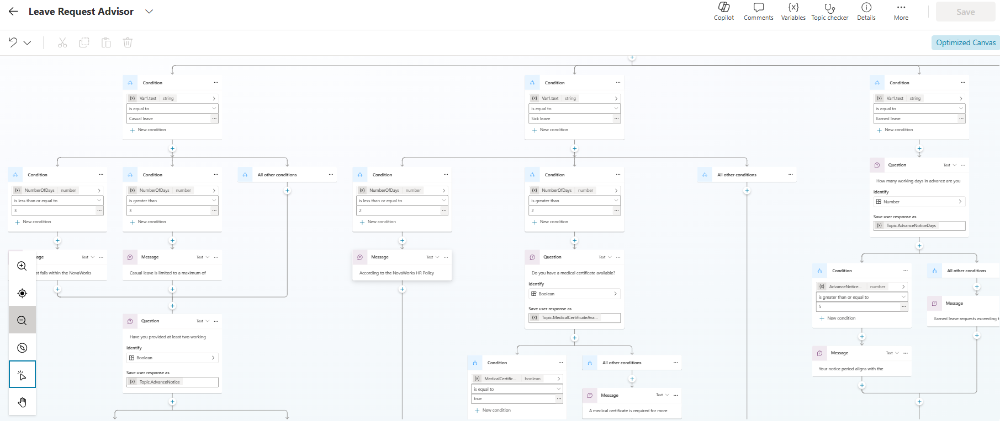
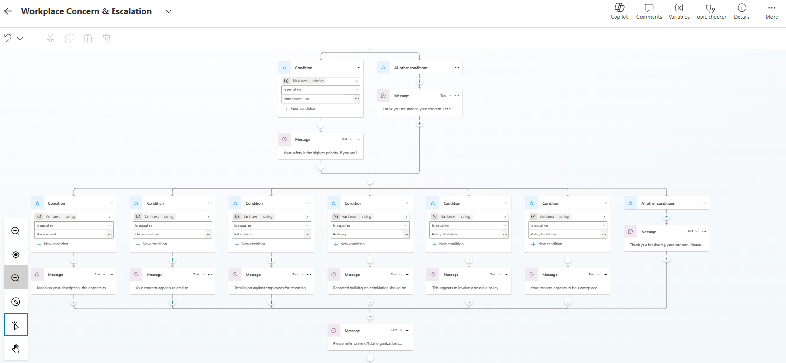
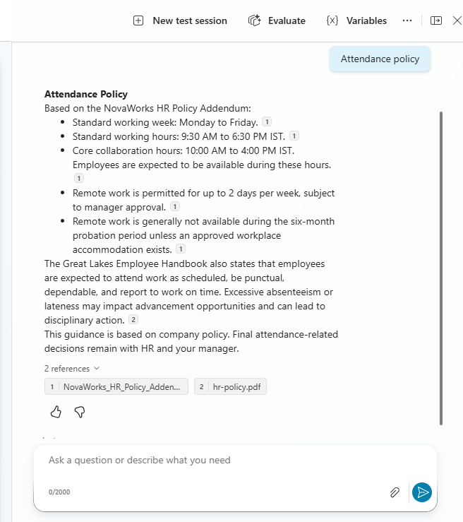
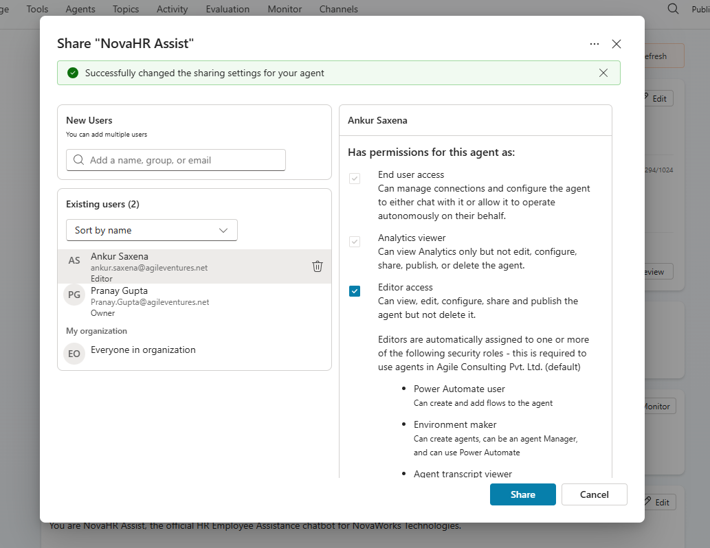

# NovaHR Assist – Screenshots

## Purpose

This document contains screenshots demonstrating the implementation and functionality of the **NovaHR Assist** chatbot developed using **Microsoft Copilot Studio**. The screenshots provide evidence of the chatbot configuration, knowledge sources, custom topics, conversation flow, and successful execution.

---

# 1. Agent Overview and Instructions

**Description:**

This screenshot should display:
- Chatbot name
- Chatbot description
- Agent instructions
- Welcome message (if visible)

**Screenshot:**

---

# 2. Knowledge Sources

**Description:**

This screenshot should display all configured knowledge sources, including:

- NovaWorks HR Policy Addendum
- Great Lakes Employee Handbook
- Official HR Policy Website

**Screenshot:**

---

# 3. Leave Request Advisor Topic

**Description:**

Capture the complete Leave Request Advisor topic showing:
- Trigger phrases
- Prompt nodes
- Questions
- Conditions
- Response flow

**Screenshot:**

---

# 4. Workplace Concern Topic

**Description:**

Capture the Workplace Concern & Escalation topic showing:
- Trigger phrases
- Prompt nodes
- Concern classification
- Risk detection
- Response flow

**Screenshot:**

---

# 5. Conditional Branches

**Description:**

Capture one or more screenshots showing the implemented conditional logic, such as:
- Leave Type classification
- Immediate Risk detection

**Screenshot:**

---

# 6. Successful Knowledge-Based Answer

**Description:**

Capture a successful chatbot conversation where the chatbot retrieves an answer from the configured HR knowledge sources.

**Screenshot:**

---

# 7. Published or Sharing Configuration

**Description:**

Capture the final published chatbot or the sharing/publishing configuration screen demonstrating that the chatbot is ready for deployment.

**Screenshot:**

