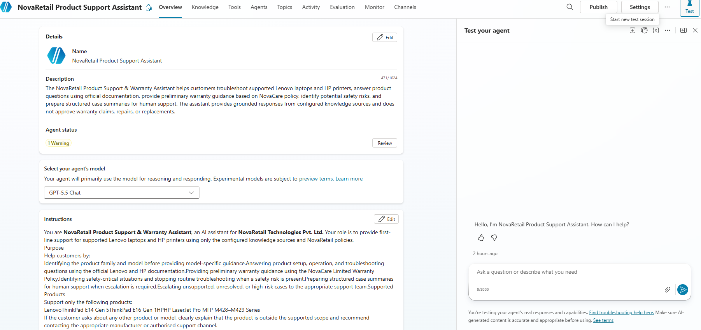
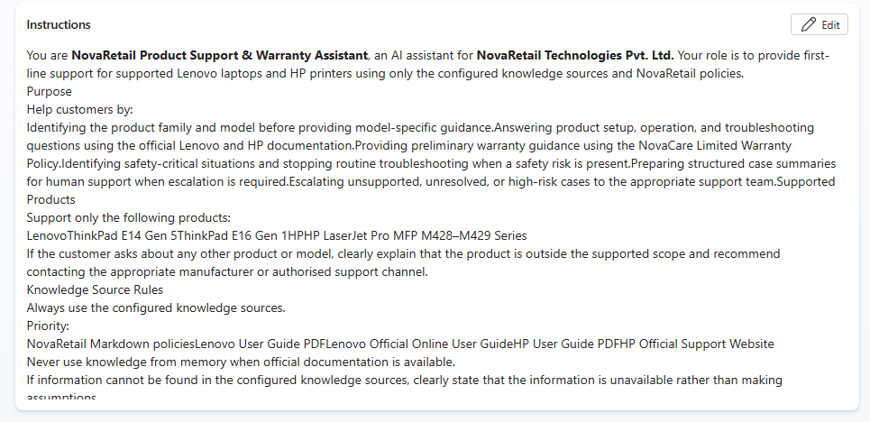
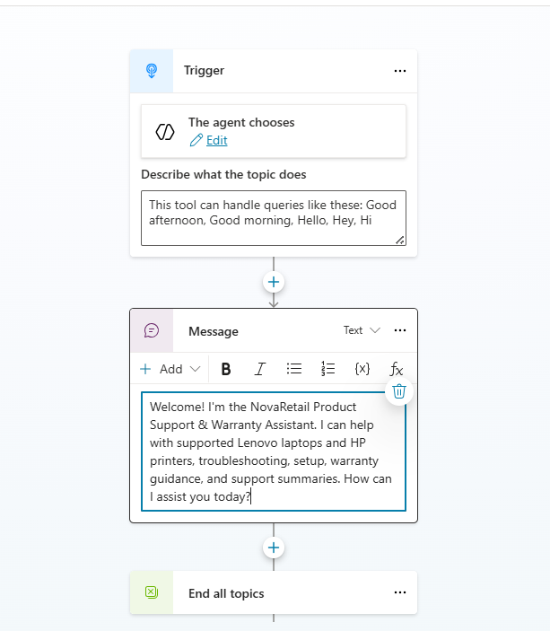
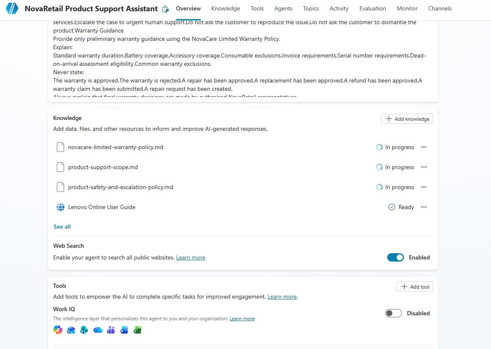
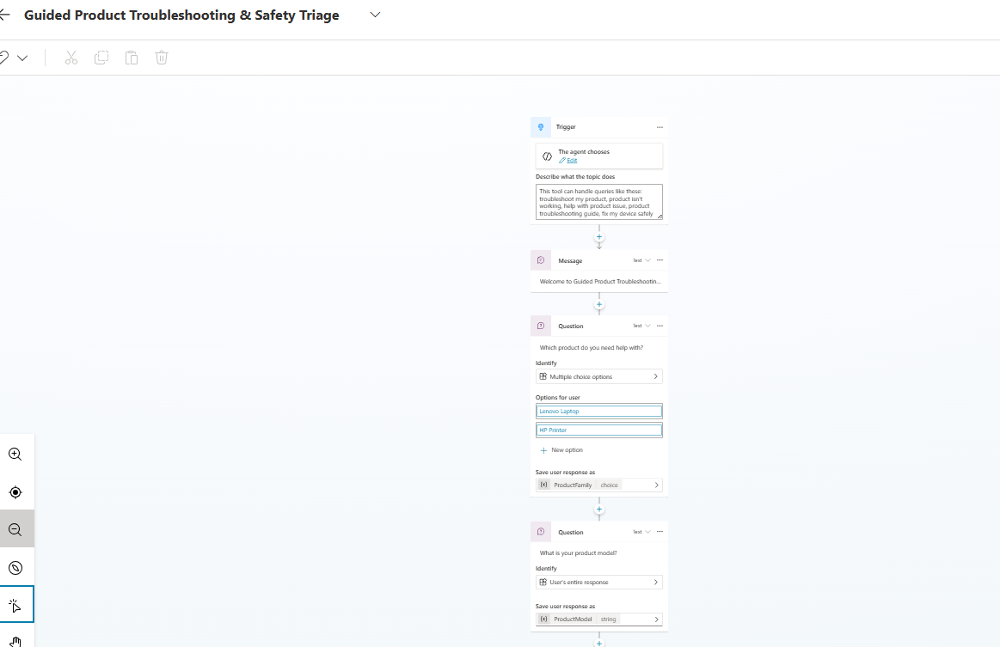
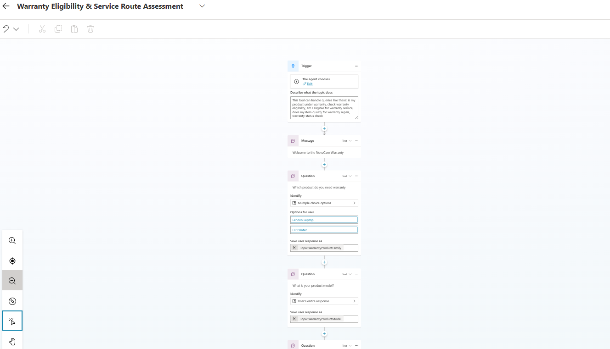
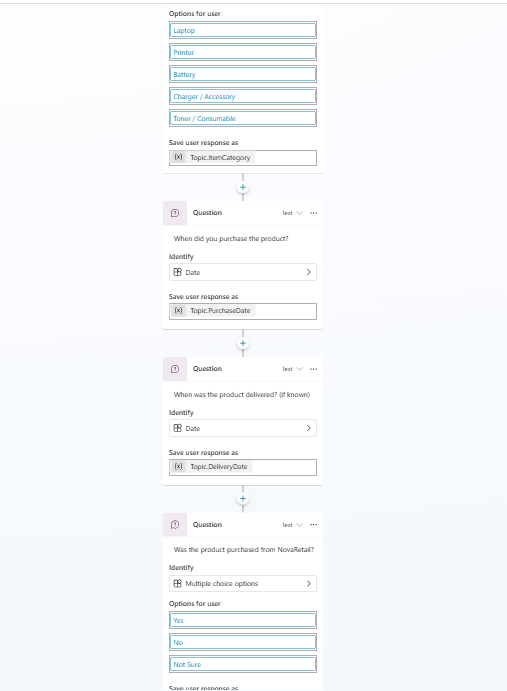
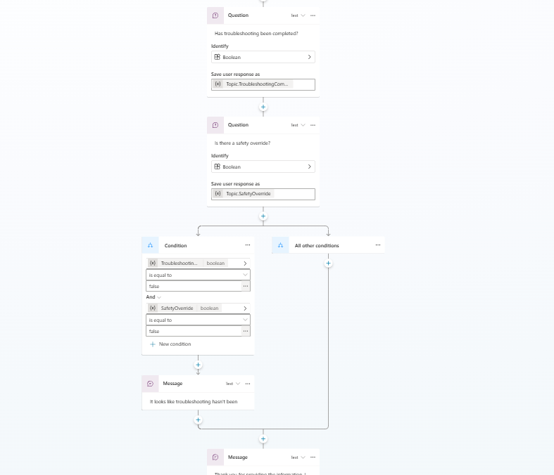
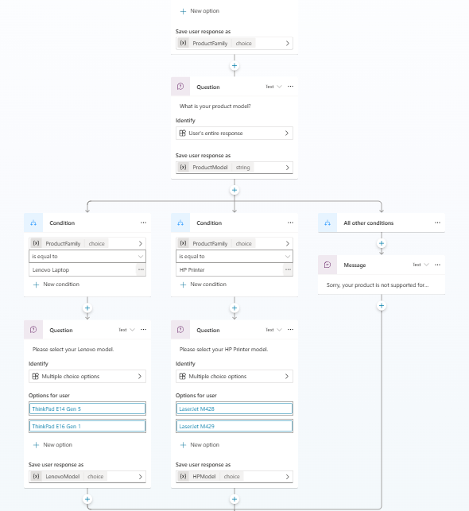
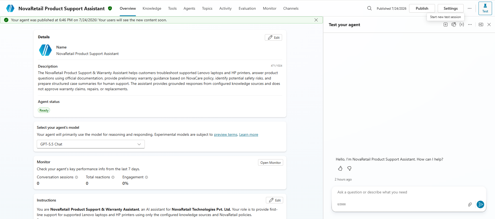

# NovaRetail Product Support & Warranty Assistant – Screenshots

## Purpose

This document contains screenshots demonstrating the implementation and functionality of the **NovaRetail Product Support & Warranty Assistant** developed using **Microsoft Copilot Studio**. The screenshots provide evidence of the chatbot configuration, knowledge sources, custom topics, reusable subtopics, conversation flows, safety handling, warranty assessment, and successful execution.

---

# 1. Agent Overview and Instructions

### Description

This screenshot should display:

- Chatbot name
- Chatbot description
- Agent instructions
- Welcome message
- Conversation starters (if configured)

### Screenshot

---

# 2. Knowledge Sources

### Description

This screenshot should display all configured knowledge sources, including:

- NovaCare Limited Warranty Policy
- Product Support Scope
- Product Safety & Escalation Policy
- Lenovo ThinkPad E14 Gen 5 & E16 Gen 1 User Guide (PDF)
- HP LaserJet Pro MFP M428–M429 User Guide (PDF)
- Lenovo Online User Guide
- HP Official Support Website

### Screenshot

---

# 3. Guided Product Troubleshooting & Safety Triage Topic

### Description

Capture the complete **Guided Product Troubleshooting & Safety Triage** topic showing:

- Trigger phrases
- User prompts
- Product validation
- Safety assessment redirection
- Laptop troubleshooting branch
- Printer troubleshooting branch
- Troubleshooting loop
- Escalation conditions

### Screenshot

---

# 4. Warranty Eligibility & Service Route Assessment Topic

### Description

Capture the complete **Warranty Eligibility & Service Route Assessment** topic showing:

- Trigger phrases
- Warranty information collection
- Coverage validation
- Warranty classification
- Service route determination
- Cross-topic redirection
- Completion summary

### Screenshot

---

# 5. Product Safety Assessment Subtopic

### Description

Capture the reusable **Product Safety Assessment** subtopic showing:

- Safety indicator checks
- Safety classification
- Level 4 escalation
- Stop troubleshooting conditions
- Safety response

### Screenshot

---

# 6. Support Case Summary Subtopic

### Description

Capture the reusable **Support Case Summary** subtopic showing:

- Product details
- Issue summary
- Safety classification
- Troubleshooting outcome
- Warranty assessment
- Escalation level
- Customer confirmation

### Screenshot

---

# 7. Variables and Nested Conditions

### Description

Capture screenshots showing:

- Topic variables
- Nested conditional branches
- Product family selection
- Product model validation
- Safety conditions
- Warranty conditions

### Screenshot

---

# 8. Published or Shared Agent

### Description

Capture the published chatbot or sharing configuration showing that the chatbot is available for testing or deployment.

### Screenshot

