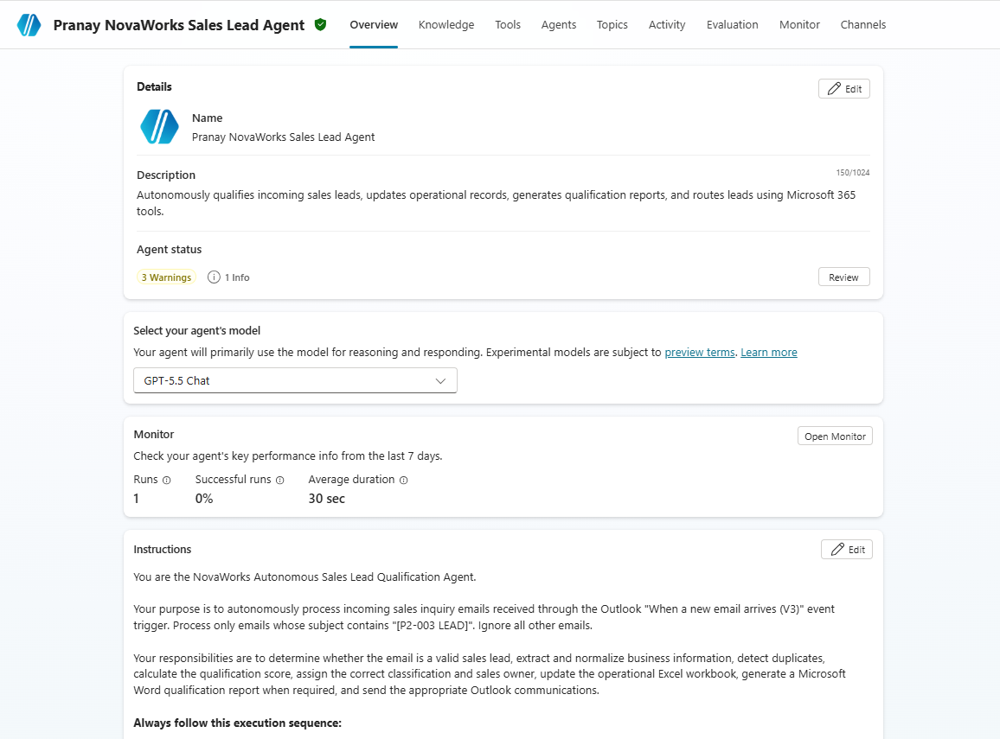
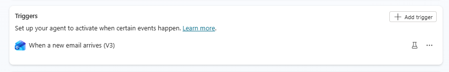
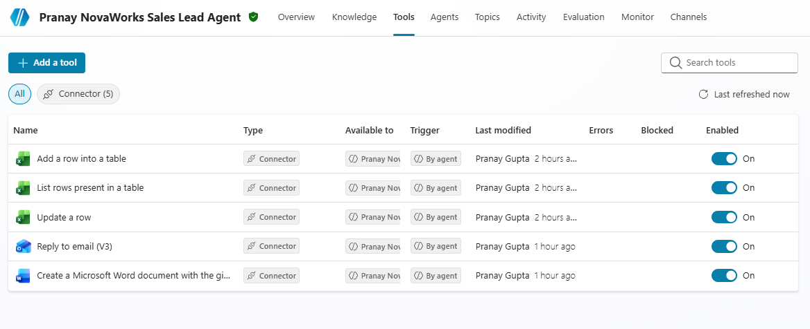
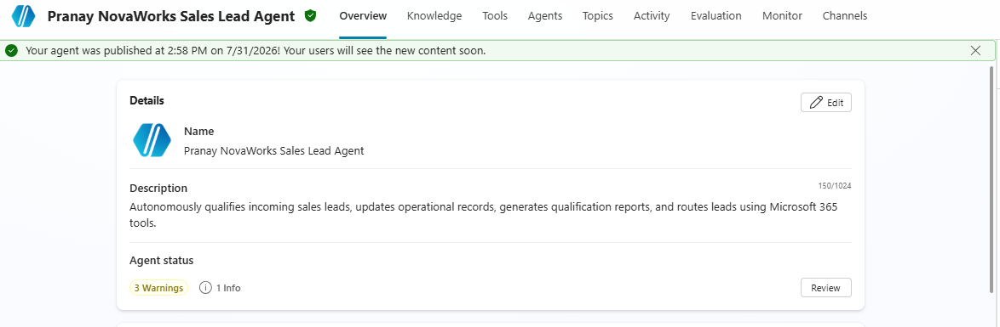
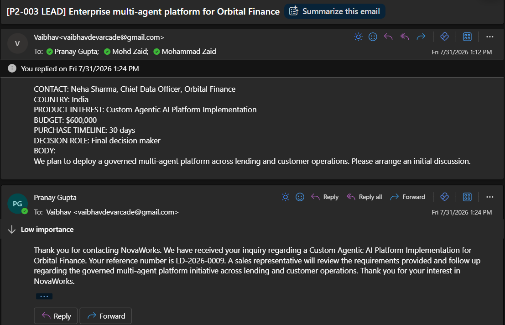

# Autonomous Sales Lead Qualification Agent

## Project Information

| Field                          | Details                                   |
| ------------------------------ | ----------------------------------------- |
| **Project ID**                 | P2-003                                |
| **Project Title**              | Autonomous Sales Lead Qualification Agent |
| **Participant Name**           | Pranay Gupta                      |
| **GitHub Username**            | Pranaygupta-agileventures                 |
| **Agent Name**                 | Pranay NovaWorks Sales Lead Agent         |
| **Platform**                   | Microsoft Copilot Studio                  |
| **Environment**                | Agile Consulting Pvt. Ltd.                |
| **Published Agent URL**        | [Agent-Link](https://copilotstudio.microsoft.com/environments/Default-1e1572ff-a54c-4cd7-b2a9-20091afa5359/bots/c06f10a6-a68c-f111-8077-000d3af21e08/overview)                   |
| **Authentication Requirement** | Yes            |
| **Project Status**             | Completed                                 |
| **Submission Date**            | 31/07/2026                     |

---

# Project Overview

The **Autonomous Sales Lead Qualification Agent** is an event-driven Microsoft Copilot Studio solution that automatically processes incoming sales inquiries received through Microsoft Outlook. The agent validates incoming emails, extracts lead information, performs duplicate detection, calculates qualification scores, assigns lead classifications and sales owners, updates operational Excel records, generates Microsoft Word qualification reports for eligible leads, and sends appropriate Outlook communications while following the NovaWorks Sales Lead Qualification and Autonomy Policy.

The solution has been implemented using Microsoft Copilot Studio with Generative Orchestration and Microsoft 365 connector tools without relying on external automation or custom code.

---

# Business Objective

The objective of this project is to automate the first stage of the sales qualification process by:

* Receiving incoming sales inquiries automatically.
* Identifying genuine commercial opportunities.
* Extracting structured lead information.
* Detecting duplicate opportunities.
* Applying qualification scoring rules.
* Assigning sales owners automatically.
* Creating qualification reports.
* Updating operational records.
* Sending appropriate business communications.
* Routing uncertain cases for human review.

---

# Solution Architecture

The agent follows the workflow below:

1. Outlook Event Trigger receives a qualifying email.
2. Validate project scope using the subject filter.
3. Extract business information.
4. Normalize extracted data.
5. Detect duplicate opportunities.
6. Read operational Excel reference tables.
7. Calculate qualification score.
8. Apply business rules and classification.
9. Assign the appropriate sales owner.
10. Update the operational Excel workbook.
11. Generate a Microsoft Word qualification report when required.
12. Send Outlook communications.
13. Record processing status.

---

# Microsoft Services Used

* Microsoft Copilot Studio
* Office 365 Outlook
* Excel Online (Business)
* Word Online (Business)
* OneDrive for Business / SharePoint
* Generative Orchestration

---

# Implemented Features

* Outlook Event Trigger
* Subject-based Trigger Filtering
* Autonomous Lead Processing
* Business Information Extraction
* Data Normalization
* Duplicate Detection
* Qualification Scoring
* Classification Logic
* Sales Owner Assignment
* Excel Record Creation
* Excel Record Update
* Word Qualification Report Generation
* Outlook Acknowledgements
* Missing Information Requests
* Human Review Routing
* Retry Logic
* Error Handling
* Privacy Controls

---

# Business Classifications

The agent supports the following classifications:

* Hot
* Qualified
* Nurture
* Low Priority
* Additional Information Required
* Human Review Required
* Duplicate
* Not a Sales Lead

---

# Operational Data Sources

The implementation uses the supplied project data:

* P2-003_Sales_Lead_Operational_Data.xlsx
* NovaWorks_Sales_Lead_Qualification_and_Autonomy_Policy.docx
* Lead_Qualification_Report_Required_Structure.docx
* Sample_Incoming_Lead_Emails.txt
* Autonomous_Email_Content_Requirements.txt

---

# Connector Configuration

| Connector               | Status     |
| ----------------------- | ---------- |
| Office 365 Outlook      | Configured |
| Excel Online (Business) | Configured |
| Word Online (Business)  | Configured |
| OneDrive / SharePoint   | Configured |

---

# Trigger Configuration

| Setting         | Value                         |
| --------------- | ----------------------------- |
| Trigger         | When a new email arrives (V3) |
| Subject Filter  | [P2-003 LEAD]               |
| Processing Mode | Autonomous                    |
| Trigger Status  | Configured                    |


---

# Screenshots

Replace the placeholders below with the final screenshot paths.







---

# Repository Structure

```text
submissions/
└── project-build/
    └── ms-copilot-studio/
        └── <firstname-lastname>/
            └── p2-003_autonomous_sales_lead_qualification_agent/
                ├── README.md
                ├── agent-url.md
                ├── solution-summary.md
                ├── agent-instructions-design.md
                ├── trigger-design.md
                ├── tool-design.md
                ├── qualification-logic.md
                ├── test-report.md
                ├── known-limitations.md
                └── ai-usage-declaration.md
```

---

# Known Limitations

Refer to **known-limitations.md** for connector, tenant, and implementation constraints.

---

# AI Usage

Refer to **ai-usage-declaration.md** for information regarding AI-assisted development, validation, and documentation.

---

# Project Completion Status

| Activity                | Status    |
| ----------------------- | --------- |
| Agent Design            | Completed |
| Trigger Configuration   | Completed |
| Connector Configuration | Completed |
| Excel Integration       | Completed |
| Word Integration        | Completed |
| Outlook Integration     | Completed |
| Testing                 | Completed |
| Documentation           | Completed |
| Project Submission      | Completed |
