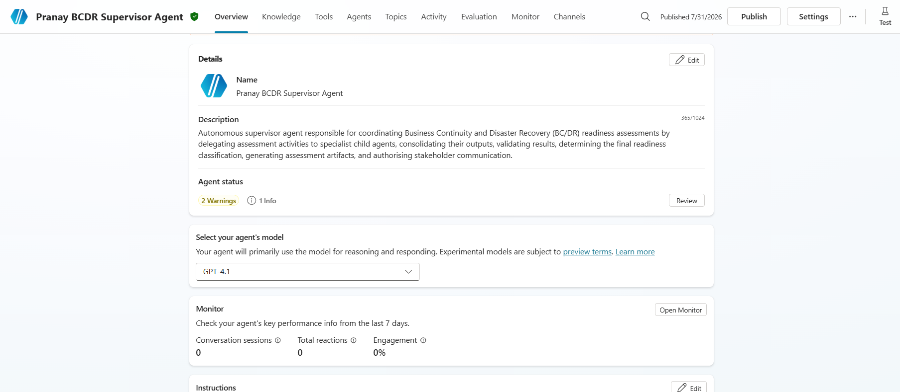
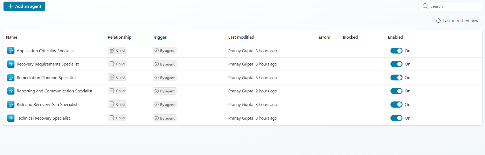
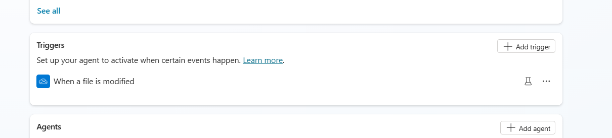
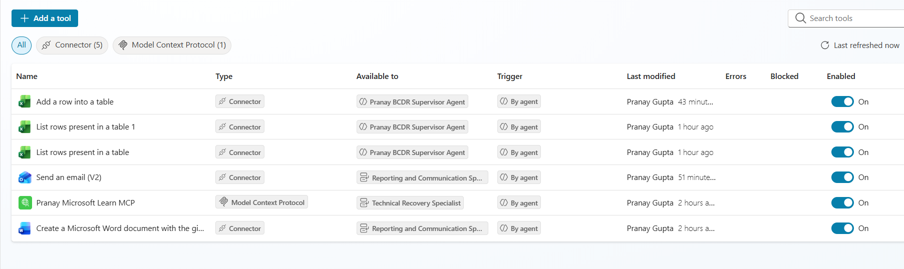
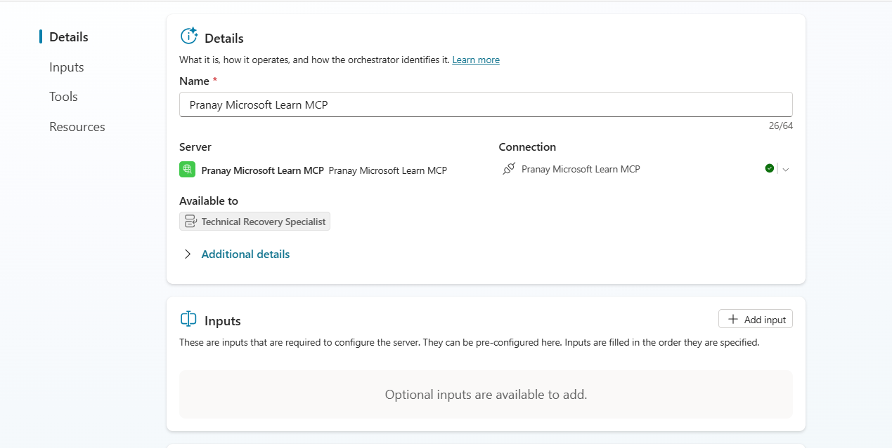
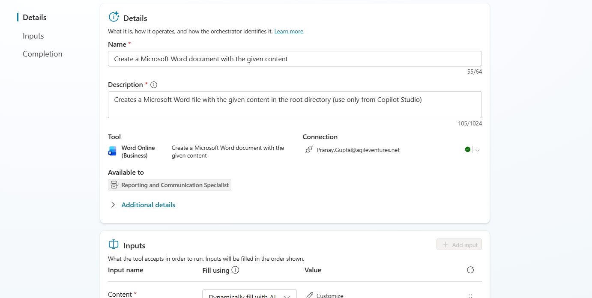
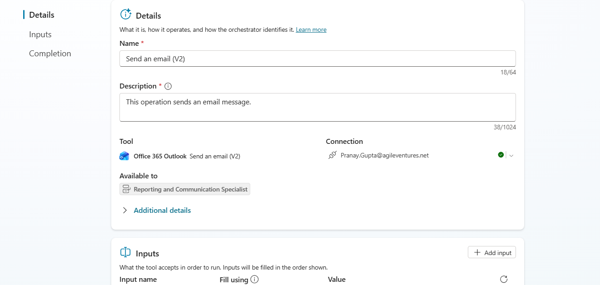

# BCDR Readiness Assessment System

## Project Information

| Field                | Details                          |
| -------------------- | -------------------------------- |
| **Project ID**       | P2-004                           |
| **Participant Name** | Pranay Gupta                     |
| **Agent Name**    | Pranay BCDR Supervisor Agent |
| **Agent-link**         | [Agent](https://copilotstudio.microsoft.com/environments/Default-1e1572ff-a54c-4cd7-b2a9-20091afa5359/bots/0b9ffe6f-cf8c-f111-8077-000d3af21e08/overview)        |

---

# Project Overview

The **BCDR Readiness Assessment System** is a multi-agent solution developed in Microsoft Copilot Studio to automate Business Continuity and Disaster Recovery (BC/DR) readiness assessments.

The solution coordinates multiple specialist agents to evaluate application criticality, recovery requirements, technical recovery capabilities, recovery gaps, remediation planning, and reporting. The Supervisor Agent consolidates all assessment results and determines the final BC/DR readiness classification.

---

# Solution Objectives

* Automate BC/DR readiness assessments.
* Evaluate application business criticality.
* Assess recovery objectives and recovery capabilities.
* Identify recovery risks and gaps.
* Generate remediation recommendations.
* Produce a standardized assessment report.
* Prepare stakeholder notifications based on the assessment outcome.

---

# Solution Architecture

The solution consists of one Supervisor Agent and six Specialist Agents.

## Supervisor Agent

* BCDR Supervisor Agent

## Specialist Agents

1. Application Criticality Specialist
2. Recovery Requirements Specialist
3. Technical Recovery Specialist
4. Risk and Recovery Gap Specialist
5. Remediation Planning Specialist
6. Reporting and Communication Specialist

---

# Solution Workflow

1. Receive a BC/DR assessment request.
2. Retrieve application information from Excel.
3. Delegate assessment tasks to specialist agents.
4. Validate specialist outputs.
5. Determine the final BC/DR readiness classification.
6. Update the assessment register.
7. Generate the assessment report.
8. Prepare stakeholder notification.

---

# Microsoft Integrations

The solution uses the following Microsoft capabilities:

* Microsoft Excel
* Microsoft Learn MCP Server
* Microsoft Word
* Microsoft Outlook

---

# Knowledge Sources

The following documents were used as knowledge sources:

* NovaSphere BC/DR Policy
* BC/DR Readiness Assessment Report Template

---

# Repository Structure

```text
p2-004_bcdr_readiness_system/
|-- README.md
|-- solution-summary.md
|-- architecture.md
|-- supervisor-agent-design.md
|-- specialist-agents.md
|-- mcp-implementation.md
|-- autonomous-trigger.md
|-- test-report.md
|-- known-limitations.md
|-- ai-usage-declaration.md
|-- data/
|   |-- application-inventory.xlsx
|   |-- assessment-register.xlsx
|   |-- risk-scoring-rules.xlsx
|-- screenshots/
    |-- supervisor-agent.png
    |-- child-agents.png
    |-- autonomous-trigger.png
    |-- mcp-configuration.png
    |-- mcp-tools.png
    |-- mcp-successful-call.png
    |-- specialist-delegation.png
    |-- excel-tool.png
    |-- word-tool.png
    |-- outlook-tool.png
    |-- final-assessment.png
```

---

# Testing

The solution was validated using the mandatory BC/DR assessment scenarios provided for the project, covering:

* Business criticality assessment
* Recovery requirement validation
* Technical recovery assessment
* MCP integration
* Report generation
* Excel integration
* Stakeholder notification

---

# Screenshots

Implementation evidence is available in the `screenshots` folder, including:










---

# Author

**Pranay Gupta**
