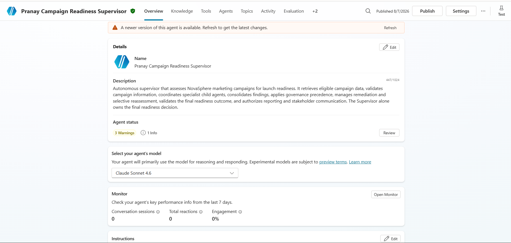
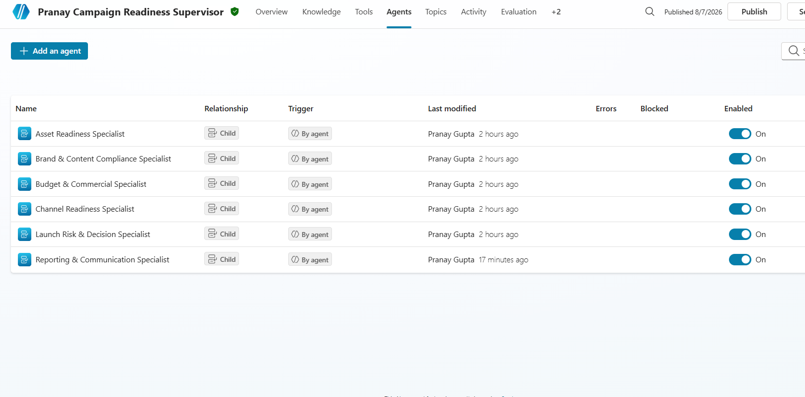
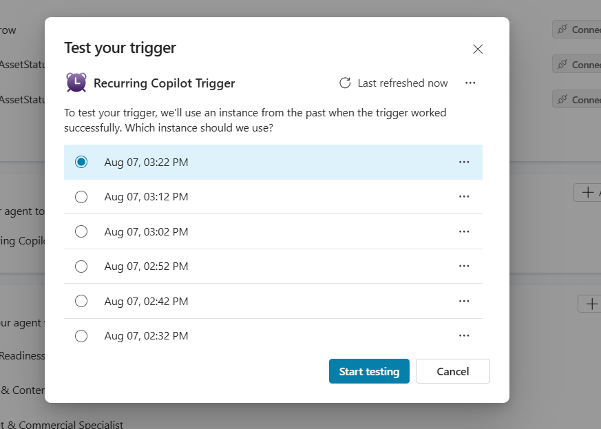
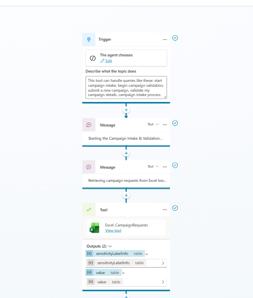
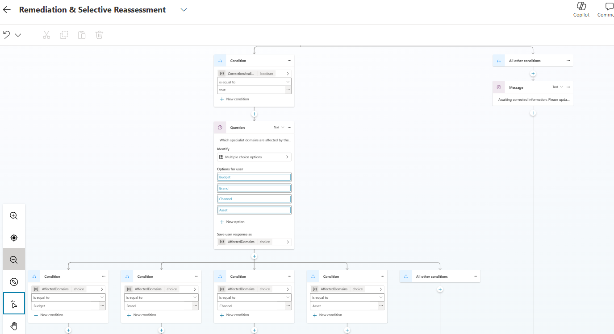
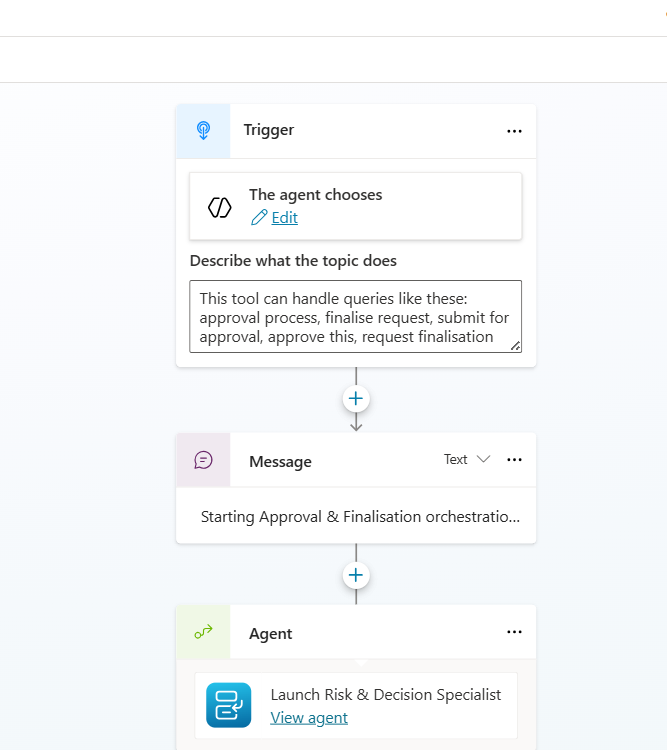
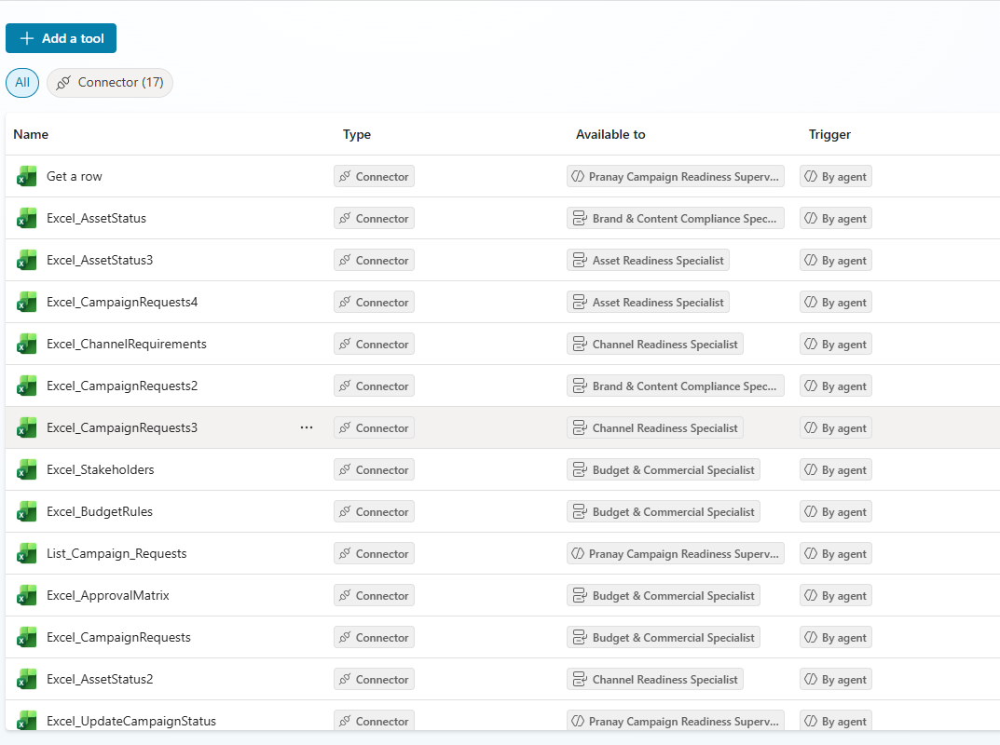
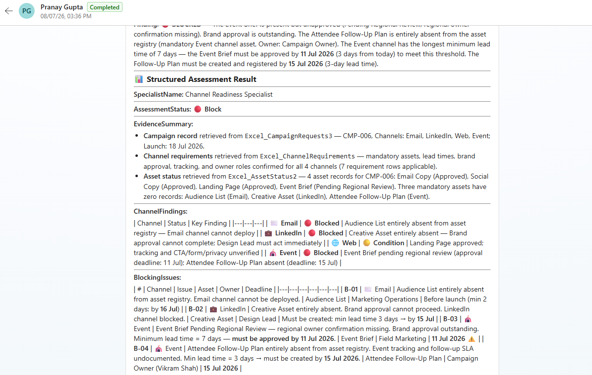

# P2-005 — Autonomous Marketing Campaign Launch Readiness & Governance System

## 1. Project Overview

| Field                | Details                          |
| -------------------- | -------------------------------- |
| **Project ID**       | P2-005                           |
| **Participant Name** | Pranay Gupta                     |
| **Agent Name**    | Pranay Campaign Readiness Supervisor |
| **Agent-link**         | [Agent](https://copilotstudio.microsoft.com/environments/Default-1e1572ff-a54c-4cd7-b2a9-20091afa5359/bots/073ca40c-2592-f111-b8dc-000d3af21e08/overview)        |

This project implements an autonomous marketing campaign launch-readiness and governance system for the NovaSphere Technologies scenario.

The system identifies an eligible campaign, validates its information, delegates independent assessments to specialist child agents, consolidates their findings, handles remediation and approvals, determines the final readiness status, updates Excel, generates a Word readiness report, and sends an Outlook notification after Supervisor approval.

The system evaluates readiness. It does **not** launch the campaign.

## 2. Business Scenario

NovaSphere Technologies runs digital marketing campaigns across email, LinkedIn, web, paid search, webinars, and events.

Before launch, the organization needs to verify:

- Budget approval
- Commercial viability
- Mandatory assets
- Brand compliance
- Content approval
- Channel readiness
- Geographic approvals
- Campaign timing
- Tracking readiness
- Claims and disclaimers
- Stakeholder ownership
- Required executive approvals

The system coordinates these checks through a Supervisor and specialist child agents.

## 3. Architecture

```text
Recurrence Trigger
       |
       v
Campaign Intake & Validation
       |
       v
Campaign Readiness Supervisor
       |
       +---- Budget & Commercial Specialist
       +---- Brand & Content Compliance Specialist
       +---- Channel Readiness Specialist
       +---- Asset Readiness Specialist
                     |
                     v
             Parallel Fan-In
                     |
                     v
             Launch Risk Specialist
                     |
                     v
                 Supervisor
               /     |      \
        Remediation Approval Final Decision
               \     |      /
                     v
            Supervisor Validation
                     |
                     v
       Reporting & Communication Specialist
                /            \
               v              v
             Word           Outlook
               \              /
                +---- Excel ----+
```

## 4. Agents

1. Campaign Readiness Supervisor
2. Budget & Commercial Specialist
3. Brand & Content Compliance Specialist
4. Channel Readiness Specialist
5. Asset Readiness Specialist
6. Launch Risk & Decision Specialist
7. Reporting & Communication Specialist

## 5. Custom Topics

- Campaign Intake & Validation
- Remediation & Selective Reassessment
- Approval & Finalisation

## 6. Key Orchestration Patterns

The solution demonstrates:

- Sequential processing
- Parallel fan-out/fan-in
- Hierarchical Supervisor-to-specialist delegation
- Conditional routing
- Selective reassessment
- Failure/fallback handling

## 7. Integrations

### Excel Online (Business)

Used for campaign requests, rules, assets, channel requirements, stakeholders, approvals, and campaign status updates.

### Word

Used to create the Campaign Launch Readiness Report after Supervisor validation.

### Outlook

Used to send the appropriate stakeholder notification after Supervisor approval.

## 8. Knowledge Sources

### NovaSphere Marketing Governance Policy

Authoritative for:

- Readiness outcomes
- Budget approval
- Timing
- Asset controls
- Geography
- Sensitivity
- Autonomous processing
- Reassessment

### NovaSphere Brand & Content Guidelines

Authoritative for:

- Brand terminology
- Product naming
- Claims
- Evidence requirements
- Channel-content rules
- Brand review classification

## 9. Final Readiness Outcomes

The mandatory precedence is:

1. Not Ready
2. Management Approval Required
3. Remediation Required
4. Ready with Conditions
5. Ready

The highest-precedence applicable result wins. Specialist results are not averaged.

## 10. Testing

The PRD defines 22 mandatory scenarios and requires at least 16 to be executed.

See `test-report.md` for the execution record.

Actual test results, screenshots, published-agent URLs, connector results, and approvals must be based on real implementation evidence.

## 11. Repository Structure

```text
p2-005_marketing_campaign_readiness_governance/
├── README.md
├── solution-summary.md
├── architecture.md
├── orchestration-patterns.md
├── supervisor-agent-design.md
├── specialist-agent-design.md
├── custom-topics.md
├── autonomous-trigger.md
├── test-report.md
├── known-limitations.md
├── ai-usage-declaration.md
├── data/
│   └── dataset-notes.md
└── screenshots/
    ├── supervisor-agent.png
    ├── child-agents.png
    ├── recurrence-trigger.png
    ├── intake-topic.png
    ├── parallel-specialists.png
    ├── fan-in-consolidation.png
    ├── remediation-topic.png
    ├── approval-topic.png
    ├── excel-tools.png
    ├── word-tool.png
    ├── outlook-tool.png
    └── final-assessment.png
```

## 12. Safety

- No autonomous campaign launch action is permitted.
- Human approval must not be fabricated.
- Unsupported specialist results must not become Ready.
- Final readiness belongs only to the Supervisor.
- Only synthetic project data is used.

## 13. Screenshots









