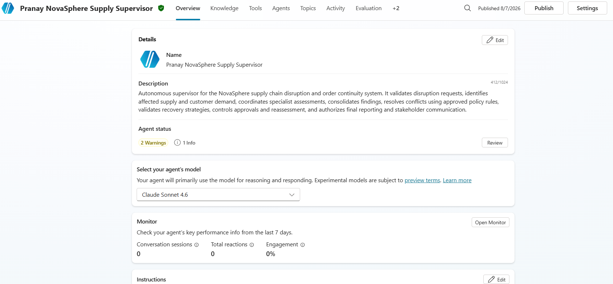
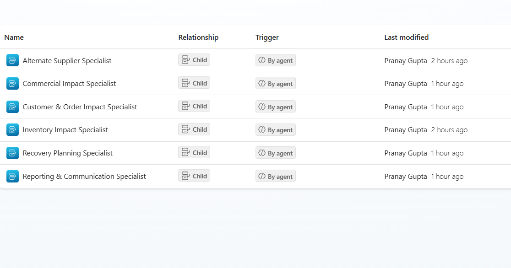
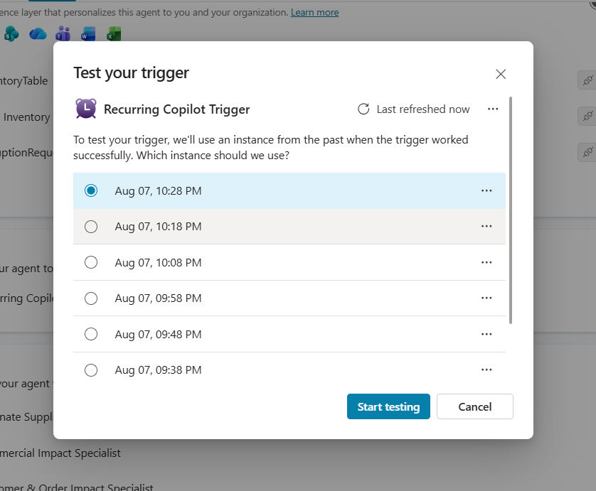
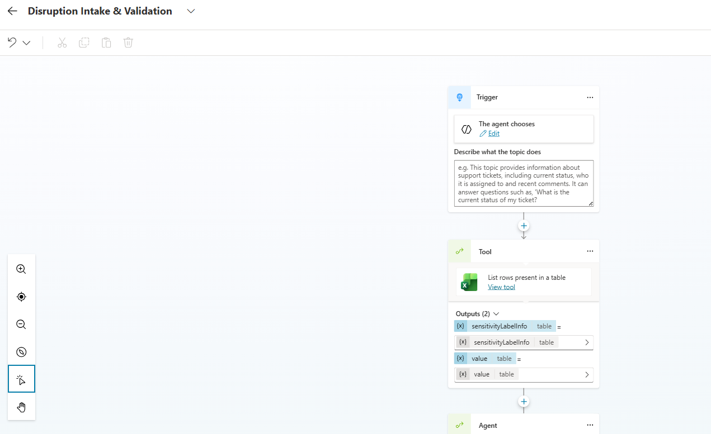
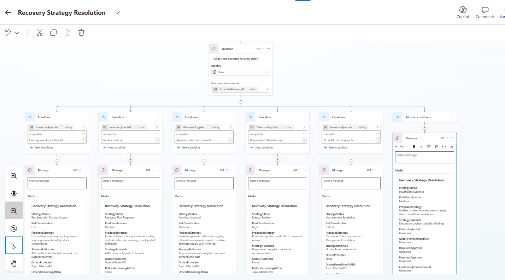
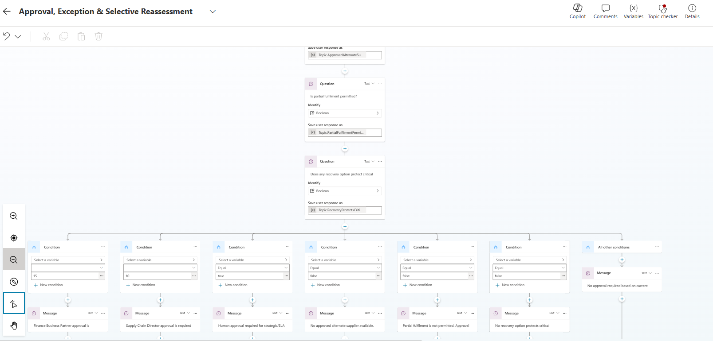
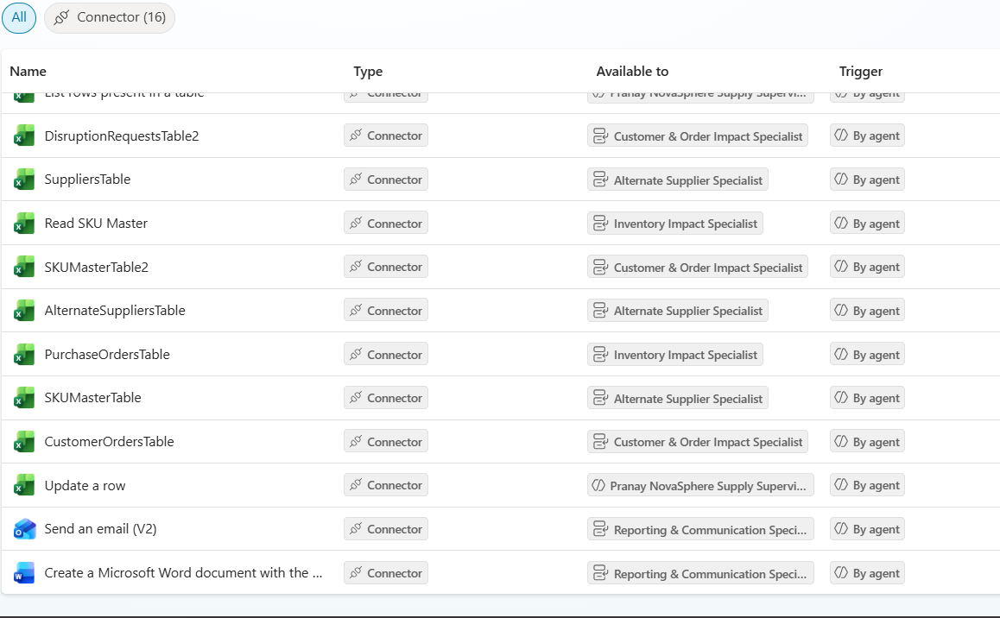
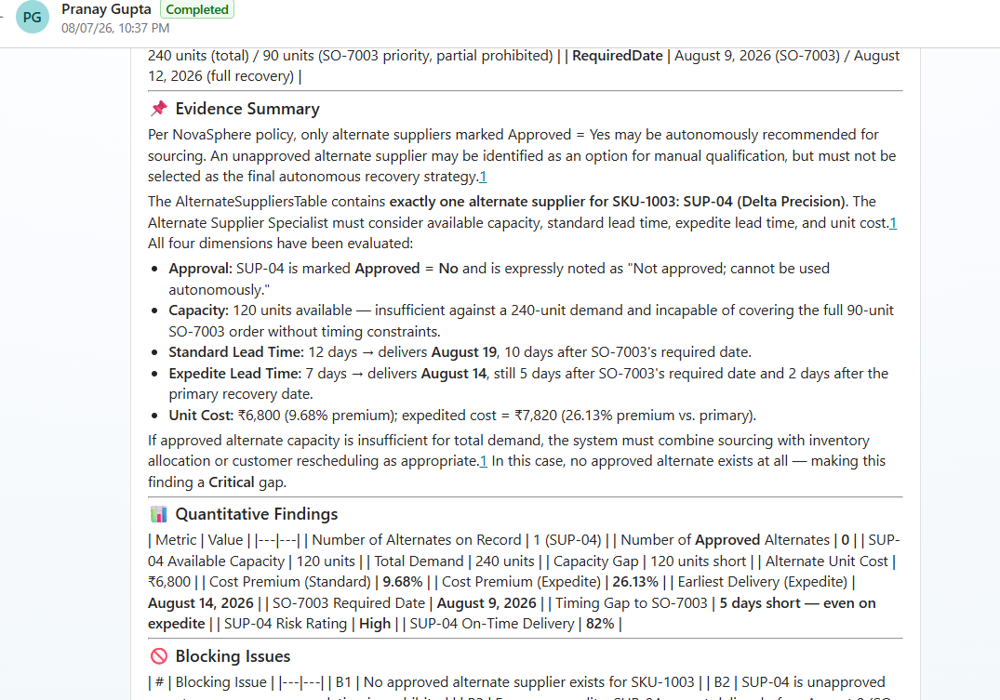

# P2-006 — Autonomous Supply Chain Disruption & Order Continuity System

## 1. Project Overview

| Field | Details |
|---|---|
| **Project ID** | P2-006 |
| **Participant Name** | Pranay Gupta |
| **Agent Name** | Pranay NovaSphere Supply Supervisor |
| **Agent Link** | [Agent](https://copilotstudio.microsoft.com/environments/Default-1e1572ff-a54c-4cd7-b2a9-20091afa5359/bots/4b49cb9f-5e92-f111-b8dc-000d3af21e08/overview) |

This project implements an autonomous supply chain disruption and order continuity system for the NovaSphere Technologies scenario.

The system identifies a pending disruption, validates its information, delegates assessments to specialist child agents, consolidates their findings, evaluates recovery options, handles approvals and exceptions, updates the disruption record, generates a Word recovery report, and sends an Outlook notification after Supervisor validation.

The system supports disruption assessment and recovery planning. It does **not** autonomously place purchase orders, approve suppliers, cancel customer orders, commit customer delivery dates, or authorize restricted commercial expenditure.

## 2. Business Scenario

NovaSphere Technologies manages supply operations across suppliers, products, purchase orders, inventory, and customer commitments.

The system evaluates:

- Inventory availability and ATP
- Safety-stock and quality-hold impact
- Purchase-order impact
- Alternate supplier availability
- Supplier approval, capacity, and lead time
- Customer and order impact
- Strategic and SLA-protected order risk
- Revenue and commercial impact
- Recovery options
- Required approvals and escalations
- Residual recovery risk

## 3. Agents

### Supervisor Agent

- Supply Continuity Supervisor

### Specialist Child Agents

1. Inventory Impact Specialist
2. Alternate Supplier Specialist
3. Customer & Order Impact Specialist
4. Commercial Impact Specialist
5. Recovery Planning Specialist
6. Reporting & Communication Specialist

The Supervisor owns orchestration, consolidation, conflict resolution, final strategy validation, approval routing, reassessment decisions, and final communication authorization.

## 4. Custom Topics

- **Disruption Intake & Validation** — Validates the disruption before specialist assessment.
- **Recovery Strategy Resolution** — Consolidates specialist findings and determines the appropriate recovery strategy.
- **Approval, Exception & Selective Reassessment** — Handles approvals, exceptions, retries, stale findings, reassessment, and manual review.

## 5. Orchestration

The solution demonstrates:

- Sequential processing
- Parallel fan-out and fan-in
- Hierarchical Supervisor-to-specialist delegation
- Conditional routing
- Retry and fallback handling
- Selective reassessment
- Conflict resolution

The four independent impact assessments are performed by the Inventory Impact, Alternate Supplier, Customer & Order Impact, and Commercial Impact Specialists before Recovery Planning.

## 6. Integrations

### Excel Online (Business)

Used for disruption requests, suppliers, SKU data, inventory, purchase orders, customer orders, alternate suppliers, recovery rules, stakeholders, and disruption status updates.

### Word Online (Business)

Used to generate the final recovery report after Supervisor validation.

### Outlook

Used for approved stakeholder notifications. Failed notifications must not be represented as successful.

## 7. Knowledge Source

### NovaSphere Supply Continuity Policy

The policy is used for supply continuity rules, inventory decisions, customer priorities, alternate supplier controls, commercial approvals, recovery planning, escalation, reassessment, and autonomous-processing boundaries.

## 8. Key Decision Rules

### ATP

`ATP = On Hand - Reserved + Inbound Within 7 Days - Quality Hold`

Quality-held quantity is excluded from usable supply.

### Customer Priority

1. Strategic + SLA Protected
2. Priority
3. Standard

### Alternate Supplier

Unapproved alternate suppliers cannot be selected autonomously.

### Commercial Approval

- Alternate supplier premium above **15%** → Finance Business Partner approval
- Expedite premium above **10%** → Supply Chain Director approval

### Decision Precedence

1. Safety or quality restriction
2. Strategic/SLA-protected customer commitment
3. Supplier approval restriction
4. Inventory availability and timing
5. Commercial approval requirement
6. Cost optimisation
7. Lower-priority customer convenience

## 9. Disruption States

- **Pending** — Awaiting assessment
- **In Assessment** — Assessment is running
- **Awaiting Approval** — Human approval is required
- **Recovery Plan Proposed** — Recovery strategy proposed
- **Customer Action Required** — Customer-related action is required
- **Management Escalation** — Management intervention is required
- **Insufficient Evidence** — Required evidence is unavailable
- **Manual Review** — Automated processing cannot continue
- **Completed** — Required processing is complete

## 10. Autonomous Trigger

The Recurrence Trigger retrieves the oldest disruption in `Pending` status.

If no Pending disruption exists, the execution ends safely.

If a Pending disruption exists, the Supervisor retrieves its complete details and starts the configured assessment workflow.

Only one disruption is processed during each execution.

## 11. Screenshots

