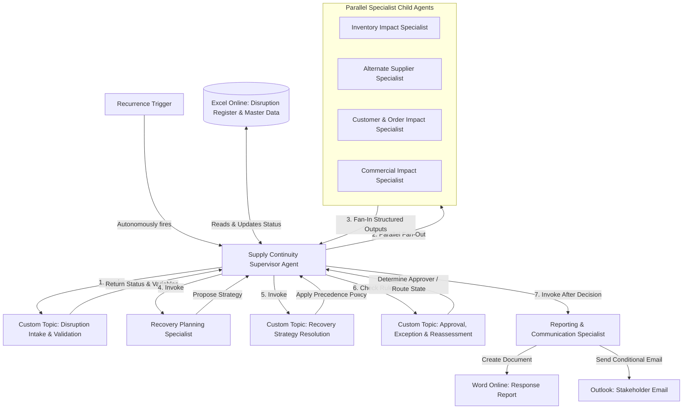

# System Architecture — Multi-Agent Disruption Response System

The Autonomous Supply Chain Disruption & Order Continuity Response System is designed as a hierarchical multi-agent system. The system runs autonomously using a recurrence trigger and leverages Microsoft Copilot Studio's generative orchestration to coordinate specialised child agents and deterministic custom topics.

---

## 1. System Architecture Block Diagram

The following Mermaid diagram illustrates the relationships between the trigger, the Supervisor orchestrator, custom topics, specialist child agents, and external connectors.

---

## 2. Component Design & System Boundaries

### A. Supply Continuity Supervisor (The Orchestrator)
The core agent that coordinates the entire disruption lifecycle. It maintains the orchestration state, executes custom validation and decision logic, coordinates specialist child agents, triggers retries on failure, and manages reporting/communication authorization.

### B. Specialist Child Agents
Four independent specialists analyze different business dimensions in a parallel fan-out manner. They do not share state with one another and only interact with the Supervisor:
1. **Inventory Specialist**: Evaluates Available to Promise (ATP) stock and net shortages.
2. **Alternate Supplier Specialist**: Maps approved and unapproved suppliers, standard and expedite lead times, and alternate capacity.
3. **Customer & Order Specialist**: Matches SKU to open orders, determines priority levels, SLA exposure, and revenue exposure.
4. **Commercial Specialist**: Calculates cost differentials, premium percentages, and necessary approvers.

### C. Downstream Planners
* **Recovery Planning Specialist**: Takes consolidated data from the 4 specialists and proposes a structured recovery strategy.
* **Reporting & Communication Specialist**: Connects to Office 365 services to output the final report and email.

---

## 3. Microsoft Office 365 Connectors Integration

The solution integrates with external systems using three standard Microsoft 365 connectors, avoiding any custom external API calls:

| Connector | Technical Implementation Details | Target Tables / Actions |
|---|---|---|
| **Excel Online (Business)** | Read, query, and write operations to the OneDrive-hosted Supply Chain Workbook. | `DisruptionRequestsTable`, `SuppliersTable`, `SKUMasterTable`, `InventoryTable`, `PurchaseOrdersTable`, `CustomerOrdersTable`, `AlternateSuppliersTable`, `RecoveryRulesTable`, `StakeholdersTable` |
| **Word Online (Business)** | Triggered by the Reporting Specialist. Generates a PDF/DOCX from a pre-formatted template. | Create document from template action using output variables. |
| **Office 365 Outlook** | Triggered only after Supervisor validation of the final decision. | Send an email (V2) action to appropriate stakeholders (e.g., Finance, Customer Operations, Supply Chain Director) based on state. |

---

## 4. Hierarchical Supervisor-to-Specialist Relationship
The hierarchy enforces that:
* Specialist child agents have **no direct communication** with each other.
* Specialists only write to a structured output contract (defined in the `Standard Specialist Output Contract`).
* The Supervisor remains the sole decision authority. Specialist agents analyze, but the Supervisor decides.
